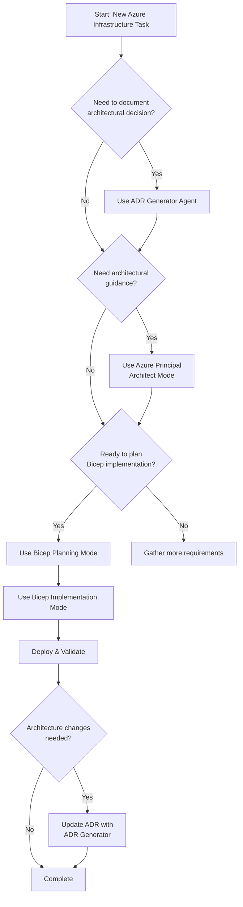

# Implementation Plan: Four-Mode Workflow Integration

## Overview

This plan restructures the **github-copilot-itpro** repository to establish a cohesive four-mode workflow for Azure infrastructure development targeting IT Professionals and SI partners. The workflow integrates:

1. **ADR Generator (Custom Agent)** - Document architectural decisions
2. **Azure Principal Architect (Chat Mode)** - Azure Well-Architected Framework guidance  
3. **Bicep Planning (Chat Mode)** - Infrastructure planning with AVM modules
4. **Bicep Implementation (Chat Mode)** - Bicep code generation

## Phase 1 — Install ADR Generator Custom Agent

**Objective:** Enable architectural decision documentation with structured ADR generation

| Task | Description | Action |
|------|-------------|--------|
| TASK-001 | Download ADR Generator agent file | Download from awesome-copilot to `.github/agents/adr-generator.agent.md` |
| TASK-002 | Create ADR documentation directory | Create `/docs/adr/` folder structure |
| TASK-003 | Generate initial ADR for workflow adoption | Use ADR Generator to document "Four-Mode Workflow Adoption" decision |
| TASK-004 | Update repository README | Add Custom Agents section referencing ADR Generator |

**Success Criteria:**
- ADR Generator agent file present in `.github/agents/`
- `/docs/adr/` directory exists
- Initial ADR-0001 created documenting workflow adoption
- README.md updated with agent documentation

## Phase 2 — Reorganize Chat Mode Structure

**Objective:** Consolidate custom chat modes into standardized location with clear documentation

| Task | Description | Action |
|------|-------------|--------|
| TASK-005 | Audit existing chat modes | List all *.chatmode.md files across repository |
| TASK-006 | Consolidate chat mode location | Move all chat modes to `resources/copilot-customizations/chatmodes/` |
| TASK-007 | Remove duplicate or outdated modes | Identify and remove superseded versions |
| TASK-008 | Create chat mode README | Document each mode's purpose, when to use it, and workflow integration |

**Files Affected:**
- `resources/copilot-customizations/chatmodes/*.chatmode.md` (all chat modes)
- `resources/copilot-customizations/chatmodes/README.md` (new documentation)

**Success Criteria:**
- All chat modes in single location
- No duplicate modes exist
- README.md explains four-mode workflow
- Each mode's purpose clearly documented

## Phase 3 — Establish Four-Mode Workflow Documentation

**Objective:** Create comprehensive documentation showing how the four modes work together

| Task | Description | Action |
|------|-------------|--------|
| TASK-009 | Create workflow diagram | Mermaid diagram showing mode transitions and outputs |
| TASK-010 | Document workflow stages | Explain each stage: Decision → Architecture → Planning → Implementation |
| TASK-011 | Create workflow examples | Provide Demo 1 (Bicep) example using all four modes |
| TASK-012 | Add troubleshooting guidance | Document common issues and mode selection guidance |

**New File:** `resources/copilot-customizations/FOUR-MODE-WORKFLOW.md`

**Workflow Stages:**

```mermaid
graph LR
    A[Architectural Decision] -->|ADR Generator| B[Document ADR]
    B --> C[Architectural Planning]
    C -->|Azure Principal Architect| D[WAF Assessment]
    D --> E[Infrastructure Planning]
    E -->|Bicep Planning Mode| F[Create Planning File]
    F --> G[Implementation]
    G -->|Bicep Implementation Mode| H[Generate Bicep Code]
    H --> I[Deploy to Azure]
```



**Success Criteria:**
- Workflow documentation created
- Mermaid diagrams illustrate mode relationships
- Examples show complete workflow
- Troubleshooting section addresses common scenarios

## Phase 4 — Update Demo Scripts with Four-Mode Integration

**Objective:** Enhance demo scripts to showcase the four-mode workflow

| Task | Description | Action |
|------|-------------|--------|
| TASK-013 | Update Demo 1 (Bicep) script | Add four-mode workflow walkthrough |
| TASK-014 | Update Demo 5 (Documentation) script | Show ADR Generator usage for architecture docs |
| TASK-015 | Create mode selection guide | Help presenters choose appropriate mode for scenarios |
| TASK-016 | Add timing guidance | Estimate time for each mode in 30-min demo format |

**Files to Update:**
- `demos/01-bicep-quickstart/DEMO-SCRIPT.md`
- `demos/05-documentation-generator/DEMO-SCRIPT.md`
- `demos/01-bicep-quickstart/prompts/effective-prompts.md`

**Success Criteria:**
- Demo scripts reference appropriate modes
- Mode selection guidance included
- Timing estimates provided
- Prompts updated for four-mode workflow

## Phase 5 — Create ADRs for Existing Architecture Patterns

**Objective:** Retroactively document architectural decisions made in demos using ADR Generator

| Task | Description | Action |
|------|-------------|--------|
| TASK-017 | ADR: 3-Tier Architecture Pattern | Document Demo 1 VNet segmentation decision |
| TASK-018 | ADR: Azure Arc Onboarding Strategy | Document Demo 3 hybrid cloud approach |
| TASK-019 | ADR: PowerShell Automation Standards | Document Demo 2 scripting conventions |
| TASK-020 | ADR: Azure Verified Modules Adoption | Document AVM usage strategy |

**New ADRs:**
- `/docs/adr/adr-0001-four-mode-workflow-adoption.md`
- `/docs/adr/adr-0002-three-tier-network-architecture.md`
- `/docs/adr/adr-0003-azure-arc-hybrid-strategy.md`
- `/docs/adr/adr-0004-powershell-automation-standards.md`
- `/docs/adr/adr-0005-azure-verified-modules-adoption.md`

**Success Criteria:**
- Minimum 5 ADRs created
- Each demo has architectural decisions documented
- ADRs reference relevant Azure Architecture Center patterns
- Consequences section includes measurable impacts

## Phase 6 — Cleanup Redundant Customizations

**Objective:** Remove outdated or superseded Copilot customizations

| Task | Description | Action |
|------|-------------|--------|
| TASK-021 | Audit custom instructions | Review all *.instructions.md files |
| TASK-022 | Identify superseded content | Find instructions now covered by chat modes |
| TASK-023 | Archive or remove redundant files | Clean up deprecated customizations |
| TASK-024 | Update copilot-instructions.md | Ensure main instructions reference four modes |

**Files to Review:**
- `resources/copilot-customizations/instructions/*.instructions.md`
- `.github/copilot-instructions.md`

**Success Criteria:**
- No duplicate guidance across modes and instructions
- Clear hierarchy: instructions → chat modes → agents
- copilot-instructions.md references four-mode workflow
- Archive folder created for deprecated content

## Phase 7 — Partner Toolkit Integration

**Objective:** Update partner materials to showcase four-mode workflow

| Task | Description | Action |
|------|-------------|--------|
| TASK-025 | Create mode reference card | Quick reference for presenters |
| TASK-026 | Update ROI calculator | Include mode-specific time savings |
| TASK-027 | Add customer objection handling | Address questions about multiple modes |
| TASK-028 | Create presentation deck slides | Four-mode workflow visual for pitches |

**New Files:**
- `partner-toolkit/four-mode-quick-reference.pdf`
- `partner-toolkit/mode-selection-flowchart.md`

**Success Criteria:**
- Reference card created
- ROI calculator updated
- Objection handling guide includes mode questions
- Presentation materials ready for partners

## Phase 8 — Repository Structure Validation

**Objective:** Ensure repository follows best practices and four-mode workflow is fully integrated

| Task | Description | Action |
|------|-------------|--------|
| TASK-029 | Create validation script | PowerShell script to check structure |
| TASK-030 | Validate all chat modes | Ensure YAML frontmatter is correct |
| TASK-031 | Validate ADR Generator agent | Confirm agent file structure |
| TASK-032 | Update main README.md | Add "How to Use This Repository" section with four-mode workflow |

**New File:** `resources/validation/Validate-RepositoryStructure.ps1`

**Success Criteria:**
- Validation script runs successfully
- All files have correct structure
- README.md clearly explains repository usage
- Links between modes documented

## High-Level Design

### Four-Mode Workflow Integration

**Stage 1: Architectural Decision (ADR Generator)**
- **Input:** Business requirement, technical challenge, or architectural choice
- **Process:** Use ADR Generator agent to document decision with context, consequences, alternatives
- **Output:** ADR markdown file in `/docs/adr/adr-NNNN-[title].md`
- **Next Step:** If architectural guidance needed, proceed to Stage 2

**Stage 2: Architectural Guidance (Azure Principal Architect Mode)**
- **Input:** ADR context, Azure service requirements, WAF considerations
- **Process:** Activate Azure Principal Architect chat mode for WAF assessment and architecture recommendations
- **Output:** Architecture recommendations with service selections, WAF trade-offs, reference architecture links
- **Next Step:** Proceed to Stage 3 for infrastructure planning

**Stage 3: Infrastructure Planning (Bicep Planning Mode)**
- **Input:** Architecture recommendations, Azure services identified, requirements
- **Process:** Activate Bicep Planning chat mode to create implementation plan
- **Output:** Planning file in `.bicep-planning-files/INFRA.[goal].md` with resource definitions, parameters, dependencies
- **Next Step:** Proceed to Stage 4 for code generation

**Stage 4: Implementation (Bicep Implementation Mode)**
- **Input:** Planning file from Stage 3, output path
- **Process:** Activate Bicep Implementation chat mode to generate Bicep code
- **Output:** Bicep template files (main.bicep, modules/*.bicep)
- **Next Step:** Deploy to Azure and update ADR if needed

### Repository Structure After Cleanup

```
github-copilot-itpro/
├── .github/
│   ├── agents/
│   │   └── adr-generator.agent.md              [NEW]
│   ├── copilot-instructions.md                 [UPDATED]
│   └── workflows/
├── .bicep-planning-files/                      [NEW - from Bicep Planning mode]
│   └── INFRA.[goal].md
├── docs/
│   └── adr/                                    [NEW]
│       ├── adr-0001-four-mode-workflow-adoption.md
│       ├── adr-0002-three-tier-network-architecture.md
│       ├── adr-0003-azure-arc-hybrid-strategy.md
│       ├── adr-0004-powershell-automation-standards.md
│       └── adr-0005-azure-verified-modules-adoption.md
├── demos/
│   ├── 01-bicep-quickstart/
│   │   ├── DEMO-SCRIPT.md                      [UPDATED - four-mode workflow]
│   │   └── prompts/effective-prompts.md        [UPDATED]
│   └── 05-documentation-generator/
│       └── DEMO-SCRIPT.md                      [UPDATED - ADR Generator usage]
├── partner-toolkit/
│   ├── four-mode-quick-reference.pdf           [NEW]
│   └── mode-selection-flowchart.md             [NEW]
├── resources/
│   ├── copilot-customizations/
│   │   ├── chatmodes/
│   │   │   ├── azure-principal-architect.chatmode.md
│   │   │   ├── bicep-plan.chatmode.md
│   │   │   ├── bicep-implement.chatmode.md
│   │   │   └── README.md                       [NEW - chat mode documentation]
│   │   ├── instructions/                       [CLEANUP - remove superseded]
│   │   └── FOUR-MODE-WORKFLOW.md               [NEW]
│   └── validation/
│       └── Validate-RepositoryStructure.ps1    [NEW]
└── README.md                                    [UPDATED - four-mode workflow]
```

### Mode Selection Decision Tree



## Implementation Checklist

### Phase 1: Agent Installation
- [ ] Download adr-generator.agent.md to `.github/agents/`
- [ ] Create `/docs/adr/` directory
- [ ] Generate ADR-0001 for workflow adoption
- [ ] Update README.md with agent section

### Phase 2: Chat Mode Consolidation
- [ ] Move all chat modes to `resources/copilot-customizations/chatmodes/`
- [ ] Remove duplicate modes
- [ ] Create chatmodes/README.md
- [ ] Verify all modes have correct YAML frontmatter

### Phase 3: Workflow Documentation
- [ ] Create FOUR-MODE-WORKFLOW.md
- [ ] Add workflow diagrams
- [ ] Document mode selection guidance
- [ ] Add troubleshooting section

### Phase 4: Demo Updates
- [ ] Update Demo 1 DEMO-SCRIPT.md
- [ ] Update Demo 5 DEMO-SCRIPT.md
- [ ] Update effective prompts
- [ ] Add timing guidance

### Phase 5: Architectural Documentation
- [ ] Create 5 ADRs for existing demos
- [ ] Link ADRs to relevant demos
- [ ] Reference Azure Architecture Center patterns

### Phase 6: Cleanup
- [ ] Audit custom instructions
- [ ] Remove superseded content
- [ ] Update copilot-instructions.md
- [ ] Archive deprecated files

### Phase 7: Partner Materials
- [ ] Create quick reference card
- [ ] Update ROI calculator
- [ ] Create mode selection flowchart
- [ ] Update presentation materials

### Phase 8: Validation
- [ ] Create validation PowerShell script
- [ ] Run validation
- [ ] Fix any issues
- [ ] Update main README.md

## Success Criteria

**Repository Organization:**
- ✅ Single Custom Agent (ADR Generator) in `.github/agents/`
- ✅ Three Chat Modes consolidated in `resources/copilot-customizations/chatmodes/`
- ✅ All modes documented with clear usage guidance
- ✅ No duplicate or conflicting customizations

**Documentation:**
- ✅ Minimum 5 ADRs created in `/docs/adr/`
- ✅ Four-mode workflow documented with diagrams
- ✅ Each demo references appropriate modes
- ✅ Partner materials updated

**Demo Integration:**
- ✅ Demo scripts showcase four-mode workflow
- ✅ Prompts optimized for each mode
- ✅ Timing estimates provided
- ✅ Mode selection guidance clear

**Validation:**
- ✅ All files have correct structure
- ✅ Validation script passes
- ✅ Links between modes work correctly
- ✅ README.md provides clear repository usage guide
