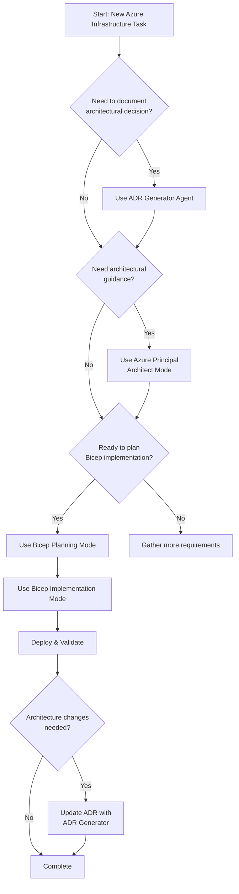

# Implementation Plan: Four-Agent Workflow Integration

## Overview

This plan restructures the **github-copilot-itpro** repository to establish a cohesive four-agent workflow for Azure infrastructure development targeting IT Professionals and SI partners. The workflow integrates:

1. **ADR Generator (Custom Agent)** - Document architectural decisions
2. **Azure Principal Architect (Custom Agent)** - Azure Well-Architected Framework guidance  
3. **Bicep Planning (Custom Agent)** - Infrastructure planning with AVM modules
4. **Bicep Implementation (Custom Agent)** - Bicep code generation

**Key Architectural Decision:** All four capabilities are implemented as **Custom Agents** (not chat modes), providing superior integration, consistency, and tool access.

## Phase 1 — Install Four Custom Agents ✅ COMPLETED

**Objective:** Enable complete infrastructure workflow with four specialized custom agents

| Task | Description | Status |
|------|-------------|--------|
| TASK-001 | Install ADR Generator agent | ✅ Downloaded to `.github/agents/adr-generator.agent.md` |
| TASK-002 | Create Azure Principal Architect agent | ✅ Created from chat mode at `.github/agents/azure-principal-architect.agent.md` |
| TASK-003 | Create Bicep Planning agent | ✅ Created from chat mode at `.github/agents/bicep-plan.agent.md` |
| TASK-004 | Create Bicep Implementation agent | ✅ Created from chat mode at `.github/agents/bicep-implement.agent.md` |
| TASK-005 | Create ADR documentation directory | ✅ Created `/docs/adr/` folder |
| TASK-006 | Generate initial ADR-0001 | ✅ Created "Four-Agent Workflow Adoption" ADR |
| TASK-007 | Test ADR Generator with ADR-0002 | ✅ Created Azure Bastion example ADR |
| TASK-008 | Update repository README | ✅ Added Custom Agents & Workflow section |

**Success Criteria:** ✅ ALL MET
- All 4 agent files present in `.github/agents/`
- `/docs/adr/` directory exists with 2 ADRs
- README.md updated with agent documentation
- Agent functionality validated

## Phase 2 — Migrate Chat Modes to Custom Agents ✅ COMPLETED

**Objective:** Convert primary workflow chat modes to superior custom agent architecture

| Task | Description | Status |
|------|-------------|--------|
| TASK-009 | Audit existing chat modes | ✅ Found 11 chat modes in `resources/copilot-customizations/chatmodes/` |
| TASK-010 | Identify workflow-critical modes | ✅ Identified 3 for agent conversion (architect, plan, implement) |
| TASK-011 | Convert to custom agents | ✅ Created 3 agents from chat modes |
| TASK-012 | Validate agent structure | ✅ All agents have proper YAML frontmatter, tools, descriptions |

**Architectural Decision:** Chat modes converted to custom agents for primary workflow. Remaining chat modes (debug, terraform, AVM, etc.) kept as supplementary tools.

**Success Criteria:** ✅ ALL MET
- 4 custom agents installed (ADR + 3 converted)
- Primary workflow uses agents, not chat modes
- Legacy chat modes remain for backward compatibility

## Phase 3 — Establish Four-Agent Workflow Documentation ✅ COMPLETED

**Objective:** Create comprehensive documentation showing how the four agents work together

| Task | Description | Status |
|------|-------------|--------|
| TASK-013 | Create workflow diagram | ✅ Created Mermaid diagram in FOUR-MODE-WORKFLOW.md |
| TASK-014 | Document workflow stages | ✅ Documented all 4 stages with examples |
| TASK-015 | Create workflow examples | ✅ Provided complete secure dev environment example |
| TASK-016 | Add troubleshooting guidance | ✅ Included decision tree and troubleshooting section |
| TASK-017 | Update main README | ✅ Added Custom Agents & Workflow section |
| TASK-018 | Create chatmodes README | ✅ Documented supplementary modes |

**Files Created/Updated:**
- ✅ `resources/copilot-customizations/FOUR-MODE-WORKFLOW.md` (700+ lines)
- ✅ `resources/copilot-customizations/chatmodes/README.md`
- ✅ `resources/copilot-customizations/README.md`
- ✅ `README.md` (root, added workflow section)

**Workflow Stages:**

```mermaid
graph LR
    A[Architectural Decision] -->|@adr-generator| B[Document ADR]
    B --> C[Architectural Planning]
    C -->|@azure-principal-architect| D[WAF Assessment]
    D --> E[Infrastructure Planning]
    E -->|@bicep-plan| F[Create Planning File]
    F --> G[Implementation]
    G -->|@bicep-implement| H[Generate Bicep Code]
    H --> I[Deploy to Azure]
```

**Success Criteria:** ✅ ALL MET
- Comprehensive workflow documentation created
- Mermaid diagrams illustrate agent relationships
- Complete examples demonstrate workflow
- Troubleshooting and decision guidance included

## Phase 4 — Update Demo Scripts with Four-Agent Integration

**Objective:** Enhance demo scripts to showcase the four-agent workflow

**Status:** 🔄 READY TO START

| Task | Description | Action |
|------|-------------|--------|
| TASK-019 | Update Demo 1 (Bicep) script | Add four-agent workflow walkthrough |
| TASK-020 | Update Demo 5 (Documentation) script | Show ADR Generator usage for architecture docs |
| TASK-021 | Create agent selection guide | Help presenters choose appropriate agent for scenarios |
| TASK-022 | Add timing guidance | Estimate time for each agent in 30-min demo format |

**Files to Update:**
- `demos/01-bicep-quickstart/DEMO-SCRIPT.md`
- `demos/05-documentation-generator/DEMO-SCRIPT.md`
- `demos/01-bicep-quickstart/prompts/effective-prompts.md`

**Success Criteria:**
- Demo scripts reference appropriate agents (using @ syntax)
- Agent selection guidance included
- Timing estimates provided for 30-min format
- Prompts updated for four-agent workflow

## Phase 5 — Create ADRs for Existing Architecture Patterns

**Objective:** Retroactively document architectural decisions made in demos using @adr-generator agent

**Status:** 🔄 IN PROGRESS (2 of 5 ADRs created)

| Task | Description | Status |
|------|-------------|--------|
| TASK-023 | ADR-0001: Four-Agent Workflow | ✅ Created |
| TASK-024 | ADR-0002: Azure Bastion (test) | ✅ Created |
| TASK-025 | ADR: 3-Tier Architecture Pattern | ⏸️ Document Demo 1 VNet segmentation |
| TASK-026 | ADR: Azure Arc Onboarding Strategy | ⏸️ Document Demo 3 hybrid cloud |
| TASK-027 | ADR: PowerShell Automation Standards | ⏸️ Document Demo 2 scripting |
| TASK-028 | ADR: Azure Verified Modules Adoption | ⏸️ Document AVM strategy |

**ADRs to Create:**
- ✅ `/docs/adr/adr-0001-four-agent-workflow-adoption.md`
- ✅ `/docs/adr/adr-0002-azure-bastion-secure-access.md` (test)
- ⏸️ `/docs/adr/adr-0003-three-tier-network-architecture.md`
- ⏸️ `/docs/adr/adr-0004-azure-arc-hybrid-strategy.md`
- ⏸️ `/docs/adr/adr-0005-powershell-automation-standards.md`
- ⏸️ `/docs/adr/adr-0006-azure-verified-modules-adoption.md`

**Success Criteria:**
- Minimum 5 ADRs created (currently 2/5)
- Each major demo has architectural decisions documented
- ADRs reference Azure Architecture Center patterns
- Consequences include measurable impacts

## Phase 6 — Cleanup Legacy Chat Modes and Redundant Files

**Objective:** Remove superseded chat modes now that custom agents are primary workflow

**Status:** 🔄 READY TO START

| Task | Description | Action |
|------|-------------|--------|
| TASK-029 | Archive superseded chat modes | Move azure-principal-architect, bicep-plan, bicep-implement to archive |
| TASK-030 | Document remaining chat modes | Update README to clarify agents vs. supplementary modes |
| TASK-031 | Review custom instructions | Audit `resources/copilot-customizations/instructions/` |
| TASK-032 | Remove duplicate guidance | Ensure no conflicts between agents and instructions |
| TASK-033 | Update copilot-instructions.md | Reference four-agent workflow as primary |

**Files to Review:**
- `resources/copilot-customizations/chatmodes/azure-principal-architect.chatmode.md` - ⚠️ SUPERSEDED by agent
- `resources/copilot-customizations/chatmodes/bicep-plan.chatmode.md` - ⚠️ SUPERSEDED by agent
- `resources/copilot-customizations/chatmodes/bicep-implement.chatmode.md` - ⚠️ SUPERSEDED by agent
- `resources/copilot-customizations/chatmodes/azure-verified-modules-*.chatmode.md` - ✅ KEEP (supplementary)
- `resources/copilot-customizations/chatmodes/terraform-*.chatmode.md` - ✅ KEEP (alternative IaC)
- `resources/copilot-customizations/chatmodes/debug.chatmode.md` - ✅ KEEP (utility)
- `resources/copilot-customizations/instructions/` - 🔍 REVIEW (may still be useful)

**Recommended Actions:**
- **ARCHIVE** (not delete) 3 superseded chat modes in `resources/copilot-customizations/chatmodes/archive/`
- **KEEP** remaining 8 chat modes as supplementary tools
- **REVIEW** instructions folder - keep Bicep best practices, archive duplicates
- **UPDATE** all documentation to reference **agents first**, chat modes as secondary

**Success Criteria:**
- Clear separation: agents = primary workflow, chat modes = supplementary
- No duplicate guidance between agents and instructions
- Documentation hierarchy established
- Legacy files archived, not deleted (for rollback capability)
- Archive folder created for deprecated content

## Phase 7 — Partner Toolkit Integration

**Objective:** Update partner materials to showcase four-mode workflow

| Task | Description | Action |
|------|-------------|--------|
| TASK-025 | Create mode reference card | Quick reference for presenters |
| TASK-026 | Update ROI calculator | Include mode-specific time savings |
| TASK-027 | Add customer objection handling | Address questions about multiple modes |
| TASK-028 | Create presentation deck slides | Four-mode workflow visual for pitches |

**New Files:**
- `partner-toolkit/four-mode-quick-reference.pdf`
- `partner-toolkit/mode-selection-flowchart.md`

**Success Criteria:**
- Reference card created
- ROI calculator updated
- Objection handling guide includes mode questions
- Presentation materials ready for partners

## Phase 8 — Repository Structure Validation

**Objective:** Ensure repository follows best practices and four-mode workflow is fully integrated

| Task | Description | Action |
|------|-------------|--------|
| TASK-029 | Create validation script | PowerShell script to check structure |
| TASK-030 | Validate all chat modes | Ensure YAML frontmatter is correct |
| TASK-031 | Validate ADR Generator agent | Confirm agent file structure |
| TASK-032 | Update main README.md | Add "How to Use This Repository" section with four-mode workflow |

**New File:** `resources/validation/Validate-RepositoryStructure.ps1`

**Success Criteria:**
- Validation script runs successfully
- All files have correct structure
- README.md clearly explains repository usage
- Links between modes documented

## High-Level Design

### Four-Mode Workflow Integration

**Stage 1: Architectural Decision (ADR Generator)**
- **Input:** Business requirement, technical challenge, or architectural choice
- **Process:** Use ADR Generator agent to document decision with context, consequences, alternatives
- **Output:** ADR markdown file in `/docs/adr/adr-NNNN-[title].md`
- **Next Step:** If architectural guidance needed, proceed to Stage 2

**Stage 2: Architectural Guidance (Azure Principal Architect Mode)**
- **Input:** ADR context, Azure service requirements, WAF considerations
- **Process:** Activate Azure Principal Architect chat mode for WAF assessment and architecture recommendations
- **Output:** Architecture recommendations with service selections, WAF trade-offs, reference architecture links
- **Next Step:** Proceed to Stage 3 for infrastructure planning

**Stage 3: Infrastructure Planning (Bicep Planning Mode)**
- **Input:** Architecture recommendations, Azure services identified, requirements
- **Process:** Activate Bicep Planning chat mode to create implementation plan
- **Output:** Planning file in `.bicep-planning-files/INFRA.[goal].md` with resource definitions, parameters, dependencies
- **Next Step:** Proceed to Stage 4 for code generation

**Stage 4: Implementation (Bicep Implementation Mode)**
- **Input:** Planning file from Stage 3, output path
- **Process:** Activate Bicep Implementation chat mode to generate Bicep code
- **Output:** Bicep template files (main.bicep, modules/*.bicep)
- **Next Step:** Deploy to Azure and update ADR if needed

### Repository Structure After Cleanup

```
github-copilot-itpro/
├── .github/
│   ├── agents/
│   │   └── adr-generator.agent.md              [NEW]
│   ├── copilot-instructions.md                 [UPDATED]
│   └── workflows/
├── .bicep-planning-files/                      [NEW - from Bicep Planning mode]
│   └── INFRA.[goal].md
├── docs/
│   └── adr/                                    [NEW]
│       ├── adr-0001-four-mode-workflow-adoption.md
│       ├── adr-0002-three-tier-network-architecture.md
│       ├── adr-0003-azure-arc-hybrid-strategy.md
│       ├── adr-0004-powershell-automation-standards.md
│       └── adr-0005-azure-verified-modules-adoption.md
├── demos/
│   ├── 01-bicep-quickstart/
│   │   ├── DEMO-SCRIPT.md                      [UPDATED - four-mode workflow]
│   │   └── prompts/effective-prompts.md        [UPDATED]
│   └── 05-documentation-generator/
│       └── DEMO-SCRIPT.md                      [UPDATED - ADR Generator usage]
├── partner-toolkit/
│   ├── four-mode-quick-reference.pdf           [NEW]
│   └── mode-selection-flowchart.md             [NEW]
├── resources/
│   ├── copilot-customizations/
│   │   ├── chatmodes/
│   │   │   ├── azure-principal-architect.chatmode.md
│   │   │   ├── bicep-plan.chatmode.md
│   │   │   ├── bicep-implement.chatmode.md
│   │   │   └── README.md                       [NEW - chat mode documentation]
│   │   ├── instructions/                       [CLEANUP - remove superseded]
│   │   └── FOUR-MODE-WORKFLOW.md               [NEW]
│   └── validation/
│       └── Validate-RepositoryStructure.ps1    [NEW]
└── README.md                                    [UPDATED - four-mode workflow]
```

### Mode Selection Decision Tree



## Implementation Checklist

### Phase 1: Agent Installation
- [ ] Download adr-generator.agent.md to `.github/agents/`
- [ ] Create `/docs/adr/` directory
- [ ] Generate ADR-0001 for workflow adoption
- [ ] Update README.md with agent section

### Phase 2: Chat Mode Consolidation
- [ ] Move all chat modes to `resources/copilot-customizations/chatmodes/`
- [ ] Remove duplicate modes
- [ ] Create chatmodes/README.md
- [ ] Verify all modes have correct YAML frontmatter

### Phase 3: Workflow Documentation
- [ ] Create FOUR-MODE-WORKFLOW.md
- [ ] Add workflow diagrams
- [ ] Document mode selection guidance
- [ ] Add troubleshooting section

### Phase 4: Demo Updates
- [ ] Update Demo 1 DEMO-SCRIPT.md
- [ ] Update Demo 5 DEMO-SCRIPT.md
- [ ] Update effective prompts
- [ ] Add timing guidance

### Phase 5: Architectural Documentation
- [ ] Create 5 ADRs for existing demos
- [ ] Link ADRs to relevant demos
- [ ] Reference Azure Architecture Center patterns

### Phase 6: Cleanup
- [ ] Audit custom instructions
- [ ] Remove superseded content
- [ ] Update copilot-instructions.md
- [ ] Archive deprecated files

### Phase 7: Partner Materials
- [ ] Create quick reference card
- [ ] Update ROI calculator
- [ ] Create mode selection flowchart
- [ ] Update presentation materials

### Phase 8: Validation
- [ ] Create validation PowerShell script
- [ ] Run validation
- [ ] Fix any issues
- [ ] Update main README.md

## Success Criteria

**Repository Organization:**
- ✅ Single Custom Agent (ADR Generator) in `.github/agents/`
- ✅ Three Chat Modes consolidated in `resources/copilot-customizations/chatmodes/`
- ✅ All modes documented with clear usage guidance
- ✅ No duplicate or conflicting customizations

**Documentation:**
- ✅ Minimum 5 ADRs created in `/docs/adr/`
- ✅ Four-mode workflow documented with diagrams
- ✅ Each demo references appropriate modes
- ✅ Partner materials updated

**Demo Integration:**
- ✅ Demo scripts showcase four-mode workflow
- ✅ Prompts optimized for each mode
- ✅ Timing estimates provided
- ✅ Mode selection guidance clear

**Validation:**
- ✅ All files have correct structure
- ✅ Validation script passes
- ✅ Links between modes work correctly
- ✅ README.md provides clear repository usage guide
