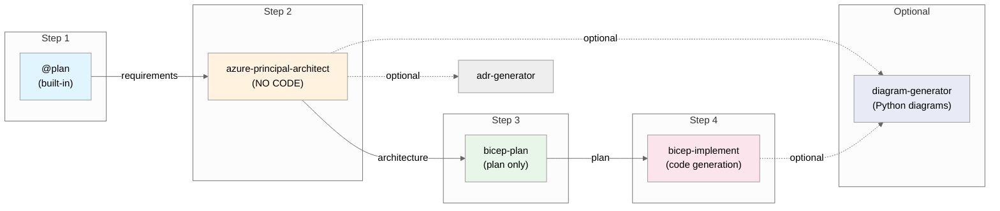
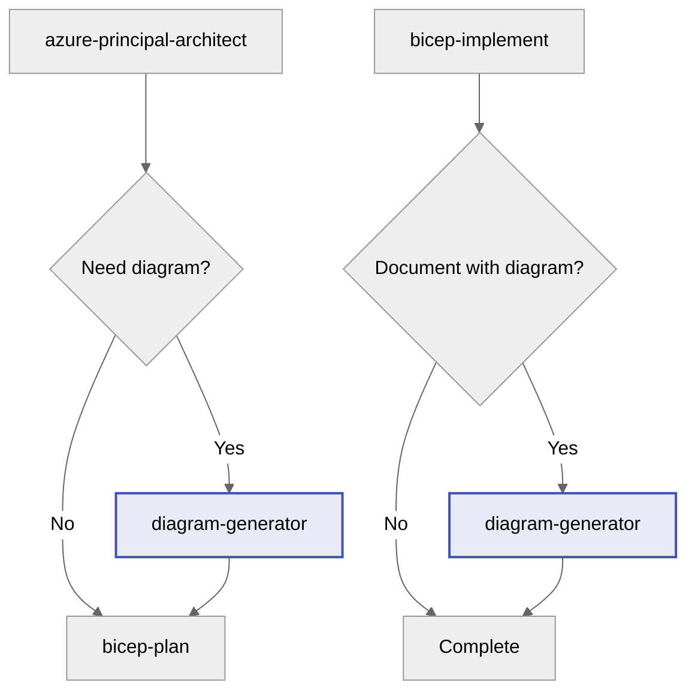

# Agent Workflow Improvement Plan

> **Status**: DRAFT - Pending Approval
> **Created**: 2025-12-01
> **Purpose**: Document proposed changes to align agents with end-to-end workflow

---

## Current vs. Desired Workflow

### Desired 4-Step Workflow (with Optional Diagram Generation)



### Workflow Steps

| Step | Agent | Input | Output | Approval Gate |
|------|-------|-------|--------|---------------|
| 1 | `@plan` (built-in) | User requirements | Requirements plan | ✅ Ask before proceeding |
| 2 | `azure-principal-architect` | Requirements plan | WAF assessment, architecture | ✅ Ask before proceeding |
| 2b | `diagram-generator` (optional) | Architecture assessment | Python diagram code + PNG | ✅ Ask before proceeding |
| 3 | `bicep-plan` | Architecture assessment | Implementation plan (INFRA.md) | ✅ Ask before proceeding |
| 4 | `bicep-implement` | Implementation plan | Bicep code files | ✅ Ask before deploying |
| 4b | `diagram-generator` (optional) | Final architecture | Updated diagram with all resources | ✅ Optional |

---

## New Agent: diagram-generator.agent.md

### Purpose

Create Python diagrams-as-code for Azure architecture visualization using the `diagrams` library by mingrammer.

### Integration Points

| When to Invoke | Trigger | Purpose |
|----------------|---------|---------|
| After architecture assessment (Step 2) | User wants visual architecture | Create initial architecture diagram |
| After implementation (Step 4) | User wants documentation | Create final deployment diagram |
| Standalone | User requests diagrams | Generate any Azure architecture diagram |

### Agent Specification

```yaml
name: diagram-generator
description: Generates Python architecture diagrams for Azure infrastructure
tools:
  - 'createOrEdit'     # Create Python diagram files
  - 'search'           # Search for architecture patterns
  - 'runCommands'      # Run Python to generate PNG
handoffs:
  - label: Continue to Infrastructure Planning
    agent: bicep-plan
    prompt: Now create a Bicep implementation plan for the visualized architecture
    send: false
  - label: Document Architecture Decision
    agent: adr-generator
    prompt: Create an ADR documenting this architecture with the generated diagram
    send: false
```

### Workflow Integration



### Key Capabilities (from S08 scenario)

1. **Azure Resource Nodes**: Front Door, AKS, SQL, Redis, Key Vault, App Insights, Container Registry, Storage, VNet, NSG
2. **Diagram Styles**: Clusters (resource groups, VNets), Edge connections, Custom icons
3. **Output**: Python file + PNG image (version-controlled)
4. **Learning Curve**: ~20 minutes
5. **Time Savings**: 80% per diagram vs manual tools

### Sample Output Pattern

```python
from diagrams import Diagram, Cluster
from diagrams.azure.network import FrontDoors, VirtualNetworks
from diagrams.azure.compute import KubernetesServices
from diagrams.azure.database import SQLDatabases

with Diagram("Contoso Patient Portal", show=False, direction="TB"):
    with Cluster("Azure Region - Sweden Central"):
        frontdoor = FrontDoors("Front Door")
        
        with Cluster("Virtual Network"):
            with Cluster("AKS Subnet"):
                aks = KubernetesServices("AKS Cluster")
            
            with Cluster("Data Subnet"):
                sql = SQLDatabases("SQL Database")
        
        frontdoor >> aks >> sql
```

### Prerequisites

- Python 3.8+
- `pip install diagrams`
- Graphviz (for PNG generation)

### Validation Checklist

- [ ] Python file passes syntax check
- [ ] All Azure resource imports are valid
- [ ] Diagram generates PNG without errors
- [ ] Architecture matches approved design

---

## Gap Analysis

### Issues Identified

| Issue | Current State | Impact | Priority |
|-------|---------------|--------|----------|
| **Architect can edit code** | `'edit'` in tools list | Violates "no code" requirement | 🔴 Critical |
| **No approval gates** | Agents proceed automatically | User loses control | 🔴 Critical |
| **Backward handoffs** | bicep-implement → architect | Confusing workflow | 🟡 High |
| **No workflow documentation** | Implicit assumptions | Hard to follow | 🟡 High |
| **Missing input/output specs** | Agents don't specify sources | Ambiguous handoffs | 🟢 Medium |

---

## Proposed Changes

### Change 1: Update `azure-principal-architect.agent.md`

**Remove code editing capability and add approval gate**

#### 1a. Remove `'edit'` from tools array

```yaml
# BEFORE
tools: ['edit', 'search', 'runCommands', 'Microsoft Docs/*', ...]

# AFTER
tools: ['search', 'runCommands', 'Microsoft Docs/*', ...]
```

#### 1b. Add Workflow Integration section

```markdown
## Workflow Integration

### Position in Workflow
This agent is **Step 2** of the 4-step infrastructure workflow.

```mermaid
%%{init: {'theme':'neutral'}}%%
graph LR
    P[@plan] --> A[azure-principal-architect]
    A --> B[bicep-plan]
    B --> I[bicep-implement]
    style A fill:#fff3e0,stroke:#ff9800,stroke-width:3px
```

### Input
- Requirements plan from `@plan` agent (built-in)
- Or direct user requirements

### Output
- WAF pillar assessment (scores for all 5 pillars)
- Architectural recommendations with trade-offs
- Cost estimation with SKU recommendations
- Reference architecture links

### Approval Gate (MANDATORY)
Before handing off to bicep-plan, ALWAYS ask:

> **🏗️ Architecture Assessment Complete**
>
> I've evaluated your requirements against the Azure Well-Architected Framework.
>
> | Pillar | Score | Notes |
> |--------|-------|-------|
> | Security | X/10 | ... |
> | Reliability | X/10 | ... |
> | Performance | X/10 | ... |
> | Cost | X/10 | ... |
> | Operations | X/10 | ... |
>
> **Do you approve this architecture assessment?**
> - Reply **"yes"** or **"approve"** to proceed to Bicep planning
> - Reply with **feedback** to refine the assessment
> - Reply **"no"** to start over with different requirements

### Guardrails
- ❌ **DO NOT** create, edit, or generate any code files
- ❌ **DO NOT** create Bicep, Terraform, or ARM templates
- ❌ **DO NOT** modify files outside documentation
- ✅ **DO** provide architectural guidance and recommendations
- ✅ **DO** create diagrams using Mermaid (in chat, not files)
- ✅ **DO** reference Azure Architecture Center patterns
- ✅ **DO** ask clarifying questions when requirements are unclear
```

---

### Change 2: Update `bicep-plan.agent.md`

**Add approval gate and clarify workflow position**

```markdown
## Workflow Integration

### Position in Workflow
This agent is **Step 3** of the 4-step infrastructure workflow.

```mermaid
%%{init: {'theme':'neutral'}}%%
graph LR
    P[@plan] --> A[azure-principal-architect]
    A --> B[bicep-plan]
    B --> I[bicep-implement]
    style B fill:#e8f5e9,stroke:#4caf50,stroke-width:3px
```

### Input
- Architecture assessment from `azure-principal-architect` agent
- WAF pillar scores and recommendations
- Cost estimates and SKU recommendations

### Output
- Implementation plan saved to `.bicep-planning-files/INFRA.{goal}.md`
- Resource dependency diagram (Mermaid)
- AVM module specifications with versions
- Phased implementation tasks

### Approval Gate (MANDATORY)
Before handing off to bicep-implement, ALWAYS ask:

> **📋 Implementation Plan Complete**
>
> I've created a detailed Bicep implementation plan:
> - **File**: `.bicep-planning-files/INFRA.{goal}.md`
> - **Resources**: X Azure resources identified
> - **AVM Modules**: Y modules specified
> - **Phases**: Z implementation phases
>
> **Do you approve this implementation plan?**
> - Reply **"yes"** or **"approve"** to proceed to Bicep code generation
> - Reply with **feedback** to refine the plan
> - Reply **"no"** to return to architecture review

### Guardrails
- ❌ **DO NOT** create actual Bicep code files (*.bicep)
- ❌ **DO NOT** modify files outside `.bicep-planning-files/`
- ✅ **DO** create detailed implementation plans
- ✅ **DO** specify exact AVM modules, versions, and configurations
- ✅ **DO** include cost breakdowns and dependency diagrams
```

---

### Change 3: Update `bicep-implement.agent.md`

**Add approval gate and remove backward handoffs**

#### 3a. Update handoffs (remove backward flow)

```yaml
# BEFORE
handoffs:
  - label: Review Security & Compliance
    agent: azure-principal-architect
    prompt: Review the implemented Bicep templates...
  - label: Update Plan Status
    agent: bicep-plan
    prompt: Update the implementation plan...

# AFTER
handoffs:
  - label: Document Implementation Decision
    agent: adr-generator
    prompt: Create an ADR documenting the infrastructure implementation, including the architectural decisions, trade-offs, and deployment approach.
    send: false
```

#### 3b. Add Workflow Integration section

```markdown
## Workflow Integration

### Position in Workflow
This agent is **Step 4** (final step) of the 4-step infrastructure workflow.

```mermaid
%%{init: {'theme':'neutral'}}%%
graph LR
    P[@plan] --> A[azure-principal-architect]
    A --> B[bicep-plan]
    B --> I[bicep-implement]
    style I fill:#fce4ec,stroke:#e91e63,stroke-width:3px
```

### Input
- Implementation plan from `bicep-plan` agent
- File: `.bicep-planning-files/INFRA.{goal}.md`

### Output
- Production-ready Bicep templates in `infra/bicep/{goal}/`
- Deployment script (`deploy.ps1`)
- Module files in `modules/` subfolder

### Approval Gate (MANDATORY)
After generating code, ALWAYS ask:

> **✅ Bicep Implementation Complete**
>
> I've generated the Bicep templates based on the implementation plan:
> - **Location**: `infra/bicep/{goal}/`
> - **Main template**: `main.bicep`
> - **Modules**: X module files
> - **Deploy script**: `deploy.ps1`
>
> **Validation Results:**
> - `bicep build`: ✅ Passed / ❌ Failed
> - `bicep lint`: ✅ Passed / ⚠️ Warnings
>
> **Do you approve this implementation?**
> - Reply **"yes"** or **"approve"** to finalize
> - Reply **"deploy"** to proceed with Azure deployment
> - Reply with **feedback** to refine the code
> - Reply **"no"** to return to planning phase

### Guardrails
- ✅ **DO** read the implementation plan before writing any code
- ✅ **DO** follow the plan exactly (AVM versions, SKUs, configurations)
- ✅ **DO** validate all code with `bicep build` and `bicep lint`
- ✅ **DO** generate deployment scripts with error handling
- ❌ **DO NOT** deviate from the approved implementation plan
- ❌ **DO NOT** deploy to Azure without explicit user approval
```

---

### Change 4: Create Workflow Documentation (Optional)

Create `WORKFLOW.md` in `.github/agents/` folder:

```markdown
# Azure Infrastructure Agent Workflow

## Overview

This repository uses a 4-step agent workflow for Azure infrastructure development:

| Step | Agent | Purpose | Creates |
|------|-------|---------|---------|
| 1 | `@plan` | Gather requirements | Requirements plan |
| 2 | `azure-principal-architect` | WAF assessment | Architecture recommendations |
| 3 | `bicep-plan` | Implementation planning | `INFRA.md` plan file |
| 4 | `bicep-implement` | Code generation | Bicep templates |

## How to Use

### Starting the Workflow

1. Open GitHub Copilot Chat
2. Type `@plan` followed by your requirements
3. Follow the agent handoffs through each step

### Approval Gates

Each step requires your approval before proceeding:
- **"yes"** / **"approve"** → Continue to next step
- **Feedback** → Agent refines output
- **"no"** → Return to previous step or restart

### Alternative: Unified Agent

For simple infrastructure or quick iterations, use `infrastructure-specialist` 
which combines all steps into a single agent.
```

---

## Summary of File Changes

| File | Action | Key Changes |
|------|--------|-------------|
| `azure-principal-architect.agent.md` | MODIFY | Remove `'edit'` tool, add guardrails, add approval gate, add handoff to diagram-generator |
| `bicep-plan.agent.md` | MODIFY | Add workflow section, add approval gate |
| `bicep-implement.agent.md` | MODIFY | Remove backward handoffs, add approval gate, add handoff to diagram-generator |
| `diagram-generator.agent.md` | **CREATE** | New agent for Python architecture diagrams (based on S08) |
| `WORKFLOW.md` | CREATE | Document end-to-end workflow (optional) |
| `adr-generator.agent.md` | NO CHANGE | Already well-structured |
| `infrastructure-specialist.agent.md` | NO CHANGE | Alternative unified workflow |

---

## Implementation Estimate

| Task | Effort | Priority |
|------|--------|----------|
| Remove `'edit'` from architect tools | 1 min | 🔴 Critical |
| Add guardrails section to architect | 5 min | 🔴 Critical |
| Add approval gates (3 agents) | 15 min | 🔴 Critical |
| Add workflow integration sections | 15 min | 🟡 High |
| Update handoff configurations | 10 min | 🟡 High |
| **Create diagram-generator.agent.md** | **20 min** | 🟢 Medium |
| Create WORKFLOW.md documentation | 10 min | 🟢 Optional |

**Total estimate**: ~75 minutes

---

## Content Review: Cross-Repository Updates

When implementing workflow changes, the following markdown files must be updated to reflect the new workflow, agents, and terminology.

### Critical Files to Update

| File | Required Updates | Priority |
|------|------------------|----------|
| `.github/copilot-instructions.md` | Add diagram-generator to agent list, update workflow diagram, add to Five-Agent section | 🔴 Critical |
| `resources/copilot-customizations/FIVE-MODE-WORKFLOW.md` | Update to reflect 5 agents + diagram-generator, add workflow steps | 🔴 Critical |
| `resources/copilot-customizations/README.md` | Add diagram-generator agent reference | 🟡 High |
| `resources/copilot-customizations/QUICK-START.md` | Add diagram-generator to quick start guide | 🟡 High |
| `scenarios/S03-five-agent-workflow/README.md` | Update workflow documentation | 🟡 High |
| `scenarios/S03-five-agent-workflow/DEMO-SCRIPT.md` | Add optional diagram generation step | 🟡 High |
| `scenarios/S08-diagrams-as-code/README.md` | Reference new diagram-generator agent | 🟢 Medium |
| `demos/30-MIN-DEMO-SCRIPT.md` | Add diagram-generator mention if relevant | 🟢 Medium |
| `demos/DEMO-QUICK-REFERENCE.md` | Update agent list | 🟢 Medium |
| `README.md` (root) | Update if workflow is mentioned | 🟢 Medium |

### Terminology Consistency Check

Ensure these terms are used consistently across all files:

| Term | Correct Usage | Check For |
|------|---------------|-----------|
| Agent count | "4-step workflow with optional diagram generation" | "4-agent", "5-agent" references |
| `@plan` | "built-in VS Code Plan Agent" | References to custom plan agent |
| diagram-generator | `diagram-generator` (with hyphen) | Inconsistent naming |
| Approval gates | "Approval Gate (MANDATORY)" | Missing approval language |
| Workflow order | Plan → Architect → Bicep-Plan → Bicep-Implement | Incorrect sequences |

### Specific Content Updates

#### 1. `.github/copilot-instructions.md`

Update the Five-Agent Workflow section:

```markdown
## Five-Agent Workflow Architecture (with Optional Diagram Generation)

This repository uses a **4-step agent workflow** with optional diagram generation:

0. **Plan Agent** (Built-in) - Create implementation plans with cost estimates (invoke with `@plan`)
1. **ADR Generator** (Optional) - Document architectural decisions
2. **Azure Principal Architect** - Azure Well-Architected Framework guidance
   - Optional handoff to **Diagram Generator** for visual architecture
3. **Bicep Planning Specialist** - Infrastructure planning with AVM modules
4. **Bicep Implementation Specialist** - Bicep code generation
   - Optional handoff to **Diagram Generator** for final documentation
```

#### 2. `resources/copilot-customizations/FIVE-MODE-WORKFLOW.md`

Add new section:

```markdown
## Optional: Diagram Generation

At two points in the workflow, you can optionally generate Python architecture diagrams:

### After Architecture Assessment (Step 2)
Use `diagram-generator` to create an initial architecture visualization before planning.

### After Implementation (Step 4)
Use `diagram-generator` to create final documentation diagrams showing all deployed resources.

### Invoking Diagram Generator
1. Press `Ctrl+Shift+A` or click the **Agent** button
2. Select `diagram-generator`
3. Provide architecture context or reference the current plan
```

#### 3. Handoff Button Updates

All agents with handoffs to diagram-generator need this button:

```yaml
handoffs:
  - label: Generate Architecture Diagram
    agent: diagram-generator
    prompt: Generate a Python architecture diagram for the current design using the diagrams library
    send: false
```

### Files to Search for Workflow References

Run this command to find all files mentioning workflow:

```powershell
Get-ChildItem -Path "c:\Repos\github-copilot-itpro" -Include "*.md" -Recurse | 
  Select-String -Pattern "workflow|agent|bicep-plan|bicep-implement|architect" -List |
  Select-Object Path, LineNumber, Line
```

### Validation Checklist

After implementing all changes, verify:

- [ ] All `.agent.md` files have consistent workflow position diagrams
- [ ] All README files reference the correct agent count and names
- [ ] All demo scripts mention approval gates
- [ ] All workflow diagrams include diagram-generator as optional
- [ ] No orphaned references to old workflow patterns
- [ ] `FIVE-MODE-WORKFLOW.md` matches actual agent capabilities
- [ ] `copilot-instructions.md` has complete agent list with diagram-generator
- [ ] Mermaid diagrams render correctly in all files

### Estimated Additional Effort

| Task | Effort |
|------|--------|
| Update copilot-instructions.md | 10 min |
| Update FIVE-MODE-WORKFLOW.md | 15 min |
| Update S03 scenario files | 10 min |
| Update demo scripts | 5 min |
| Cross-reference validation | 10 min |
| **Total content review** | **~50 min** |

**Grand Total (Implementation + Content Review)**: ~125 minutes

---

## Decision Points

Please review and decide:

- [ ] **Approve all changes** → Implement everything
- [ ] **Critical only** → Just approval gates + no-code guardrail
- [ ] **Modify plan** → Provide feedback for adjustments
- [ ] **Reject plan** → Keep current configuration

---

## Appendix: Current Handoff Configuration

### Before (Current)

```
azure-principal-architect:
  handoffs:
    → adr-generator (optional)
    → bicep-plan ✅

bicep-plan:
  handoffs:
    → bicep-implement ✅
    → azure-principal-architect ❌ (backward)

bicep-implement:
  handoffs:
    → azure-principal-architect ❌ (backward)
    → bicep-plan ❌ (backward)
```

### After (Proposed)

```
azure-principal-architect:
  handoffs:
    → bicep-plan ✅
    → adr-generator (optional)

bicep-plan:
  handoffs:
    → bicep-implement ✅

bicep-implement:
  handoffs:
    → adr-generator (optional, for documentation)
```

---

*This plan was generated based on workflow analysis on 2025-12-01.*
