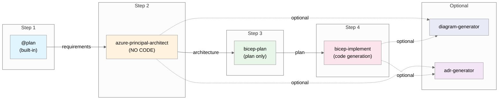

# Azure Infrastructure Agent Workflow

> **Version**: 1.0
> **Last Updated**: 2025-12-01

This document describes the 4-step agent workflow for Azure infrastructure development in this repository.

---

## Overview



## Workflow Steps

| Step | Agent | Purpose | Creates | Approval Required |
|------|-------|---------|---------|-------------------|
| 1 | `@plan` (built-in) | Gather requirements | Requirements plan | ✅ Yes |
| 2 | `azure-principal-architect` | WAF assessment | Architecture recommendations | ✅ Yes |
| 3 | `bicep-plan` | Implementation planning | `INFRA.md` plan file | ✅ Yes |
| 4 | `bicep-implement` | Code generation | Bicep templates | ✅ Yes |

### Optional Steps

| Agent | When to Use | Creates |
|-------|-------------|---------|
| `diagram-generator` | After Step 2 or 4 | Python diagram + PNG |
| `adr-generator` | After any step | Architecture Decision Record |

---

## How to Use

### Starting the Workflow

1. Open GitHub Copilot Chat (`Ctrl+Alt+I`)
2. Click the **Agent** button or press `Ctrl+Shift+A`
3. Select `@plan` to start with requirements
4. Follow the agent handoffs through each step

### Approval Gates

Each step requires your explicit approval before proceeding:

| Response | Action |
|----------|--------|
| **"yes"** or **"approve"** | Continue to next step |
| **Feedback text** | Agent refines output |
| **"no"** | Return to previous step or restart |

### Example Conversation Flow

```
You: @plan Create a HIPAA-compliant patient portal with Azure App Service and SQL Database

Plan Agent: [Generates requirements plan]
           Do you approve this plan?

You: yes

[Handoff to azure-principal-architect]

Architect: [Provides WAF assessment with scores]
           Do you approve this architecture assessment?

You: Add Azure Front Door for global load balancing

Architect: [Updates assessment with Front Door]
           Do you approve this architecture assessment?

You: approve

[Handoff to bicep-plan]

Planner: [Creates implementation plan in .bicep-planning-files/]
         Do you approve this implementation plan?

You: yes

[Handoff to bicep-implement]

Implementer: [Generates Bicep templates]
             Validation: bicep build ✅ | bicep lint ✅
             Do you approve this implementation?

You: deploy

Implementer: [Executes deployment to Azure]
```

---

## Agent Responsibilities

### @plan (Built-in VS Code Feature)

- **Input**: Natural language requirements
- **Output**: Structured requirements plan with cost estimates
- **Limitations**: Cannot access workspace files

### azure-principal-architect

- **Input**: Requirements from @plan or user
- **Output**: WAF pillar assessment, SKU recommendations, cost estimates
- **Limitations**: ❌ Cannot create or edit any files
- **Focus**: Architectural guidance only

### bicep-plan

- **Input**: Architecture assessment
- **Output**: Implementation plan in `.bicep-planning-files/INFRA.{goal}.md`
- **Limitations**: ❌ Cannot create actual Bicep code
- **Focus**: Detailed planning with AVM modules

### bicep-implement

- **Input**: Implementation plan from `.bicep-planning-files/`
- **Output**: Bicep templates in `infra/bicep/{goal}/`
- **Limitations**: Must follow the approved plan
- **Focus**: Code generation and validation

### diagram-generator (Optional)

- **Input**: Architecture context from any step
- **Output**: Python diagram file + PNG
- **Focus**: Visual documentation

### adr-generator (Optional)

- **Input**: Any architectural decision
- **Output**: ADR in `docs/adr/`
- **Focus**: Decision documentation

---

## Alternative: Unified Agent

For simple infrastructure or quick iterations, use `infrastructure-specialist` which combines all steps into a single agent. This is useful for:

- Small projects (< 5 resources)
- Prototyping and experimentation
- Users familiar with Azure who don't need step-by-step guidance

---

## File Locations

| Artifact | Location |
|----------|----------|
| Implementation plans | `.bicep-planning-files/INFRA.{goal}.md` |
| Bicep templates | `infra/bicep/{goal}/` |
| Architecture diagrams | `docs/diagrams/{goal}/` |
| ADRs | `docs/adr/` |
| Agent definitions | `.github/agents/` |

---

## Troubleshooting

### Agent Not Available

1. Press `Ctrl+Shift+A` to open agent picker
2. Verify agent files exist in `.github/agents/`
3. Restart VS Code if agents don't appear

### Handoff Not Working

1. Look for the handoff button in chat response
2. If no button, manually switch agents with `Ctrl+Shift+A`
3. Copy relevant context to new agent conversation

### Validation Failures

| Error | Solution |
|-------|----------|
| `bicep build` fails | Check syntax errors in Bicep files |
| `bicep lint` warnings | Address best practice violations |
| Deployment fails | Verify Azure permissions and quotas |

---

## Related Documentation

- [Five-Mode Workflow](../../resources/copilot-customizations/FIVE-MODE-WORKFLOW.md)
- [Copilot Instructions](../copilot-instructions.md)
- [S03 Scenario: Five-Agent Workflow](../../scenarios/S03-five-agent-workflow/)
