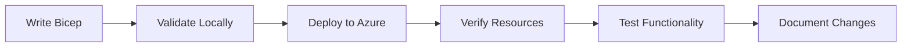
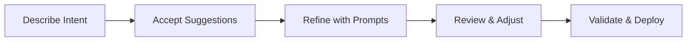

# GitHub Copilot Instructions for IT Pro Field Guide

This file provides context and guidance for GitHub Copilot when assisting with this repository.

## Quick Reference for AI Agents

**Essential Knowledge for Immediate Productivity:**

1. **Default Region**: Always use `swedencentral` (alternative: `germanywestcentral` for German data residency)
2. **Unique Resource Names**: Generate `var uniqueSuffix = uniqueString(resourceGroup().id)` in main.bicep, pass to ALL modules
3. **Name Length Limits**: Key Vault ≤24 chars, Storage ≤24 chars (no hyphens), SQL ≤63 chars
4. **Demo Policy Bypass**: Add `SecurityControl: 'Ignore'` tag to bypass Azure AD-only auth for SQL Server
5. **Zone Redundancy**: App Service Plans need P1v3 SKU (not S1) for zone redundancy
6. **Five-Agent Workflow**: Start with `@plan` → (optional) adr_generator → azure-principal-architect → bicep-plan → bicep-implement
7. **Working Example**: `infra/bicep/contoso-patient-portal/` demonstrates all patterns correctly
8. **Deploy Script Pattern**: Use `[CmdletBinding(SupportsShouldProcess)]` + `$WhatIfPreference` (NOT explicit `$WhatIf` param)
9. **Dev Container**: Pre-configured Ubuntu 24.04 with all tools (Terraform, Azure CLI, Bicep, PowerShell 7)
10. **Line Endings**: Use `.gitattributes` with `* text=auto eol=lf` for cross-platform consistency

**Critical Files:**
- Agent definitions: `.github/agents/*.agent.md`
- Workflow guide: `resources/copilot-customizations/FIVE-MODE-WORKFLOW.md`
- Production example: `infra/bicep/contoso-patient-portal/`
- Bicep implement agent: `.github/agents/bicep-implement.agent.md` (has unique suffix guidance)
- Dev container config: `.devcontainer/devcontainer.json` (includes post-create.sh tool installation)
- Line ending rules: `.gitattributes` (normalizes CRLF→LF for cross-platform development)

## Regional Selection Guidelines

**Default Region**: `swedencentral` (sustainable operations with renewable energy)

**Alternative Region**: `germanywestcentral` (German data residency requirements)

**When to Use Other Regions:**

### Geographic Latency Optimization
- **Americas**: Use `eastus`, `eastus2`, `westus2`, or `centralus` for users primarily in North/South America
- **Asia Pacific**: Use `southeastasia`, `eastasia`, or `australiaeast` for users in APAC region
- **Europe (other alternatives)**: Use `westeurope` or `northeurope` if swedencentral/germanywestcentral don't meet requirements

### Compliance & Data Sovereignty
- **Germany**: Use `germanywestcentral` for German data residency requirements
- **Switzerland**: Use `switzerlandnorth` for Swiss banking/healthcare regulations
- **UK**: Use `uksouth` or `ukwest` for UK GDPR requirements
- **France**: Use `francecentral` for French data sovereignty
- **Specific Regulations**: Check compliance requirements at [Azure Compliance](https://learn.microsoft.com/azure/compliance/)

### Service Availability
- **Preview Features**: Some Azure preview features may only be available in specific regions (typically `eastus`, `westus2`, `westeurope`)
- **VM/Database SKUs**: Not all VM sizes or database tiers are available in all regions
- **Check Availability**: Use [Azure Products by Region](https://azure.microsoft.com/global-infrastructure/services/) to verify service availability
- **Availability Zones**: Ensure the selected region supports availability zones if zone redundancy is required

### Cost Optimization
- Some regions have lower pricing for compute and storage resources
- Use [Azure Pricing Calculator](https://azure.microsoft.com/pricing/calculator/) to compare costs
- Consider egress costs for data transfer between regions

**Best Practice**: When deviating from `swedencentral`, document the reason (latency/compliance/availability) in deployment parameters or README.

## Repository Purpose

This repository demonstrates how GitHub Copilot serves as an **efficiency multiplier** for IT Professionals and Cloud Architects working with Azure infrastructure. The target audience is:

- **Primary**: System Integrator (SI) partners delivering Azure infrastructure projects
- **Secondary**: IT Pros learning cloud/IaC, customers evaluating GitHub Copilot

## Five-Agent Workflow Architecture

This repository uses a **five-agent workflow** for Azure infrastructure development:

0. **Plan Agent** (Built-in) - Create implementation plans with cost estimates (invoke with `@plan`)
1. **ADR Generator** (Optional) - Document architectural decisions (`.github/agents/adr-generator.agent.md`)
2. **Azure Principal Architect** - Azure Well-Architected Framework guidance (`.github/agents/azure-principal-architect.agent.md`)
3. **Bicep Planning Specialist** - Infrastructure planning with AVM modules (`.github/agents/bicep-plan.agent.md`)
4. **Bicep Implementation Specialist** - Bicep code generation (`.github/agents/bicep-implement.agent.md`)

**How to Use Custom Agents:**
1. Press `Ctrl+Shift+A` or click the **Agent** button in Copilot Chat
2. Select agent from dropdown: `@plan`, `adr_generator`, `azure-principal-architect`, `bicep-plan`, or `bicep-implement`
3. Type your prompt and submit

**Recommended Workflow with Plan Agent:**
```
Agent: @plan (START HERE for multi-step projects)
Prompt: Create deployment plan for HIPAA-compliant patient portal with cost estimates

[Plan agent asks clarifying questions and generates detailed plan]
Click "Document This Decision" button → Switches to adr_generator

Agent: adr_generator (auto-selected via handoff)
[Documents architectural decisions]
Click "Review Against WAF Pillars" button → Switches to azure-principal-architect

Agent: azure-principal-architect (auto-selected via handoff)
Prompt: Assess architecture against WAF pillars
Click "Generate Implementation Plan" button → Switches to bicep-plan

Agent: bicep-plan (auto-selected via handoff)
[Creates machine-readable YAML plan in .bicep-planning-files/]
Click "Generate Bicep Code" button → Switches to bicep-implement

Agent: bicep-implement (auto-selected via handoff)
[Generates production-ready Bicep templates]
```

**Quick Workflow (Skip Planning):**
```
Agent: azure-principal-architect (skip ADR and Plan for quick demos)
Prompt: Assess HIPAA-compliant patient portal architecture

Agent: bicep-plan
Prompt: Create implementation plan with AVM modules

Agent: bicep-implement
Prompt: Generate Bicep templates from the plan
```

📖 **Full Documentation:** See `resources/copilot-customizations/FIVE-MODE-WORKFLOW.md`

**Critical Agent Behaviors:**
- **All agents default to `swedencentral` region** (alternative: `germanywestcentral`), unless explicitly specified
- **Bicep agents ALWAYS generate unique resource name suffixes** using `uniqueString(resourceGroup().id)` to prevent naming collisions
- **Key Vault names**: Must be ≤24 chars (pattern: `kv-{shortname}-{env}-{suffix}`)
- **App Service Plans**: Use P1v3 (Premium) or higher for zone redundancy (Standard SKU doesn't support it)
- **SQL Server**: Add `SecurityControl: 'Ignore'` tag to bypass Azure AD-only auth policy in demo environments

**Supplementary Tools:** Additional chat modes are available in `resources/copilot-customizations/chatmodes/` for Terraform, debugging, and specialized scenarios.

## Repository Structure

```
github-copilot-itpro/
├── .devcontainer/                       # Pre-configured dev environment
│   ├── devcontainer.json                # Container configuration
│   ├── post-create.sh                   # Tool installation script
│   └── TROUBLESHOOTING.md               # Setup issues & fixes
├── .github/
│   ├── agents/                          # 4 custom agents (Plan is built-in)
│   │   ├── adr-generator.agent.md
│   │   ├── azure-principal-architect.agent.md
│   │   ├── bicep-plan.agent.md
│   │   └── bicep-implement.agent.md
│   └── copilot-instructions.md          # THIS FILE - AI agent guidance
├── demos/                               # Self-contained 30-minute demo modules
│   ├── 01-bicep-quickstart/
│   ├── 02-powershell-automation/
│   ├── 03-terraform-infrastructure/     # Multi-cloud IaC with Terraform
│   ├── 04-troubleshooting-assistant/
│   ├── 05-documentation-generator/
│   ├── 06-azure-specialization-prep/
│   ├── 07-five-agent-workflow/          # Workflow demo (points to infra/)
│   └── 08-sbom-generator/               # Software Bill of Materials
├── infra/bicep/                         # Production-ready Bicep examples
│   └── contoso-patient-portal/         # HIPAA-compliant multi-tier app (Demo 07 implementation)
├── partner-toolkit/                     # Materials for SI partners
├── case-studies/                        # Real-world success stories
├── skills-bridge/                       # Learning content for IT Pros
└── resources/copilot-customizations/    # Workflow guides & chat modes
    ├── FIVE-MODE-WORKFLOW.md            # Complete workflow documentation
    ├── chatmodes/                       # Supplementary chat modes
    ├── instructions/                    # Bicep, PowerShell, Terraform best practices
    └── prompts/                         # Curated prompt examples
```

**Note**: Demo 07 (Five-Agent Workflow) is referenced in README but lives in `infra/bicep/contoso-patient-portal/` - this is the actual working implementation of the workflow showing 96% time savings (18 hours → 45 minutes).

## Content Format Standards

### Demo Modules

Each demo follows this structure:

```
demos/XX-demo-name/
├── README.md                   # Overview, objectives, prerequisites
├── DEMO-SCRIPT.md              # Step-by-step walkthrough (30 min)
├── scenario/
│   ├── requirements.md         # Customer scenario
│   └── architecture.md         # Target architecture (Mermaid diagrams)
├── manual-approach/
│   ├── example-code/          # Traditional approach
│   └── time-tracking.md       # Manual effort metrics (baseline)
├── with-copilot/
│   ├── example-code/          # Copilot-assisted code
│   └── time-tracking.md       # Time saved metrics
├── prompts/
│   └── effective-prompts.md   # Curated prompts for this scenario
└── validation/
    ├── deploy.ps1             # Deployment script
    ├── cleanup.ps1            # Resource cleanup
    └── verify.ps1             # Post-deployment validation
```

### Naming Conventions

- **Resource Groups**: `rg-<project>-<env>`
- **Virtual Networks**: `vnet-<env>-<purpose>-<region>`
- **Subnets**: `snet-<tier>-<env>`
- **Storage Accounts**: `st<project><env><random>`
- **NSGs**: `nsg-<subnet>-<env>`

### Tags Required

All Azure resources should include:
```bicep
tags: {
  Environment: string    // dev, staging, prod
  ManagedBy: 'Bicep'    // or 'Terraform', 'ARM'
  Project: string       // Project name
  Owner: string         // Team or individual
  CostCenter: string    // Billing allocation (optional)
}
```

## Copilot Guidance for Code Generation

### Bicep Templates

When generating Bicep code:

1. **Always use latest API versions** (2023-05-01 or newer)
2. **Default location**: `swedencentral` (alternative: `germanywestcentral` for German data residency)
3. **CRITICAL - Unique resource names**: Generate suffix in main.bicep and pass to ALL modules:
   ```bicep
   var uniqueSuffix = uniqueString(resourceGroup().id)
   ```
4. **Name length constraints**:
   - Key Vault: ≤24 chars (e.g., `kv-contosop-dev-abc123` = 22 chars)
   - Storage Account: ≤24 chars, lowercase + numbers only, NO hyphens
   - SQL Server: ≤63 chars, lowercase + numbers + hyphens
5. **Include security by default**:
   - `supportsHttpsTrafficOnly: true`
   - `minimumTlsVersion: 'TLS1_2'`
   - `allowBlobPublicAccess: false`
   - NSG deny rules at priority 4096
6. **Azure Policy compliance for demos**:
   - SQL Server: Add `SecurityControl: 'Ignore'` tag to bypass Azure AD-only auth requirement
   - App Service Plan: Use P1v3 (not S1) for zone redundancy support
7. **Add descriptive comments** for all parameters and resources
8. **Include outputs** for resource IDs and endpoints
9. **Follow modular design** (separate files for network, storage, compute)

Example parameter documentation:
```bicep
@description('Azure region for all resources')
@allowed([
  'swedencentral'
  'germanywestcentral'
  'westeurope'
  'northeurope'
])
param location string = 'swedencentral'

@description('Unique suffix for resource naming (generated from resource group ID)')
param uniqueSuffix string

@description('Environment name (dev, staging, prod)')
@allowed([
  'dev'
  'staging'
  'prod'
])
param environment string = 'dev'
```

### PowerShell Scripts

When generating PowerShell code:

1. **Use approved verbs** (Get-, Set-, New-, Remove-)
2. **Include comment-based help** with `.SYNOPSIS`, `.DESCRIPTION`, `.EXAMPLE`
3. **Add parameter validation**:
   ```powershell
   [Parameter(Mandatory = $true)]
   [ValidateNotNullOrEmpty()]
   [string]$ResourceGroupName
   ```
4. **Implement error handling** with `try/catch`
5. **Set strict mode**: `Set-StrictMode -Version Latest`
6. **Use splatting** for complex commands
7. **Add colored output** for better UX

### Documentation (Markdown)

**BEFORE generating any markdown, read `.github/instructions/markdown.instructions.md` and `MARKDOWN-STYLE-GUIDE.md`**

When generating documentation:

1. **Follow markdown standards** (ATX headers, 120-char line length, fenced code blocks with language)
2. **Use Mermaid diagrams** for architecture and workflows
3. **Include metrics** for time savings (e.g., "45 min → 10 min (78% reduction)")
4. **Add prerequisites** section with tool versions
5. **Provide multiple examples** (quick start, detailed walkthrough)
6. **Use emoji sparingly** for visual hierarchy (✅ ❌ ⚠️ 💡 🚀)
7. **Include troubleshooting** section
8. **Validate before committing**: Run `markdownlint '**/*.md' --ignore node_modules --config .markdownlint.json`

## Value Messaging

### Core Value Proposition

"GitHub Copilot is an **efficiency multiplier** for IT Pros, reducing infrastructure development time by 60-90% while teaching best practices through context-aware suggestions."

### Key Metrics to Highlight

| Scenario | Manual Time | With Copilot | Improvement |
|----------|-------------|--------------|-------------|
| Bicep Template (VNet + Storage) | 45 min | 10 min | 78% reduction |
| PowerShell Automation Script | 60 min | 15 min | 75% reduction |
| Azure Arc Onboarding | 80 hours | 8 hours | 90% reduction |
| Troubleshooting Research | 30 min | 5 min | 83% reduction |
| Documentation Generation | 120 min | 20 min | 83% reduction |

### Messaging Principles

1. **Not "Pain Point Solving"** → Focus on "Efficiency Multiplier"
2. **Not "Replace Expertise"** → Focus on "Augment Capabilities"
3. **Not "Just for Developers"** → Focus on "Infrastructure as Code"
4. **Not "Learn to Use Tool"** → Focus on "Learn by Doing"

## Copilot Prompting Best Practices

### Effective Prompt Patterns

**For Infrastructure**:
```bicep
// Create an Azure [resource type] with [specific requirements]
// Include [security features]
// Use [parameters/variables]
```

**For Automation**:
```powershell
# Create a function to [task]
# Accept parameters: [list]
# Include error handling and verbose output
```

**For Documentation**:
```markdown
Generate a README for [purpose]
Include: overview, prerequisites, usage examples, troubleshooting
Use Mermaid diagrams for architecture
```

### Prompt Engineering Tips

1. **Be Specific**: "Create a VNet with 3 subnets (10.0.1.0/24, 10.0.2.0/24, 10.0.3.0/24)"
2. **Mention Security**: "with HTTPS only, TLS 1.2 minimum, no public access"
3. **Use Iterative Refinement**: Build complexity in steps
4. **Reference Context**: "use the subnet ID from the network module"
5. **Describe Intent**: "secure storage for application data" vs. "storage account"

## Demo Delivery Guidelines

### 30-Minute Demo Structure

| Phase | Duration | Focus |
|-------|----------|-------|
| **Scene Setting** | 5 min | Customer scenario, manual approach pain points |
| **Copilot Demo** | 15 min | Live code generation, show key features |
| **Validation** | 8 min | Deploy to Azure, verify resources |
| **Wrap-Up** | 2 min | Metrics, ROI, next steps |

### Demo Presentation Tips

1. **Pause after suggestions** - Let audience see the "magic"
2. **Highlight surprises** - "Notice Copilot added outputs automatically"
3. **Show before/after** - Compare manual ARM template vs. Copilot-generated Bicep
4. **Invite participation** - Take prompt suggestions from audience
5. **Use real scenarios** - Reference actual customer challenges

## Partner Enablement Focus

When assisting with partner-related content:

1. **ROI Calculators**: Include formulas for time savings → cost savings
2. **Customer Pitch Decks**: Emphasize business value, not technical features
3. **Demo Delivery Guides**: Step-by-step with timing, backup plans
4. **Success Stories**: Quantified results (hours saved, errors reduced)
5. **Objection Handling**: Address concerns about AI, security, costs

## Common Patterns

### Azure Resource Deployment Workflow



### Copilot-Assisted Development Workflow



## Critical Deployment Patterns

### Resource Naming with Unique Suffixes

**Problem**: Azure resources like Key Vault, Storage Accounts, and SQL Servers require globally unique names. Without suffixes, deployments fail with naming collisions.

**Solution Pattern** (See `infra/bicep/contoso-patient-portal/` for complete implementation):

```bicep
// main.bicep - Generate suffix once
var uniqueSuffix = uniqueString(subscription().subscriptionId, resourceGroupName)

// Pass to all modules
module keyVault 'modules/key-vault.bicep' = {
  params: {
    uniqueSuffix: uniqueSuffix
    // ... other params
  }
}

// modules/key-vault.bicep - Apply to resource names
param uniqueSuffix string
var keyVaultName = 'kv-${take(replace(projectName, '-', ''), 8)}-${take(environment, 3)}-${take(uniqueSuffix, 6)}'
// Result: "kv-contosop-dev-abc123" (22 chars, within 24 limit)
```

**Key Points:**
- Use `take()` to control name length (Key Vault = 24 chars max)
- Remove hyphens for Storage Accounts (no special chars allowed)
- Shorten project names (e.g., "contoso-patient-portal" → "contosop")
- Apply suffix to ALL resources for consistency

### Azure Policy Workarounds for Demo Environments

**Common Policy Blockers:**
1. **SQL Server Azure AD-only authentication**: Add `SecurityControl: 'Ignore'` tag
2. **App Service Plan zone redundancy**: Must use Premium SKU (P1v3+), not Standard
3. **Key Vault name length**: Policy doesn't block, but Azure enforces 24-char limit

**Implementation** (See `infra/bicep/contoso-patient-portal/main.bicep`):
```bicep
param tags object = {
  Environment: environment
  ManagedBy: 'Bicep'
  SecurityControl: 'Ignore'  // Bypass demo-blocking policies
}
```

### Progressive Deployment Pattern

For complex infrastructure (10+ resources, multiple modules):

**Phase 1**: Foundation (networking, NSGs)
**Phase 2**: Platform services (Key Vault, SQL Server, App Service Plan)
**Phase 3**: Application tier (App Service, databases, private endpoints)
**Phase 4**: Configuration (secrets, RBAC, monitoring)

Between each phase: `bicep build` → `bicep lint` → `az deployment` → validate resources exist

**Why**: Helps isolate dependency issues, provides clear rollback points, makes debugging easier.

## Repository-Specific Context

### Technologies Used

- **IaC**: Bicep (primary), Terraform (demos/03), ARM templates (legacy examples)
- **Automation**: PowerShell 7+, Azure CLI, Bash scripts
- **Platform**: Azure (public cloud), multi-cloud patterns (Terraform)
- **Tooling**: VS Code, GitHub Copilot, Azure CLI, Bicep CLI, Terraform CLI
- **Security Scanning**: tfsec, Checkov, PSScriptAnalyzer
- **Version Control**: Git/GitHub with `.gitattributes` for line ending normalization
- **Documentation**: Markdown, Mermaid diagrams
- **Containerization**: Dev Containers with Ubuntu 24.04 LTS base

### Target Environments

- **Dev/Demo**: Low-cost resources (Standard LRS, B-series VMs)
- **Staging**: Standard tier, zone-redundant where applicable
- **Production**: Premium tier, geo-redundant, HA configurations

### Security Baseline

All demo code should follow these security principles:

- 🔒 **Encryption**: At rest and in transit (TLS 1.2+)
- 🚫 **No Public Access**: Use private endpoints where possible
- 🛡️ **Network Isolation**: NSGs on all subnets, deny by default
- 🔑 **Managed Identities**: Prefer over connection strings
- 📝 **Audit Logging**: Enable diagnostic settings
- 🔄 **Soft Delete**: Enable for storage and Key Vault

## File-Specific Instructions

### When Editing Bicep Files

- Use 2-space indentation
- Add `@description()` decorators for all parameters
- Group resources logically (NSGs before VNets)
- Include comprehensive outputs
- Add comments explaining complex logic
- **ALWAYS include `uniqueSuffix` parameter in modules**
- Default `location` to `swedencentral`

### When Editing PowerShell Deployment Scripts (deploy.ps1)

Critical patterns from `infra/bicep/contoso-patient-portal/deploy.ps1`:

1. **Use `[CmdletBinding(SupportsShouldProcess)]`** - Provides automatic `-WhatIf` support
   - DO NOT add explicit `[switch]$WhatIf` parameter (causes conflict)
   - Use `$WhatIfPreference` automatic variable in script body
   - Use `$PSCmdlet.ShouldProcess()` for confirmation prompts

2. **Bicep lint handling**: Treat warnings as non-blocking
   ```powershell
   $lintResult = bicep lint $TemplateFile 2>&1
   if ($lintResult -match 'Error') { return $false }
   if ($lintResult -match 'Warning') { Write-Warning "Non-blocking warnings found" }
   return $true  # Continue deployment
   ```

3. **Region validation**: Add allowed regions to ValidateSet
   ```powershell
   [ValidateSet('swedencentral', 'germanywestcentral', 'westeurope', 'northeurope')]
   [string]$Location = 'swedencentral'
   ```

4. **Standard structure**:
   - Prerequisites check (Azure CLI, Bicep CLI, authentication)
   - Bicep validation (build + lint)
   - Cost estimation display
   - User confirmation (Read-Host)
   - Deployment with progress indicators
   - Output display (resource IDs, connection strings)

### When Editing PowerShell Scripts (General)

- Use 4-space indentation
- Follow PSScriptAnalyzer rules
- Include verbose output for debugging
- Add progress indicators for long-running tasks
- Use Write-Verbose, Write-Warning, Write-Error appropriately
- Set `Set-StrictMode -Version Latest` and `$ErrorActionPreference = 'Stop'`

### When Editing Markdown Files

**CRITICAL: Always follow markdown standards defined in `.github/instructions/markdown.instructions.md` and `MARKDOWN-STYLE-GUIDE.md`**

Key requirements (see full standards in referenced files):
- Use ATX-style headers (`#` not `===`)
- Add empty lines before/after headers
- Use fenced code blocks with language identifiers (always specify language)
- Maximum line length: 120 characters (150 for code blocks)
- Use `-` for bullet points (not `*` or `+`)
- Use relative links for internal navigation
- Ensure LF line endings (handled automatically by `.gitattributes`)
- Validate with: `markdownlint '**/*.md' --ignore node_modules --config .markdownlint.json`
- Auto-fix with: `markdownlint '**/*.md' --ignore node_modules --config .markdownlint.json --fix`

**Before creating/editing any markdown file:**
1. Read `.github/instructions/markdown.instructions.md` for validation requirements
2. Check `MARKDOWN-STYLE-GUIDE.md` for formatting examples
3. Follow `.markdownlint.json` configuration rules

### When Creating .gitattributes Files

For cross-platform development (Windows/Linux/macOS):

```gitattributes
# Auto-normalize all text files to LF
* text=auto eol=lf

# Explicit LF for code files
*.bicep text eol=lf
*.tf text eol=lf
*.md text eol=lf
*.sh text eol=lf
*.ps1 text working-tree-encoding=UTF-8 eol=lf
*.json text eol=lf
*.yml text eol=lf
*.yaml text eol=lf

# Binary files
*.png binary
*.jpg binary
*.zip binary
*.exe binary
```

**Critical Pattern**: PowerShell files need `working-tree-encoding=UTF-8` to preserve BOM while using LF

## Suitable Tasks for Copilot Coding Agent

### Tasks Well-Suited for Copilot

When assigned to work on issues in this repository, Copilot works best on:

- **Bug fixes**: Correcting issues in Bicep templates, PowerShell scripts, or documentation
- **Test coverage**: Adding validation scripts or test cases for demos
- **Documentation updates**: Improving README files, adding examples, updating guides
- **Code refactoring**: Improving existing scripts or templates for clarity and maintainability
- **Demo enhancements**: Adding new scenarios or prompts to existing demos
- **Template generation**: Creating new Bicep modules or PowerShell functions
- **Small feature additions**: Adding parameters, outputs, or new resources to templates

### Tasks to Keep Manual

Some tasks should be handled by human developers:

- **Complex multi-demo refactoring**: Changes affecting multiple demos requiring design consistency
- **Architecture decisions**: Deciding demo structure, learning paths, or partner toolkit design
- **Production deployments**: Actual Azure deployments to live environments
- **Security reviews**: Validating security implications of infrastructure changes
- **Partner-specific customizations**: Tailoring content for specific customer needs
- **Strategic content**: Creating new case studies or value messaging

### Issue Description Best Practices

For best results when assigning issues to Copilot:

- ✅ **Be specific**: "Add NSG rules to network.bicep for web tier allowing HTTP/HTTPS"
- ✅ **Include acceptance criteria**: "Must include outputs for NSG ID and include comments"
- ✅ **Reference files**: "Update demos/01-bicep-quickstart/with-copilot/network.bicep"
- ✅ **Specify standards**: "Follow security baseline and use latest API versions"
- ❌ **Avoid vague requests**: "Make the demo better" or "Add more content"

## Custom Agents

This repository supports GitHub Copilot custom agents for specialized tasks. Custom agents can be defined in `.github/agents/` directory.

### Potential Custom Agents for This Repository

Consider creating custom agents for:

1. **Bicep Template Specialist**
   - Focus: Azure infrastructure as code
   - Expertise: Bicep syntax, Azure resources, security best practices
   - Use for: Creating or reviewing Bicep templates

2. **PowerShell Automation Expert**
   - Focus: PowerShell scripting for Azure
   - Expertise: Azure PowerShell modules, error handling, automation patterns
   - Use for: Writing or improving PowerShell scripts

3. **Documentation Generator**
   - Focus: Technical documentation and runbooks
   - Expertise: Markdown, Mermaid diagrams, Azure architecture
   - Use for: Creating or updating documentation

4. **Demo Validator**
   - Focus: Ensuring demo quality and consistency
   - Expertise: Demo structure, validation scripts, time tracking
   - Use for: Reviewing new demos before publication

### Creating a Custom Agent

To create a custom agent, add a markdown file in `.github/agents/`:

```markdown
# Agent Name: Bicep Template Specialist

## Description
Expert in Azure Bicep templates with focus on security and best practices.

## Specialization
- Azure resource types and API versions
- Security configurations (encryption, private endpoints, NSGs)
- Naming conventions and tagging standards
- Modular template design

## Instructions
When creating or reviewing Bicep templates:
- Use latest API versions (2023-05-01 or newer)
- Include security by default settings
- Add descriptive @description() decorators
- Follow repository naming conventions
- Generate comprehensive outputs
```

## Questions to Ask Users

When users request changes or additions:

1. **Audience**: "Is this for partners, IT Pros, or executives?"
2. **Complexity**: "Should this be beginner, intermediate, or advanced?"
3. **Duration**: "Is this a 30-min demo or deep-dive content?"
4. **Environment**: "Is this for dev/demo or production deployment?"
5. **Metrics**: "Do you have time savings data to include?"
6. **Scope**: "Is this suitable for Copilot coding agent or needs human review?"

## Development Environment

### Option 1: Dev Container (Recommended)

This repository includes a pre-configured dev container with all tools installed:

**Included Tools:**
- **Terraform** (latest) with tfsec, Checkov validation
- **Azure CLI** (latest) with Bicep CLI embedded
- **PowerShell 7+** (cross-platform)
- **Git** (built from source, latest version)
- **Go, Python, Node.js** runtimes
- **25+ VS Code extensions** (Copilot, Azure, Terraform, PowerShell)

**Quick Start:**
```bash
# Clone and open in VS Code
git clone https://github.com/jonathan-vella/github-copilot-itpro.git
code github-copilot-itpro

# Reopen in container (F1 → "Dev Containers: Reopen in Container")
# Wait 3-5 minutes for post-create.sh to install tools

# Verify setup
terraform --version
az --version
bicep --version
pwsh --version
```

**Environment Details:**
- OS: Ubuntu 24.04.3 LTS on WSL2 (if using Windows)
- Container runs as `vscode` user with sudo access
- Working directory: `/workspaces/github-copilot-itpro`
- Persistent storage for Azure CLI credentials and VS Code extensions

**Troubleshooting:** See `.devcontainer/TROUBLESHOOTING.md`

### Option 2: Manual Setup

To work with this repository without dev containers, ensure the following tools are installed:

- **Visual Studio Code** (latest version)
- **GitHub Copilot extension** for VS Code
- **Azure CLI** (version 2.50.0 or newer)
- **Bicep CLI** (version 0.20.0 or newer) - Often included with Azure CLI
- **PowerShell 7+** (cross-platform)
- **Git** (version 2.30.0 or newer)
- **Terraform CLI** (version 1.5.0 or newer) - For Terraform demos

### Recommended VS Code Extensions

- GitHub Copilot (required)
- GitHub Copilot Chat (required)
- Azure Bicep
- PowerShell
- Markdown All in One
- Mermaid Preview
- Azure Account
- Azure Resources

### Local Validation Commands

Before committing changes:

```bash
# Validate Bicep templates (build, lint, format)
bicep build infra/bicep/contoso-patient-portal/main.bicep
bicep lint infra/bicep/contoso-patient-portal/main.bicep
bicep format infra/bicep/contoso-patient-portal/main.bicep

# Validate Terraform configurations
cd demos/03-terraform-infrastructure/with-copilot
terraform init
terraform fmt -check -recursive
terraform validate
tfsec .
checkov -d .

# Run PowerShell script analyzer
pwsh -Command "Invoke-ScriptAnalyzer -Path demos/02-powershell-automation/ -Recurse -Settings PSGallery"

# Check markdown links (if markdownlint-cli installed)
markdownlint '**/*.md' --ignore node_modules

# Verify line endings (should be LF in repository)
git ls-files --eol | grep 'w/crlf' || echo "✓ All files use LF"
```

**Key Validation Patterns:**

1. **Bicep**: Always run `build` → `lint` → `format` before commit
2. **Terraform**: Run `fmt` → `validate` → `tfsec` → `checkov` for security
3. **PowerShell**: Use PSGallery settings for strict analysis
4. **Line Endings**: Ensure `.gitattributes` normalizes to LF (cross-platform consistency)

### Azure Subscription Requirements

For testing demos:
- Azure subscription with Contributor access
- Sufficient quota for demo resources (typically minimal)
- Resource groups should use naming pattern: `rg-copilot-demo-<demo-name>-<random>`
- Clean up resources after testing to minimize costs

## Resources

- [Azure Bicep Documentation](https://learn.microsoft.com/azure/azure-resource-manager/bicep/)
- [Terraform Azure Provider](https://registry.terraform.io/providers/hashicorp/azurerm/latest/docs)
- [PowerShell Best Practices](https://learn.microsoft.com/powershell/scripting/developer/cmdlet/cmdlet-development-guidelines)
- [Azure Naming Conventions](https://learn.microsoft.com/azure/cloud-adoption-framework/ready/azure-best-practices/naming-and-tagging)
- [GitHub Copilot for Azure](https://learn.microsoft.com/azure/developer/github/github-copilot-azure)
- [GitHub Copilot Best Practices](https://docs.github.com/en/copilot/tutorials/coding-agent/get-the-best-results)
- [VS Code Dev Containers](https://code.visualstudio.com/docs/devcontainers/containers)
- [Plan Agent Documentation](https://code.visualstudio.com/docs/copilot/chat/chat-planning)

---

## Terraform Workflow (Alternative to Bicep)

This repository includes Terraform infrastructure examples in `demos/03-terraform-infrastructure/` for multi-cloud scenarios.

### When to Use Terraform vs. Bicep

**Use Terraform:**
- Multi-cloud environments (Azure + AWS/GCP)
- Existing Terraform investment
- Need Terraform-specific providers
- Team expertise in HCL

**Use Bicep:**
- Azure-only deployments
- Want native Azure integration
- Prefer declarative DSL over HCL
- Need latest Azure features first

### Terraform Best Practices

When generating Terraform code:

1. **Use latest provider versions** (azurerm 3.0+)
2. **Modular design**: Separate network, compute, data modules
3. **State management**: Use Azure Storage backend
   ```hcl
   terraform {
     backend "azurerm" {
       resource_group_name  = "rg-terraform-state"
       storage_account_name = "sttfstate<random>"
       container_name       = "tfstate"
       key                  = "dev.terraform.tfstate"
     }
   }
   ```
4. **Security scanning**: Run `tfsec .` and `checkov -d .` before commit
5. **Formatting**: Always run `terraform fmt -recursive` before commit
6. **Validation workflow**: `terraform init` → `terraform validate` → `terraform plan`
7. **Variable validation**: Add validation blocks
   ```hcl
   variable "environment" {
     type = string
     validation {
       condition     = contains(["dev", "staging", "prod"], var.environment)
       error_message = "Environment must be dev, staging, or prod."
     }
   }
   ```

### Terraform Demo Structure

```
demos/03-terraform-infrastructure/
├── with-copilot/
│   ├── main.tf              # Root module
│   ├── variables.tf         # Input variables
│   ├── outputs.tf           # Output values
│   ├── providers.tf         # Provider configuration
│   ├── terraform.tfvars     # Variable values
│   └── modules/
│       ├── network/         # Network resources
│       ├── compute/         # VM resources
│       └── storage/         # Storage resources
└── validation/
    ├── deploy.sh            # Deployment script
    └── cleanup.sh           # Resource cleanup
```

**Supplementary Chat Modes for Terraform:**
- `resources/copilot-customizations/chatmodes/terraform-azure-planning.chatmode.md`
- `resources/copilot-customizations/chatmodes/terraform-azure-implement.chatmode.md`

---

**Repository Mission**: Empower IT Professionals to leverage GitHub Copilot as an efficiency multiplier for Azure infrastructure work, demonstrating 60-90% time savings through hands-on demos and real-world scenarios.
