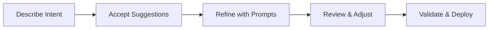

# GitHub Copilot Instructions for IT Pro Field Guide

This file provides context and guidance for GitHub Copilot when assisting with this repository.

## Repository Purpose

This repository demonstrates how GitHub Copilot serves as an **efficiency multiplier** for IT Professionals and Cloud Architects working with Azure infrastructure. The target audience is:

- **Primary**: System Integrator (SI) partners delivering Azure infrastructure projects
- **Secondary**: IT Pros learning cloud/IaC, customers evaluating GitHub Copilot

## Repository Structure

```
github-copilot-itpro/
├── demos/               # Self-contained 30-minute demo modules
│   ├── 01-bicep-quickstart/
│   ├── 02-powershell-automation/
│   ├── 03-azure-arc-onboarding/
│   ├── 04-troubleshooting-assistant/
│   └── 05-documentation-generator/
├── partner-toolkit/     # Materials for SI partners
├── case-studies/        # Real-world success stories
├── skills-bridge/       # Learning content for IT Pros
└── resources/          # Shared utilities and guides
```

## Content Format Standards

### Demo Modules

Each demo follows this structure:

```
demos/XX-demo-name/
├── README.md                   # Overview, objectives, prerequisites
├── DEMO-SCRIPT.md              # Step-by-step walkthrough (30 min)
├── scenario/
│   ├── requirements.md         # Customer scenario
│   └── architecture.md         # Target architecture (Mermaid diagrams)
├── manual-approach/
│   ├── example-code/          # Traditional approach
│   └── time-tracking.md       # Manual effort metrics (baseline)
├── with-copilot/
│   ├── example-code/          # Copilot-assisted code
│   └── time-tracking.md       # Time saved metrics
├── prompts/
│   └── effective-prompts.md   # Curated prompts for this scenario
└── validation/
    ├── deploy.ps1             # Deployment script
    ├── cleanup.ps1            # Resource cleanup
    └── verify.ps1             # Post-deployment validation
```

### Naming Conventions

- **Resource Groups**: `rg-<project>-<env>`
- **Virtual Networks**: `vnet-<env>-<purpose>-<region>`
- **Subnets**: `snet-<tier>-<env>`
- **Storage Accounts**: `st<project><env><random>`
- **NSGs**: `nsg-<subnet>-<env>`

### Tags Required

All Azure resources should include:
```bicep
tags: {
  Environment: string    // dev, staging, prod
  ManagedBy: 'Bicep'    // or 'Terraform', 'ARM'
  Project: string       // Project name
  Owner: string         // Team or individual
  CostCenter: string    // Billing allocation (optional)
}
```

## Copilot Guidance for Code Generation

### Bicep Templates

When generating Bicep code:

1. **Always use latest API versions** (2023-05-01 or newer)
2. **Include security by default**:
   - `supportsHttpsTrafficOnly: true`
   - `minimumTlsVersion: 'TLS1_2'`
   - `allowBlobPublicAccess: false`
   - NSG deny rules at priority 4096
3. **Add descriptive comments** for all parameters and resources
4. **Include outputs** for resource IDs and endpoints
5. **Use parameters** instead of hardcoded values
6. **Follow modular design** (separate files for network, storage, compute)

Example parameter documentation:
```bicep
@description('Azure region for all resources')
param location string = resourceGroup().location

@description('Environment name (dev, staging, prod)')
@allowed([
  'dev'
  'staging'
  'prod'
])
param environment string = 'dev'
```

### PowerShell Scripts

When generating PowerShell code:

1. **Use approved verbs** (Get-, Set-, New-, Remove-)
2. **Include comment-based help** with `.SYNOPSIS`, `.DESCRIPTION`, `.EXAMPLE`
3. **Add parameter validation**:
   ```powershell
   [Parameter(Mandatory = $true)]
   [ValidateNotNullOrEmpty()]
   [string]$ResourceGroupName
   ```
4. **Implement error handling** with `try/catch`
5. **Set strict mode**: `Set-StrictMode -Version Latest`
6. **Use splatting** for complex commands
7. **Add colored output** for better UX

### Documentation (Markdown)

When generating documentation:

1. **Use Mermaid diagrams** for architecture and workflows
2. **Include metrics** for time savings (e.g., "45 min → 10 min (78% reduction)")
3. **Add prerequisites** section with tool versions
4. **Provide multiple examples** (quick start, detailed walkthrough)
5. **Use emoji sparingly** for visual hierarchy (✅ ❌ ⚠️ 💡 🚀)
6. **Include troubleshooting** section

## Value Messaging

### Core Value Proposition

"GitHub Copilot is an **efficiency multiplier** for IT Pros, reducing infrastructure development time by 60-90% while teaching best practices through context-aware suggestions."

### Key Metrics to Highlight

| Scenario | Manual Time | With Copilot | Improvement |
|----------|-------------|--------------|-------------|
| Bicep Template (VNet + Storage) | 45 min | 10 min | 78% reduction |
| PowerShell Automation Script | 60 min | 15 min | 75% reduction |
| Azure Arc Onboarding | 80 hours | 8 hours | 90% reduction |
| Troubleshooting Research | 30 min | 5 min | 83% reduction |
| Documentation Generation | 120 min | 20 min | 83% reduction |

### Messaging Principles

1. **Not "Pain Point Solving"** → Focus on "Efficiency Multiplier"
2. **Not "Replace Expertise"** → Focus on "Augment Capabilities"
3. **Not "Just for Developers"** → Focus on "Infrastructure as Code"
4. **Not "Learn to Use Tool"** → Focus on "Learn by Doing"

## Copilot Prompting Best Practices

### Effective Prompt Patterns

**For Infrastructure**:
```bicep
// Create an Azure [resource type] with [specific requirements]
// Include [security features]
// Use [parameters/variables]
```

**For Automation**:
```powershell
# Create a function to [task]
# Accept parameters: [list]
# Include error handling and verbose output
```

**For Documentation**:
```markdown
Generate a README for [purpose]
Include: overview, prerequisites, usage examples, troubleshooting
Use Mermaid diagrams for architecture
```

### Prompt Engineering Tips

1. **Be Specific**: "Create a VNet with 3 subnets (10.0.1.0/24, 10.0.2.0/24, 10.0.3.0/24)"
2. **Mention Security**: "with HTTPS only, TLS 1.2 minimum, no public access"
3. **Use Iterative Refinement**: Build complexity in steps
4. **Reference Context**: "use the subnet ID from the network module"
5. **Describe Intent**: "secure storage for application data" vs. "storage account"

## Demo Delivery Guidelines

### 30-Minute Demo Structure

| Phase | Duration | Focus |
|-------|----------|-------|
| **Scene Setting** | 5 min | Customer scenario, manual approach pain points |
| **Copilot Demo** | 15 min | Live code generation, show key features |
| **Validation** | 8 min | Deploy to Azure, verify resources |
| **Wrap-Up** | 2 min | Metrics, ROI, next steps |

### Demo Presentation Tips

1. **Pause after suggestions** - Let audience see the "magic"
2. **Highlight surprises** - "Notice Copilot added outputs automatically"
3. **Show before/after** - Compare manual ARM template vs. Copilot-generated Bicep
4. **Invite participation** - Take prompt suggestions from audience
5. **Use real scenarios** - Reference actual customer challenges

## Partner Enablement Focus

When assisting with partner-related content:

1. **ROI Calculators**: Include formulas for time savings → cost savings
2. **Customer Pitch Decks**: Emphasize business value, not technical features
3. **Demo Delivery Guides**: Step-by-step with timing, backup plans
4. **Success Stories**: Quantified results (hours saved, errors reduced)
5. **Objection Handling**: Address concerns about AI, security, costs

## Common Patterns

### Azure Resource Deployment Workflow


### Copilot-Assisted Development Workflow



## Repository-Specific Context

### Technologies Used

- **IaC**: Bicep (primary), ARM templates (legacy examples)
- **Automation**: PowerShell 7+, Azure CLI
- **Platform**: Azure (public cloud)
- **Tooling**: VS Code, GitHub Copilot, Azure CLI, Bicep CLI
- **Version Control**: Git/GitHub
- **Documentation**: Markdown, Mermaid diagrams

### Target Environments

- **Dev/Demo**: Low-cost resources (Standard LRS, B-series VMs)
- **Staging**: Standard tier, zone-redundant where applicable
- **Production**: Premium tier, geo-redundant, HA configurations

### Security Baseline

All demo code should follow these security principles:

- 🔒 **Encryption**: At rest and in transit (TLS 1.2+)
- 🚫 **No Public Access**: Use private endpoints where possible
- 🛡️ **Network Isolation**: NSGs on all subnets, deny by default
- 🔑 **Managed Identities**: Prefer over connection strings
- 📝 **Audit Logging**: Enable diagnostic settings
- 🔄 **Soft Delete**: Enable for storage and Key Vault

## File-Specific Instructions

### When Editing Bicep Files

- Use 2-space indentation
- Add `@description()` decorators for all parameters
- Group resources logically (NSGs before VNets)
- Include comprehensive outputs
- Add comments explaining complex logic

### When Editing PowerShell Files

- Use 4-space indentation
- Follow PSScriptAnalyzer rules
- Include verbose output for debugging
- Add progress indicators for long-running tasks
- Use Write-Verbose, Write-Warning, Write-Error appropriately

### When Editing Markdown Files

- Use ATX-style headers (`#` not `===`)
- Add empty lines before/after headers
- Use fenced code blocks with language identifiers
- Keep line length reasonable (80-120 chars when possible)
- Use relative links for internal navigation

## Questions to Ask Users

When users request changes or additions:

1. **Audience**: "Is this for partners, IT Pros, or executives?"
2. **Complexity**: "Should this be beginner, intermediate, or advanced?"
3. **Duration**: "Is this a 30-min demo or deep-dive content?"
4. **Environment**: "Is this for dev/demo or production deployment?"
5. **Metrics**: "Do you have time savings data to include?"

## Resources

- [Azure Bicep Documentation](https://learn.microsoft.com/azure/azure-resource-manager/bicep/)
- [PowerShell Best Practices](https://learn.microsoft.com/powershell/scripting/developer/cmdlet/cmdlet-development-guidelines)
- [Azure Naming Conventions](https://learn.microsoft.com/azure/cloud-adoption-framework/ready/azure-best-practices/naming-and-tagging)
- [GitHub Copilot for Azure](https://learn.microsoft.com/azure/developer/github/github-copilot-azure)

---

**Repository Mission**: Empower IT Professionals to leverage GitHub Copilot as an efficiency multiplier for Azure infrastructure work, demonstrating 60-90% time savings through hands-on demos and real-world scenarios.
