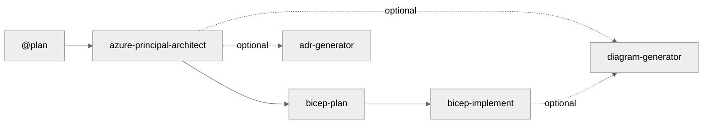
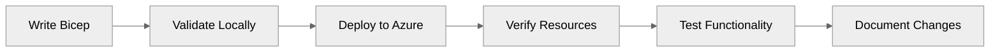
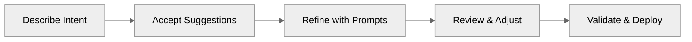

# GitHub Copilot Instructions for IT Pro Field Guide

This file provides context and guidance for GitHub Copilot when assisting with this repository.

## Quick Reference for AI Agents

**Essential Knowledge for Immediate Productivity:**

1. **Default Region**: Always use `swedencentral` (alternative: `germanywestcentral` when encountering quota issues)
2. **Unique Resource Names**: Generate `var uniqueSuffix = uniqueString(resourceGroup().id)` in main.bicep, pass to ALL modules
3. **Name Length Limits**: Key Vault ≤24 chars, Storage ≤24 chars (no hyphens), SQL ≤63 chars
4. **Azure SQL Auth Policy**: Azure AD-only auth for SQL Server
5. **Zone Redundancy**: App Service Plans need P1v3 SKU (not S1) for zone redundancy
6. **Four-Step Workflow**: `@plan` → `azure-principal-architect` → `bicep-plan` → `bicep-implement` (each step requires approval)
7. **Working Example**: `infra/bicep/contoso-patient-portal/` demonstrates all patterns correctly
8. **Deploy Script Pattern**: Use `[CmdletBinding(SupportsShouldProcess)]` + `$WhatIfPreference` (NOT explicit `$WhatIf` param)
9. **Dev Container**: Pre-configured Ubuntu 24.04 with all tools (Terraform, Azure CLI, Bicep, PowerShell 7)
10. **Line Endings**: Use `.gitattributes` with `* text=auto eol=lf` for cross-platform consistency

**Critical Files:**

- Agent definitions: `.github/agents/*.agent.md`
- Workflow guide: `.github/agents/WORKFLOW.md`
- Full workflow docs: `resources/copilot-customizations/FIVE-MODE-WORKFLOW.md`
- Production example: `infra/bicep/contoso-patient-portal/`
- Bicep implement agent: `.github/agents/bicep-implement.agent.md` (has unique suffix guidance)
- Diagram generator: `.github/agents/diagram-generator.agent.md` (Python architecture diagrams)
- Dev container config: `.devcontainer/devcontainer.json` (includes post-create.sh tool installation)
- Line ending rules: `.gitattributes` (normalizes CRLF→LF for cross-platform development)

## Regional Selection Guidelines

**Default Region**: `swedencentral` (sustainable operations with renewable energy)

**Alternative Region**: `germanywestcentral` (when encountering quota issues)

**When to Use Other Regions:**

### Geographic Latency Optimization

- **Americas**: Use `eastus`, `eastus2`, `westus2`, or `centralus` for users primarily in North/South America
- **Asia Pacific**: Use `southeastasia`, `eastasia`, or `australiaeast` for users in APAC region
- **Europe (other alternatives)**: Use `northeurope` if swedencentral/germanywestcentral don't meet requirements

### Compliance & Data Sovereignty

- **Germany**: Use `germanywestcentral` for German data residency requirements
- **Switzerland**: Use `switzerlandnorth` for Swiss banking/healthcare regulations
- **UK**: Use `uksouth` or `ukwest` for UK GDPR requirements
- **France**: Use `francecentral` for French data sovereignty
- **Specific Regulations**: Check compliance requirements at [Azure Compliance](https://learn.microsoft.com/azure/compliance/)

### Service Availability

- **Preview Features**: Some Azure preview features may only be available in specific regions (typically `eastus`, `westus2`, `swedencentral`)
- **VM/Database SKUs**: Not all VM sizes or database tiers are available in all regions
- **Check Availability**: Use [Azure Products by Region](https://azure.microsoft.com/global-infrastructure/services/) to verify service availability
- **Availability Zones**: Ensure the selected region supports availability zones if zone redundancy is required

### Cost Optimization

- Some regions have lower pricing for compute and storage resources
- Use [Azure Pricing Calculator](https://azure.microsoft.com/pricing/calculator/) to compare costs
- Consider egress costs for data transfer between regions

**Best Practice**: When deviating from `swedencentral`, document the reason (latency/compliance/availability) in deployment parameters or README.

## Repository Purpose

This repository demonstrates how GitHub Copilot serves as an **efficiency multiplier** for IT Professionals and Cloud Architects working with Azure infrastructure. The target audience is:

- **Primary**: System Integrator (SI) partners delivering Azure infrastructure projects
- **Secondary**: IT Pros learning cloud/IaC, customers evaluating GitHub Copilot

## Four-Step Agent Workflow Architecture

This repository uses a **4-step agent workflow** for Azure infrastructure development, with optional diagram generation:



| Step | Agent | Purpose | Approval Required |
|------|-------|---------|-------------------|
| 1 | `@plan` (Built-in) | Create implementation plans with cost estimates | ✅ Yes |
| 2 | `azure-principal-architect` | Azure Well-Architected Framework guidance (NO CODE) | ✅ Yes |
| 3 | `bicep-plan` | Infrastructure planning with AVM modules | ✅ Yes |
| 4 | `bicep-implement` | Bicep code generation | ✅ Yes |

**Optional Agents:**

- **diagram-generator** - Python architecture diagrams using `diagrams` library (after Step 2 or 4)
- **adr-generator** - Document architectural decisions (after any step)

**How to Use Custom Agents:**

1. Press `Ctrl+Shift+A` or click the **Agent** button in Copilot Chat
2. Select agent from dropdown: `@plan`, `azure-principal-architect`, `bicep-plan`, `bicep-implement`, `diagram-generator`, or `adr-generator`
3. Type your prompt and submit
4. **Wait for approval prompt** before proceeding to next step

**Recommended Workflow:**

```
Step 1: @plan (START HERE)
Prompt: Create deployment plan for HIPAA-compliant patient portal
[Plan agent generates requirements]
→ Approve to continue

Step 2: azure-principal-architect
[Provides WAF assessment with scores - NO CODE CREATION]
→ Approve to continue
→ Optional: Click "Generate Architecture Diagram" for visual

Step 3: bicep-plan
[Creates implementation plan in .bicep-planning-files/]
→ Approve to continue

Step 4: bicep-implement
[Generates Bicep templates, validates with bicep build/lint]
→ Approve to deploy or finalize
→ Optional: Click "Generate Architecture Diagram" for documentation
```

**Quick Workflow (Skip @plan):**

```
Step 1: azure-principal-architect
Prompt: Assess HIPAA-compliant patient portal architecture
→ Approve

Step 2: bicep-plan
Prompt: Create implementation plan with AVM modules
→ Approve

Step 3: bicep-implement
Prompt: Generate Bicep templates from the plan
→ Approve and deploy
```

📖 **Full Documentation:** See `.github/agents/WORKFLOW.md`

**Critical Agent Behaviors:**

- **All agents require approval** before proceeding to next step (reply "yes", "approve", or provide feedback)
- **azure-principal-architect does NOT create code** - only provides architectural guidance
- **All agents default to `swedencentral` region** (alternative: `germanywestcentral`), unless explicitly specified
- **Bicep agents ALWAYS generate unique resource name suffixes** using `uniqueString(resourceGroup().id)` to prevent naming collisions
- **Key Vault names**: Must be ≤24 chars (pattern: `kv-{shortname}-{env}-{suffix}`)
- **App Service Plans**: Use P1v3 (Premium) or higher for zone redundancy (Standard SKU doesn't support it)
- **SQL Server**: Use Azure AD-only auth and grant logged in user appropriate admin permissions

**Supplementary Tools:** Additional chat modes are available in `resources/copilot-customizations/chatmodes/` for Terraform, debugging, and specialized scenarios.

## Repository Structure

```
github-copilot-itpro/
├── .devcontainer/                       # Pre-configured dev environment
│   ├── devcontainer.json                # Container configuration
│   ├── post-create.sh                   # Tool installation script
│   └── TROUBLESHOOTING.md               # Setup issues & fixes
├── .github/
│   ├── agents/                          # 5 custom agents (Plan is built-in)
│   │   ├── adr-generator.agent.md
│   │   ├── azure-principal-architect.agent.md
│   │   ├── bicep-plan.agent.md
│   │   ├── bicep-implement.agent.md
│   │   ├── diagram-generator.agent.md   # Python architecture diagrams
│   │   └── WORKFLOW.md                  # Workflow documentation
│   └── copilot-instructions.md          # THIS FILE - AI agent guidance
├── scenarios/                           # Self-contained learning scenarios
│   ├── S01-bicep-baseline/              # Hub & Spoke network with Bicep
│   ├── S02-terraform-baseline/          # Hub & Spoke network with Terraform
│   ├── S03-five-agent-workflow/         # End-to-end agent orchestration
│   ├── S04-documentation-generation/    # Automated docs with Copilot
│   ├── S05-service-validation/          # Testing Azure services
│   ├── S06-troubleshooting/             # Diagnostic workflows
│   ├── S07-sbom-generator/              # Software Bill of Materials
│   ├── S08-diagrams-as-code/            # Architecture diagrams with Python
│   └── S09-coding-agent/                # GitHub Copilot Coding Agent (async)
├── infra/bicep/                         # near-production-ready Bicep examples
│   └── contoso-patient-portal/         # HIPAA-compliant multi-tier app (S03 implementation)
├── docs/                                # ADRs and archived documentation
└── resources/
    ├── copilot-customizations/          # Workflow guides & chat modes
    │   ├── FIVE-MODE-WORKFLOW.md        # Complete workflow documentation
    │   ├── chatmodes/                   # Supplementary chat modes
    │   ├── instructions/                # Bicep, PowerShell, Terraform best practices
    │   └── prompts/                     # Curated prompt examples
    └── presenter-toolkit/               # Demo delivery materials for presenters
```

**Note**: S03 (Five-Agent Workflow) implementation lives in `infra/bicep/contoso-patient-portal/` - this is the actual working code showing 96% time savings (18 hours → 45 minutes).

## Content Format Standards

### Demo Modules

Each scenario follows this structure:

```
scenarios/SXX-scenario-name/
├── README.md                   # Overview with "Meet [Character]" hero section
├── DEMO-SCRIPT.md              # Step-by-step walkthrough with 🎓 Learning Moments
├── solution/                   # Reference implementation
│   └── README.md               # Solution explanation
├── examples/                   # Conversation transcripts
│   └── copilot-conversation.md # Full Copilot dialogue example
├── prompts/
│   └── effective-prompts.md   # Discovery questions and prompt patterns
└── validation/
    └── validate.ps1           # Post-completion validation
```

**Key Pattern**: Each scenario features a named character (e.g., "Meet Sarah Chen") with a real-world challenge, demonstrating discovery-based learning rather than script generation.

### Naming Conventions

- **Resource Groups**: `rg-<project>-<env>`
- **Virtual Networks**: `vnet-<env>-<purpose>-<region>`
- **Subnets**: `snet-<tier>-<env>`
- **Storage Accounts**: `st<project><env><random>`
- **NSGs**: `nsg-<subnet>-<env>`

### Tags Required

All Azure resources should include:

```bicep
tags: {
  Environment: string    // dev, staging, prod
  ManagedBy: 'Bicep'    // or 'Terraform', 'ARM'
  Project: string       // Project name
  Owner: string         // Team or individual
  CostCenter: string    // Billing allocation (optional)
}
```

## Copilot Guidance for Code Generation

### Bicep Templates

When generating Bicep code:

1. **Always use latest API versions** (2023-05-01 or newer)
2. **Default location**: `swedencentral` (alternative: `germanywestcentral` if quota issues)
3. **CRITICAL - Unique resource names**: Generate suffix in main.bicep and pass to ALL modules:
   ```bicep
   var uniqueSuffix = uniqueString(resourceGroup().id)
   ```
4. **Name length constraints**:
   - Key Vault: ≤24 chars (e.g., `kv-contosop-dev-abc123` = 22 chars)
   - Storage Account: ≤24 chars, lowercase + numbers only, NO hyphens
   - SQL Server: ≤63 chars, lowercase + numbers + hyphens
5. **Include security by default**:
   - `supportsHttpsTrafficOnly: true`
   - `minimumTlsVersion: 'TLS1_2'`
   - `allowBlobPublicAccess: false`
   - NSG deny rules at priority 4096
6. **Azure Policy compliance for demos**:
   - SQL Server: UseAzure AD-only auth
   - App Service Plan: Use P1v3 (not S1) for zone redundancy support
7. **Add descriptive comments** for all parameters and resources
8. **Include outputs** for resource IDs and endpoints
9. **Follow modular design** (separate files for network, storage, compute)

Example parameter documentation:

```bicep
@description('Azure region for all resources')
@allowed([
  'swedencentral'
  'germanywestcentral'
  'northeurope'
])
param location string = 'swedencentral'

@description('Unique suffix for resource naming (generated from resource group ID)')
param uniqueSuffix string

@description('Environment name (dev, staging, prod)')
@allowed([
  'dev'
  'staging'
  'prod'
  'demo'
])
param environment string = 'dev'
```

### PowerShell Scripts

When generating PowerShell code:

1. **Use approved verbs** (Get-, Set-, New-, Remove-)
2. **Include comment-based help** with `.SYNOPSIS`, `.DESCRIPTION`, `.EXAMPLE`
3. **Add parameter validation**:
   ```powershell
   [Parameter(Mandatory = $true)]
   [ValidateNotNullOrEmpty()]
   [string]$ResourceGroupName
   ```
4. **Implement error handling** with `try/catch`
5. **Set strict mode**: `Set-StrictMode -Version Latest`
6. **Use splatting** for complex commands
7. **Add colored output** for better UX

### Documentation (Markdown)

**BEFORE generating any markdown, read `.github/instructions/markdown.instructions.md` and `MARKDOWN-STYLE-GUIDE.md`**

When generating documentation:

1. **Follow markdown standards** (ATX headers, 120-char line length, fenced code blocks with language)
2. **Use Mermaid diagrams** for architecture and workflows
3. **Include metrics** for time savings (e.g., "45 min → 10 min (78% reduction)")
4. **Add prerequisites** section with tool versions
5. **Provide multiple examples** (quick start, detailed walkthrough)
6. **Use emoji sparingly** for visual hierarchy (✅ ❌ ⚠️ 💡 🚀)
7. **Include troubleshooting** section
8. **Validate before committing**: Run `markdownlint '**/*.md' --ignore node_modules --config .markdownlint.json`

## Value Messaging

**Core Value Proposition**: "GitHub Copilot is an **efficiency multiplier** for IT Pros, reducing infrastructure development time by 60-90% while teaching best practices through context-aware suggestions."

📊 **Time Savings Metrics**: See `docs/time-savings-evidence.md` for detailed methodology and scenario-specific data.

🎯 **Real-World Portfolio**: See `docs/copilot-portfolio-showcase.md` for actual projects built by a non-developer using GitHub Copilot.

**Messaging Focus**: Efficiency Multiplier (not pain points) • Augment Capabilities (not replace) • Infrastructure as Code (not just dev) • Learn by Doing (not tool training)

## Copilot Prompting Best Practices

### Effective Prompt Patterns

**For Infrastructure**:

```bicep
// Create an Azure [resource type] with [specific requirements]
// Include [security features]
// Use [parameters/variables]
```

**For Automation**:

```powershell
# Create a function to [task]
# Accept parameters: [list]
# Include error handling and verbose output
```

**For Documentation**:

```markdown
Generate a README for [purpose]
Include: overview, prerequisites, usage examples, troubleshooting
Use Mermaid diagrams for architecture
```

### Prompt Engineering Tips

1. **Be Specific**: "Create a VNet with 3 subnets (10.0.1.0/24, 10.0.2.0/24, 10.0.3.0/24)"
2. **Mention Security**: "with HTTPS only, TLS 1.2 minimum, no public access"
3. **Use Iterative Refinement**: Build complexity in steps
4. **Reference Context**: "use the subnet ID from the network module"
5. **Describe Intent**: "secure storage for application data" vs. "storage account"

## Demo & Partner Guidelines

📖 **Full demo guidance**: See `resources/presenter-toolkit/demo-delivery-guide.md`

**Demo Structure** (30 min): Scene Setting (5 min) → Live Demo (15 min) → Validation (8 min) → Wrap-Up (2 min)

**Key Tips**: Pause after suggestions • Show before/after comparisons • Use real scenarios • Invite audience prompts

**Presenter Resources**: Focus on business value over technical features. Quantify results (hours saved, errors reduced). See `resources/presenter-toolkit/` for ROI calculators and objection handling.

## Common Patterns

### Azure Resource Deployment Workflow



### Copilot-Assisted Development Workflow



## Critical Deployment Patterns

### Resource Naming with Unique Suffixes

**Problem**: Azure resources like Key Vault, Storage Accounts, and SQL Servers require globally unique names. Without suffixes, deployments fail with naming collisions.

**Solution Pattern** (See `infra/bicep/contoso-patient-portal/` for complete implementation):

```bicep
// main.bicep - Generate suffix once
var uniqueSuffix = uniqueString(subscription().subscriptionId, resourceGroupName)

// Pass to all modules
module keyVault 'modules/key-vault.bicep' = {
  params: {
    uniqueSuffix: uniqueSuffix
    // ... other params
  }
}

// modules/key-vault.bicep - Apply to resource names
param uniqueSuffix string
var keyVaultName = 'kv-${take(replace(projectName, '-', ''), 8)}-${take(environment, 3)}-${take(uniqueSuffix, 6)}'
// Result: "kv-contosop-dev-abc123" (22 chars, within 24 limit)
```

**Key Points:**

- Use `take()` to control name length (Key Vault = 24 chars max)
- Remove hyphens for Storage Accounts (no special chars allowed)
- Shorten project names (e.g., "contoso-patient-portal" → "contosop")
- Apply suffix to ALL resources for consistency

### Azure Policy Workarounds for Demo Environments

**Common Policy Blockers:**

1. **SQL Server Azure AD-only authentication**: Use Azure AD auth
2. **App Service Plan zone redundancy**: Must use Premium SKU (P1v3+), not Standard
3. **Key Vault name length**: Policy doesn't block, but Azure enforces 24-char limit

**Implementation** (See `infra/bicep/contoso-patient-portal/main.bicep`):

```bicep
param tags object = {
  Environment: environment
  ManagedBy: 'Bicep'
  SecurityControl: 'Ignore'  // Bypass demo-blocking policies
}
```

### Progressive Deployment Pattern

For complex infrastructure (10+ resources, multiple modules):

**Phase 1**: Foundation (networking, NSGs)
**Phase 2**: Platform services (Key Vault, SQL Server, App Service Plan)
**Phase 3**: Application tier (App Service, databases, private endpoints)
**Phase 4**: Configuration (secrets, RBAC, monitoring)

Between each phase: `bicep build` → `bicep lint` → `az deployment` → validate resources exist

**Why**: Helps isolate dependency issues, provides clear rollback points, makes debugging easier.

## Repository-Specific Context

### Technologies Used

- **IaC**: Bicep (primary), Terraform (scenarios/03), ARM templates (legacy examples)
- **Automation**: PowerShell 7+, Azure CLI, Bash scripts
- **Platform**: Azure (public cloud), multi-cloud patterns (Terraform)
- **Tooling**: VS Code, GitHub Copilot, Azure CLI, Bicep CLI, Terraform CLI
- **Security Scanning**: tfsec, Checkov, PSScriptAnalyzer
- **Version Control**: Git/GitHub with `.gitattributes` for line ending normalization
- **Documentation**: Markdown, Mermaid diagrams
- **Containerization**: Dev Containers with Ubuntu 24.04 LTS base

### Target Environments

- **Dev/Demo**: Low-cost resources (Standard LRS, B-series VMs)
- **Staging**: Standard tier, zone-redundant where applicable
- **Production**: Premium tier, geo-redundant, HA configurations

### Security Baseline

All demo code should follow these security principles:

- 🔒 **Encryption**: At rest and in transit (TLS 1.2+)
- 🚫 **No Public Access**: Use private endpoints where possible
- 🛡️ **Network Isolation**: NSGs on all subnets, deny by default
- 🔑 **Managed Identities**: Prefer over connection strings
- 📝 **Audit Logging**: Enable diagnostic settings
- 🔄 **Soft Delete**: Enable for storage and Key Vault

## File-Specific Instructions

### When Editing Bicep Files

- Use 2-space indentation
- Add `@description()` decorators for all parameters
- Group resources logically (NSGs before VNets)
- Include comprehensive outputs
- Add comments explaining complex logic
- **ALWAYS include `uniqueSuffix` parameter in modules**
- Default `location` to `swedencentral`

### When Editing PowerShell Deployment Scripts (deploy.ps1)

**Critical patterns** from `infra/bicep/contoso-patient-portal/deploy.ps1`:

1. **Use `[CmdletBinding(SupportsShouldProcess)]`** - Provides automatic `-WhatIf` support

   - DO NOT add explicit `[switch]$WhatIf` parameter (causes conflict)
   - Use `$WhatIfPreference` automatic variable in script body

2. **Bicep lint handling**: Treat warnings as non-blocking (only fail on errors)

3. **Region validation**: Add allowed regions to ValidateSet

4. **Standard structure**: Prerequisites check → Bicep validation → Cost estimation → User confirmation → Deployment → Output display

### When Editing PowerShell Scripts (General)

- Use 4-space indentation, follow PSScriptAnalyzer rules
- Set `Set-StrictMode -Version Latest` and `$ErrorActionPreference = 'Stop'`
- Use Write-Verbose, Write-Warning, Write-Error appropriately

### When Editing Markdown Files

**CRITICAL: Follow standards in `.github/instructions/markdown.instructions.md` and `MARKDOWN-STYLE-GUIDE.md`**

Key requirements:

- ATX headers, fenced code blocks with language, 120-char line length
- Use `-` for bullets, LF line endings (via `.gitattributes`)
- Validate: `markdownlint '**/*.md' --ignore node_modules --config .markdownlint.json`

### When Creating .gitattributes Files

For cross-platform development (Windows/Linux/macOS):

```gitattributes
# Auto-normalize all text files to LF
* text=auto eol=lf

# Explicit LF for code files
*.bicep text eol=lf
*.tf text eol=lf
*.md text eol=lf
*.sh text eol=lf
*.ps1 text working-tree-encoding=UTF-8 eol=lf
*.json text eol=lf
*.yml text eol=lf
*.yaml text eol=lf

# Binary files
*.png binary
*.jpg binary
*.zip binary
*.exe binary
```

**Critical Pattern**: PowerShell files need `working-tree-encoding=UTF-8` to preserve BOM while using LF

## Suitable Tasks for Copilot Coding Agent

### Tasks Well-Suited for Copilot

- **Bug fixes**: Correcting issues in Bicep templates, PowerShell scripts, or documentation
- **Test coverage**: Adding validation scripts or test cases for demos
- **Documentation updates**: Improving README files, adding examples, updating guides
- **Code refactoring**: Improving existing scripts or templates for clarity
- **Template generation**: Creating new Bicep modules or PowerShell functions

### Tasks to Keep Manual

- **Complex multi-demo refactoring**: Changes affecting multiple demos
- **Architecture decisions**: Demo structure, learning paths, partner toolkit design
- **Production deployments**: Actual Azure deployments to live environments
- **Security reviews**: Validating security implications of changes

### Issue Description Best Practices

- ✅ **Be specific**: "Add NSG rules to network.bicep for web tier allowing HTTP/HTTPS"
- ✅ **Include acceptance criteria**: "Must include outputs for NSG ID and include comments"
- ✅ **Reference files**: "Update scenarios/S01-bicep-baseline/solution/network.bicep"
- ❌ **Avoid vague requests**: "Make the demo better"

## Questions to Ask Users

When users request changes or additions:

1. **Audience**: "Is this for partners, IT Pros, or executives?"
2. **Complexity**: "Should this be beginner, intermediate, or advanced?"
3. **Duration**: "Is this a 30-min demo or deep-dive content?"
4. **Environment**: "Is this for dev/demo or production deployment?"
5. **Metrics**: "Do you have time savings data to include?"
6. **Scope**: "Is this suitable for Copilot coding agent or needs human review?"

## Development Environment

### Option 1: Dev Container (Recommended)

This repository includes a pre-configured dev container with all tools installed:

**Included Tools:** Terraform (latest) with tfsec/Checkov • Azure CLI with Bicep CLI • PowerShell 7+ • Git • Go, Python, Node.js runtimes • 25+ VS Code extensions

**Quick Start:**

```bash
git clone https://github.com/jonathan-vella/github-copilot-itpro.git
code github-copilot-itpro
# F1 → "Dev Containers: Reopen in Container" → Wait 3-5 min
terraform --version && az --version && bicep --version && pwsh --version
```

**Troubleshooting:** See `.devcontainer/TROUBLESHOOTING.md`

### Option 2: Manual Setup

Required tools: VS Code • GitHub Copilot extension • Azure CLI 2.50+ • Bicep CLI 0.20+ • PowerShell 7+ • Git 2.30+ • Terraform 1.5+ (for Terraform demos)

### Local Validation Commands

```bash
# Bicep
bicep build infra/bicep/contoso-patient-portal/main.bicep && bicep lint infra/bicep/contoso-patient-portal/main.bicep

# Terraform
terraform init && terraform validate && tfsec . && checkov -d .

# PowerShell
pwsh -Command "Invoke-ScriptAnalyzer -Path scenarios/S05-service-validation/ -Recurse -Settings PSGallery"

# Markdown
markdownlint '**/*.md' --ignore node_modules
```

### Azure Subscription Requirements

- Azure subscription with Contributor access
- Resource groups: `rg-copilot-demo-<demo-name>-<random>`
- Clean up resources after testing

## Resources

- [Azure Bicep Documentation](https://learn.microsoft.com/azure/azure-resource-manager/bicep/)
- [Terraform Azure Provider](https://registry.terraform.io/providers/hashicorp/azurerm/latest/docs)
- [PowerShell Best Practices](https://learn.microsoft.com/powershell/scripting/developer/cmdlet/cmdlet-development-guidelines)
- [Azure Naming Conventions](https://learn.microsoft.com/azure/cloud-adoption-framework/ready/azure-best-practices/naming-and-tagging)
- [GitHub Copilot for Azure](https://learn.microsoft.com/azure/developer/github/github-copilot-azure)
- [GitHub Copilot Best Practices](https://docs.github.com/en/copilot/tutorials/coding-agent/get-the-best-results)
- [VS Code Dev Containers](https://code.visualstudio.com/docs/devcontainers/containers)
- [Plan Agent Documentation](https://code.visualstudio.com/docs/copilot/chat/chat-planning)

---

## Terraform Workflow (Alternative to Bicep)

This repository includes Terraform infrastructure examples in `scenarios/S02-terraform-baseline/` for multi-cloud scenarios.

**When to Use Terraform**: Multi-cloud environments, existing Terraform investment, team expertise in HCL.

**When to Use Bicep**: Azure-only deployments, native Azure integration, need latest Azure features first.

**Terraform Best Practices** (When generating Terraform code):

1. Use latest provider versions (azurerm 3.0+)
2. Modular design: Separate network, compute, data modules
3. State management: Use Azure Storage backend
4. Security scanning: Run `tfsec .` and `checkov -d .` before commit
5. Validation workflow: `terraform init` → `terraform validate` → `terraform plan`

📖 **Supplementary Chat Modes**: `resources/copilot-customizations/chatmodes/terraform-azure-*.chatmode.md`

---

**Repository Mission**: Empower IT Professionals to leverage GitHub Copilot as an efficiency multiplier for Azure infrastructure work, demonstrating 60-90% time savings through hands-on demos and real-world scenarios.
