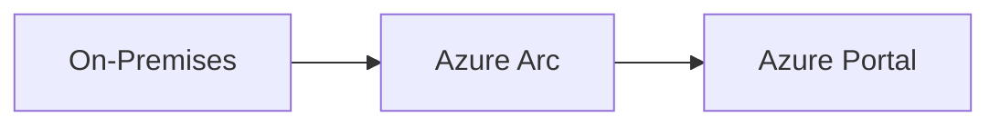

# Contributing to GitHub Copilot for IT Pros

Thank you for your interest in contributing! This repository is designed to help IT Professionals and System Integrators demonstrate the value of GitHub Copilot for Azure infrastructure work.

## 🎯 What We're Looking For

### High-Priority Contributions

1. **New Demo Scenarios**
   - 30-minute self-contained demos
   - Clear before/after metrics
   - Production-tested prompts
   - Real Azure infrastructure scenarios

2. **Effective Prompts**
   - Prompts that consistently work well
   - Specific to Azure infrastructure tasks
   - Documented with expected outcomes

3. **Case Studies**
   - Real-world implementations
   - Quantified time savings
   - Lessons learned
   - Anonymized customer references

4. **Industry-Specific Examples**
   - Financial services scenarios
   - Healthcare compliance requirements
   - Government/sovereign cloud
   - Retail/manufacturing patterns

### Medium-Priority Contributions

- Improvements to existing demos
- Additional validation scripts
- Documentation enhancements
- Translation to other languages
- Video demonstrations

## 📋 Contribution Guidelines

### Before You Start

1. **Check existing issues** - Someone might already be working on it
2. **Open an issue** - Discuss your idea before investing time
3. **Review the plan** - See [untitled:plan-githubCopilotItProFieldGuide.prompt.md](docs/plan-githubCopilotItProFieldGuide.prompt.md)

### Demo Structure Requirements

All demos must follow this structure:

```
demos/XX-demo-name/
├── README.md                   # Overview & learning objectives
├── DEMO-SCRIPT.md              # Step-by-step walkthrough with timing
├── scenario/
│   ├── requirements.md         # Customer scenario description
│   └── architecture.md         # Target architecture (Mermaid)
├── manual-approach/
│   ├── example-code/          # Traditional approach
│   └── time-tracking.md       # Manual effort metrics
├── with-copilot/
│   ├── example-code/          # Copilot-assisted code
│   └── time-tracking.md       # Time saved metrics
├── prompts/
│   └── effective-prompts.md   # Curated prompts
└── validation/
    ├── deploy.ps1             # Test deployment
    └── cleanup.ps1            # Resource cleanup
```

### Code Standards

**PowerShell:**
```powershell
# Use approved verbs
# Include comment-based help
# Implement proper error handling
# Follow PSScriptAnalyzer rules
```

**Bicep:**
```bicep
// Use consistent naming conventions
// Include parameter descriptions
// Add output values
// Follow Azure naming best practices
```

### Documentation Standards

- Use clear, concise language
- Include code examples
- Document prerequisites
- Add troubleshooting sections
- Use Mermaid for diagrams

## 🚀 Contribution Process

### 1. Fork & Clone

```bash
# Fork the repository on GitHub
git clone https://github.com/YOUR-USERNAME/github-copilot-itpro.git
cd github-copilot-itpro
git remote add upstream https://github.com/jonathan-vella/github-copilot-itpro.git
```

### 2. Create a Branch

```bash
git checkout -b feature/your-demo-name
# or
git checkout -b fix/issue-description
```

### 3. Make Your Changes

- Follow the structure guidelines above
- Test in a clean Azure subscription
- Document time savings metrics
- Include validation scripts

### 4. Test Thoroughly

```powershell
# Test deployment
cd demos/your-demo-name/validation
./deploy.ps1

# Verify resources created
az resource list --resource-group <your-rg> --output table

# Test cleanup
./cleanup.ps1

# Verify cleanup
az resource list --resource-group <your-rg> --output table
```

### 5. Commit & Push

```bash
git add .
git commit -m "feat: Add [demo name] scenario"
git push origin feature/your-demo-name
```

**Commit Message Format:**
- `feat:` New feature or demo
- `fix:` Bug fix
- `docs:` Documentation changes
- `refactor:` Code refactoring
- `test:` Test improvements

### 6. Create Pull Request

1. Go to your fork on GitHub
2. Click "New Pull Request"
3. Fill out the PR template
4. Link related issues
5. Request review

## 📝 Pull Request Checklist

Before submitting:

- [ ] Code follows repository structure
- [ ] Tested in clean Azure subscription
- [ ] Documentation updated (README, DEMO-SCRIPT)
- [ ] Time savings metrics documented
- [ ] Prompts are production-tested
- [ ] Validation scripts included
- [ ] No hardcoded secrets or subscription IDs
- [ ] Mermaid diagrams render correctly
- [ ] Links work and images load
- [ ] CHANGELOG.md updated (if applicable)

## 🔍 Review Process

### What We Look For

1. **Quality** - Does it work reliably?
2. **Value** - Does it demonstrate time savings?
3. **Clarity** - Is it easy to understand and follow?
4. **Reusability** - Can partners adapt it for customers?
5. **Completeness** - Are all required files included?

### Timeline

- Initial review: Within 3 business days
- Feedback provided: Within 5 business days
- Merge decision: Within 7 business days

## 🎨 Style Guide

### Markdown

```markdown
# Heading 1 (Title)
## Heading 2 (Major Section)
### Heading 3 (Subsection)

**Bold** for emphasis
*Italic* for terms
`code` for inline code
```

### Code Blocks

```powershell
# PowerShell with syntax highlighting
Get-AzResourceGroup -Name "rg-demo"
```

```bicep
// Bicep with syntax highlighting
param location string = resourceGroup().location
```

### Mermaid Diagrams



## 🤝 Community Standards

### Code of Conduct

- Be respectful and inclusive
- Welcome newcomers
- Focus on constructive feedback
- No harassment or discrimination
- Assume good intentions

### Getting Help

- **Questions**: GitHub Discussions
- **Issues**: GitHub Issues
- **Urgent**: Tag @jonathan-vella in PR/Issue

## 🎁 Recognition

Contributors will be:
- Listed in CONTRIBUTORS.md
- Mentioned in release notes
- Credited in demo README files
- Invited to community calls (optional)

## 📚 Resources

### Learning Materials

- [GitHub Copilot Documentation](https://docs.github.com/copilot)
- [Azure Bicep Documentation](https://learn.microsoft.com/azure/azure-resource-manager/bicep/)
- [PowerShell Best Practices](https://learn.microsoft.com/powershell/scripting/developer/cmdlet/cmdlet-development-guidelines)
- [Azure Naming Conventions](https://learn.microsoft.com/azure/cloud-adoption-framework/ready/azure-best-practices/naming-and-tagging)

### Tools

- [VS Code](https://code.visualstudio.com/)
- [GitHub Copilot Extension](https://marketplace.visualstudio.com/items?itemName=GitHub.copilot)
- [Azure CLI](https://learn.microsoft.com/cli/azure/install-azure-cli)
- [PowerShell 7+](https://learn.microsoft.com/powershell/scripting/install/installing-powershell)
- [Bicep CLI](https://learn.microsoft.com/azure/azure-resource-manager/bicep/install)

## 📄 License

By contributing, you agree that your contributions will be licensed under the MIT License.

---

**Thank you for helping make Azure infrastructure work more efficient for everyone!** 🚀
