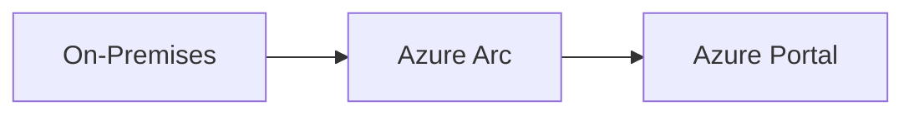

# Markdown Style Guide

This document defines the markdown formatting standards for the GitHub Copilot for IT Pros repository.

## Purpose

Consistent markdown formatting ensures:

- **Readability**: Documentation is easy to read and navigate
- **Maintainability**: Changes are easier to review in version control
- **Professionalism**: Content reflects high-quality standards
- **Accessibility**: Content is accessible to all users and tools

## Tools

This repository uses [markdownlint-cli](https://github.com/igorshubovych/markdownlint-cli) for automated validation.

### Installation

```bash
npm install -g markdownlint-cli
```

### Usage

```bash
# Validate all markdown files (excluding .github folder)
markdownlint '**/*.md' --ignore '.github/**' --ignore 'node_modules/**' --config .markdownlint.json

# Auto-fix issues where possible
markdownlint '**/*.md' --ignore '.github/**' --ignore 'node_modules/**' --config .markdownlint.json --fix
```

## Configuration

The repository includes `.markdownlint.json` with the following rules:

- **Line length**: Maximum 120 characters (150 for code blocks)
- **Code blocks**: Must have language specifiers
- **Lists**: Must be surrounded by blank lines
- **Headings**: Must be surrounded by blank lines
- **Tables**: Exempt from line length limits

## Formatting Standards

### Headings

#### ATX-Style Headers (Preferred)

Use `#` symbols for headers:

```markdown
# H1 - Page Title

## H2 - Major Section

### H3 - Subsection

#### H4 - Minor Section
```

#### Heading Hierarchy

- Use only one H1 per document (typically the page title)
- Don't skip heading levels (H1 → H2 → H3, not H1 → H3)
- Add blank lines before and after headings

✅ **Good:**

```markdown
## Prerequisites

Before starting, ensure you have:

### Required Tools
```

❌ **Bad:**

```markdown
## Prerequisites
Before starting, ensure you have:
#### Required Tools
```

### Lists

#### Unordered Lists

Use `-` for bullet points (consistent throughout the repository):

```markdown
- Item 1
- Item 2
  - Nested item 2.1
  - Nested item 2.2
- Item 3
```

#### Ordered Lists

Use `1.` for all items (auto-numbering):

```markdown
1. First step
1. Second step
1. Third step
```

#### List Formatting

- Add blank lines before and after lists
- Use 2 spaces for nested list indentation
- Keep list items concise

✅ **Good:**

```markdown
Prerequisites include:

- VS Code with GitHub Copilot extension
- Azure CLI (version 2.50.0+)
- Active Azure subscription

Let's get started.
```

❌ **Bad:**

```markdown
Prerequisites include:
- VS Code with GitHub Copilot extension
- Azure CLI (version 2.50.0+)
- Active Azure subscription
Let's get started.
```

### Code Blocks

#### Fenced Code Blocks

Always specify the language for syntax highlighting:

✅ **Good:**

````markdown
```powershell
Get-AzResourceGroup -Name "rg-demo"
```

```bicep
param location string = 'swedencentral'
```

```bash
az group create --name rg-demo --location swedencentral
```
````

❌ **Bad:**

````markdown
```
Get-AzResourceGroup -Name "rg-demo"
```
````

#### Supported Languages

Common languages used in this repository:

- `powershell` - PowerShell scripts
- `bicep` - Bicep templates
- `bash` - Bash/shell scripts
- `json` - JSON configuration
- `yaml` - YAML configuration
- `markdown` - Markdown examples
- `text` - Plain text output
- `mermaid` - Mermaid diagrams

#### Code Block Formatting

- Add blank lines before and after code blocks
- Keep code blocks under 150 characters wide when possible
- Use inline code `` `code` `` for short snippets in text

### Links

#### Internal Links

Use relative paths for internal documentation:

```markdown
[Demo 1: Bicep Quickstart](demos/01-bicep-quickstart/README.md)
[Contributing Guidelines](CONTRIBUTING.md)
```

#### External Links

Use full URLs with descriptive text:

```markdown
[Azure Bicep Documentation](https://learn.microsoft.com/azure/azure-resource-manager/bicep/)
```

#### Reference-Style Links

For repeated links, use reference style:

```markdown
Check the [Azure CLI][cli] and [PowerShell][ps] documentation.

[cli]: https://learn.microsoft.com/cli/azure/
[ps]: https://learn.microsoft.com/powershell/
```

### Tables

#### Table Formatting

- Use pipe alignment for readability
- Keep table content concise
- Tables are exempt from line length limits

✅ **Good:**

```markdown
| Task | Manual | With Copilot | Time Saved |
|------|--------|--------------|------------|
| Bicep template | 45 min | 10 min | 78% |
| PowerShell script | 60 min | 15 min | 75% |
```

#### Table Alignment

- Left-align text columns
- Right-align numeric columns
- Center-align short labels

```markdown
| Feature | Status | Count |
|---------|:------:|------:|
| Bicep | ✅ | 12 |
| PowerShell | ✅ | 8 |
```

### Emphasis and Formatting

#### Bold and Italic

- Use `**bold**` for emphasis and important terms
- Use `*italic*` for introducing new terms
- Use `` `code` `` for technical terms, file names, and commands

```markdown
**Prerequisites**: Install the *Azure CLI* and run `az login`.
```

#### Emoji

Use emoji sparingly for visual hierarchy:

- ✅ Success indicators
- ❌ Error indicators
- ⚠️ Warnings
- 💡 Tips
- 🚀 Actions
- 📖 Documentation references

### Quotes and Callouts

Use blockquotes for important notes:

```markdown
> **Note**: This feature requires GitHub Copilot Business or Enterprise.

> **Warning**: This will delete resources permanently.

> **Tip**: Use `-WhatIf` to preview changes.
```

### Mermaid Diagrams

#### Diagram Syntax

Use mermaid code blocks for diagrams:

````markdown

````

#### Diagram Best Practices

- Keep diagrams simple and focused
- Use consistent styling
- Add descriptive labels
- Test rendering in GitHub

### Images

#### Image Syntax

```markdown

```

#### Image Best Practices

- Use descriptive alt text for accessibility
- Optimize image sizes (prefer PNG/SVG)
- Store images in appropriate directories
- Use relative paths

## Line Length

### General Guidelines

- **Prose**: Target 80-120 characters per line
- **Code blocks**: Up to 150 characters
- **Tables**: Exempt from line length limits
- **URLs**: Exempt from line length limits

### When to Break Lines

Break long lines at natural boundaries:

- After punctuation (periods, commas)
- Before conjunctions (and, but, or)
- Between logical phrases

✅ **Good:**

```markdown
GitHub Copilot accelerates Azure infrastructure work by providing
context-aware code suggestions, reducing development time by 60-90%
while teaching best practices through interactive assistance.
```

❌ **Bad:**

```markdown
GitHub Copilot accelerates Azure infrastructure work by providing context-aware code suggestions, reducing development time by 60-90% while teaching best practices through interactive assistance.
```

## Document Structure

### Standard Document Layout

1. **Title (H1)**: Page title
2. **Overview**: Brief description (2-3 sentences)
3. **Sections (H2)**: Major sections
4. **Subsections (H3)**: Supporting details
5. **Code Examples**: Illustrative code blocks
6. **Links**: Related resources

### README Files

Standard README structure:

```markdown
# Title

Brief overview paragraph.

## Overview

Detailed description.

## Prerequisites

- Required tools
- Required knowledge

## Quick Start

Step-by-step instructions.

## Usage

Detailed usage examples.

## Troubleshooting

Common issues and solutions.

## Related Resources

- Link 1
- Link 2
```

### Demo Scripts

Standard demo script structure:

```markdown
# Demo: [Name]

⏱️ **Duration**: X minutes
🎯 **Difficulty**: Beginner/Intermediate/Advanced
💡 **Value**: Time savings description

## Overview

Brief description.

## Learning Objectives

- Objective 1
- Objective 2

## Prerequisites

Required tools and knowledge.

## Demo Steps

### Phase 1: [Name]

Steps...

### Phase 2: [Name]

Steps...

## Validation

Verification steps.

## Cleanup

Resource cleanup steps.

## Next Steps

Related demos or resources.
```

## Common Issues and Solutions

### Issue: Code Block Without Language

❌ **Problem:**

````markdown
```
Get-AzResourceGroup
```
````

✅ **Solution:**

````markdown
```powershell
Get-AzResourceGroup
```
````

### Issue: Lists Without Blank Lines

❌ **Problem:**

```markdown
Prerequisites:
- VS Code
- Azure CLI
Let's begin.
```

✅ **Solution:**

```markdown
Prerequisites:

- VS Code
- Azure CLI

Let's begin.
```

### Issue: Inconsistent List Markers

❌ **Problem:**

```markdown
- Item 1
* Item 2
+ Item 3
```

✅ **Solution:**

```markdown
- Item 1
- Item 2
- Item 3
```

### Issue: Long Lines

❌ **Problem:**

```markdown
This is a very long line that exceeds the 120 character limit and makes the document harder to read in plain text editors and during code reviews.
```

✅ **Solution:**

```markdown
This is a very long line that exceeds the 120 character limit and makes
the document harder to read in plain text editors and during code reviews.
```

## Validation Workflow

### Before Committing

1. Run markdown linting:

   ```bash
   markdownlint '**/*.md' --ignore '.github/**' --config .markdownlint.json --fix
   ```

2. Review changes:

   ```bash
   git diff
   ```

3. Commit with descriptive message:

   ```bash
   git commit -m "docs: Fix markdown formatting in README"
   ```

### CI/CD Integration (Future)

Consider adding markdown linting to CI pipeline:

```yaml
# .github/workflows/markdown-lint.yml
name: Markdown Lint
on: [push, pull_request]
jobs:
  lint:
    runs-on: ubuntu-latest
    steps:
      - uses: actions/checkout@v3
      - uses: articulate/actions-markdownlint@v1
        with:
          config: .markdownlint.json
```

## Resources

### Tools

- [markdownlint-cli](https://github.com/igorshubovych/markdownlint-cli) - Command-line linting
- [markdownlint VS Code extension](https://marketplace.visualstudio.com/items?itemName=DavidAnson.vscode-markdownlint) - Real-time linting in editor
- [Mermaid Live Editor](https://mermaid.live/) - Test Mermaid diagrams

### References

- [CommonMark Specification](https://commonmark.org/) - Markdown standard
- [GitHub Flavored Markdown](https://github.github.com/gfm/) - GitHub's markdown variant
- [Markdown Guide](https://www.markdownguide.org/) - Comprehensive guide

### Repository Files

- [.markdownlint.json](.markdownlint.json) - Linting configuration
- [CONTRIBUTING.md](CONTRIBUTING.md) - Contribution guidelines
- [README.md](README.md) - Repository overview

## Questions and Feedback

For questions or suggestions about this style guide:

- Open an issue: [GitHub Issues](https://github.com/jonathan-vella/github-copilot-itpro/issues)
- Contribute improvements: [Pull Requests](https://github.com/jonathan-vella/github-copilot-itpro/pulls)

---

**Last Updated**: 2025-01-18
**Version**: 1.0
