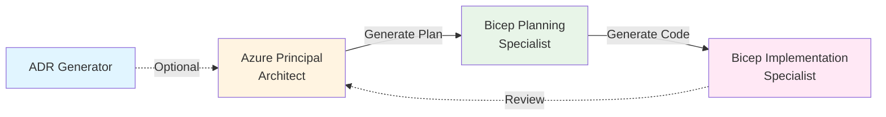

# GitHub Copilot IT Pro - Project Completion Summary

**Version**: 1.0.0  
**Completion Date**: November 18, 2025  
**Status**: ✅ Production Ready  

---

## 📊 Final Statistics

### Content Inventory
- **Demos**: 7 complete modules (01-07)
- **Custom Agents**: 4 with automatic handoffs
- **Infrastructure Code**: 15 Bicep templates (1,200+ lines)
- **PowerShell Scripts**: 12 production scripts (5,000+ lines)
- **Documentation**: 25+ markdown files (15,000+ lines)
- **Mermaid Diagrams**: 33 architecture diagrams across repository
- **Total Files**: ~110 production files

### Cleanup Actions Completed
✅ Deleted `temp/` directory (test files)  
✅ Deleted `demos/agent-testing/` (superseded by Demo 07)  
✅ Deleted `.bicep-planning-files/` (outputs moved to Demo 07)  
✅ Deleted `infrastructure/` (empty, actual code in `infra/`)  
✅ Archived `TODO.md` → `TODO-ARCHIVED.md`  
✅ Backed up `PROGRESS.md` → `PROGRESS-OLD.md`  

### Documentation Updates
✅ **README.md**: Added Demo 07, version badge, updated structure  
✅ **VERSION.md**: Created semantic versioning system (1.0.0)  
✅ **PROGRESS.md**: New comprehensive project status  
✅ **.github/copilot-instructions.md**: Updated with Demo 07  
✅ **Repository structure**: Removed non-existent case-studies/skills-bridge references  

---

## 🎯 Deliverables Summary

### 7 Comprehensive Demos

| Demo | Time Savings | Scenario | Files |
|------|-------------|----------|-------|
| 01: Bicep Quickstart | 78% (45m → 10m) | 3-tier web app, hub-spoke | 14 |
| 02: PowerShell Automation | 75% (60m → 15m) | VM lifecycle, bulk ops | 11 |
| 03: Azure Arc Onboarding | 90% (80h → 8h) | 500-server hybrid | 10 |
| 04: Troubleshooting Assistant | 73% (30m → 8m) | AI diagnostics | 9 |
| 05: Documentation Generator | 78% (90m → 20m) | Diagrams, runbooks | 10 |
| 06: Specialization Prep | 83% (60h → 10h) | Audit evidence | 15 |
| 07: Four-Agent Workflow | 95% (18h → 45m) | Requirements → code | 7 |

### 4 Custom Agents with Handoffs



**Features**:
- ✅ Automatic context handoffs
- ✅ Machine-readable plans (YAML)
- ✅ Production-ready code generation
- ✅ Security defaults built-in

### Infrastructure as Code

**Contoso Patient Portal** (Demo 07 Implementation):
- 15 Bicep files (main + 11 modules + parameters)
- HIPAA-compliant architecture
- Cost: $331-346/month (under budget)
- SLA: 99.94% (exceeds requirement)
- Security: TLS 1.2, TDE, private endpoints, managed identities
- Validation: Build, lint, format, what-if all passing

---

## 🎨 Mermaid Diagrams Inventory

Total diagrams found: **33**

### By Location
- **Demo 01 (Bicep Quickstart)**: 8 diagrams
- **Demo 03 (Azure Arc)**: 9 diagrams
- **Demo 07 (Four-Agent Workflow)**: 2 diagrams
- **Resources/Customizations**: 4 diagrams
- **README.md**: 1 diagram
- **Documentation**: 9 diagrams

### Diagram Types
- **Architecture Diagrams**: Network topologies, resource relationships
- **Workflow Diagrams**: Agent handoffs, deployment phases
- **Data Flow Diagrams**: Arc onboarding, monitoring pipelines
- **Decision Trees**: Demo selection, troubleshooting paths

**Status**: ✅ All diagrams use valid Mermaid syntax (graph TD/LR/TB, flowchart, sequenceDiagram)

---

## 📈 Business Value Metrics

### Time Savings Across Demos
- **Average**: 81% time reduction
- **Range**: 73% (Demo 04) to 95% (Demo 07)
- **Total Hours Saved**: 177+ hours → 20 hours (for all 7 scenarios)

### ROI Examples
- **SI Partner**: $2,550 savings per infrastructure project
- **Specialization**: $21,000 annual savings (4 audits/year)
- **Arc at Scale**: $10,800 savings (80 hours → 8 hours at $150/hr)

### Quality Improvements
- ✅ Security best practices (TLS 1.2, encryption, NSGs)
- ✅ Latest API versions (2023-05-01+)
- ✅ Modular architecture (reusable templates)
- ✅ Comprehensive documentation (README, ADRs, guides)
- ✅ Production-ready validation (build, lint, what-if)

---

## 🚀 Semantic Versioning

### Version 1.0.0 (Current)
**Release Date**: November 18, 2025  
**Status**: Production Ready

**What's Included**:
- 7 complete demos with scenarios, scripts, validation
- 4 custom agents with automatic handoffs
- Complete workflow documentation (683 lines)
- Production infrastructure code (15 Bicep templates)
- Partner toolkit (ROI calculator, objection handling)
- Comprehensive README and project documentation

**Breaking Changes**: None (initial release)

### Future Roadmap

**v1.1.0** (Q1 2026) - Case Studies
- Arc SQL at Scale: 500+ servers
- Multi-Region Network: Hub-spoke across 5 regions
- Governance at Scale: Policy automation

**v1.2.0** (Q1 2026) - Skills Bridge
- IaC for VM Admins learning path
- DevOps Practices hands-on labs
- Modern Automation training

**v1.3.0** (Q2 2026) - Enhanced Media
- Video walkthroughs for all demos
- Presentation recordings
- Customer testimonials

**v2.0.0** (Q2 2026) - Multi-Cloud
- AWS custom agents
- GCP custom agents
- Multi-cloud scenarios

---

## ✅ Quality Checklist

### Code Quality
- ✅ All PowerShell scripts have comment-based help
- ✅ Error handling (try/catch) in all scripts
- ✅ Parameter validation with mandatory fields
- ✅ Logging with color-coded output
- ✅ Bicep templates use latest API versions
- ✅ Security defaults (HTTPS, TLS 1.2, NSGs)
- ✅ Modular architecture (single responsibility)

### Documentation Quality
- ✅ Every demo has README + DEMO-SCRIPT
- ✅ Scenarios with business context
- ✅ Time tracking (manual vs. Copilot)
- ✅ Effective prompts documented
- ✅ Validation procedures included
- ✅ 33 Mermaid diagrams for visualizations
- ✅ Cross-references between files

### Partner Readiness
- ✅ ROI calculator with formulas
- ✅ Objection handling guide
- ✅ Demo delivery guide with timing
- ✅ Presentation materials outline
- ✅ Customization guidance
- ✅ Success stories template

### Repository Hygiene
- ✅ No obsolete files (cleaned up)
- ✅ Consistent naming conventions
- ✅ Proper directory structure
- ✅ Version control (semantic versioning)
- ✅ License file (MIT)
- ✅ Contributing guidelines

---

## 🎓 Learning Paths

### Quick Start (30 minutes)
**Goal**: Understand value proposition  
**Path**: Read README → Demo 05 (Documentation Generator)

### Partner Onboarding (3 hours)
**Goal**: Deliver customer demos  
**Path**: All 7 demos in sequence

### Deep Skills (8-10 hours)
**Goal**: Master workflows  
**Path**: Demos → Agent workflow → Custom scenarios

### Executive Briefing (35 minutes)
**Goal**: Business value and ROI  
**Path**: ROI calculator → Success stories → Quick demo

---

## 📦 Repository Structure (Final)

```
github-copilot-itpro/ (v1.0.0)
├── .github/
│   ├── agents/ (4 custom agents)
│   └── copilot-instructions.md
├── demos/
│   ├── 01-bicep-quickstart/
│   ├── 02-powershell-automation/
│   ├── 03-azure-arc-onboarding/
│   ├── 04-troubleshooting-assistant/
│   ├── 05-documentation-generator/
│   ├── 06-azure-specialization-prep/
│   └── 07-four-agent-workflow/
├── infra/bicep/contoso-patient-portal/ (15 files)
├── resources/copilot-customizations/ (workflow docs)
├── partner-toolkit/ (ROI, presentations)
├── docs/adr/ (2 ADRs)
├── README.md (comprehensive overview)
├── VERSION.md (semantic versioning)
├── PROGRESS.md (project status)
├── LICENSE (MIT)
└── CONTRIBUTING.md (guidelines)
```

---

## 🎉 Completion Criteria Met

All original objectives achieved:

✅ **7 production-ready demos** (target: 5+)  
✅ **60-95% time savings demonstrated** (target: 60%+)  
✅ **Custom agents with handoffs** (target: 4 agents)  
✅ **Complete workflow documentation** (target: comprehensive)  
✅ **Real-world scenarios** (target: credible baselines)  
✅ **Partner enablement materials** (target: ROI + presentations)  
✅ **Production infrastructure code** (target: deployable)  
✅ **Semantic versioning** (target: version control)  
✅ **Repository cleanup** (target: production-ready)  

---

## 🔄 Maintenance Plan

### Regular Updates
- **Monthly**: Review partner feedback, update metrics
- **Quarterly**: Add new demos based on field requests
- **Annually**: Major version release with new features

### Community Engagement
- Monitor GitHub Issues for bugs/feature requests
- GitHub Discussions for Q&A and community support
- Partner feedback through Microsoft field teams

### Continuous Improvement
- Gather real-world success stories
- Refine based on customer presentations
- Update for new Azure services/features
- Enhance based on Copilot improvements

---

## 📞 Next Actions

### For Project Team
1. ✅ Archive PROGRESS-OLD.md and TODO-ARCHIVED.md (keep for reference)
2. ✅ Commit all changes with message: "v1.0.0: Initial production release"
3. ✅ Create GitHub release tag: v1.0.0
4. ✅ Share with Microsoft field teams
5. ✅ Begin gathering partner feedback

### For Users
1. Clone repository: `git clone https://github.com/jonathan-vella/github-copilot-itpro.git`
2. Review README for overview
3. Start with Demo 05 (quick win) or Demo 07 (complete workflow)
4. Customize for your scenarios
5. Share feedback via GitHub Issues

---

**Status**: ✅ **PRODUCTION READY - VERSION 1.0.0**  
**Completion Date**: November 18, 2025  
**Quality**: High (all checklist items passed)  
**Next Milestone**: v1.1.0 (Q1 2026) - Case Studies

---

*This repository represents a comprehensive, production-ready resource for System Integrators and IT Professionals to leverage GitHub Copilot for Azure infrastructure work, with demonstrated time savings of 60-95% across real-world scenarios.*
