# 🚀 We've Evolved!

<!-- Animated Header -->
<picture>
  <source media="(prefers-color-scheme: dark)" srcset="assets/redirect-dark.svg">
  <source media="(prefers-color-scheme: light)" srcset="assets/redirect-light.svg">
  
</picture>

  

# This repository has a new home! 🏠

 

## 🔗 **[azure-agentic-infraops](https://github.com/jonathan-vella/azure-agentic-infraops)**

 

 

---

## What Changed?

| Before | After |
|:------:|:-----:|
| GitHub Copilot IT Pro | **Agentic InfraOps** |
| Demo repository | Production-ready toolkit |
| Single demos | Coordinated AI agents |
| Manual workflows | Automated 4-step workflow |

---

## ✨ What's New?

<table>
<tr>
<td width="50%">

### 🤖 Coordinated AI Agents
Four specialized agents working together:
- **@plan** → Requirements
- **azure-principal-architect** → WAF Assessment  
- **bicep-plan** → Implementation Plan
- **bicep-implement** → Deploy-Ready Code

</td>
<td width="50%">

### 💰 Real-Time Azure Pricing
MCP server integration for:
- Live pricing during design
- Region cost comparison
- SKU discovery
- Cost estimation

</td>
</tr>
</table>

---

## 🎯 Quick Links

| Resource | Link |
|----------|------|
| 📖 New Repository | [azure-agentic-infraops](https://github.com/jonathan-vella/azure-agentic-infraops) |
| 🔗 Shortlink | [aka.ms/agenticinfraops](https://aka.ms/agenticinfraops) |
| 📚 Documentation | [Workflow Guide](https://github.com/jonathan-vella/azure-agentic-infraops/blob/main/docs/workflow/WORKFLOW.md) |
| 🚀 Quick Start | [Getting Started](https://github.com/jonathan-vella/azure-agentic-infraops/blob/main/docs/getting-started/QUICKSTART.md) |

---

 

> **"Azure infrastructure engineered by agents. Verified. Well-Architected. Deployable."**

 

 

---

This repository is archived. All development continues at [azure-agentic-infraops](https://github.com/jonathan-vella/azure-agentic-infraops).

