# GitHub Copilot for Azure IT Pros

<!-- Badges -->
[](https://github.com/features/copilot)
[](https://azure.microsoft.com)
[](https://learn.microsoft.com/azure/azure-resource-manager/bicep/)
[](https://www.terraform.io/)

[](LICENSE)
[](CONTRIBUTING.md)
[](https://code.visualstudio.com/docs/devcontainers/containers)


---

> **Transform how you build Azure infrastructure.** Go from hours of manual template writing
> to minutes of AI-assisted development—with production-ready code, security best practices,
> and documentation built in.

```mermaid
graph LR
    A["📝 Describe Intent"] --> B["🤖 AI Generates Code"]
    B --> C["👀 Review & Refine"]
    C --> D["🚀 Deploy to Azure"]

    style A fill:#e3f2fd
    style B fill:#e8f5e9
    style C fill:#fff3e0
    style D fill:#fce4ec
```



## Why This Matters

| Traditional Approach | With GitHub Copilot |
|---------------------|---------------------|
| 45 min to write VNet + NSGs | **10 min** (78% faster) |
| 60 min for automation scripts | **15 min** (75% faster) |
| 2 hours for documentation | **20 min** (83% faster) |
| Days of troubleshooting | **Minutes** with AI diagnosis |

📖 **[Read the full IT Pro Impact Story](docs/it-pro-impact-story.md)** — Real challenges, real transformations.

---

## 🚀 Getting Started

### Quick Start (5 minutes)

```bash
# 1. Clone and open
git clone https://github.com/jonathan-vella/github-copilot-itpro.git
code github-copilot-itpro

# 2. Open in Dev Container (F1 → "Dev Containers: Reopen in Container")
# 3. Wait 3-5 minutes for setup (first build may take 5-10 minutes)
# 4. The container installs Terraform, Azure CLI, Bicep, PowerShell 7, and 25+ VS Code extensions
# 5. Start with S01-bicep-baseline scenario
```

### Before You Begin

- **[Prerequisites](docs/getting-started/prerequisites.md)** — Tools, Azure subscription, knowledge requirements
- **[Model Selection Guide](docs/getting-started/model-selection.md)** — Choose the right AI model for your task

---

## 📚 Scenarios

Each scenario features a real-world IT Pro facing a challenge you'll recognize.

| Scenario | Description | What You'll Learn |
|----------|-------------|-------------------|
| **[S01 Bicep Baseline](scenarios/S01-bicep-baseline)** | Hub & Spoke network with Firewall & Bastion | Bicep fundamentals, Copilot prompting |
| **[S02 Terraform Baseline](scenarios/S02-terraform-baseline)** | Same topology in Terraform | Multi-cloud IaC, HCL syntax |
| **[S03 Five Agent Workflow](scenarios/S03-five-agent-workflow)** | End-to-end with 5 specialized agents | Advanced workflow, agent handoffs |
| **[S04 Documentation](scenarios/S04-documentation-generation)** | Auto-generate docs and diagrams | Markdown, Mermaid, consistency |
| **[S05 Service Validation](scenarios/S05-service-validation)** | Automated testing of Azure services | PowerShell, Pester, compliance |
| **[S06 Troubleshooting](scenarios/S06-troubleshooting)** | Diagnose and fix infrastructure issues | Azure Monitor, Log Analytics |
| **[S07 SBOM Generator](scenarios/S07-sbom-generator)** | Software Bill of Materials for compliance | Syft, Grype, security scanning |
| **[S08 Diagrams as Code](scenarios/S08-diagrams-as-code)** | Architecture diagrams in Python | Diagrams library, automation |
| **[S09 Coding Agent](scenarios/S09-coding-agent)** | Assign issues to Copilot for autonomous implementation | Coding Agent, async workflows |

---

## 🔄 The Five-Agent Workflow

For complex projects, use our five-agent workflow that mirrors how senior architects think:


**Result:** Projects that took 18+ hours now complete in 45 minutes with production-ready code.

📖 **[See it in action → S03 Five Agent Workflow](scenarios/S03-five-agent-workflow)**

---

## 📊 Time Savings Evidence

All productivity estimates are backed by peer-reviewed research from GitHub, Forrester, Stanford HAI, MIT Sloan, and more.

📖 **[Evidence & Methodology](docs/time-savings-evidence.md)**

---

## 🤝 Contributing

We welcome contributions! Please read [CONTRIBUTING.md](CONTRIBUTING.md) for guidelines.

## 📄 License

MIT License — see [LICENSE](LICENSE) for details.
