# GitHub Copilot for Azure IT Pros

<!-- Badges -->

[](https://github.com/features/copilot)
[](https://azure.microsoft.com)
[](https://learn.microsoft.com/azure/azure-resource-manager/bicep/)
[](https://www.terraform.io/)

[](LICENSE)
[](CONTRIBUTING.md)
[](https://code.visualstudio.com/docs/devcontainers/containers)


---

> **Transform how you build Azure infrastructure.** Go from hours of manual template writing
> to minutes of AI-assisted development—with near-production-ready code, security best practices,
> and documentation built in.

```mermaid
%%{init: {'theme':'neutral'}}%%
graph LR
    A["📝 Describe Intent"] --> B["🤖 AI Generates Code"]
    B --> C["👀 Review & Refine"]
    C --> D["🚀 Deploy to Azure"]

    style A fill:#e3f2fd
    style B fill:#e8f5e9
    style C fill:#fff3e0
    style D fill:#fce4ec
```



## Why This Matters

| Traditional Approach          | With GitHub Copilot           |
| ----------------------------- | ----------------------------- |
| 45 min for Zero Trust Network | **10 min** (78% faster)       |
| 60 min for automation scripts | **15 min** (75% faster)       |
| 2 hours for documentation     | **20 min** (83% faster)       |
| Days of troubleshooting       | **Minutes** with AI diagnosis |

📖 **[Read the IT Pro Transformation Story](docs/the-itpro-copilot-story.md)** — The narrative journey from frustration to productivity.

🎯 **[See What Copilot Enabled Me to Build](docs/copilot-portfolio-showcase.md)** — Real projects built by a non-developer.

💼 **[5-Minute Executive Pitch](docs/executive-pitch.md)** — Ready-to-use presentation for leadership.

---

## 🚀 Getting Started

### 📘 Complete Guide

**New here?** Follow our end-to-end guide: **[Getting Started: Your Complete Journey](docs/getting-started/README.md)**

It walks you through:

1. **Setup** (15 min) — Clone, Dev Container, verify tools
2. **First Scenario** (30 min) — Deploy real infrastructure with Copilot
3. **Explore** — Learning paths for your role
4. **Master** — Five-Agent Workflow and Coding Agent

### Quick Start (5 minutes)

```bash
# 1. Clone and open
git clone https://github.com/jonathan-vella/github-copilot-itpro.git
code github-copilot-itpro

# 2. Open in Dev Container (F1 → "Dev Containers: Reopen in Container")
# 3. Wait 3-5 minutes for setup (first build may take 5-10 minutes)
# 4. The container installs Terraform, Azure CLI, Bicep, PowerShell 7, and 25+ VS Code extensions
# 5. Start with S01-bicep-baseline scenario
```

### Before You Begin

- **[Prerequisites](docs/getting-started/prerequisites.md)** — Tools, Azure subscription, knowledge requirements
- **[Model Selection Guide](docs/getting-started/model-selection.md)** — Choose the right AI model for your task

---

## 📚 Scenarios

Each scenario features a real-world IT Pro facing a challenge you'll recognize.

| Scenario                                                         | Description                                            | What You'll Learn                     |
| ---------------------------------------------------------------- | ------------------------------------------------------ | ------------------------------------- |
| **[S01 Bicep Baseline](scenarios/S01-bicep-baseline)**           | Hub & Spoke network with Firewall & Bastion            | Bicep fundamentals, Copilot prompting |
| **[S02 Terraform Baseline](scenarios/S02-terraform-baseline)**   | Same topology in Terraform                             | Multi-cloud IaC, HCL syntax           |
| **[S03 Five Agent Workflow](scenarios/S03-five-agent-workflow)** | End-to-end with 5 specialized agents                   | Advanced workflow, agent handoffs     |
| **[S04 Documentation](scenarios/S04-documentation-generation)**  | Auto-generate docs and diagrams                        | Markdown, Mermaid, consistency        |
| **[S05 Service Validation](scenarios/S05-service-validation)**   | Automated testing of Azure services                    | PowerShell, Pester, compliance        |
| **[S06 Troubleshooting](scenarios/S06-troubleshooting)**         | Diagnose and fix infrastructure issues                 | Azure Monitor, Log Analytics          |
| **[S07 SBOM Generator](scenarios/S07-sbom-generator)**           | Software Bill of Materials for compliance              | Syft, Grype, security scanning        |
| **[S08 Diagrams as Code](scenarios/S08-diagrams-as-code)**       | Azure Architecture diagrams in Python                  | Diagrams library, automation          |
| **[S09 Coding Agent](scenarios/S09-coding-agent)**               | Assign issues to Copilot for autonomous implementation | Coding Agent, async workflows         |

---

## 🔄 The Five-Agent Workflow

For complex projects, use our five-agent workflow that mirrors how senior architects think:


| Agent                       | Type     | Purpose                                  |
| --------------------------- | -------- | ---------------------------------------- |
| `@plan`                     | Built-in | Strategic planning with cost estimates   |
| `adr_generator`             | Custom   | Document architectural decisions         |
| `azure-principal-architect` | Custom   | Azure Well-Architected Framework review  |
| `bicep-plan`                | Custom   | Infrastructure module design             |
| `bicep-implement`           | Custom   | Generate near-production-ready Bicep     |

> **Note:** The Plan Agent (`@plan`) is a **built-in VS Code feature**. The other four agents are custom
> agents defined in `.github/agents/`. See [VS Code Plan Agent docs](https://code.visualstudio.com/docs/copilot/chat/chat-planning).

**Result:** Projects that took 18+ hours now complete in 45 minutes with near-production-ready code.

📖 **[See it in action → S03 Five Agent Workflow](scenarios/S03-five-agent-workflow)**

---

## 📊 Time Savings Evidence

All productivity estimates are backed by peer-reviewed research from GitHub, Forrester, Stanford HAI, MIT Sloan, and more.

📖 **[Evidence & Methodology](docs/time-savings-evidence.md)**

---

## 📁 Documentation & Resources

### Core Documentation

| Document                                                                 | Description                                       |
| ------------------------------------------------------------------------ | ------------------------------------------------- |
| [docs/README.md](docs/README.md)                                         | **Documentation overview and navigation guide**   |
| [docs/the-itpro-copilot-story.md](docs/the-itpro-copilot-story.md)       | Full narrative story of the IT Pro transformation |
| [docs/executive-pitch.md](docs/executive-pitch.md)                       | 5-minute executive pitch                          |
| [docs/copilot-portfolio-showcase.md](docs/copilot-portfolio-showcase.md) | Real projects built with Copilot                  |

### Presenter Toolkit

| Resource                                                                          | Description                                                 |
| --------------------------------------------------------------------------------- | ----------------------------------------------------------- |
| [ROI Calculator](resources/presenter-toolkit/roi-calculator-worksheet.md)         | Calculate time/cost savings for your team                   |
| [Pilot Success Checklist](resources/presenter-toolkit/pilot-success-checklist.md) | Plan and evaluate Copilot pilots                            |
| [Infographics](resources/presenter-toolkit/infographics/)                         | Python-generated visual assets (time savings, before/after) |
| [Demo Delivery Guide](resources/presenter-toolkit/demo-delivery-guide.md)         | How to run effective demos                                  |

---

## 🤝 Contributing

We welcome contributions! Please read [CONTRIBUTING.md](CONTRIBUTING.md) for guidelines.

## 📄 License

MIT License — see [LICENSE](LICENSE) for details.
