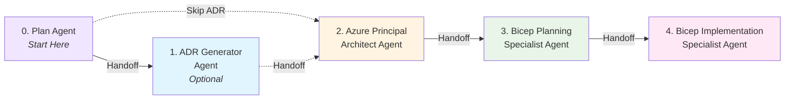

# GitHub Copilot for IT Pros: Your Azure Infrastructure Efficiency Multiplier

[](LICENSE)
[](VERSION.md)
[](https://azure.microsoft.com/)
[](https://github.com/features/copilot)

> **Not about solving pain points—it's about amplifying capabilities.**  
> GitHub Copilot helps IT Pros and System Integrators work faster, smarter, and bridge skills gaps in IaC, DevOps, and modern automation.

---

## 🎯 The Efficiency Multiplier

### What This Repository Offers

This is a hands-on collection of **30-minute demos** showing how GitHub Copilot accelerates Azure infrastructure work:

| Task | Manual | With Copilot | Time Saved |
|------|--------|--------------|------------|
| **Bicep template** (3-tier network) | 45 min | 10 min | **78%** ⚡ |
| **PowerShell automation** (VM lifecycle) | 60 min | 15 min | **75%** ⚡ |
| **Arc onboarding** (100 servers) | 80 hrs | 8 hrs | **90%** ⚡ |
| **Troubleshooting diagnostics** | 30 min | 8 min | **73%** ⚡ |
| **Documentation** (runbook) | 90 min | 20 min | **78%** ⚡ |
| **Specialization audit prep** | 60 hrs | 10 hrs | **83%** ⚡ |
| **5-agent workflow** (requirements → code) | 18 hrs | 45 min | **96%** ⚡ |

### Who This Is For

- **🤝 System Integrators (SIs)**: Deliver compelling customer demos in 30 minutes
- **🛠️ IT Professionals**: Bridge skills gaps in IaC, DevOps, and automation
- **☁️ Cloud Architects**: Accelerate infrastructure design and deployment
- **📊 Decision Makers**: Understand ROI and business value

---

## 🚀 Quick Start

### For Partners: Deliver Your First Demo

```powershell
# Clone the repository
git clone https://github.com/jonathan-vella/github-copilot-itpro.git
cd github-copilot-itpro

# Choose a demo based on customer profile:
# - Traditional IT Pros → demos/02-powershell-automation
# - Adopting IaC → demos/01-bicep-quickstart  
# - Hybrid Infrastructure → demos/03-azure-arc-onboarding
# - Operational Teams → demos/04-troubleshooting-assistant
# - Specialization Partners → demos/06-azure-specialization-prep
# - Complete Workflow → infra/bicep/contoso-patient-portal (Demo 07 implementation)

# Read the demo script
cat demos/01-bicep-quickstart/DEMO-SCRIPT.md

# Test in your Azure subscription
cd demos/01-bicep-quickstart/validation
./deploy.ps1
```

**Time to First Demo:** 45 minutes (including review and test)

### For IT Pros: Start Learning

1. **Quick Win** (30 min): [Documentation Generator](demos/05-documentation-generator) - Generate runbooks and diagrams
2. **Foundation** (30 min): [PowerShell Automation](demos/02-powershell-automation) - See automation best practices emerge
3. **Modern IaC** (30 min): [Bicep Quickstart](demos/01-bicep-quickstart) - Bridge to Infrastructure as Code
4. **Advanced** (30 min): [Azure Arc](demos/03-azure-arc-onboarding) - Hybrid infrastructure at scale
5. **Specialization** (40 min): [Azure Specialization Prep](demos/06-azure-specialization-prep) - Audit preparation with validation
6. **Complete Workflow** (45 min): [Five-Agent Workflow](infra/bicep/contoso-patient-portal) - Requirements to code in minutes

> **Note on Demo 07**: The Five-Agent Workflow demo is implemented in `infra/bicep/contoso-patient-portal/` rather than a separate `demos/07-five-agent-workflow/` directory. This production-ready HIPAA-compliant infrastructure (1,070 lines of Bicep, 10 modules) serves as the working demonstration of the complete agent workflow, showing 96% time savings (18 hours manual → 45 minutes with agents). See [`FIVE-MODE-WORKFLOW.md`](resources/copilot-customizations/FIVE-MODE-WORKFLOW.md) for complete documentation.

**Total Investment:** 3.5 hours | **Outcome:** Confident in modern Azure practices + specialization readiness + agent workflow mastery

---

## 📁 Repository Structure

```
github-copilot-itpro/
├── .github/
│   ├── agents/                         # 4 custom agents (Plan agent is built-in)
│   │   ├── adr-generator.agent.md
│   │   ├── azure-principal-architect.agent.md
│   │   ├── bicep-plan.agent.md
│   │   └── bicep-implement.agent.md
│   └── copilot-instructions.md         # Repository context for Copilot
│
├── demos/                              # 30-minute demo modules
│   ├── 01-bicep-quickstart/            # IaC without the learning curve
│   ├── 02-powershell-automation/       # Operational tasks automated
│   ├── 03-azure-arc-onboarding/        # Hybrid infrastructure simplified
│   ├── 04-troubleshooting-assistant/   # AI-powered diagnostics
│   ├── 05-documentation-generator/     # Runbooks & diagrams at speed
│   ├── 06-azure-specialization-prep/   # Audit preparation accelerated
│   └── 07-five-agent-workflow/         # Complete workflow demo (NEW!)
│
├── resources/copilot-customizations/   # Workflow guides & instructions
│   ├── FOUR-MODE-WORKFLOW.md           # Complete workflow documentation
│   ├── AGENT-HANDOFF-DEMO.md          # 15-20 min demo script
│   ├── INDEX.md                        # Documentation index
│   └── QUICK-START.md                  # Getting started guide
│
├── partner-toolkit/                    # Customer demo enablement
│   ├── presentation/                   # Ready-to-use slide decks
│   ├── customization-guide/            # Adapt for your customers
│   └── roi-calculator/                 # Business case development
│
├── case-studies/                       # Real-world success stories
│   ├── arc-sql-at-scale/              # 80 hours → 8 hours
│   ├── multi-region-network/          # 3 weeks → 3 days
│   └── governance-at-scale/           # Automated compliance
│
├── skills-bridge/                      # Learning pathways
│   ├── iac-for-vm-admins/             # From VMs to IaC
│   ├── devops-practices/              # CI/CD fundamentals
│   └── modern-automation/             # Declarative approaches
│
└── docs/                               # Additional documentation
    └── adr/                            # Architectural Decision Records
```

---

## 🤖 Custom Agents & Workflow

This repository includes **five custom GitHub Copilot agents** that work together through automatic handoffs to accelerate Azure infrastructure development from business requirements to production-ready code:

### Five-Agent Workflow



**Time Savings**: 96% (18 hours → 45 minutes) for complete infrastructure development from requirements to code

### How to Use Custom Agents

1. **Open Copilot Chat** (`Ctrl+Alt+I` or `Cmd+Alt+I`)
2. **Start with Plan**: Type `@plan` followed by your requirements, or click the Agent dropdown and select **Plan**
3. **Follow the workflow**: Use handoff buttons to move between agents:
   - Plan → ADR Generator (optional) → Azure Architect → Bicep Planning → Bicep Implementation
4. **Alternative**: Click the Agent button (`Ctrl+Shift+A`) to manually select agents: `@plan`, `adr_generator`, `azure-principal-architect`, `bicep-plan`, or `bicep-implement`
5. **Context preservation**: All handoffs automatically carry forward your requirements and decisions

### The Five Agents

#### 0. Plan Agent (`@plan`) - *Start Here*
**Purpose**: Break down complex tasks into step-by-step implementation plans before any code is written

> **Best practice**: Always start with the Plan agent for multi-step infrastructure projects. It ensures all requirements and context are captured upfront.

**Usage**:
```
@plan Create a complete Azure infrastructure deployment plan for a HIPAA-compliant healthcare application with:
- Hub-spoke network topology
- Azure SQL Database with private endpoints
- Application Gateway with WAF
- Azure Key Vault for secrets
- Log Analytics for monitoring
- Budget: $800/month, 99.9% SLA requirement
```

**Output**: Interactive planning session with:
- Clarifying questions about requirements
- Detailed implementation plan with phases
- Resource breakdown with cost estimates
- Security and compliance considerations
- Deployment sequence and dependencies
- Validation checkpoints

**Key Features**:
- **Iterative refinement**: Spend time improving the plan before implementation
- **Requirement capture**: Ensures nothing is missed through guided questions
- **Scope adjustment**: Easily modify requirements before code generation
- **Implementation options**: Deploy locally in VS Code or via GitHub Copilot coding agent
- **Custom planning**: Create your own plan agent tailored to your team's workflow

**Handoff Buttons**: 
- "Document This Decision" → Invokes ADR Generator to create architectural decision records
- "Skip to Architecture Review" → Directly invokes Azure Principal Architect
- "Start Implementation" → Proceeds to Bicep Planning Specialist

**When to Use**:
- ✅ Multi-step infrastructure projects with multiple components
- ✅ Complex requirements needing clarification
- ✅ Projects requiring cost estimates and resource planning
- ✅ When you need stakeholder approval before implementation
- ❌ Skip for simple, single-resource deployments
- ❌ Skip when requirements are already fully documented

**Learn More**: [Planning in VS Code Chat](https://code.visualstudio.com/docs/copilot/chat/chat-planning) | [VS Code 1.106 Release Notes](https://code.visualstudio.com/updates/v1_106#_plan-agent)

---

#### 1. ADR Generator (`adr_generator`) - *Optional*
**Purpose**: Document architectural decisions with structured ADRs for enterprise governance

> **Skip for demos** focused on speed. Most valuable for enterprise teams needing audit trails.

**Usage**:
```
Document the decision to use Azure Bastion vs. Jump Boxes for secure VM access.
Include context, alternatives, and consequences.
```

**Output**: Creates ADR in `/docs/adr/adr-NNNN-{title}.md` with:
- Status, Context, Decision, Consequences
- Alternatives with rejection rationale
- Implementation notes and references

**Handoff Button**: "Review Against WAF Pillars" → Automatically invokes Azure Principal Architect

---

#### 2. Azure Principal Architect (`azure-principal-architect`)
**Purpose**: Azure Well-Architected Framework assessment and guidance

**Usage**:
```
Assess the hub network topology against Azure Well-Architected Framework.
Evaluate all 5 pillars and provide recommendations.
```

**Output**: Comprehensive WAF assessment with:
- Security, Reliability, Performance, Cost, Operations evaluation
- Overall score (e.g., 7.2/10)
- Specific recommendations for improvements
- Risk mitigation strategies

**Handoff Buttons**: 
- "Generate Implementation Plan" → Invokes Bicep Planning Specialist
- "Create ADR from Assessment" → Returns to ADR Generator

---

#### 3. Bicep Planning Specialist (`bicep-plan`)
**Purpose**: Create machine-readable implementation plans

**Usage**:
```
Create a detailed implementation plan for deploying a hub network.
Include all resources, dependencies, and security configurations.
```

**Output**: Creates plan in `.bicep-planning-files/INFRA.{goal}.md` with:
- YAML resource specifications
- Implementation phases and tasks
- Architecture diagrams (Mermaid)
- Dependencies and deployment order
- Time estimates and cost projections

**Handoff Buttons**:
- "Generate Bicep Code" → Invokes Bicep Implementation Specialist
- "Validate Against WAF" → Returns to Azure Principal Architect

---

#### 4. Bicep Implementation Specialist (`bicep-implement`)
**Purpose**: Generate production-ready Bicep templates

**Usage**:
```
Implement the Bicep templates based on the implementation plan.
Output to: infrastructure/my-project/
```

**Output**: Creates complete infrastructure code:
- `main.bicep` - Orchestration template
- `modules/*.bicep` - Modular resource templates
- `parameters/*.json` - Environment configurations
- `deploy.ps1`, `validate.ps1`, `cleanup.ps1` - Deployment scripts
- `README.md` - Complete documentation

**Features**:
- Latest API versions (2023-05-01+)
- Security best practices (TLS 1.2, NSG rules)
- Modular architecture
- Automatic validation (build, lint, format)

**Handoff Buttons**:
- "Review Security & Compliance" → Returns to Azure Principal Architect
- "Update Plan Status" → Updates planning file

---

### Complete Workflow Example

**Scenario**: Deploy a HIPAA-compliant healthcare application infrastructure

**Step 0 - Create Implementation Plan** (5 minutes)
```
@plan Create a complete Azure infrastructure deployment plan for a patient portal with:
- 10,000 active patients
- HIPAA compliance required
- Budget: $800/month
- 99.9% availability SLA
- Need: web app, database, API backend, file storage
```
→ Plan agent asks clarifying questions (region, scaling needs, backup requirements)
→ Generates detailed plan with cost breakdown, 8 Azure resources, 4 deployment phases
→ Click **"Document This Decision"** button to create ADR

**Step 1 - Document Key Decisions** (2 minutes)
```
(Automatically switches to adr_generator)
Document the architectural decisions from this plan, focusing on
HIPAA compliance choices and cost optimization strategies.
```
→ Creates ADR-0004 with HIPAA compliance rationale, alternatives, security controls
→ Click **"Review Against WAF Pillars"** button

**Step 2 - WAF Assessment** (3 minutes)
```
(Automatically switches to azure-principal-architect)
Assess the hub network topology against Azure Well-Architected Framework...
```
→ Provides 7.2/10 score with detailed pillar analysis
→ Click **"Generate Implementation Plan"** button

**Step 3 - Create Plan** (5 minutes)
```
(Automatically switches to bicep-plan)
Create detailed implementation plan for the hub network...
```
→ Creates INFRA.hub-network.md with 10 resources, 5 phases, diagrams
→ Click **"Generate Bicep Code"** button

**Step 4 - Implement Code** (10 minutes)
```
(Automatically switches to bicep-implement)
Implement the Bicep templates based on the plan...
```
→ Generates 7 modules, main template, parameters, deployment scripts
→ Validates and formats all templates
→ Creates comprehensive README

**Total Time**: 30-45 minutes (vs. 18 hours manual) | **Improvement**: 96% time savings

---

### Key Features

✅ **Interactive Planning**: Plan agent asks questions to capture all requirements upfront  
✅ **Automatic Handoffs**: Click buttons to switch agents with full context preserved  
✅ **Iterative Refinement**: Improve plans before implementation to reduce rework  
✅ **Machine-Readable Plans**: Structured YAML for deterministic code generation  
✅ **Production-Ready Code**: Latest APIs, security best practices, validation built-in  
✅ **Complete Documentation**: Each agent creates comprehensive outputs  
✅ **Cost Visibility**: Plan agent provides budget estimates before deployment  
✅ **Tested Workflow**: All handoffs and agents validated and working  

### Quick Start Guide

📖 **[Complete Workflow Documentation](resources/copilot-customizations/FIVE-MODE-WORKFLOW.md)** (includes Plan agent guidance)  
🎬 **[15-Minute Demo Script](resources/copilot-customizations/AGENT-HANDOFF-DEMO.md)** (start with `@plan`)  
📚 **[Plan Agent Documentation](https://code.visualstudio.com/docs/copilot/chat/chat-planning)** (official VS Code docs)  
📚 **[Index of All Customizations](resources/copilot-customizations/INDEX.md)**  

---

## 💡 Core Value Propositions

### 1. Work Faster ⚡
Cut deployment time by 60-75% on common infrastructure tasks. What took hours now takes minutes.

### 2. Work Smarter 🎯
Generate production-ready Infrastructure as Code without deep IaC expertise. Best practices built-in.

### 3. Learn Continuously 📚
Bridge skills gaps in DevOps, automation, and modern practices while delivering real work.

### 4. Stay Consistent 🔄
Maintain standards across infrastructure deployments with AI-assisted templates and patterns.

---

## 🎓 Learning Paths

### Path 1: Partner Onboarding (3 hours)
**Goal:** Deliver customer demos confidently

1. Read main README (this page) - 5 min
2. Demo 1: Bicep Quickstart - 30 min *(Foundation: IaC basics)*
3. Demo 2: PowerShell Automation - 30 min *(Build on: Automation patterns)*
4. Demo 5: Documentation Generator - 30 min *(Quick win: Immediate value)*
5. Demo 6: Azure Specialization Prep - 40 min *(Advanced: Audit preparation with validation)*
6. Demo 7: Five-Agent Workflow - 45 min *(Complete: End-to-end workflow)*

**Outcome:** Ready to deliver demos to customers with full workflow understanding

---

### Path 2: Customer Demo Delivery (30 min)
**Goal:** Compelling demo for decision makers

Choose your demo based on customer profile:

| Customer Profile | Recommended Demo | Key Message |
|-----------------|------------------|-------------|
| Traditional IT Pros | PowerShell Automation | "Work faster with familiar tools" |
| Adopting IaC | Bicep Quickstart | "Modern infrastructure without learning curve" |
| Hybrid Infrastructure | Azure Arc | "Manage on-prem like Azure" |
| Operational Teams | Troubleshooting Assistant | "AI-powered diagnostics" |
| Governance Focus | Arc + Policy | "Compliance at scale, automated" |

**Demo Delivery Checklist:**
- [ ] Review DEMO-SCRIPT.md (10 min)
- [ ] Test in Azure subscription (20 min)
- [ ] Customize for customer scenario (10 min)
- [ ] Prepare ROI talking points (5 min)

---

### Path 3: Deep Skills Development (8-10 hours)
**Goal:** Bridge skills gaps completely

1. **Foundations**: Complete Skills Bridge modules
   - IaC for VM Admins (2 hours)
   - DevOps Practices (2 hours)
   - Modern Automation (2 hours)

2. **Hands-On**: Work through all 7 demos
   - Focus on understanding prompts and agent workflows
   - Experiment with variations
   - Build your own scenarios

3. **Real-World**: Adapt to your environment
   - Use case studies as templates
   - Start with non-production
   - Document time savings

**Outcome:** Confident in modern Azure practices

---

### Path 4: Executive Briefing (35 min)
**Goal:** Understand business value and ROI

1. **Business Case**: Review ROI calculator (10 min)
2. **Success Stories**: Read case studies (15 min)
   - 500+ SQL Servers: 80 hours → 8 hours
   - Multi-region Network: 3 weeks → 3 days
3. **Quick Demo**: Documentation Generator (10 min)
4. **Discussion**: Technical team alignment

**Decision Point:** Pilot program approval

---

## 🌟 Featured Demos

### [Demo 1: Bicep Quickstart](demos/01-bicep-quickstart)
**Time:** 30 minutes | **Level:** Intermediate

Generate production-ready Bicep templates for complex Azure infrastructure without deep IaC expertise.

**Scenario:** Deploy a secure 3-tier Azure network with proper segmentation, NSGs, and NAT Gateway.

**What You'll Learn:**
- Effective prompts for Bicep generation
- Before/after comparison (45 min manual vs. 10 min with Copilot)
- Validation and deployment workflow

---

### [Demo 2: PowerShell Automation](demos/02-powershell-automation)
**Time:** 30 minutes | **Level:** Beginner

Automate operational tasks with best practices built-in. Familiar PowerShell, amplified capabilities.

**Scenarios:**
- VM lifecycle automation
- Compliance reporting across subscriptions
- Cost optimization (identify idle resources)

**What You'll Learn:**
- Production-ready error handling
- Logging patterns
- At-scale automation

---

### [Demo 3: Azure Arc Onboarding](demos/03-azure-arc-onboarding)
**Time:** 30 minutes | **Level:** Advanced

Onboard and manage hybrid infrastructure at scale with automated Arc enablement.

**Scenarios:**
- Bulk server onboarding (100+ servers)
- SQL Server Arc discovery and enablement
- At-scale policy assignment

**What You'll Learn:**
- Bulk automation patterns
- Error handling for distributed systems
- Policy as code

---

### [Demo 4: Troubleshooting Assistant](demos/04-troubleshooting-assistant)
**Time:** 30 minutes | **Level:** Intermediate

AI-assisted diagnostics and remediation for common Azure infrastructure issues.

**Scenarios:**
- VM performance diagnostics
- Network connectivity troubleshooting
- Log analysis with Kusto queries

**What You'll Learn:**
- Diagnostic script generation
- Automated remediation
- Pattern recognition

---

### [Demo 5: Documentation Generator](demos/05-documentation-generator)
**Time:** 30 minutes | **Level:** Beginner

Generate architecture diagrams, runbooks, and troubleshooting guides automatically.

**Examples:**
- Mermaid architecture diagrams from descriptions
- DR runbooks from infrastructure state
- Troubleshooting guides from common issues

**What You'll Learn:**
- Documentation as code
- Diagram generation
- Template reuse

---

### [Demo 6: Azure Specialization Audit Preparation](demos/06-azure-specialization-prep)
**Time:** 40 minutes | **Level:** Advanced

Accelerate Azure Infrastructure and Database Migration Specialization audit preparation using the five-agent workflow with comprehensive validation.

**Scenarios:**
- Complete audit evidence generation (11 controls with validation)
- Infrastructure as Code with ALZ alignment
- Well-Architected Framework assessments including chaos engineering
- Architecture Decision Records (ADRs)
- Migration validation (chaos testing, load testing, UAT)

**What You'll Learn:**
- Five-agent workflow with automatic handoffs (Plan → ADR → Azure Architect → Bicep Planning → Bicep Implementation)
- Production-ready Bicep templates with security best practices
- Comprehensive validation framework aligned with CAF Migrate
- Chaos engineering with Azure Chaos Studio
- Load testing with Azure Load Testing
- UAT tracking with realistic test data

**Business Value:**
- **Time Savings:** 60 hours → 10 hours (83% reduction)
- **Annual ROI:** $34,500 for 4 audits/year (includes validation framework)
- **Audit Coverage:** 3 Module A + 5 Module B controls

---

### [Demo 7: Five-Agent Workflow](infra/bicep/contoso-patient-portal) 🆕
**Time:** 45-60 minutes | **Level:** Advanced

> **Implementation Note**: This demo is implemented as production-ready infrastructure in `infra/bicep/contoso-patient-portal/` (1,070 lines of Bicep across 10 modules), serving as the working demonstration of the complete five-agent workflow. See [`FIVE-MODE-WORKFLOW.md`](resources/copilot-customizations/FIVE-MODE-WORKFLOW.md) for detailed documentation.

Showcase the complete 5-agent workflow from business requirements to deployable infrastructure with automatic agent handoffs.

**Scenario:** HIPAA-compliant patient portal for Contoso Healthcare (10k patients, $800/month budget, 99.9% SLA).

**What You'll Learn:**
- Five-agent collaboration (Plan → ADR Generator → Azure Architect → Bicep Planning → Bicep Implementation)
- Interactive planning with clarifying questions and cost estimates
- Automatic context handoffs between agents
- Production-ready output quality
- Complete workflow in 45 minutes vs. 18 hours manual

**Business Value:**
- **Time Savings:** 18 hours → 45 minutes (96% reduction)
- **Cost Savings:** $2,550 per project for SI partners
- **Output Quality:** Cost-validated plan, WAF-aligned architecture, AVM-based templates, security defaults

---

## 📊 Case Studies & Skills Bridge (Coming Soon)

**Note:** Case studies and skills bridge content are planned for future releases. Current focus is on production-ready demos and agent workflow.


## 🤝 Partner Enablement

### Ready-to-Use Materials

- **📊 Presentation Deck**: 30-minute partner presentation with speaker notes
- **📝 Demo Scripts**: Step-by-step walkthroughs with timing
- **💰 ROI Calculator**: Business case development spreadsheet
- **🎯 Objection Handling**: Answers to common questions
- **🏆 Success Stories**: Anonymized customer references

**Access:** [partner-toolkit/](partner-toolkit/)

---


## 🛠️ Getting Started with Copilot

### Prerequisites

- **GitHub Copilot License**: Individual, Business, or Enterprise
- **VS Code**: With GitHub Copilot extension
- **Azure Subscription**: For testing demos
- **Azure CLI**: For deployment scripts
- **PowerShell 7+**: For automation scenarios

### Recommended VS Code Extensions

```json
{
  "recommendations": [
    "github.copilot",
    "github.copilot-chat",
    "ms-vscode.azurecli",
    "ms-vscode.powershell",
    "ms-azuretools.vscode-bicep"
  ]
}
```

### 🎯 Supercharge Your Copilot (NEW!)

Enhance Copilot with curated customizations from the [Awesome Copilot](https://github.com/github/awesome-copilot) repository:

**[📦 Copilot Customizations for IT Pros](resources/copilot-customizations/)**

Get started in 5 minutes with:
- ✅ **Bicep Best Practices**: Auto-applied naming conventions and security standards
- ✅ **PowerShell Testing**: Pester v5 patterns built-in
- ✅ **Azure Architecture**: Well-Architected Framework guidance
- ✅ **DevOps Principles**: DORA metrics and automation patterns

**Quick Setup**:
```bash
# Add Bicep and DevOps standards (recommended)
cat resources/copilot-customizations/instructions/bicep-code-best-practices.instructions.md >> .github/copilot-instructions.md
cat resources/copilot-customizations/instructions/devops-core-principles.instructions.md >> .github/copilot-instructions.md
```

**Result**: 60-90% faster infrastructure code with best practices built-in

📖 **Full Guide**: [resources/copilot-customizations/QUICK-START.md](resources/copilot-customizations/QUICK-START.md)

---

## 💬 Community & Support

### Contributing

We welcome contributions! See [CONTRIBUTING.md](CONTRIBUTING.md) for guidelines.

**Ways to Contribute:**
- Submit new demo scenarios
- Share effective prompts
- Add industry-specific examples
- Report issues or improvements

### Feedback & Discussion

- **Issues**: [GitHub Issues](https://github.com/jonathan-vella/github-copilot-itpro/issues)
- **Discussions**: [GitHub Discussions](https://github.com/jonathan-vella/github-copilot-itpro/discussions)
- **Feature Requests**: [Feature Request Template](https://github.com/jonathan-vella/github-copilot-itpro/issues/new?template=feature_request.md)

---

## 📜 License

This project is licensed under the MIT License - see [LICENSE](LICENSE) file for details.

---

## 🙏 Acknowledgments

- **Microsoft Cloud Adoption Framework (CAF)**: Guidance and best practices
- **Azure Well-Architected Framework (WAF)**: Design principles
- **GitHub Copilot Team**: AI-powered development experience
- **[Awesome Copilot Community](https://github.com/github/awesome-copilot)**: Curated customizations and best practices
- **Community Contributors**: Sharing scenarios and feedback

---

## 🔗 Related Resources

### Jonathan Vella's Azure Infrastructure Portfolio

- [Azure Arc-Enabled SQL Server](https://github.com/jonathan-vella/azure-arc-enabled-sql-server) - Comprehensive Arc SQL guidance
- [Azure PostgreSQL HA on AKS](https://github.com/jonathan-vella/azure-postgresql-ha-aks-workshop) - Production database workshop
- [Sovereign Cloud Brain Trek](https://github.com/jonathan-vella/microsoft-sovereign-cloud-brain-trek) - Learning journey for sovereign cloud
- [Azure Migration Guide](https://github.com/jonathan-vella/xlr8-migrate) - Rehost & refactor strategies

### Microsoft Official Resources

- [Cloud Adoption Framework](https://learn.microsoft.com/azure/cloud-adoption-framework/)
- [Well-Architected Framework](https://learn.microsoft.com/azure/architecture/framework/)
- [Azure Architecture Center](https://learn.microsoft.com/azure/architecture/)
- [GitHub Copilot Documentation](https://docs.github.com/copilot)
- [Awesome Copilot Repository](https://github.com/github/awesome-copilot) - 200+ Copilot customizations

---

<div align="center">

**Ready to amplify your Azure infrastructure capabilities?**

[Get Started with Demo 1](demos/01-bicep-quickstart) | [Explore All Demos](demos/) | [Partner Toolkit](partner-toolkit/)

**Made with ❤️ for IT Pros by IT Pros**

</div>
