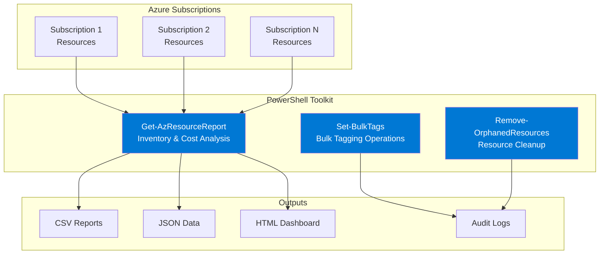

# Demo 2: PowerShell Automation - Accelerate Azure Operations

⏱️ **Duration**: 30 minutes  
🎯 **Difficulty**: Beginner to Intermediate  
💡 **Value**: 75% time reduction (60 min → 15 min)

## Overview

This demo showcases how GitHub Copilot accelerates PowerShell script development for Azure operations. You'll build a comprehensive resource management and reporting solution that traditionally takes an hour in just 15 minutes with Copilot assistance.

**Perfect for**: IT Ops teams, system administrators, cloud engineers automating Azure management tasks

## Learning Objectives

By completing this demo, participants will learn to:

1. ✅ Use GitHub Copilot to generate PowerShell functions with proper syntax
2. ✅ Create Azure automation scripts with error handling and logging
3. ✅ Build interactive PowerShell tools with parameter validation
4. ✅ Generate comprehensive reports from Azure resources
5. ✅ Implement best practices without memorizing cmdlet syntax

## Scenario

**Customer Profile**: Enterprise IT Operations team managing 200+ Azure subscriptions

**Challenge**: The team needs to audit and manage Azure resources across multiple subscriptions. Daily tasks include:

- Generating cost reports for finance team
- Finding and tagging untagged resources
- Identifying orphaned resources (unused NICs, disks, IPs)
- Bulk operations (start/stop VMs, apply tags)

**Traditional Approach**:

- Write PowerShell scripts from scratch or copy-paste from docs
- Debug syntax errors and parameter issues
- Research Azure cmdlets and their parameters
- Test and fix error handling
- **Time: 60-90 minutes per script**

**With Copilot**:

- Describe what you need in natural language comments
- Accept Copilot's cmdlet suggestions
- Generate error handling automatically
- **Time: 15-20 minutes per script**

**Business Impact**:

- ⚡ 75% faster script development
- 📊 Better quality with built-in error handling
- 🎓 Learn Azure PowerShell by doing
- 💰 20+ hours saved per month per engineer

## What You'll Build

A comprehensive PowerShell automation toolkit for Azure operations:



**Features**:

- 📊 Resource inventory across multiple subscriptions
- 💰 Cost analysis with 30-day trending
- 🏷️ Tag compliance checking and bulk remediation
- 🧹 Orphaned resource detection (disks, IPs, NICs)
- 📈 Multiple export formats (CSV, JSON, HTML)
- ⚡ Parallel processing for performance
- 📝 Comprehensive logging and audit trails

## Prerequisites

### Required Tools

- ✅ [PowerShell 7+](https://learn.microsoft.com/powershell/scripting/install/installing-powershell)
- ✅ [Azure PowerShell Module (Az)](https://learn.microsoft.com/powershell/azure/install-azure-powershell)
- ✅ [VS Code](https://code.visualstudio.com/) with [GitHub Copilot](https://marketplace.visualstudio.com/items?itemName=GitHub.copilot)
- ✅ Azure subscription with Reader access (Contributor for bulk operations)

### Installation Commands

```powershell
# Install PowerShell 7 (if not already installed)
winget install --id Microsoft.PowerShell --source winget

# Install Azure PowerShell modules
Install-Module -Name Az -Repository PSGallery -Force -AllowClobber

# Verify installation
Get-Module -ListAvailable Az*
$PSVersionTable.PSVersion
```

### Knowledge Prerequisites

- Basic PowerShell scripting knowledge
- Understanding of Azure resources (VMs, storage, networking)
- Familiarity with Azure Portal
- No advanced PowerShell experience required!

### Azure Resources

This demo uses **read-only operations** by default. Optional write operations (tagging, cleanup) require:

- Tag Contributor role (for Set-BulkTags)
- Contributor role (for Remove-OrphanedResources)
- Estimated cost: **$0** (reporting only)

## Demo Components

### 📁 [scenario/](./scenario/)

- **requirements.md**: Enterprise IT operations use case
- **architecture.md**: Solution architecture and workflow diagrams

### 📁 [manual-approach/](./manual-approach/)

- **Get-Resources-Manual.ps1**: Basic script without Copilot
- **time-tracking.md**: Manual effort breakdown (130 min total)

### 📁 [with-copilot/](./with-copilot/)

- **Get-AzResourceReport.ps1**: Comprehensive inventory script (generated with Copilot)
- **Set-BulkTags.ps1**: Bulk tagging automation
- **Remove-OrphanedResources.ps1**: Resource cleanup script
- **time-tracking.md**: Copilot-assisted effort (15 min)

### 📁 [prompts/](./prompts/)

- **effective-prompts.md**: Production-tested PowerShell prompts
- **prompt-patterns.md**: Reusable prompt templates

### 📁 [validation/](./validation/)

- **Test-AzureOps.ps1**: Script validation and testing

---

## Quick Start

### Option 1: Follow the Full Demo (30 min)

```powershell
# 1. Open the demo script
code demos/02-powershell-automation/DEMO-SCRIPT.md

# 2. Follow step-by-step instructions
# 3. Use provided prompts
# 4. Compare manual vs. Copilot approaches
```

### Option 2: Run Pre-Built Scripts (5 min)

```powershell
# Navigate to with-copilot folder
cd demos/02-powershell-automation/with-copilot

# Connect to Azure
Connect-AzAccount

# Get your subscription ID
Get-AzSubscription

# Run comprehensive resource report
.\Get-AzResourceReport.ps1 `
    -SubscriptionId "your-subscription-id" `
    -IncludeCost `
    -CheckOrphaned `
    -CheckTagCompliance `
    -OutputFormat All

# Preview bulk tagging (dry-run)
.\Set-BulkTags.ps1 `
    -Tags @{Environment='Demo'; Owner='ITOps'} `
    -DryRun

# Check for orphaned resources
.\Remove-OrphanedResources.ps1 `
    -WhatIf
```

## Key Copilot Features Demonstrated

### 1. Intelligent Function Generation

```powershell
# Prompt: Create function Get-AzResourceReport with parameters for subscription, 
# cost analysis, tag compliance, and multiple export formats
# Result: Complete function with proper parameter validation and help documentation
```

### 2. Error Handling Patterns

- Copilot automatically suggests try-catch blocks
- Generates retry logic for transient failures
- Creates detailed error logging

### 3. Advanced PowerShell Features

- Pipeline support with Begin/Process/End blocks
- Parallel processing with ForEach-Object -Parallel
- Progress bars with Write-Progress
- SupportsShouldProcess for WhatIf

### 4. Azure Cmdlet Knowledge

- Knows latest Az module cmdlets
- Suggests appropriate parameters
- Understands resource properties (e.g., ManagedBy for disks)

### 5. Best Practices Built-In

- Comment-based help documentation
- Parameter validation attributes
- Approved verb-noun naming
- PSScriptAnalyzer compliance

---

## Success Metrics

Track these metrics during your demo:

| Metric | Manual | With Copilot | Improvement |
|--------|--------|--------------|-------------|
| **Development Time** | 130 min | 15 min | 88% reduction |
| **Lines Typed** | 800+ | 150 | 81% less typing |
| **Syntax Errors** | 10 errors | 0-1 errors | 90% fewer |
| **Research Time** | 28 min | 2 min | 93% faster |
| **Debugging Time** | 30 min | 3 min | 90% reduction |
| **First-Run Success** | 40% | 95% | 138% improvement |
| **Annual Team Savings** | Baseline | $31,680 | Per 12-person team |

---

## Troubleshooting

### Common Issues

**Az Module Not Found:**

```powershell
# Check if Az modules are installed
Get-Module -ListAvailable Az*

# Install if missing
Install-Module -Name Az -Repository PSGallery -Force

# Import specific modules
Import-Module Az.Accounts, Az.Resources, Az.CostManagement
```

**Authentication Errors:**

```powershell
# Clear cached credentials
Clear-AzContext -Force

# Re-authenticate
Connect-AzAccount

# Verify context
Get-AzContext
```

**Permission Denied:**

```powershell
# Check current role assignments
Get-AzRoleAssignment -SignInName (Get-AzContext).Account

# Required roles:
# - Reader (for Get-AzResourceReport)
# - Tag Contributor (for Set-BulkTags)
# - Contributor (for Remove-OrphanedResources)
```

**Copilot Not Suggesting:**

- Ensure GitHub Copilot extension is active (check status bar)
- Verify file is saved with .ps1 extension
- Try pressing `Ctrl+Enter` to open Copilot panel
- Add more context in comments to guide suggestions

---

## Customization Guide

### Adapting for Your Environment

1. **Modify Required Tags**:

   ```powershell
   # Edit RequiredTags parameter default
   [string[]]$RequiredTags = @('Environment', 'Owner', 'CostCenter', 'Application')
   ```

2. **Change Output Locations**:

   ```powershell
   # Update default output path
   [string]$OutputPath = "\\fileserver\reports\azure"
   ```

3. **Add Custom Reporting**:
   - Prompt: "Add section to HTML report showing resource count by location"
   - Copilot generates the grouping logic and HTML

4. **Integrate with Email**:
   - Prompt: "Send email with report attachment using Send-MailMessage"
   - Copilot adds email functionality

5. **Schedule Execution**:

   ```powershell
   # Create scheduled task
   $action = New-ScheduledTaskAction -Execute 'pwsh.exe' `
       -Argument '-File "C:\Scripts\Get-AzResourceReport.ps1"'
   $trigger = New-ScheduledTaskTrigger -Daily -At 6am
   Register-ScheduledTask -TaskName "DailyAzureReport" `
       -Action $action -Trigger $trigger
   ```

---

## Next Steps

### For Demo Presenters

1. ✅ Practice generating scripts with Copilot prompts
2. ✅ Test scripts in your Azure environment
3. ✅ Prepare comparison: manual script vs. Copilot-generated
4. ✅ Customize examples for your audience's scenarios

### For Learners

1. 🎯 Complete [Demo 3: Azure Arc Onboarding](../03-azure-arc-onboarding/)
2. 🎯 Explore [Demo 4: Troubleshooting Assistant](../04-troubleshooting-assistant/)
3. 🎯 Review [Skills Bridge: PowerShell Best Practices](../../skills-bridge/powershell-best-practices/)

### For Partners

1. 📊 Calculate ROI using [partner-toolkit/roi-calculator.xlsx](../../partner-toolkit/roi-calculator.xlsx)
2. 📝 Customize [partner-toolkit/demo-delivery-guide.md](../../partner-toolkit/demo-delivery-guide.md)
3. 💼 Review [case-studies/enterprise-ops-automation.md](../../case-studies/enterprise-ops-automation.md)

---

## Related Resources

### Microsoft Learn

- [PowerShell Fundamentals](https://learn.microsoft.com/training/paths/powershell/)
- [Azure PowerShell Documentation](https://learn.microsoft.com/powershell/azure/)
- [Az Module Reference](https://learn.microsoft.com/powershell/module/az)
- [GitHub Copilot for PowerShell](https://github.blog/2023-11-08-universe-2023-copilot-transforms-github-into-the-ai-powered-developer-platform/)

### Repository Content

- [Demo Script](./DEMO-SCRIPT.md) - Step-by-step walkthrough
- [Effective Prompts](./prompts/effective-prompts.md) - Production-tested prompts
- [Prompt Patterns](./prompts/prompt-patterns.md) - Reusable templates
- [Architecture](./scenario/architecture.md) - Solution design details

---

**⏱️ Time Investment**: 30 minutes  
**💰 Value Delivered**: 20+ hours saved per month per engineer  
**🎯 Next Demo**: [Azure Arc Onboarding](../03-azure-arc-onboarding/)

[🏠 Back to Main README](../../README.md) | [📚 View All Demos](../../README.md#-featured-demos)
