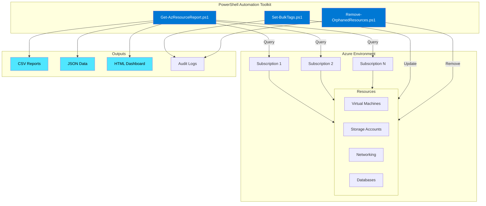
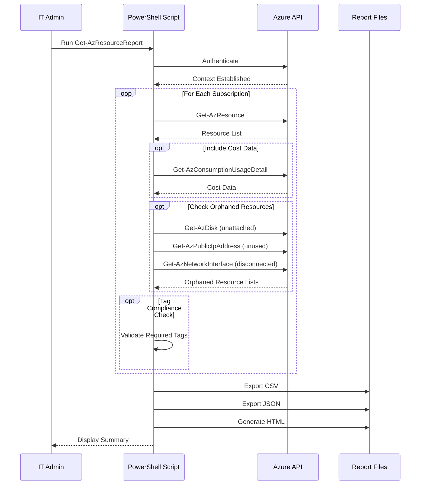

# Demo 02: PowerShell Automation Architecture

## Overview

This document outlines the target architecture and workflow for the PowerShell automation demo, which focuses on Azure resource management, reporting, and compliance automation.

---

## Solution Architecture



---

## Workflow Diagram



---

## Component Architecture

### 1. Get-AzResourceReport.ps1

**Purpose**: Comprehensive resource inventory and reporting

**Capabilities**:

- Multi-subscription support
- Resource inventory with tags
- Cost analysis (last 30 days)
- Orphaned resource detection
- Tag compliance checking
- Multiple export formats (CSV, JSON, HTML)

**Data Flow**:

```
Azure Subscriptions → Authentication → Resource Query → 
Data Processing → Compliance Checks → Report Generation → 
File Export + Console Summary
```

**Key Features**:

- Parallel subscription processing
- Progress indicators for long operations
- Error handling with detailed logging
- Configurable output formats
- Cost estimation for orphaned resources

---

### 2. Set-BulkTags.ps1

**Purpose**: Apply tags to multiple resources efficiently

**Capabilities**:

- Filter by resource group, type, or existing tags
- Merge or replace tag modes
- Dry-run preview before applying
- Parallel processing with throttling
- Detailed change logging

**Data Flow**:

```
Filter Criteria → Resource Discovery → 
Tag Validation → WhatIf Preview → 
User Confirmation → Parallel Tag Application → 
Change Logging + Summary Report
```

**Key Features**:

- SupportsShouldProcess for WhatIf
- Configurable parallelism (throttle limit)
- Rollback on error
- Detailed change tracking

---

### 3. Remove-OrphanedResources.ps1

**Purpose**: Identify and clean up unused Azure resources

**Capabilities**:

- Detect unattached managed disks
- Find unused public IP addresses
- Identify disconnected network interfaces
- Locate empty resource groups
- Calculate cost savings

**Data Flow**:

```
Resource Discovery → Orphan Detection → 
Cost Estimation → User Confirmation → 
Resource Deletion → Audit Log → 
Savings Report
```

**Key Features**:

- Multiple safety confirmations
- Cost impact analysis
- Optional snapshot backup before deletion
- Comprehensive audit trail

---

## Automation Scenarios

### Scenario 1: Daily Resource Inventory

```powershell
# Scheduled task runs daily at 6 AM
Get-AzResourceReport.ps1 `
    -SubscriptionId @("sub-1", "sub-2", "sub-3") `
    -IncludeCost `
    -CheckTagCompliance `
    -RequiredTags @('Environment','Owner','CostCenter') `
    -OutputFormat All `
    -OutputPath "\\fileserver\reports\azure"

# Email report to stakeholders
Send-MailMessage -To "ops-team@company.com" `
    -Subject "Daily Azure Resource Report" `
    -Attachments "ResourceInventory_*.html"
```

---

### Scenario 2: Monthly Compliance Audit

```powershell
# Run comprehensive compliance check
Get-AzResourceReport.ps1 `
    -CheckTagCompliance `
    -CheckOrphaned `
    -OutputFormat HTML

# Review orphaned resources
Remove-OrphanedResources.ps1 `
    -MinimumAgeInDays 30 `
    -WhatIf

# Apply compliance tags
Set-BulkTags.ps1 `
    -FilterTag @{Project='Migration'} `
    -Tags @{Reviewed='2025-11'; Compliant='Yes'} `
    -MergeMode
```

---

### Scenario 3: Project Cleanup

```powershell
# Find all resources for completed project
$projectResources = Get-AzResource -Tag @{Project='ProjectX'}

# Estimate cost savings
Remove-OrphanedResources.ps1 `
    -ResourceGroupPattern "rg-projectx-*" `
    -EstimateSavingsOnly

# Clean up with confirmation
Remove-OrphanedResources.ps1 `
    -ResourceGroupPattern "rg-projectx-*" `
    -BackupFirst
```

---

### Scenario 4: Cost Optimization

```powershell
# Weekly cost analysis
Get-AzResourceReport.ps1 `
    -IncludeCost `
    -OutputFormat JSON

# Identify top cost resources
$costs = Get-Content "ResourceCosts_*.json" | ConvertFrom-Json
$costs | Sort-Object TotalCost -Descending | Select-Object -First 10

# Tag high-cost resources for review
Set-BulkTags.ps1 `
    -FilterResourceIds $highCostResourceIds `
    -Tags @{CostReview='Required'} `
    -MergeMode
```

---

## Security & Compliance

### Required Permissions

| Script | Minimum Role | Additional Permissions |
|--------|-------------|----------------------|
| Get-AzResourceReport | Reader | Cost Management Reader (for cost data) |
| Set-BulkTags | Tag Contributor | None |
| Remove-OrphanedResources | Contributor | None (for resource deletion) |

### Audit Trail

All scripts log to:

- **Console**: Real-time progress and summary
- **Log Files**: Detailed timestamp logs with all operations
- **Change Logs**: Specific files for resource modifications

Log location: `$OutputPath\*_timestamp.log`

---

## Performance Considerations

### Get-AzResourceReport Performance

| Resources | Processing Time | Memory Usage |
|-----------|----------------|--------------|
| < 100 | 10-20 seconds | < 50 MB |
| 100-1000 | 30-60 seconds | 50-200 MB |
| 1000-5000 | 2-5 minutes | 200-500 MB |
| > 5000 | 5-15 minutes | 500 MB - 1 GB |

**Optimization Tips**:

- Use `-ResourceGroupName` to limit scope
- Disable cost data with `-IncludeCost:$false` if not needed
- Process subscriptions serially for resource-constrained systems

---

### Set-BulkTags Performance

**Parallel Processing**:

- Default throttle limit: 10 concurrent operations
- Recommended for > 50 resources
- Can adjust with `-MaxParallelJobs` parameter

**Serial Processing**:

- Best for < 50 resources
- More predictable progress tracking
- Lower memory footprint

---

## Integration Points

### Azure DevOps Pipelines

```yaml
- task: AzurePowerShell@5
  inputs:
    azureSubscription: 'ServiceConnection'
    ScriptType: 'FilePath'
    ScriptPath: 'Get-AzResourceReport.ps1'
    ScriptArguments: '-IncludeCost -OutputFormat JSON'
    azurePowerShellVersion: 'LatestVersion'
```

---

### Azure Automation Runbooks

```powershell
# Import as Azure Automation Runbook
Import-AzAutomationRunbook -ResourceGroupName "rg-automation" `
    -AutomationAccountName "aa-ops" `
    -Path "Get-AzResourceReport.ps1" `
    -Type PowerShell `
    -Name "DailyResourceReport"

# Schedule execution
New-AzAutomationSchedule -ResourceGroupName "rg-automation" `
    -AutomationAccountName "aa-ops" `
    -Name "DailyAt6AM" `
    -StartTime (Get-Date).AddDays(1).Date.AddHours(6) `
    -DayInterval 1
```

---

### Log Analytics Integration

```powershell
# Parse JSON output and send to Log Analytics
$report = Get-Content "ResourceInventory_*.json" | ConvertFrom-Json

# Send to custom table
Invoke-AzOperationalInsightsDataCollection `
    -WorkspaceId $workspaceId `
    -SharedKey $sharedKey `
    -LogType "AzureResourceInventory" `
    -Body ($report | ConvertTo-Json -Depth 10)
```

---

## Error Handling Strategy

### Retry Logic

All scripts implement:

- **Transient error detection**: 429 (Too Many Requests), 503 (Service Unavailable)
- **Exponential backoff**: 2s, 4s, 8s retry delays
- **Maximum retries**: 3 attempts before failing

### Error Recovery

- **Continue on error**: Process remaining items after failure
- **Error collection**: Track all errors for end summary
- **Detailed logging**: Full exception details in log files

---

## Monitoring & Alerting

### Key Metrics to Track

1. **Execution Time**: Alert if > expected duration
2. **Error Rate**: Alert if > 5% of operations fail
3. **Orphaned Resource Count**: Track trend over time
4. **Tag Compliance**: Alert on declining compliance percentage
5. **Cost Trends**: Alert on significant changes (> 20%)

### Sample Monitoring Dashboard

```
┌─────────────────────────────────────────────┐
│ Azure Resource Health Dashboard             │
├─────────────────────────────────────────────┤
│ Total Resources: 1,247                      │
│ Tag Compliance: 87% ⬆️                      │
│ Orphaned Resources: 23 ⬇️                   │
│ Monthly Cost: $45,231 ⬇️ (-8%)             │
│                                             │
│ Last Report: 2025-11-18 06:00 ✅           │
│ Next Report: 2025-11-19 06:00              │
└─────────────────────────────────────────────┘
```

---

## Best Practices

1. **Always use WhatIf** before bulk operations
2. **Schedule during off-hours** for resource-intensive reports
3. **Archive reports** for historical compliance tracking
4. **Test in non-prod** before production rollout
5. **Version control** all scripts in Git
6. **Document** custom parameters and thresholds
7. **Monitor** script execution and alert on failures
8. **Review** orphaned resources before deletion
9. **Back up** before destructive operations
10. **Audit** all changes with detailed logging

---

## Next Steps

### Implementation Phases

**Phase 1: Discovery (Week 1)**

- Deploy Get-AzResourceReport.ps1
- Run initial inventory across all subscriptions
- Identify tag compliance gaps

**Phase 2: Standardization (Week 2-3)**

- Define tagging standards
- Use Set-BulkTags.ps1 for bulk remediation
- Implement automated tagging for new resources

**Phase 3: Optimization (Week 4)**

- Identify orphaned resources
- Calculate cost savings opportunities
- Execute cleanup with Remove-OrphanedResources.ps1

**Phase 4: Automation (Week 5+)**

- Schedule daily/weekly reports
- Set up alerting for compliance drift
- Integrate with ITSM/monitoring tools

---

## Related Documentation

- [Demo README](../README.md)
- [Effective Prompts](../prompts/effective-prompts.md)
- [Prompt Patterns](../prompts/prompt-patterns.md)
- [Requirements](./requirements.md)

---

**Document Version**: 1.0  
**Last Updated**: 2025-11-18  
**Owner**: IT Operations Team
