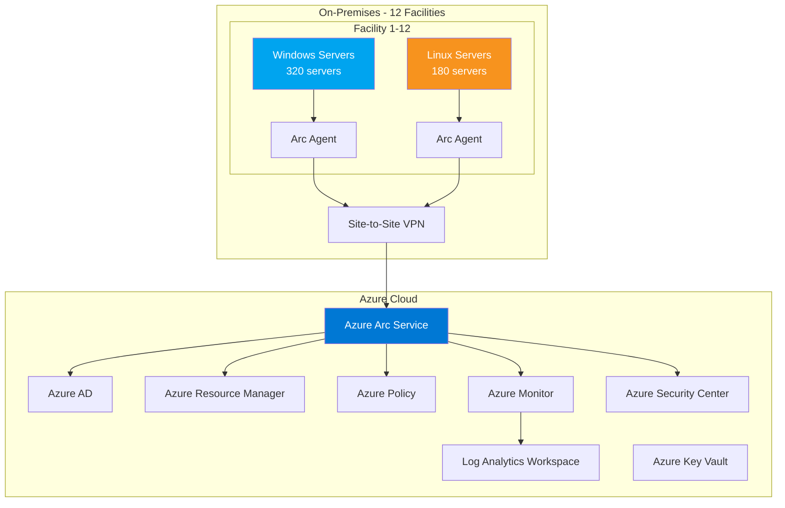
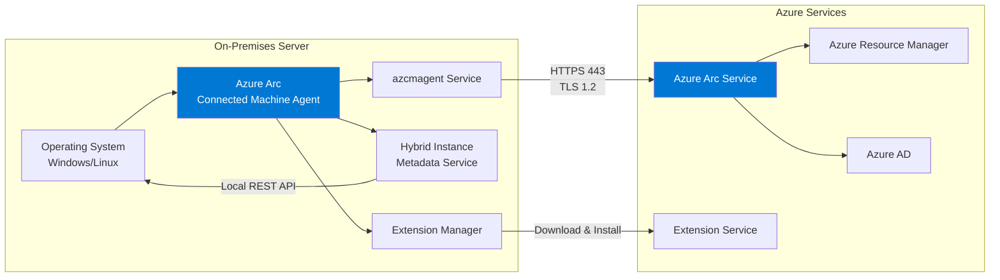
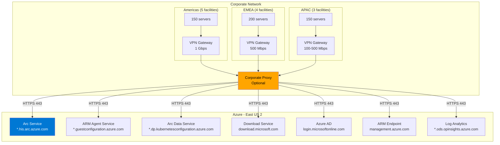
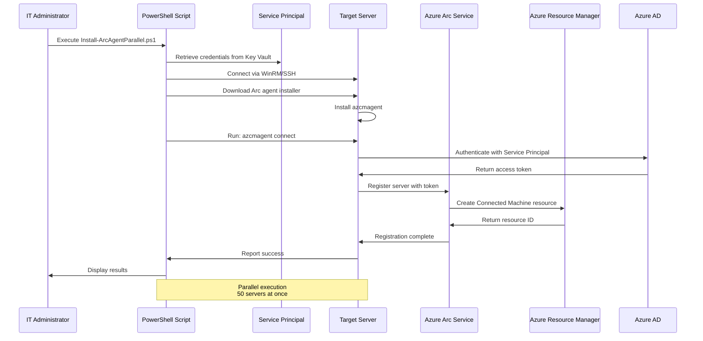
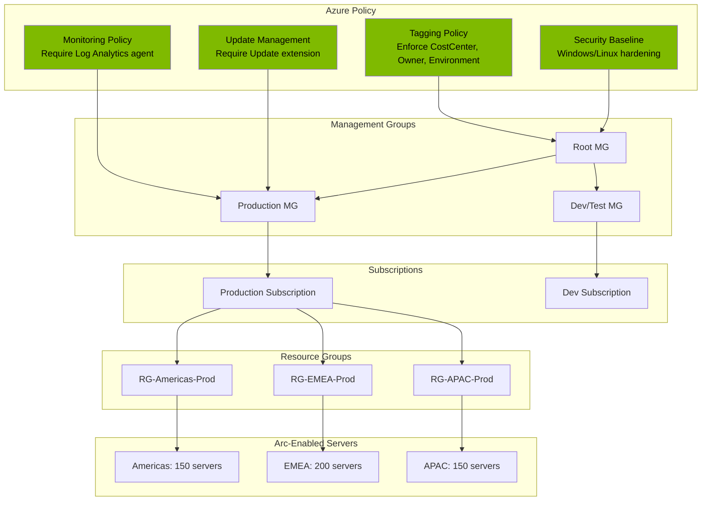
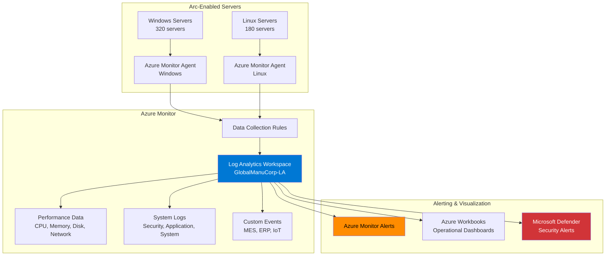
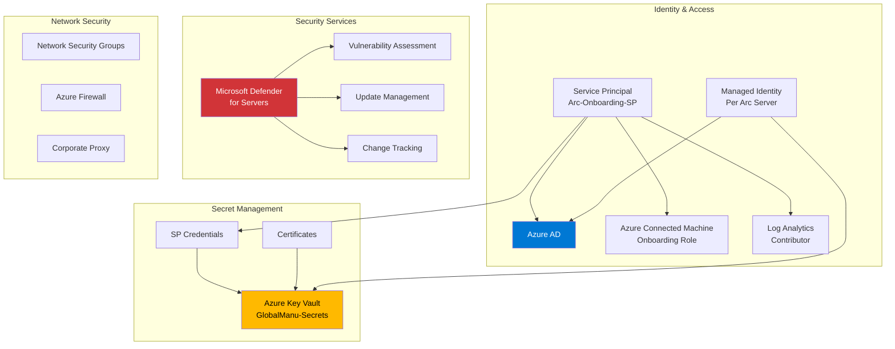
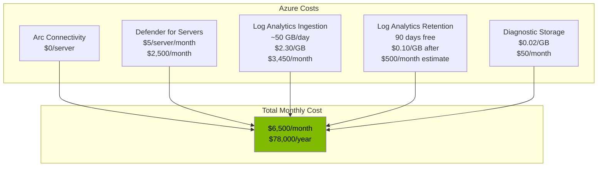

# Azure Arc Architecture

## Solution Architecture Overview

This document describes the Azure Arc hybrid cloud architecture for GlobalManu Corp's 500-server onboarding project.

---

## High-Level Architecture



---

## Azure Arc Agent Architecture



**Key Components**:

- **azcmagent**: Core service managing heartbeat, authentication, and extension management
- **Hybrid Instance Metadata Service (HIMDS)**: Local REST API endpoint (169.254.169.254) providing Azure metadata
- **Extension Manager**: Handles installation and lifecycle of Arc VM extensions
- **Azure Arc Service**: Cloud service managing Arc-enabled servers as ARM resources

---

## Network Architecture



**Required Network Endpoints**:

| Service | Endpoint | Port | Purpose |
|---------|----------|------|---------|
| Azure Arc | `*.his.arc.azure.com` | 443 | Agent communication |
| Guest Configuration | `*.guestconfiguration.azure.com` | 443 | Policy enforcement |
| Kubernetes Configuration | `*.dp.kubernetesconfiguration.azure.com` | 443 | Extension management |
| Azure AD | `login.microsoftonline.com` | 443 | Authentication |
| ARM | `management.azure.com` | 443 | Resource management |
| Log Analytics | `*.ods.opinsights.azure.com` | 443 | Monitoring data |
| Download | `download.microsoft.com` | 443 | Agent updates |

**Network Requirements**:
- Outbound HTTPS (443) connectivity from servers to Azure endpoints
- Proxy support for environments with restricted internet access
- Minimum bandwidth: 100 Kbps per server (1.5 GB/month per server)
- VPN/ExpressRoute for hybrid connectivity

---

## Deployment Architecture



**Deployment Flow**:

1. **Authentication**: Service Principal retrieves access token from Azure AD
2. **Download**: Arc agent installer downloaded from Microsoft CDN
3. **Installation**: Agent installed as system service (Windows) or daemon (Linux)
4. **Connection**: `azcmagent connect` registers server with Azure Arc
5. **Resource Creation**: Server appears as ARM resource in Azure Portal
6. **Extension Deployment**: Monitoring, policy, and security extensions installed
7. **Validation**: Health check confirms connectivity and extension status

---

## Governance Architecture



**Policy Inheritance**:

- **Root Management Group**: Organization-wide policies (tagging, security baselines)
- **Production Management Group**: Production-specific policies (monitoring, updates)
- **Subscriptions**: Subscription-level policies and RBAC assignments
- **Resource Groups**: Regional groupings for Arc-enabled servers

**Azure Policy Definitions**:

| Policy | Scope | Effect | Purpose |
|--------|-------|--------|---------|
| Require tags | Root MG | Deny | Enforce CostCenter, Owner, Environment, Application tags |
| Windows security baseline | Root MG | DeployIfNotExists | Apply Windows Server hardening |
| Linux security baseline | Root MG | DeployIfNotExists | Apply Linux hardening |
| Configure Log Analytics | Prod MG | DeployIfNotExists | Install monitoring agent |
| Enable Update Management | Prod MG | DeployIfNotExists | Install update extension |
| Guest Configuration | Root MG | AuditIfNotExists | Check configuration compliance |

---

## Monitoring Architecture



**Data Collection**:

**Performance Metrics** (collected every 60 seconds):
- CPU utilization (total, per-core)
- Memory (available, used, percentage)
- Disk I/O (read/write bytes, IOPS)
- Network (bytes sent/received, errors)

**Log Collection**:
- **Windows**: Security, Application, System event logs
- **Linux**: Syslog (auth, daemon, kern, user)
- **Custom**: Application-specific logs (MES, ERP, IoT collectors)

**Data Collection Rules**:
- **DCR-Production-Windows**: Windows Server performance + Security/System logs
- **DCR-Production-Linux**: Linux performance + Syslog
- **DCR-Custom-Applications**: Application-specific log files

**Alerting Examples**:
- High CPU: > 90% for 10 minutes
- Low memory: < 10% available for 5 minutes
- Disk space: < 10% free
- Arc agent disconnected: No heartbeat for 15 minutes
- Security: Failed logon attempts > 10 in 5 minutes

---

## Security Architecture



**Security Components**:

**Identity & Access Management**:
- **Service Principal**: Least-privilege SP for Arc onboarding
  - Role: Azure Connected Machine Onboarding (subscription scope)
  - Role: Log Analytics Contributor (workspace scope)
- **Managed Identity**: Each Arc server gets system-assigned managed identity
- **RBAC**: Role assignments at subscription, resource group, resource levels

**Secret Management**:
- **Azure Key Vault**: Centralized secret storage
  - Service Principal credentials (expires every 90 days)
  - Certificates for TLS mutual authentication
  - Access policies restrict retrieval to authorized identities

**Security Services**:
- **Microsoft Defender for Servers**: 
  - Vulnerability assessment scanning
  - Just-in-time VM access
  - File integrity monitoring
  - Adaptive application controls
- **Update Management**: Automated patching compliance
- **Change Tracking**: Configuration change detection

**Network Security**:
- All communication over TLS 1.2+
- Outbound-only connectivity (no inbound ports opened)
- Corporate proxy for internet access control
- NSGs on Azure VNet subnets (future ExpressRoute)

---

## Disaster Recovery & High Availability

```mermaid
graph LR
    subgraph "Regional Architecture"
        PRIMARY[Primary Region<br/>East US 2<br/>Log Analytics<br/>Azure Arc Service]
        SECONDARY[Secondary Region<br/>West US 2<br/>Log Analytics (DR)<br/>Azure Arc Service]
    end
    
    subgraph "On-Premises"
        SERVERS[500 Arc-Enabled<br/>Servers]
    end
    
    SERVERS -->|Primary Connection| PRIMARY
    SERVERS -.->|Failover Connection| SECONDARY
    
    PRIMARY -.->|Geo-Replication| SECONDARY
    
    style PRIMARY fill:#00a4ef,color:#fff
    style SECONDARY fill:#0078d4,color:#fff
```

**High Availability**:

- **Azure Arc Service**: Built-in 99.9% SLA, multi-region availability
- **Log Analytics Workspace**: Data replication within region
- **Agent Resilience**: 
  - Local buffering of telemetry (up to 24 hours)
  - Automatic reconnection after network outages
  - Retry logic with exponential backoff

**Disaster Recovery**:

- **Backup Log Analytics Workspace**: Geo-redundant workspace in secondary region
- **Policy Definitions**: Stored in ARM (automatically replicated)
- **Arc Agent Reinstall**: Scripts and documentation for rapid re-onboarding
- **RTO/RPO**: 
  - Agent reconnection: < 15 minutes
  - Full workspace failover: < 4 hours
  - Data loss: < 1 hour (buffered telemetry)

---

## Scalability Considerations

**Current Scale**:
- 500 servers across 12 facilities
- 320 Windows + 180 Linux
- 3 Azure subscriptions

**Future Scale Targets**:
- 2,000 servers (planned server expansion)
- 5 additional facilities (global growth)
- Multi-cloud (AWS/GCP hybrid in roadmap)

**Scaling Strategies**:

| Component | Current | Max Capacity | Scaling Method |
|-----------|---------|--------------|----------------|
| Arc Service | 500 servers | 5,000/subscription | Additional subscriptions |
| Log Analytics Workspace | 500 servers, ~50 GB/day | 2,000 GB/day | Data capping, multiple workspaces |
| Parallel Deployment | 50 concurrent | 200 concurrent | Increase PowerShell runspaces |
| Policy Assignments | 10 policies | 200 policies/scope | Management group hierarchy |
| Service Principal | 1 SP | 1 SP/subscription | Subscription separation |

---

## Cost Architecture



**Cost Breakdown**:

| Service | Unit Cost | Quantity | Monthly | Annual |
|---------|-----------|----------|---------|--------|
| Arc Connectivity | $0 | 500 servers | $0 | $0 |
| Defender for Servers | $5/server | 500 servers | $2,500 | $30,000 |
| Log Analytics Ingestion | $2.30/GB | 1,500 GB | $3,450 | $41,400 |
| Log Analytics Retention | $0.10/GB | 5,000 GB | $500 | $6,000 |
| Storage (Diagnostics) | $0.02/GB | 2,500 GB | $50 | $600 |
| **Total** | - | - | **$6,500** | **$78,000** |

**Cost Optimization**:
- Use data collection rules to filter unnecessary logs
- Set retention policies based on compliance requirements (31/90/365 days)
- Leverage commitment tiers for Log Analytics (save 15-30%)
- Right-size Defender coverage (exclude non-critical servers)
- Monitor with Azure Cost Management + Budgets

**ROI Comparison**:
- Azure costs: $78,000/year
- Operational savings: $300,000+/year
- **Net savings: $222,000+/year**

---

## Technology Stack

| Layer | Technology | Purpose |
|-------|-----------|---------|
| **Hybrid Connectivity** | Azure Arc Connected Machine Agent | Server onboarding to Azure |
| **Identity** | Azure AD, Service Principal, Managed Identity | Authentication and authorization |
| **Governance** | Azure Policy, Guest Configuration | Compliance and configuration management |
| **Monitoring** | Azure Monitor, Log Analytics, Azure Monitor Agent | Telemetry and observability |
| **Security** | Microsoft Defender for Servers, Update Management | Vulnerability and patch management |
| **Automation** | PowerShell 7.x, Azure CLI, Azure Automation | Deployment and operations |
| **Secret Management** | Azure Key Vault | Credential storage |
| **Networking** | Site-to-Site VPN, Corporate Proxy | Hybrid connectivity |

---

## Deployment Tooling

**Infrastructure as Code**:
- **PowerShell Scripts**: Agent deployment, policy configuration, monitoring setup
- **Azure Bicep** (future): Policy definitions, RBAC assignments, workspaces
- **ARM Templates** (legacy): Extension deployments

**Automation Platform**:
- **Local Execution**: PowerShell scripts run from jump box
- **Azure Automation** (future): Scheduled runs, runbook execution
- **GitHub Actions** (future): CI/CD for policy updates

**Version Control**:
- **GitHub Repository**: All scripts, documentation, IaC stored in Git
- **Branching Strategy**: Main (production), develop (testing), feature branches

---

## Integration Points

**Existing Systems**:
- **SCCM**: Phased decommissioning, coordinate with Arc Update Management
- **Ansible**: Continue for configuration management, integrate with Arc Guest Configuration
- **Monitoring Tools**: Migrate from Nagios/Zabbix to Azure Monitor over 6 months
- **ServiceNow**: ITSM integration via Azure Monitor alerts (webhook)

**Future Integrations**:
- **Azure Sentinel**: SIEM integration for security analytics
- **Azure Automation**: Runbook execution for remediation
- **Azure DevOps**: CI/CD pipelines for policy updates
- **Power BI**: Custom reporting dashboards

---

**Architecture Version**: 1.0  
**Last Updated**: November 2025  
**Owner**: Cloud Infrastructure Team
