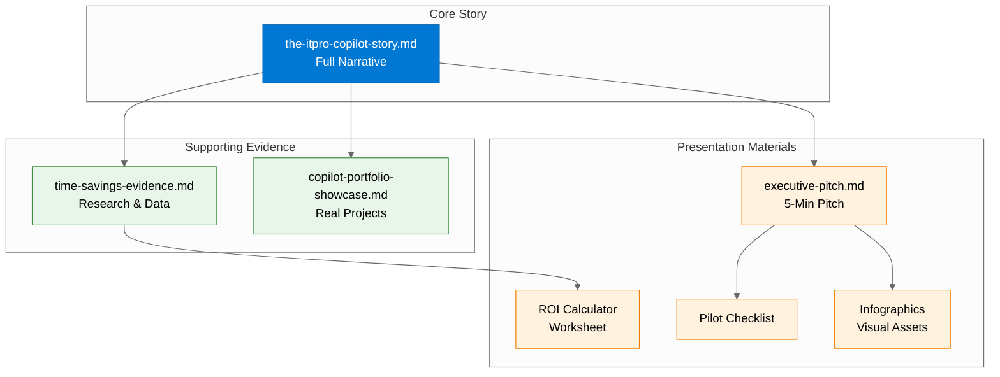

# Documentation Overview

> **A guide to the documentation in this folder and how to use it for different audiences.**


---

## 🚀 New Here? Start with the Complete Guide

**[Getting Started: Your Complete Journey](getting-started/README.md)** — A step-by-step guide from setup to mastery.

| Phase              | What You'll Do                               | Time      |
| ------------------ | -------------------------------------------- | --------- |
| **Setup**          | Clone repo, open Dev Container, verify tools | 15 min    |
| **First Scenario** | Complete S01 Bicep Baseline                  | 30 min    |
| **Explore**        | Try scenarios matching your role             | 2-4 hours |
| **Master**         | Five-Agent Workflow, Coding Agent            | Ongoing   |

---

## Document Index

| Document                                                       | Audience            | Purpose                                      | Duration       |
| -------------------------------------------------------------- | ------------------- | -------------------------------------------- | -------------- |
| [the-itpro-copilot-story.md](the-itpro-copilot-story.md)       | IT Pros, Partners   | Narrative story of the IT Pro transformation | 10-15 min read |
| [executive-pitch.md](executive-pitch.md)                       | C-level, Directors  | 5-minute pitch with key stats and ROI        | 5 min          |
| [copilot-portfolio-showcase.md](copilot-portfolio-showcase.md) | Technical audiences | Real projects built with Copilot             | 5-10 min read  |
| [time-savings-evidence.md](time-savings-evidence.md)           | Skeptics, Analysts  | Research-backed methodology and sources      | Reference      |
| [troubleshooting.md](troubleshooting.md)                       | Everyone            | Centralized troubleshooting guide            | Reference      |

---

## Choose Your Starting Point

### 🎯 "I want to understand the value proposition"

Start with **[the-itpro-copilot-story.md](the-itpro-copilot-story.md)**

A narrative journey through:

- The architect's frustration (the gap between vision and implementation)
- Real projects built by non-developers
- Character-based scenarios (Sarah, Marcus, Elena, James)
- Evidence-backed time savings
- The five-agent workflow
- Portfolio of proof

### 💼 "I need to pitch this to leadership"

Start with **[executive-pitch.md](executive-pitch.md)**

A structured 5-minute pitch with:

- Hook, problem, solution, proof, ask
- One-slide summary
- Q&A talking points
- ROI highlights

### 🔬 "I want proof this actually works"

Start with **[copilot-portfolio-showcase.md](copilot-portfolio-showcase.md)**

Real GitHub projects with:

- Project descriptions and links
- Before/after time comparisons
- Technologies used
- Business impact

### 📊 "I need to verify the numbers"

Start with **[time-savings-evidence.md](time-savings-evidence.md)**

Research methodology with:

- Academic sources (Stanford, MIT, Harvard/BCG)
- Industry studies (GitHub, Forrester, McKinsey)
- Calculation methods
- Assumptions and limitations

---

## Related Resources

### Presenter Toolkit

Located in `resources/presenter-toolkit/`:

| Resource                                                                                  | Description                    |
| ----------------------------------------------------------------------------------------- | ------------------------------ |
| [roi-calculator-worksheet.md](../resources/presenter-toolkit/roi-calculator-worksheet.md) | Calculate ROI for your team    |
| [pilot-success-checklist.md](../resources/presenter-toolkit/pilot-success-checklist.md)   | Plan and evaluate pilots       |
| [infographics/](../resources/presenter-toolkit/infographics/)                             | Python-generated visual assets |
| [demo-delivery-guide.md](../resources/presenter-toolkit/demo-delivery-guide.md)           | Demo structure and tips        |
| [objection-handling.md](../resources/presenter-toolkit/objection-handling.md)             | Common questions and answers   |

### Visual Assets

Generated infographics in `resources/presenter-toolkit/infographics/generated/`:

| Asset                              | Format        | Use Case         |
| ---------------------------------- | ------------- | ---------------- |
| `time-savings-infographic.png`     | PNG (300 DPI) | Print, posters   |
| `time-savings-infographic-web.png` | PNG (150 DPI) | Web, slides      |
| `before-after-poster.png`          | PNG (300 DPI) | Workshops, walls |
| `before-after-poster-web.png`      | PNG (150 DPI) | Presentations    |

Regenerate anytime:

```bash
cd resources/presenter-toolkit/infographics
python generate_infographic.py
python generate_before_after.py
```

---

## Document Relationships



---

## Subfolders

### `getting-started/`

| Document                                                 | Purpose                     |
| -------------------------------------------------------- | --------------------------- |
| [prerequisites.md](getting-started/prerequisites.md)     | Required tools and setup    |
| [model-selection.md](getting-started/model-selection.md) | Choosing the right AI model |

### `adr/`

Architectural Decision Records documenting key technical decisions:

| ADR                                                      | Decision                        |
| -------------------------------------------------------- | ------------------------------- |
| [adr-0001](adr/adr-0001-five-agent-workflow-adoption.md) | Five-agent workflow adoption    |
| [adr-0002](adr/adr-0002-azure-bastion-secure-access.md)  | Azure Bastion for secure access |

### `audit-checklists/`

Compliance and validation checklists:

| Checklist                                                                 | Purpose                       |
| ------------------------------------------------------------------------- | ----------------------------- |
| [infradb-audit-checklist.md](audit-checklists/infradb-audit-checklist.md) | Infrastructure database audit |

### `agent-improvements-archive/`

Historical documentation of agent development and improvements.

---

## Quick Links

| Need                    | Go To                                                                         |
| ----------------------- | ----------------------------------------------------------------------------- |
| **Start learning**      | [scenarios/](../scenarios/)                                                   |
| **See working code**    | [infra/bicep/contoso-patient-portal/](../infra/bicep/contoso-patient-portal/) |
| **Run a demo**          | [demos/30-MIN-DEMO-SCRIPT.md](../demos/30-MIN-DEMO-SCRIPT.md)                 |
| **Present to partners** | [resources/presenter-toolkit/](../resources/presenter-toolkit/)               |
| **Fix issues**          | [troubleshooting.md](troubleshooting.md)                                      |

---

## Document Info

|                |                                |
| -------------- | ------------------------------ |
| **Created**    | November 2025                  |
| **Purpose**    | Documentation navigation guide |
| **Maintainer** | Repository maintainers         |
