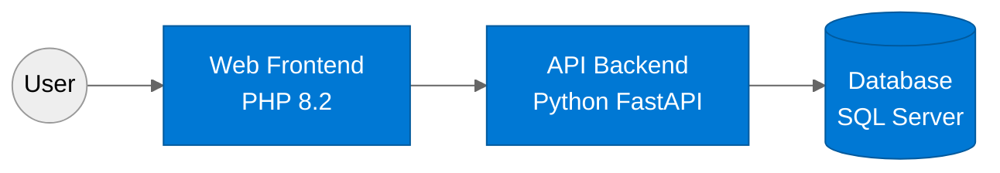
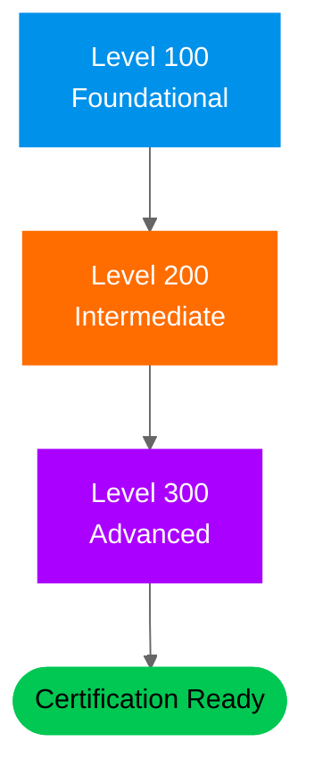
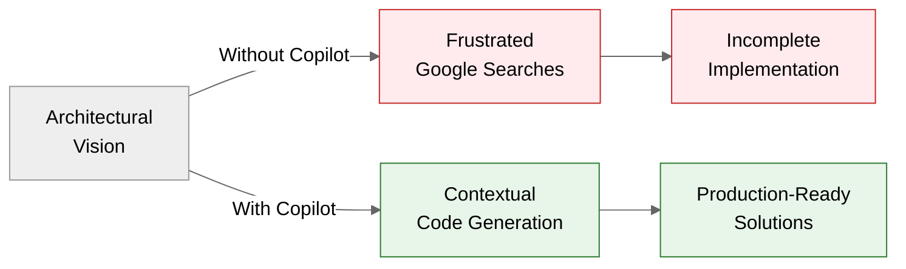

# What GitHub Copilot Enabled Me to Build

> **"I'm not a developer. My IaC skills were limited at best. Yet with GitHub Copilot,
> I built production-ready infrastructure, comprehensive workshops, and learning platforms
> that would have been impossible for me just a year ago."**

---

## The Reality: Non-Developer Building Real Solutions

This page showcases real GitHub projects that demonstrate what becomes possible when an IT Professional
with limited coding experience leverages GitHub Copilot as an efficiency multiplier.

**My background:**

- ✅ I am a Cloud Architect with deep Azure knowledge
- ❌ I am not a developer and have limited programming experience
- ❌ I had minimal Infrastructure-as-Code skills before GitHub Copilot
- ✅ I have a strong understanding of what needs to be built, but struggled with _how_

**The transformation:** GitHub Copilot bridged the gap between my architectural vision and actual implementation, enabling me to create production-quality code, documentation, and learning materials.

---

## 🎯 Projects Portfolio

### 1. SAIF: Secure AI Foundations

**What it is:** A 3-tier diagnostic application designed for hands-on learning about securing AI systems
across identity, network, application, and content safety domains.

**The Challenge:**

- Building a complete application with PHP frontend, Python FastAPI backend, and SQL Server database
- Creating intentionally vulnerable code for security training purposes
- Automating deployment with PowerShell scripts and Bicep templates
- Implementing Docker containerization for all components

**What Copilot Enabled:**

- Complete multi-tier application architecture (PHP + Python + SQL)
- Production-ready deployment automation scripts
- Bicep infrastructure-as-code templates
- Docker Compose configurations for local development
- Comprehensive documentation and security challenge guides

**Link to project:** [SAIF on GitHub](https://github.com/jonathan-vella/SAIF)

---

### 2. Azure PostgreSQL HA on AKS Workshop

**What it is:** A complete automation framework for deploying highly available PostgreSQL on Azure Kubernetes Service
with Premium v2 storage, CloudNativePG operator, and PgBouncer connection pooling.

**The Challenge:**

- Creating complex Kubernetes deployments with YAML manifests
- Building Bash automation scripts for 8-step deployments
- Configuring advanced PostgreSQL features (replication, pooling, backup)
- Setting up Azure Monitor, Prometheus, and Grafana dashboards

**What Copilot Enabled:**

- Full Azure CLI automation scripts following Microsoft reference implementations
- Kubernetes manifests for 3-node PostgreSQL clusters with automatic failover
- PgBouncer configuration handling 10,000+ concurrent connections
- Comprehensive failover testing scenarios with RPO=0 validation
- DevContainer with all tools pre-installed

**Link to project:** [Azure PostgreSQL HA on AKS Workshop](https://github.com/jonathan-vella/azure-postgresql-ha-aks-workshop)

**Key Metrics Achieved:**

| Metric                   | Value              |
| ------------------------ | ------------------ |
| Recovery Time Objective  | <10 seconds        |
| Recovery Point Objective | 0 (zero data loss) |
| Target Throughput        | 8,000-10,000 TPS   |
| Max Connections          | 30,000 concurrent  |

---

### 3. Java Application Modernization with uPortal

**What it is:** A reference implementation for modernizing legacy Java applications, demonstrating upgrade patterns
from Java 8/Spring Boot 1.x to modern versions.

**The Challenge:**

- Understanding complex Java/Spring Boot application structure
- Creating DevContainer configurations for Java development
- Documenting upgrade paths for enterprise Java applications
- Building testing strategies for legacy code migration

**What Copilot Enabled:**

- DevContainer setup optimized for Java development workflow
- Documentation of Java 8 → Java 21 migration patterns
- Spring Boot 1.x → 3.x upgrade guidance
- Build configuration modernization with Maven

**Link to project:** [GitHub Copilot Application Modernization](https://github.com/jonathan-vella/github-copilot-appmod-java-uportal)

**Learning Impact:** This project serves as a training resource for Microsoft Learn's
[Java Upgrade Documentation](https://learn.microsoft.com/en-us/java/upgrade/).

---

### 4. Microsoft Sovereign Cloud Brain Trek

**What it is:** A comprehensive learning journey for architects and solutions professionals covering
Sovereign Cloud, Azure Local, Azure Arc, and Edge AI technologies.

**The Challenge:**

- Creating structured learning content across 3 progressive levels (100/200/300)
- Developing 16 modules with quizzes and hands-on labs
- Building navigation and learning path visualizations
- Organizing complex technical content for multiple audiences

**What Copilot Enabled:**

- Complete curriculum structure with 16 modules
- Mermaid diagrams for learning journey visualization
- Consistent formatting across all documentation
- Quiz and assessment frameworks
- Content organization for sales and technical professionals

**Link to project:** [Microsoft Sovereign Cloud Brain Trek](https://github.com/jonathan-vella/microsoft-sovereign-cloud-brain-trek)

**Content Structure:**

---

### 5. Azure Arc-Enabled SQL Server

**What it is:** Scripts and utilities for managing SQL Server instances enabled by Azure Arc,
including licensing management, monitoring, and onboarding automation.

**The Challenge:**

- Creating PowerShell scripts for complex Azure Arc operations
- Building Bicep templates for hybrid infrastructure
- Developing step-by-step hands-on labs
- Documenting multiple feature areas (licensing, monitoring, assessment)

**What Copilot Enabled:**

- Complete PowerShell automation for Arc SQL Server management
- License type modification and activation scripts
- Monitoring configuration utilities
- Comprehensive 2-hour hands-on lab with Bicep templates
- Namespace migration scripts for resource updates
- FAQ and learning resource documentation

**Link to project:** [Azure Arc-Enabled SQL Server 1-Stop](https://github.com/jonathan-vella/azure-arc-enabled-sql-server)

**Repository Contents:**

| Category            | What Was Built                                             |
| ------------------- | ---------------------------------------------------------- |
| Resource Management | Namespace migration scripts                                |
| Licensing           | P-Core activation, PAYG installation, license modification |
| Monitoring          | Data collection, best practices assessment                 |
| Automation          | Server onboarding scripts                                  |
| Learning            | 2-hour hands-on lab, FAQ, presentation materials           |

---

## 💡 Key Insights from This Journey

### What Made the Difference

1. **Context is Everything:** Copilot understood my Azure architecture context and generated code that followed best practices I wouldn't have known to implement.

2. **Documentation at Scale:** Writing comprehensive docs for 5 projects would have taken months. With Copilot, I maintained consistent quality across thousands of lines of documentation.

3. **Learning While Building:** Every suggestion taught me something new. I went from not knowing Bash scripting to writing complex automation pipelines.

4. **Error Prevention:** Copilot helped me avoid common pitfalls in areas where I had no experience (Kubernetes, PostgreSQL configuration, Docker networking).

### The Multiplier Effect

### Time Investment vs. Output

| Project         | Traditional Estimate | With Copilot | What I Learned                |
| --------------- | -------------------- | ------------ | ----------------------------- |
| SAIF            | 3-4 months           | 3 weeks      | Python, PHP, Docker, Bicep    |
| PostgreSQL HA   | 2-3 months           | 2 weeks      | Kubernetes, Bash, PostgreSQL  |
| Java AppMod     | 1-2 months           | 1 week       | Java ecosystem, DevContainers |
| Sovereign Cloud | 2-3 months           | 3 weeks      | Curriculum design, Mermaid    |
| Arc SQL Server  | 2 months             | 2 weeks      | PowerShell automation         |

---

## 🚀 Start Your Own Journey

These projects prove that you don't need to be a developer to build real solutions.
You need:

- **Domain expertise** (yours comes from your field)
- **Clear vision** of what needs to be built
- **GitHub Copilot** to bridge the implementation gap
- **Willingness to learn** as you build

**Ready to see GitHub Copilot in action for IT Pros?**

📖 **[Return to main documentation](../README.md)** | 📚 **[Explore the scenarios](../scenarios/)**

---

_These projects are open source and available for learning and reference.
Feel free to explore, fork, and adapt them to your needs._
