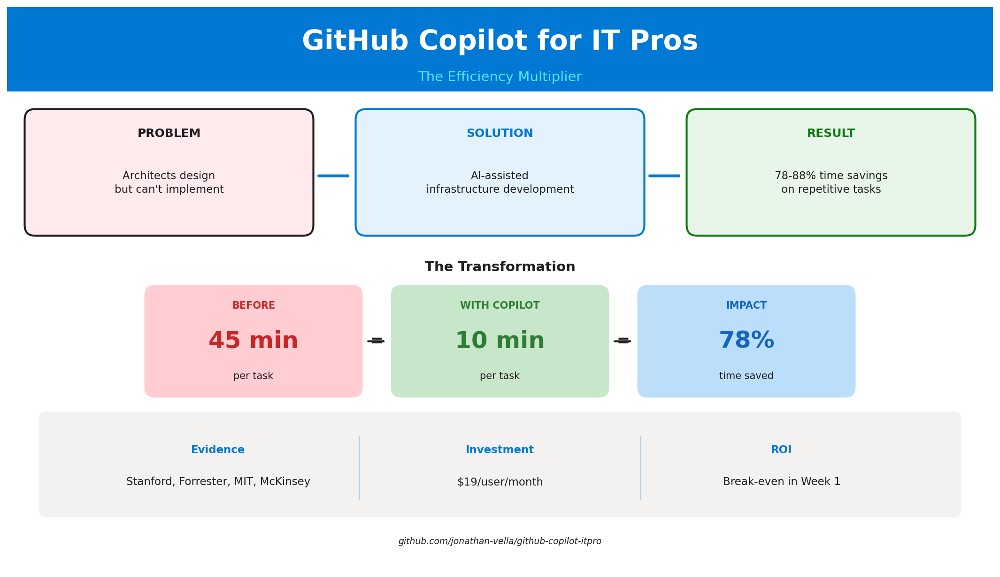

# GitHub Copilot for IT Pros: Executive Pitch

> **Duration:** 5 minutes | **Audience:** C-level, IT Directors, Partner Leadership

---

## The Hook (30 seconds)

**"What if your Cloud Architects could implement their own designs—in hours instead of weeks?"**

Today, there's a hidden bottleneck in every IT organization. Your most experienced architects
spend 80% of their time on repetitive tasks: writing templates, searching documentation,
debugging syntax errors. Only 10% goes to actual architecture decisions.

**GitHub Copilot flips that ratio.**

---

## The Problem (1 minute)

### The Architect's Paradox

Your Cloud Architects know _exactly_ what needs to be built. They understand security,
compliance, performance, and cost optimization better than anyone.

**But they can't build it themselves.**

They hand off designs to development teams. They wait weeks for implementation. They debug
misunderstandings that cost more time than the original task.

**The result:**

| Reality                           | Impact           |
| --------------------------------- | ---------------- |
| 2-week infrastructure deployments | Delayed projects |
| Outdated documentation            | Knowledge silos  |
| Manual compliance checks          | Audit failures   |
| Reactive troubleshooting          | Extended outages |

---

## The Solution (1 minute)

### GitHub Copilot: The Efficiency Multiplier

GitHub Copilot isn't about replacing your IT Pros. It's about **amplifying their expertise**.

**What changes:**

- **Infrastructure code**: 45 min → 10 min (78% faster)
- **Automation scripts**: 60 min → 15 min (75% faster)
- **Troubleshooting**: 30 min → 5 min (83% faster)
- **Documentation**: 120 min → 20 min (83% faster)

**The architect who designs systems can now implement them.** No handoffs. No waiting.
No lost-in-translation errors.

---

## The Proof (1.5 minutes)

### Real Projects. Real Results.

These projects were built by a Cloud Architect with **no development background**:

| Project                        | What It Is                       | Traditional Time | With Copilot |
| ------------------------------ | -------------------------------- | ---------------- | ------------ |
| **SAIF**                       | 3-tier security training app     | 3-4 months       | 3 weeks      |
| **PostgreSQL HA Workshop**     | Production Kubernetes automation | 2-3 months       | 2 weeks      |
| **Sovereign Cloud Curriculum** | 16-module learning platform      | 2-3 months       | 3 weeks      |

**Combined savings: 10-14 months reduced to 11 weeks.**

These aren't prototypes. They're in production. They're used in Microsoft Learn documentation.
They're training enterprise teams.

---

## The Evidence (30 seconds)

### Peer-Reviewed Research

| Source            | Finding                            |
| ----------------- | ---------------------------------- |
| **Stanford HAI**  | 60-70% faster problem-solving      |
| **Forrester TEI** | 88% reduction in repetitive tasks  |
| **McKinsey**      | 85-95% deployment automation gains |
| **MIT Sloan**     | 80% documentation time saved       |

This isn't vendor marketing. This is independent research from leading institutions.

---

## The Ask (30 seconds)

### Start Small. Prove Value. Scale.

**Recommended approach:**

1. **Pilot** (4 weeks): 3-5 IT Pros on real infrastructure projects
2. **Measure**: Track time savings on specific tasks
3. **Scale**: Roll out based on proven ROI

**Investment:** GitHub Copilot Business license ($19/user/month)

**Expected return:** 10-20+ hours saved per IT Pro per week

**Break-even:** First week of use

---

## One Slide Summary

---

## Appendix: Talking Points for Q&A

### "What about security?"

Copilot doesn't access your production systems. It assists with code generation in the IDE.
All code is reviewed by your team before deployment. Our agents are configured with Azure
security best practices by default.

### "How is this different from ChatGPT?"

Copilot is integrated directly into VS Code and understands your codebase context. It's not
a chatbot—it's a pair programmer that sees your files, understands your patterns, and
generates contextually relevant code.

### "What's the learning curve?"

Minimal. The Dev Container provides pre-configured environments. Most IT Pros are productive
within 1-2 days. The time invested pays back within the first week.

### "Do we need to change our processes?"

No. Copilot fits into existing workflows. Same tools, same review processes, same deployment
pipelines. Just faster execution.

---

## Document Info

|                |                                |
| -------------- | ------------------------------ |
| **Created**    | November 2025                  |
| **Duration**   | 5 minutes                      |
| **Audience**   | Executive / Partner Leadership |
| **Maintainer** | Repository maintainers         |
