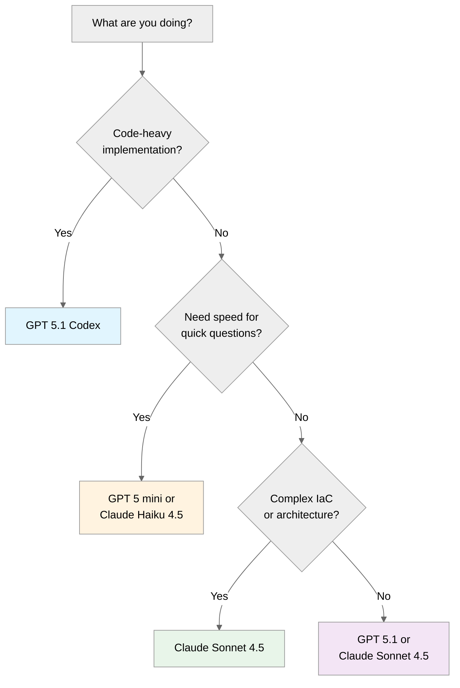

# Choosing the Right AI Model

> **TL;DR**: Use **Claude Sonnet 4.5** for most infrastructure work. Switch to **GPT 5.1** for quick questions
> or **GPT 5.1 Codex** for code-heavy tasks. The model matters less than your prompt quality.

## Quick Decision Guide



---

## Model Comparison for IT Pro Tasks

| Model | Best For | Context Window | Speed | Cost Efficiency |
|-------|----------|----------------|-------|------------------|
| **Claude Sonnet 4.5** | Balanced IaC work, agents, architecture | 200K tokens | Fast | ⭐⭐⭐⭐ |
| **Claude Haiku 4.5** | Quick tasks, high volume, inline | 200K tokens | Fastest | ⭐⭐⭐⭐⭐ |
| **GPT 5.1** | General purpose, large context | 1M tokens | Fast | ⭐⭐⭐⭐ |
| **GPT 5.1 Codex** | Code generation, implementation | 1M tokens | Fast | ⭐⭐⭐ |
| **GPT 5.1 Codex mini** | Lightweight code tasks | 1M tokens | Fastest | ⭐⭐⭐⭐⭐ |
| **GPT 5 mini** | Quick questions, simple tasks | 1M tokens | Fastest | ⭐⭐⭐⭐⭐ |

---

## Recommended Model by Scenario

| Scenario | Recommended Model | Why |
|----------|-------------------|-----|
| **S01 Bicep Baseline** | Claude Sonnet 4.5 | Best balance of speed and quality for IaC |
| **S02 Terraform Baseline** | Claude Sonnet 4.5 | Same reasoning as Bicep |
| **S03 Five-Agent Workflow** | Claude Sonnet 4.5 | Optimized for agent handoffs and planning |
| **S04 Documentation** | GPT 5.1 or Claude Haiku 4.5 | Fast generation for text-heavy tasks |
| **S05 Service Validation** | GPT 5.1 Codex | PowerShell generation with large context |
| **S06 Troubleshooting** | GPT 5 mini | Quick answers, diagnostic speed matters |
| **S07 SBOM Generator** | GPT 5.1 | Straightforward task, good context |
| **S08 Diagrams as Code** | GPT 5.1 Codex | Python code generation |
| **S09 Coding Agent** | Claude Sonnet 4.5 | Best for issue-to-PR automation |

---

## When to Use Each Model

### Claude Sonnet 4.5 (Default Recommendation)

**Use when:**

- Writing Bicep or Terraform templates
- Working with custom agents (bicep-plan, bicep-implement)
- Need to reference multiple files
- Generating modular infrastructure code
- Architecture design and planning

**Example prompt:**

```text
Create a Bicep module for Azure Key Vault with:
- Private endpoint in snet-data subnet
- Soft delete enabled (90 days)
- RBAC authorization
- Diagnostic settings to Log Analytics
Reference the network module for subnet ID.
```

### Claude Haiku 4.5 (Speed Champion)

**Use when:**

- Inline code completions
- High-volume simple tasks
- Quick syntax fixes
- Documentation generation

**Example prompt:**

```text
Add a description decorator to each parameter in this Bicep file.
```

### GPT 5.1 (General Purpose + Large Context)

**Use when:**

- Working with very large codebases (1M token context)
- General questions and explanations
- Cross-referencing many files simultaneously
- Mixed code and documentation tasks

**Example prompt:**

```text
Analyze the entire infra/bicep/ folder and summarize
the resource dependencies across all modules.
```

### GPT 5.1 Codex (Code Generation)

**Use when:**

- Heavy code generation tasks
- Multi-file implementation
- PowerShell and Python scripting
- Refactoring across modules

**Example prompt:**

```text
Generate a complete PowerShell deployment script for
the contoso-patient-portal infrastructure with:
- Parameter validation
- WhatIf support
- Error handling and retry logic
```

### GPT 5.1 Codex mini (Lightweight Code)

**Use when:**

- Quick code snippets
- Simple function implementations
- Code formatting and cleanup
- Syntax corrections

### GPT 5 mini (Quick Answers)

**Use when:**

- Quick syntax questions ("How do I loop in Bicep?")
- Explaining error messages
- Time-sensitive troubleshooting
- Simple diagnostics

**Example prompt:**

```text
What's wrong with this Bicep? Getting BCP037 error:
resource kv 'Microsoft.KeyVault/vaults@2023-07-01' = {
  name: keyVaultName
  properties: {
    sku: 'standard'  // <-- error here
  }
}
```

---

## How to Switch Models in VS Code

### Method 1: Model Picker (Recommended)

1. Open Copilot Chat (`Ctrl+Alt+I`)
2. Click the model name in the chat header
3. Select your preferred model

### Method 2: Inline Mention

Type the model name in your prompt:

```text
@claude-sonnet-4.5 Create a Bicep template for...
```

### Method 3: Settings

```json
// settings.json
{
  "github.copilot.chat.defaultModel": "claude-sonnet-4.5"
}
```

---

## Model Performance Tips

### Maximize Context Efficiency

```text
❌ "Fix the bug in my code"

✅ "Fix the BCP036 error in network.bicep line 45.
    The subnet reference should use existing resource syntax.
    Keep the current naming convention (snet-*-env)."
```

### Use Iterative Refinement

```text
// Step 1: Generate base template
"Create a basic App Service Bicep template"

// Step 2: Add specifics
"Add private endpoint configuration to the App Service"

// Step 3: Enhance
"Add diagnostic settings and managed identity"
```

### Leverage File Context

- Keep relevant files open in VS Code
- Use `#file:network.bicep` to reference specific files
- Use `#selection` to highlight code you're asking about

---

## Context Window Explained

| Term | Meaning | Practical Impact |
|------|---------|------------------|
| **Context window** | Max tokens model can "see" | Larger = more files at once |
| **1M tokens** | ~750,000 words | Can see entire large repos (GPT 5.1 family) |
| **200K tokens** | ~150,000 words | Can see ~50-100 code files (Claude 4.5 models) |

**For most IT Pro work**: All modern models have sufficient context. GPT 5.1 family
with 1M tokens can analyze entire repositories at once, while Claude 4.5 models
offer excellent quality for focused infrastructure work.

---

## Troubleshooting Model Issues

### "Model not available"

- Check your Copilot license tier (some models require Business/Enterprise)
- Try a different model temporarily
- Verify internet connection

### "Response cut off"

- Break your request into smaller parts
- Ask for specific sections ("First, show me the network module")
- Use `Continue` in the chat

### "Quality seems low"

- Add more context to your prompt
- Try a different model for comparison
- Check if you're using a "mini" variant (GPT 5 mini, Codex mini are optimized for speed over depth)

---

## Next Steps

- [Prerequisites](prerequisites.md) - Ensure your environment is ready
- [IT Pro Impact Story](../it-pro-impact-story.md) - Understand the bigger picture
- [S01 Bicep Baseline](../../scenarios/S01-bicep-baseline/) - Start your first scenario
