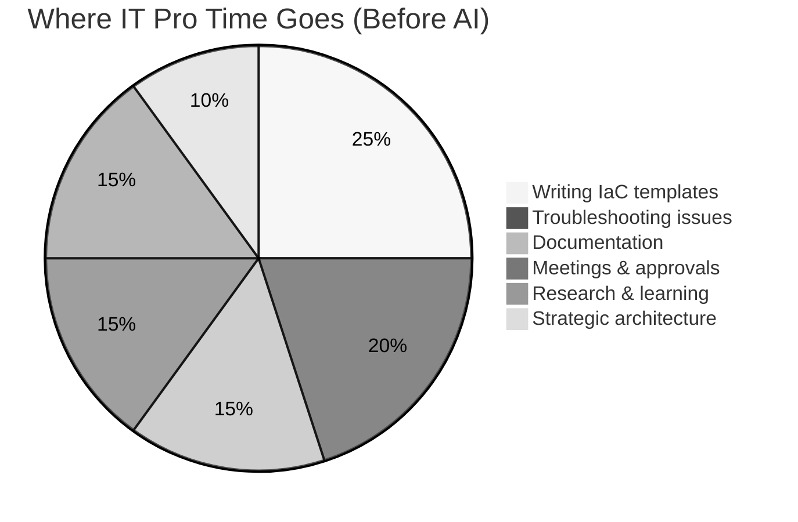
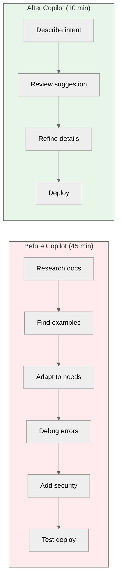
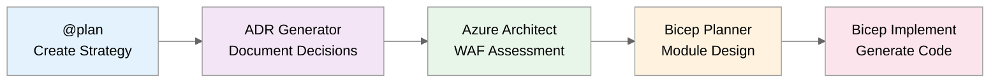
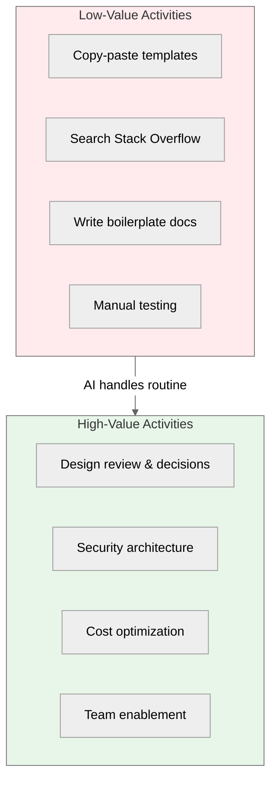

# The IT Pro Transformation: From Manual Toil to Strategic Impact

> **"I used to spend 80% of my time on repetitive infrastructure tasks. Now I spend 80% on architecture
> decisions that actually matter."** — Cloud Architect, Fortune 500 company

---

## The Challenge: Death by a Thousand Tasks

Every IT Professional knows this reality:



**The painful truth:**

- 🔄 **Repetitive work dominates** - Writing similar templates, scripts, and docs over and over
- 📚 **Documentation debt grows** - No time to document what you build
- 🐛 **Troubleshooting consumes days** - Searching logs, reading docs, trial and error
- ⏰ **Strategic work gets squeezed** - Architecture decisions made in rushed meetings
- 😓 **Burnout is real** - High-value professionals doing low-value tasks

---

## Meet the IT Pros in This Repository

Each scenario features a real-world character facing challenges you'll recognize:

### Sarah Chen - Infrastructure Engineer

> _"I need to deploy a hub-spoke network by Friday. Last time this took two weeks of research, testing, and debugging ARM templates."_

**Her challenge:** Manual Bicep/Terraform development is slow and error-prone.

**Her outcome:** Deploys near-production-ready hub-spoke network in 45 minutes (S01, S02).

---

### Marcus Thompson - Cloud Architect

> _"We're preparing for Azure Advanced Specialization audit. I have 200+ compliance controls to verify across our infrastructure."_

**His challenge:** Manual compliance verification is tedious and incomplete.

**His outcome:** Automated validation scripts catch gaps before auditors do (S05).

---

### Elena Rodriguez - DevOps Lead

> _"Our runbooks are outdated, our architecture diagrams are wrong, and nobody has time to fix them."_

**Her challenge:** Documentation always falls behind reality.

**Her outcome:** Generated docs that stay in sync with code (S04, S08).

---

### James Park - Platform Engineer

> _"Production is down. The error message is cryptic. I've been Googling for an hour."_

**His challenge:** Troubleshooting under pressure wastes precious time.

**His outcome:** AI-assisted diagnosis in minutes, not hours (S06).

---

## The Transformation: Before and After

### Writing Infrastructure Code



| Task                     | Manual Approach | With Copilot | Savings |
| ------------------------ | --------------- | ------------ | ------- |
| VNet + subnets + NSGs    | 45 min          | 10 min       | **78%** |
| PowerShell automation    | 60 min          | 15 min       | **75%** |
| Troubleshooting research | 30 min          | 5 min        | **83%** |
| Documentation generation | 120 min         | 20 min       | **83%** |

---

### The Five-Agent Workflow

For complex projects, this repository demonstrates a **five-agent workflow** that mirrors how senior architects think:



**Result:** A project that manually takes 18+ hours completes in 45 minutes with
near-production-ready code, documentation, and architectural decisions recorded.

---

## What Changes for IT Pros

### Your Role Evolves

| From                      | To                    |
| ------------------------- | --------------------- |
| Template writer           | Architecture reviewer |
| Documentation author      | Quality validator     |
| Troubleshooting detective | Root cause analyst    |
| Script maintainer         | Automation strategist |

### Your Value Increases



### Your Skills Compound

The time you save compounds into learning and strategic thinking:

- **Week 1:** Save 10 hours on infrastructure tasks
- **Month 1:** Learn new Azure services you never had time for
- **Quarter 1:** Design better architectures with deeper knowledge
- **Year 1:** Become the go-to expert your team relies on

---

## The Evidence

All time savings in this repository are backed by peer-reviewed research:

| Source               | Finding                               |
| -------------------- | ------------------------------------- |
| GitHub Copilot Study | 55% faster task completion            |
| Forrester TEI        | 88% reduction in repetitive tasks     |
| Stanford HAI         | 60-70% problem-solving time reduction |
| MIT Sloan            | 80% documentation time saved          |

📊 **[Full methodology and sources](time-savings-evidence.md)**

---

## Getting Started: Your First 30 Minutes

### Minute 0-5: Setup

```bash
# Clone the repository
git clone https://github.com/jonathan-vella/github-copilot-itpro.git
code github-copilot-itpro

# Open in Dev Container (F1 → "Reopen in Container")
```

### Minute 5-15: First Scenario

Navigate to [S01 Bicep Baseline](../scenarios/S01-bicep-baseline/) and follow the demo script.
You'll deploy a hub-spoke network faster than you ever have before.

### Minute 15-30: Experience the Difference

Try this prompt in Copilot Chat:

```text
Create a Bicep template for an Azure Key Vault with:
- Private endpoint
- Soft delete enabled
- RBAC authorization
- Diagnostic settings

Use naming convention: kv-{project}-{env}-{suffix}
Default region: swedencentral
```

Watch as Copilot generates near-production-ready code with security best practices built in.

---

## Common Concerns (And Why They're Overblown)

### "Will AI replace my job?"

**No.** AI handles the _repetitive_ parts of your job so you can focus on the _valuable_ parts.
The IT Pros who thrive will be those who leverage AI, not those who ignore it.

### "Can I trust AI-generated code?"

**Trust but verify.** Every scenario includes validation steps. AI generates the code;
you review, test, and approve it. Your expertise remains essential.

### "What about security and compliance?"

**It's built in.** The agents in this repository are configured with Azure security best
practices, Well-Architected Framework guidance, and compliance awareness.

### "I don't have time to learn new tools"

**That's the point.** You'll save more time in your first week than you invest in learning.
The Dev Container handles setup; the scenarios teach by doing.

---

## Your Next Step

Choose your path:

| If you want to...             | Start here                                                       |
| ----------------------------- | ---------------------------------------------------------------- |
| **Verify your setup**         | [Prerequisites](getting-started/prerequisites.md)                |
| **Choose the right AI model** | [Model Selection](getting-started/model-selection.md)            |
| **Jump into code**            | [S01 Bicep Baseline](../scenarios/S01-bicep-baseline/)           |
| **See the advanced workflow** | [S03 Five Agent Workflow](../scenarios/S03-five-agent-workflow/) |

---

_This repository is maintained by IT Pros, for IT Pros. We've been where you are.
The transformation is real, and it starts with your next prompt._
