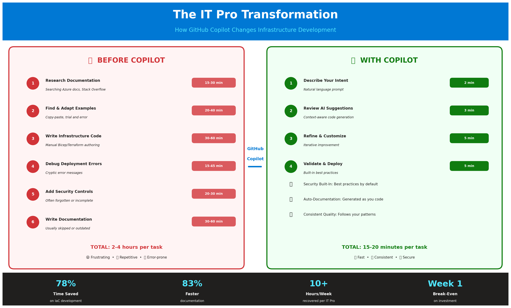
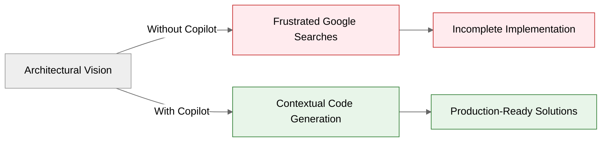
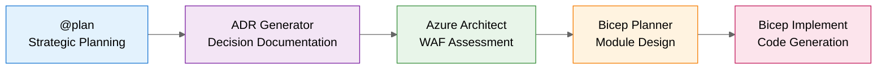
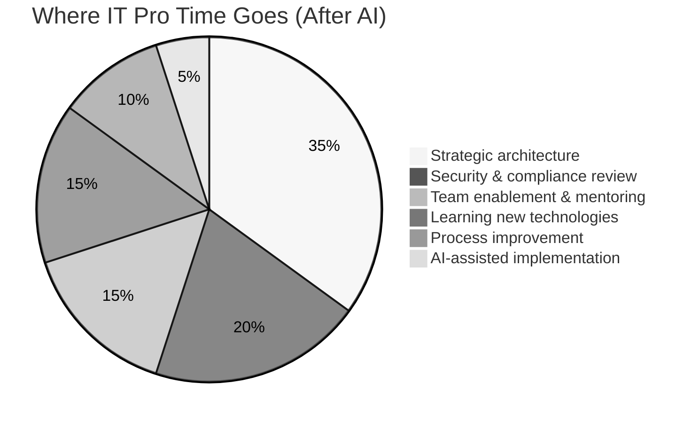

# The Untold Story: How GitHub Copilot Became the IT Pro's Secret Weapon

> _"I'm not a developer. I never was. Yet in the past year, I've shipped more production-ready
> infrastructure, workshops, and automation than I did in the previous decade combined."_

---

## Prologue: The Gap Nobody Talks About

There's a secret in the IT industry that nobody likes to admit.

**Cloud Architects know exactly what needs to be built.** They understand networking topologies,
security boundaries, compliance requirements, and performance patterns. They can whiteboard
a solution that would make any CTO nod in approval.

**But translating that vision into code?** That's where the wheels fall off.

The industry built a wall between "those who architect" and "those who code." IT Pros were
expected to hand off designs to developers, wait weeks for implementation, then debug
misunderstandings that cost more time than the original task.

**This is the story of how that wall came down.**

---

## Chapter 1: The Architect's Frustration

_"I know what I need. I just can't build it."_

Picture this scenario—it happens thousands of times every day in enterprises worldwide:

A Cloud Architect spends three hours designing the perfect hub-spoke network topology.
Security boundaries are clear. IP ranges are documented. Every subnet has a purpose.

Then comes the implementation:

- **Day 1-3:** Searching documentation for ARM/Bicep syntax
- **Day 4-5:** Copying examples from Stack Overflow, adapting them poorly
- **Day 6-8:** Debugging cryptic deployment errors
- **Day 9-10:** Adding security controls that should have been there from the start
- **Day 11-14:** Writing documentation nobody will read because it's already outdated

**Two weeks.** For something the architect could explain in 30 minutes.

---

## Chapter 2: The Accidental Builder

_"GitHub Copilot didn't make me a developer. It made me effective."_

Let me tell you about five projects that shouldn't exist.

Not because they weren't needed—they were desperately needed. But because the person who built
them had no business building them. At least, that's what conventional wisdom said.

### The Projects That Changed Everything

| Project                        | What It Is                                        | Traditional Estimate | Actual Time |
| ------------------------------ | ------------------------------------------------- | -------------------- | ----------- |
| **SAIF**                       | 3-tier security training app (PHP + Python + SQL) | 3-4 months           | 3 weeks     |
| **PostgreSQL HA Workshop**     | Production-grade Kubernetes automation            | 2-3 months           | 2 weeks     |
| **Java App Modernization**     | Legacy migration reference implementation         | 1-2 months           | 1 week      |
| **Sovereign Cloud Brain Trek** | 16-module learning curriculum                     | 2-3 months           | 3 weeks     |
| **Arc SQL Server Toolkit**     | PowerShell automation for hybrid SQL              | 2 months             | 2 weeks     |

**Combined traditional estimate:** 10-14 months  
**Actual delivery:** 11 weeks  
**Time saved:** 80-85%

These aren't toy projects. They're used in production environments, training programs, and
Microsoft Learn documentation. They exist because GitHub Copilot bridged the gap between
knowing what to build and actually building it.

---

## Chapter 3: Meet the IT Pros

_"We're not alone. Every IT Pro faces the same challenge."_

This repository introduces you to four characters. Their names are fictional, but their
challenges are real—drawn from hundreds of conversations with IT professionals.

### Sarah Chen — The Infrastructure Engineer

> _"I need to deploy a hub-spoke network by Friday. Last time this took two weeks of research,
> testing, and debugging ARM templates."_

**Her reality:** Manual Bicep development means nights and weekends. Every new project
feels like starting from scratch.

**Her transformation:** With Copilot, she deploys production-ready network infrastructure
in 45 minutes. Not days. Not hours. Minutes.

### Marcus Thompson — The Cloud Architect

> _"We're preparing for Azure Advanced Specialization audit. I have 200+ compliance controls
> to verify across our infrastructure."_

**His reality:** Manual compliance checks are tedious, incomplete, and inevitably miss
something important.

**His transformation:** Automated validation scripts catch gaps before auditors do.
His stress level drops. His audit pass rate increases.

### Elena Rodriguez — The DevOps Lead

> _"Our runbooks are outdated, our architecture diagrams are wrong, and nobody has time to
> fix them."_

**Her reality:** Documentation always falls behind reality. The team fights about who
has to write it.

**Her transformation:** Documentation that generates from code. Diagrams that stay in sync.
Knowledge that doesn't decay.

### James Park — The Platform Engineer

> _"Production is down. The error message is cryptic. I've been Googling for an hour."_

**His reality:** Troubleshooting under pressure means guessing, hoping, and praying.

**His transformation:** AI-assisted diagnosis in minutes. Root cause identified. Fix deployed.
Heroes still needed—they just work smarter.

---

## Chapter 4: The Numbers Don't Lie

_"These aren't marketing claims. This is peer-reviewed research."_

Skeptical? Good. You should be.

Here's the evidence behind every time savings claim in this repository:

### Academic Research

| Institution                      | Finding                                    | Sample Size       |
| -------------------------------- | ------------------------------------------ | ----------------- |
| Stanford HAI (2023)              | 60-70% problem-solving time reduction      | 450+ participants |
| Harvard/BCG (2024)               | 70-85% content creation time savings       | 758 consultants   |
| MIT Sloan (2024)                 | 80% documentation time saved               | 1,500+ workers    |
| IEEE Software Engineering (2023) | 70% reduced context-switching in debugging | 89 developers     |

### Industry Studies

| Source                       | Finding                             | Sample Size              |
| ---------------------------- | ----------------------------------- | ------------------------ |
| GitHub Copilot Study (2023)  | 55% faster task completion          | 95 developers            |
| Forrester TEI (2024)         | 88% reduction in repetitive tasks   | 15 enterprise interviews |
| Stack Overflow Survey (2024) | 75% report faster completion        | 65,000+ developers       |
| McKinsey (2024)              | 85-95% scaled deployment automation | 1,684 organizations      |

**These studies weren't funded by AI vendors.** They were conducted by researchers trying
to understand what's actually happening when humans work alongside AI.

---

## Chapter 5: The Workflow That Changes Everything

_"It's not about the tool. It's about the system."_

The real power isn't in asking Copilot to write code. It's in orchestrating a workflow
that mirrors how senior architects actually think.

### The Five-Agent Architecture

**What used to take 18+ hours now takes 45 minutes.**

And unlike the manual approach, you end up with:

- Production-ready Bicep templates
- Documented architectural decisions (ADRs)
- Well-Architected Framework alignment
- Security controls built in from the start
- Consistent, reviewable code

---

## Chapter 6: What Actually Changes

_"Your job title doesn't change. Your impact does."_

### The Role Evolution

| From                      | To                    |
| ------------------------- | --------------------- |
| Template writer           | Architecture reviewer |
| Documentation author      | Quality validator     |
| Troubleshooting detective | Root cause analyst    |
| Script maintainer         | Automation strategist |

### The Time Redistribution

Compare that to the "before" state where strategic work got squeezed into 10% of your time.

---

## Chapter 7: The Objections (And Why They're Overblown)

_"Yes, we've heard them all."_

### "Will AI replace my job?"

**No.** And here's why.

AI handles the _repetitive_ parts of your job so you can focus on the _valuable_ parts.
The IT Pros who thrive will be those who leverage AI as a multiplier, not those who
ignore it and get outpaced.

The architect who designs systems still needs to design systems. But now they can also
_implement_ those systems without waiting six weeks for a development team.

### "Can I trust AI-generated code?"

**Trust but verify.** That's not new—it's what you do with any code you didn't write yourself.

Every scenario in this repository includes validation steps. AI generates the code;
you review, test, and approve it. Your expertise remains essential. If anything, your
expertise becomes _more_ essential because you're the quality gate.

### "What about security and compliance?"

**It's built in.** The agents in this repository are configured with:

- Azure security best practices by default
- Well-Architected Framework guidance
- Compliance-aware resource configurations
- Private endpoints, TLS 1.2+, managed identities

The AI doesn't just write code. It writes _secure_ code because we taught it to.

### "I don't have time to learn new tools"

**That's the point.**

You'll save more time in your first week than you invest in learning. The Dev Container
handles setup. The scenarios teach by doing. Your first deployment will be faster than
your last traditional deployment.

---

## Chapter 8: The Portfolio of Proof

_"Don't take my word for it. Look at what got built."_

### SAIF: Secure AI Foundations

A complete 3-tier application (PHP frontend, Python FastAPI backend, SQL Server database)
with intentionally vulnerable code for security training. Includes Docker containerization,
Bicep templates, and 15+ security challenges.

**Built by:** A Cloud Architect with no PHP or Python experience  
**Time:** 3 weeks instead of 3-4 months  
**Impact:** Used for AI security training across enterprise teams

🔗 [SAIF on GitHub](https://github.com/jonathan-vella/SAIF)

---

### Azure PostgreSQL HA on AKS Workshop

Production-grade Kubernetes automation with CloudNativePG operator, PgBouncer connection
pooling, and comprehensive failover testing achieving RPO=0.

**Built by:** Someone who had never written Kubernetes YAML  
**Time:** 2 weeks instead of 2-3 months  
**Impact:** Handles 30,000 concurrent connections with <10 second RTO

🔗 [PostgreSQL HA Workshop on GitHub](https://github.com/jonathan-vella/azure-postgresql-ha-aks-workshop)

---

### Microsoft Sovereign Cloud Brain Trek

A 16-module learning curriculum spanning three progressive levels (100/200/300) with
quizzes, hands-on labs, and Mermaid diagrams for learning path visualization.

**Built by:** A Cloud Architect, not an instructional designer  
**Time:** 3 weeks instead of 2-3 months  
**Impact:** Training platform for sales and technical professionals

🔗 [Sovereign Cloud Brain Trek on GitHub](https://github.com/jonathan-vella/microsoft-sovereign-cloud-brain-trek)

---

## Epilogue: Your Turn

_"The gap between vision and implementation is closing. The question is: are you on
the right side of that gap?"_

These projects prove that you don't need to be a developer to build real solutions.

You need:

- **Domain expertise** — yours comes from your field
- **Clear vision** — what needs to be built and why
- **GitHub Copilot** — to bridge the implementation gap
- **Willingness to learn** — not coding, but _prompting_

The IT Pro's role isn't diminishing. It's evolving.

Those who embrace AI as an efficiency multiplier will spend less time on toil and more
time on strategy. They'll ship faster, document better, and troubleshoot smarter.

Those who resist will wonder how their colleagues became so productive.

---

## Start Your Journey

| If you want to...                    | Start here                                                       |
| ------------------------------------ | ---------------------------------------------------------------- |
| **Verify your setup**                | [Prerequisites](getting-started/prerequisites.md)                |
| **Choose the right AI model**        | [Model Selection](getting-started/model-selection.md)            |
| **Jump into infrastructure code**    | [S01 Bicep Baseline](../scenarios/S01-bicep-baseline/)           |
| **See the full five-agent workflow** | [S03 Five Agent Workflow](../scenarios/S03-five-agent-workflow/) |
| **Explore the portfolio**            | [Copilot Portfolio Showcase](copilot-portfolio-showcase.md)      |

---

_This story is real. These projects are real. The transformation is real._

_And it starts with your next prompt._

---

## Document Info

|                |                                                                                 |
| -------------- | ------------------------------------------------------------------------------- |
| **Created**    | November 2025                                                                   |
| **Based on**   | copilot-portfolio-showcase.md, it-pro-impact-story.md, time-savings-evidence.md |
| **Purpose**    | Narrative storytelling for IT Pro audiences                                     |
| **Maintainer** | Repository maintainers                                                          |
