# Troubleshooting Guide

**Your single source of truth for resolving issues in this repository.**

---

## Quick Diagnosis

Use this decision tree to find your issue quickly:

```mermaid
%%{init: {'theme':'neutral'}}%%
flowchart TD
    START([🔍 What's the problem?]) --> Q1{Where does<br/>the issue occur?}

    Q1 --> |Copilot Chat| COPILOT[GitHub Copilot Issues]
    Q1 --> |Dev Container| DEVCON[Dev Container Issues]
    Q1 --> |Azure Deployment| AZURE[Azure Issues]
    Q1 --> |Custom Agents| AGENTS[Agent Issues]
    Q1 --> |Network/Proxy| NETWORK[Network Issues]

    COPILOT --> C1{Symptom?}
    C1 --> |No suggestions| C1A[Check extension enabled]
    C1 --> |Response cut off| C1B["Response length limit"]
    C1 --> |Generic answers| C1C[Add context to prompt]
    C1 --> |Slow/hanging| C1D[Check network + simplify prompt]

    DEVCON --> D1{Symptom?}
    D1 --> |Won't start| D1A[Check Docker + memory]
    D1 --> |Tool not found| D1B[Re-run post-create.sh]
    D1 --> |Auth failure| D1C[Use device code flow]

    AZURE --> A1{Symptom?}
    A1 --> |Deployment fails| A1A[Check resource names + quotas]
    A1 --> |Policy blocks| A1B[Check compliance tags]
    A1 --> |Auth issues| A1C[Re-authenticate with az login]

    AGENTS --> AG1{Symptom?}
    AG1 --> |Not appearing| AG1A[Reload VS Code window]
    AG1 --> |Incomplete output| AG1B[Use agent handoffs]
    AG1 --> |Wrong recommendations| AG1C[Provide more context]

    click C1B "#response-hit-length-limit"
    click C1A "#copilot-not-responding"
    click D1A "#container-wont-start"
    click AG1A "#agents-not-appearing"
```



---

## Table of Contents

1. [GitHub Copilot Issues](#github-copilot-issues)
2. [Dev Container Issues](#dev-container-issues)
3. [Azure Deployment Issues](#azure-deployment-issues)
4. [Custom Agent Issues](#custom-agent-issues)
5. [Network & Proxy Issues](#network--proxy-issues)
6. [Error Message Reference](#error-message-reference)
7. [Getting More Help](#getting-more-help)

---

## GitHub Copilot Issues

### Copilot Not Responding

**Symptoms:**

- No code suggestions appearing
- Chat not responding
- "Copilot is not available" message

**Solutions:**

1. **Check extension is enabled:**

   - Open Extensions (`Ctrl+Shift+X`)
   - Search "GitHub Copilot"
   - Ensure both "GitHub Copilot" and "GitHub Copilot Chat" are enabled

2. **Reload VS Code:**

   - Press `Ctrl+Shift+P`
   - Type "Reload Window"
   - Select "Developer: Reload Window"

3. **Check authentication:**

   - Click the Copilot icon in the status bar
   - Ensure you're signed in to GitHub
   - If prompted, re-authenticate

4. **Check subscription:**
   - Verify your GitHub account has an active Copilot subscription
   - Visit [github.com/settings/copilot](https://github.com/settings/copilot)

---

### Response Hit Length Limit

**Symptom:** Message appears: _"Sorry, the response hit the length limit. Please rephrase your prompt."_

**Why This Happens:**

- Copilot has a maximum response length (~4,000 tokens for chat)
- Complex requests generate responses that exceed this limit
- The response is truncated, leaving incomplete output

**Solutions:**

**1. Break Into Smaller Requests**

```markdown
❌ Too broad:
"Generate complete Bicep templates for a three-tier application with
networking, security, monitoring, Key Vault, SQL, App Service, and
full deployment scripts."

✅ Break it down:
Step 1: "Create the networking module (VNet, subnets, NSGs)"
Step 2: "Create the Key Vault module with RBAC"
Step 3: "Create the App Service module"
Step 4: "Create the main.bicep that ties them together"
```

**2. Use Agent Handoffs (for Five-Agent Workflow)**

Instead of asking one agent to do everything:

```markdown
# Step 1: Architecture (azure-principal-architect)

"Design a three-tier web application architecture"

# Step 2: Planning (bicep-plan)

"Create an implementation plan for this architecture"

# Step 3: Implementation (bicep-implement)

"Implement Phase 1: Foundation resources"
"Implement Phase 2: Security resources"
"Implement Phase 3: Application resources"
```

**3. Request Specific Sections**

```markdown
# Instead of "generate full documentation"

"Generate the Prerequisites section for the README"
"Generate the Installation section"
"Generate the Usage Examples section"
```

**4. Use Continuation Prompts**

```markdown
# If response was cut off mid-output

"Continue from where you left off"
"Complete the remaining functions"
"Finish the validation section"
```

**5. Reduce Output Verbosity**

```markdown
# Add constraints to reduce length

"Provide a concise implementation with minimal comments"
"Show only the key resources, skip optional configurations"
"Give me the skeleton code, I'll add details"
```

---

### Generic or Unhelpful Responses

**Symptoms:**

- Vague advice ("use best practices")
- Doesn't understand Azure/Bicep/Terraform specifics
- Suggests outdated approaches

**Solutions:**

**1. Provide Context**

```markdown
❌ Generic:
"Create a storage account"

✅ With context:
"I'm using Bicep to deploy Azure infrastructure. Create a storage
account module with:

- Standard_LRS for dev environment
- TLS 1.2 minimum
- HTTPS only
- No public blob access
- Resource lock for production"
```

**2. Specify Your Background**

```markdown
"I have 10 years of on-premises VMware experience and am learning Azure.
Explain VNet peering in terms I'd understand coming from traditional networking."
```

**3. Reference Specific Technologies**

```markdown
"Using the Python 'diagrams' library by mingrammer
(https://diagrams.mingrammer.com/), create an Azure architecture diagram."
```

---

### Copilot Takes Too Long

**Symptoms:**

- Responses take >60 seconds
- Chat appears frozen
- Spinning indicator doesn't stop

**Solutions:**

1. **Simplify your prompt** - Break complex requests into smaller pieces
2. **Check network connection** - See [Network Issues](#network--proxy-issues)
3. **Reduce workspace size** - Large workspaces slow context gathering
4. **Close unused files** - Open files are included in context

---

## Dev Container Issues

### Container Won't Start

**Symptoms:**

- "Failed to start container"
- Docker errors in VS Code
- Container keeps restarting

**Solutions:**

1. **Check Docker Desktop is running**

   - Windows/Mac: Look for Docker icon in system tray
   - Linux: Run `docker ps` to verify daemon is running

2. **Increase Docker memory**

   - Docker Desktop → Settings → Resources → Memory
   - Recommend: 4GB minimum, 8GB for comfortable usage

3. **Clear Docker cache**

   ```bash
   docker system prune -a --volumes
   ```

4. **Rebuild without cache**

   - Press `F1` → "Dev Containers: Rebuild Container Without Cache"

5. **Check disk space**

   ```bash
   df -h  # Linux/Mac
   # Need at least 10GB free for container + tools
   ```

---

### Tool Not Found

**Symptoms:**

- `bicep: command not found`
- `terraform: command not found`
- `az: command not found`

**Solutions:**

1. **Check installation log**

   ```bash
   cat ~/.devcontainer-install.log
   ```

2. **Re-run post-create script**

   ```bash
   bash .devcontainer/post-create.sh
   ```

3. **Manual installation**

   ```bash
   # Azure CLI + Bicep
   curl -sL https://aka.ms/InstallAzureCLIDeb | sudo bash
   az bicep install

   # Terraform
   sudo apt-get update && sudo apt-get install -y terraform

   # Graphviz (for diagrams)
   sudo apt-get install -y graphviz
   ```

4. **Rebuild container** (if manual install doesn't persist)

---

### Azure CLI Authentication Issues

**Symptoms:**

- `az login` fails
- "AADSTS" errors
- Browser doesn't open for login

**Solutions:**

**1. Use Device Code Flow (Recommended for Dev Containers)**

```bash
az login --use-device-code
```

This works through proxies and when browser can't open.

**2. Use Service Principal (for CI/CD)**

```bash
az login --service-principal \
  -u <app-id> \
  -p <secret> \
  --tenant <tenant-id>
```

**3. Check Existing Login**

```bash
az account show
az account list --output table
```

**4. Clear Cached Credentials**

```bash
az account clear
az login --use-device-code
```

---

## Azure Deployment Issues

### Resource Name Conflicts

**Symptoms:**

- "Resource name already exists"
- "Name must be unique"
- Key Vault, Storage Account deployment failures

**Solutions:**

1. **Use unique suffixes in Bicep**

   ```bicep
   // In main.bicep
   var uniqueSuffix = uniqueString(resourceGroup().id)

   // Pass to modules
   module keyVault 'modules/key-vault.bicep' = {
     params: {
       uniqueSuffix: uniqueSuffix
     }
   }
   ```

2. **Check name length limits**

   - Key Vault: ≤24 characters
   - Storage Account: ≤24 characters, lowercase + numbers only, NO hyphens
   - SQL Server: ≤63 characters

3. **Verify name availability**

   ```bash
   # Storage account
   az storage account check-name --name mystorageaccount

   # Key Vault
   az keyvault list-deleted --query "[].name"  # Check soft-deleted vaults
   ```

---

### Azure Policy Blocking Deployment

**Symptoms:**

- "RequestDisallowedByPolicy"
- Deployment fails with policy violation
- Specific SKUs or configurations blocked

**Common Policy Fixes:**

| Policy Requirement         | Solution                                |
| -------------------------- | --------------------------------------- |
| Azure AD-only auth for SQL | Set `azureADOnlyAuthentication: true`   |
| Zone redundancy required   | Use Premium SKUs (P1v3 for App Service) |
| Private endpoints required | Add private endpoint resources          |
| Specific tags required     | Add required tags to all resources      |

**Example: SQL Server with Azure AD-only auth**

```bicep
resource sqlServer 'Microsoft.Sql/servers@2023-05-01-preview' = {
  name: sqlServerName
  location: location
  properties: {
    administrators: {
      administratorType: 'ActiveDirectory'
      azureADOnlyAuthentication: true
      principalType: 'User'
      login: adminLogin
      sid: adminObjectId
      tenantId: tenant().tenantId
    }
  }
}
```

---

### Quota Exceeded

**Symptoms:**

- "QuotaExceeded" errors
- "Subscription not registered for resource type"
- VM size not available

**Solutions:**

1. **Check quota usage**

   ```bash
   az vm list-usage --location swedencentral --output table
   ```

2. **Try alternative region**

   - Default: `swedencentral`
   - Alternative: `germanywestcentral`

3. **Request quota increase**

   - Azure Portal → Subscriptions → Usage + quotas → Request increase

4. **Use smaller SKUs for dev/demo**

   ```bicep
   param appServicePlanSku string = 'B1'  // Basic tier for demos
   ```

---

## Custom Agent Issues

### Agents Not Appearing

**Symptoms:**

- Agent dropdown doesn't show custom agents
- Only see default agents
- `Ctrl+Shift+A` shows empty list

**Solutions:**

1. **Reload VS Code Window**

   - `Ctrl+Shift+P` → "Developer: Reload Window"
   - Wait 10-15 seconds for agents to load

2. **Verify agent files exist**

   ```bash
   ls -la .github/agents/*.agent.md
   # Should see 4 files:
   # - adr-generator.agent.md
   # - azure-principal-architect.agent.md
   # - bicep-plan.agent.md
   # - bicep-implement.agent.md
   ```

3. **Check file syntax**

   - Agent files must have correct YAML front matter
   - Open file and check for syntax errors

4. **Ensure GitHub Copilot Chat is installed**
   - Extensions → Search "GitHub Copilot Chat" → Must be installed + enabled

---

### Agent Produces Incomplete Output

**Symptoms:**

- Output cuts off mid-sentence
- Missing expected sections
- Partial responses

**Solutions:**

1. **Use agent handoffs** instead of asking one agent to do everything

2. **Simplify the request**

   ```markdown
   ❌ Too complex:
   "Design complete enterprise architecture with multi-region HA,
   DR, security, compliance, cost optimization, and all Bicep code"

   ✅ Focused:
   "Design a multi-region HA architecture for a web application"
   ```

3. **Break into phases**

   ```markdown
   Step 1 (Architect): "Design the architecture"
   Step 2 (Planner): "Create implementation plan"  
   Step 3 (Implement): "Generate Phase 1 Bicep code"
   ```

---

### Cost Estimates Missing

**Symptoms:**

- No cost information in architect recommendations
- Cost table shows "$TBD"

**Solutions:**

1. **Explicitly request cost estimates**

   ```markdown
   "Design the architecture AND provide detailed monthly cost estimates
   for a production workload with 10,000 daily users"
   ```

2. **Provide usage context**

   ```markdown
   Context for costing:

   - Region: swedencentral
   - Environment: Production
   - Expected load: 50,000 requests/day
   - Data storage: 500GB
   ```

---

## Network & Proxy Issues

### Copilot Can't Connect

**Symptoms:**

- "Unable to connect to GitHub Copilot"
- Timeout errors
- Works on some networks but not others

**Solutions:**

1. **Check firewall/proxy settings**

   Required domains to allow:

   ```text
   *.github.com
   *.githubusercontent.com
   api.github.com
   copilot-proxy.githubusercontent.com
   ```

2. **Configure VS Code proxy**

   ```json
   // settings.json
   {
     "http.proxy": "http://proxy.company.com:8080",
     "http.proxyStrictSSL": false
   }
   ```

3. **Test connectivity**

   ```bash
   curl -I https://api.github.com
   curl -I https://copilot-proxy.githubusercontent.com
   ```

---

### SSL Certificate Errors

**Symptoms:**

- "SSL certificate problem"
- "self signed certificate in certificate chain"

**Solutions:**

1. **For corporate environments with SSL inspection**

   ```bash
   # Add corporate CA to trusted certs
   export NODE_EXTRA_CA_CERTS=/path/to/corporate-ca.crt
   ```

2. **In VS Code settings**

   ```json
   {
     "http.proxyStrictSSL": false
   }
   ```

   ⚠️ Use with caution - only for trusted corporate networks

---

## Error Message Reference

Quick lookup for common error messages:

| Error Message                   | Cause                  | Solution                                                       |
| ------------------------------- | ---------------------- | -------------------------------------------------------------- |
| "Response hit the length limit" | Request too complex    | [Break into smaller requests](#response-hit-length-limit)      |
| "Copilot is not available"      | Extension/auth issue   | [Check extension + re-auth](#copilot-not-responding)           |
| "RequestDisallowedByPolicy"     | Azure Policy blocking  | [Check policy requirements](#azure-policy-blocking-deployment) |
| "ResourceNameNotAvailable"      | Name conflict          | [Use unique suffixes](#resource-name-conflicts)                |
| "QuotaExceeded"                 | Subscription limits    | [Check quotas + try alternate region](#quota-exceeded)         |
| "AADSTS50076"                   | MFA required           | Use `az login --use-device-code`                               |
| "ExecutableNotFound: dot"       | Graphviz missing       | `sudo apt-get install graphviz`                                |
| "No module named 'diagrams'"    | Python package missing | `pip install diagrams`                                         |
| "bicep: command not found"      | Bicep not installed    | `az bicep install`                                             |

---

## Getting More Help

### Self-Service Resources

| Resource                                                                        | Use For                        |
| ------------------------------------------------------------------------------- | ------------------------------ |
| [Getting Started Guide](./getting-started/README.md)                            | End-to-end setup walkthrough   |
| [Five-Mode Workflow](../resources/copilot-customizations/FIVE-MODE-WORKFLOW.md) | Agent workflow documentation   |
| [Scenario READMEs](../scenarios/)                                               | Scenario-specific guidance     |
| [GitHub Copilot Docs](https://docs.github.com/en/copilot)                       | Official Copilot documentation |

### Community Support

- **GitHub Discussions**: [Repository Discussions](https://github.com/jonathan-vella/github-copilot-itpro/discussions)
- **Azure Community**: [Microsoft Q&A](https://learn.microsoft.com/answers/tags/133/azure)

### Reporting Issues

When opening an issue, include:

1. **What you were trying to do**
2. **What happened instead**
3. **Steps to reproduce**
4. **Environment details** (VS Code version, OS, Copilot version)
5. **Screenshots** if applicable

**Create issue**: [GitHub Issues](https://github.com/jonathan-vella/github-copilot-itpro/issues)

---

## Scenario-Specific Troubleshooting

Each scenario has unique troubleshooting content. For scenario-specific issues, see:

- [S01: Bicep Baseline](../scenarios/S01-bicep-baseline/README.md#troubleshooting)
- [S02: Terraform Baseline](../scenarios/S02-terraform-baseline/README.md#troubleshooting)
- [S03: Five-Agent Workflow](../scenarios/S03-five-agent-workflow/README.md#troubleshooting)
- [S07: SBOM Generator](../scenarios/S07-sbom-generator/README.md#troubleshooting)
- [S08: Diagrams as Code](../scenarios/S08-diagrams-as-code/README.md#troubleshooting)
- [S09: Coding Agent](../scenarios/S09-coding-agent/README.md#troubleshooting)

---

**Last Updated:** November 2025  
**Feedback:** Open an issue with label `documentation`
