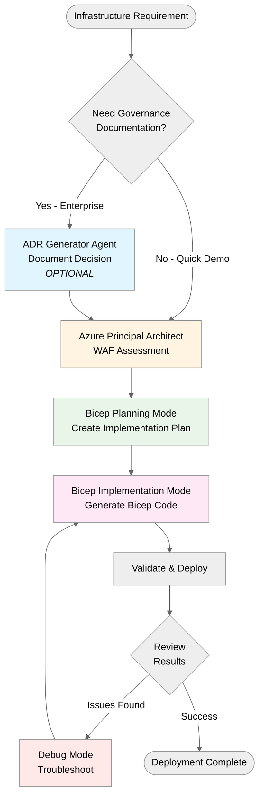
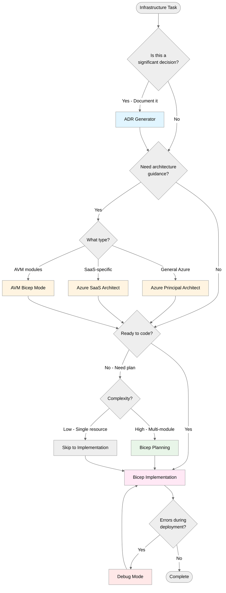

# Five-Agent Workflow for Azure Infrastructure Development

This document describes the structured workflow for developing Azure infrastructure using GitHub Copilot Custom Agents and Chat Modes.

## Overview

The five-agent workflow provides a systematic approach to infrastructure development:

1. **Document Decisions** → ADR Generator (Custom Agent) - _Optional for enterprise governance_
2. **Plan Architecture** → Azure Principal Architect (Custom Agent)
3. **Create Plan** → Bicep Planning Specialist (Custom Agent)
4. **Implement Code** → Bicep Implementation Specialist (Custom Agent)

> **Note**: The ADR Generator agent is optional. For quick demos focused on speed, you can start directly with the Azure Principal Architect agent (step 2). The ADR agent is most valuable for enterprise teams needing audit trails and governance documentation.

**How to Use Custom Agents:**

- Press `Ctrl+Shift+A` or click the **Agent** button in Copilot Chat
- Select the agent from the dropdown: `adr_generator`, `azure-principal-architect`, `bicep-plan`, or `bicep-implement`
- Type your prompt and submit

## Workflow Diagram



## Mode Details

### 1. ADR Generator (Custom Agent) - _Optional_

**Purpose:** Document significant architectural decisions for future reference and team alignment.

> **Use Case**: Best for enterprise teams, large projects, or when governance/audit trails are required. **Skip for quick demos** focused on showing infrastructure development speed.

**When to Use:**

- Making architectural decisions that impact multiple teams or components
- Choosing between significant alternatives (e.g., hub-spoke vs. Virtual WAN)
- Documenting security, compliance, or governance decisions
- Establishing patterns to be reused across demos or projects

**Inputs:**

- Business requirements
- Technical constraints
- Alternatives considered
- Decision rationale

**Outputs:**

- Structured ADR in `/docs/adr/adr-NNNN-{title}.md`
- Includes: Status, Context, Decision, Consequences, Alternatives, Implementation Notes, References

**How to Invoke:**

1. Press `Ctrl+Shift+A` or click Agent button
2. Select `adr_generator` from dropdown
3. Enter your prompt

**Example Prompt:**

```markdown
Create an ADR for choosing Azure Bastion over Jump Boxes
for secure VM access in our demo infrastructure.

Context:

- Demos require secure RDP/SSH access to VMs
- Must demonstrate Azure best practices
- Budget constraints for demo environments
- 30-minute demo format

Alternatives to consider:

1. Azure Bastion
2. Traditional Jump Box VM
3. Just-in-Time (JIT) VM access
```

**Output Example:**

```markdown
# ADR-0002: Azure Bastion for Secure VM Access

## Status

Accepted

## Context

[Detailed context from prompt]

## Decision

We will use Azure Bastion for secure VM access in all demos...

## Consequences

### Positive

POS-001: No public IP addresses on VMs (improved security posture)
POS-002: No Jump Box management overhead (reduced operational costs)
...

### Negative

NEG-001: Additional Azure cost for Bastion host (see Azure Pricing Calculator)
NEG-002: Cannot demonstrate Jump Box patterns
...
```

---

### 2. Azure Principal Architect (Custom Agent)

**Purpose:** Provide Azure Well-Architected Framework (WAF) expertise and best practices guidance.

**When to Use:**

- Evaluating architecture against WAF pillars (Security, Reliability, Performance, Cost, Operations)
- Need Azure-specific recommendations and patterns
- Assessing trade-offs between approaches
- Planning multi-region or HA architectures

**Inputs:**

- Architecture description or requirements
- Specific WAF concerns (security, cost, etc.)
- Constraints (budget, timeline, skills)

**Outputs:**

- Architecture recommendations
- WAF assessment against all 5 pillars
- Trade-off analysis
- Azure service recommendations with configurations
- Reference to Azure Architecture Center patterns

**How to Invoke:**

1. Press `Ctrl+Shift+A` or click Agent button
2. Select `azure-principal-architect` from dropdown
3. Enter your prompt

**Example Prompt:**

```markdown
Assess this architecture:

Requirements:

- Web application with SQL database
- 99.95% SLA required
- Global users (North America and Europe)
- PCI-DSS compliance needed
- Budget: Enterprise-scale budget for production workload

Proposed Architecture:

- Azure Front Door for global load balancing
- App Services in two regions (primary/failover)
- Azure SQL with active geo-replication
- Azure Key Vault for secrets

Assess against all WAF pillars and suggest improvements.
```

**Output Example:**

```markdown
## Architecture Assessment

### Security (Score: 8/10)

✅ Good: Key Vault for secrets, PCI-DSS capable services
⚠️ Improvement: Add Private Endpoints for App Service and SQL
⚠️ Improvement: Enable Azure DDoS Protection on Front Door

### Reliability (Score: 9/10)

✅ Good: Multi-region deployment, SQL geo-replication
✅ Good: Front Door provides automatic failover
💡 Consider: Add health probes and circuit breaker patterns

[... continues for all 5 pillars ...]

## Recommendations

1. Add Private Endpoints: Additional cost, significant security improvement
2. Enable DDoS Protection: Significant cost increase, required for PCI-DSS
3. Consider: Azure SQL elastic pool for cost optimization

## Trade-offs

- Cost vs. Security: DDoS Protection pushes near budget limit
- Performance vs. Cost: Consider CDN caching to reduce App Service tier
```

---

### 3. Bicep Planning Specialist (Custom Agent)

**Purpose:** Create structured, machine-readable infrastructure plans before implementation.

**When to Use:**

- Planning complex multi-resource deployments
- Breaking down requirements into implementation tasks
- Creating reusable planning artifacts
- Need team review before coding

**Inputs:**

- Infrastructure requirements
- Architecture recommendations (from Principal Architect)
- Constraints and dependencies

**Outputs:**

- Structured planning file in `.bicep-planning-files/INFRA.{name}.md`
- Resource breakdown with dependencies
- Parameter definitions
- Module structure
- Implementation tasks with priority

**How to Invoke:**

1. Press `Ctrl+Shift+A` or click Agent button
2. Select `bicep-plan` from dropdown
3. Enter your prompt

**Example Prompt:**

```markdown
Create a plan for implementing the multi-region
architecture assessed by the Azure Principal Architect.

Requirements:

- Hub-spoke network in West Europe (hub) and East US (spoke)
- Azure Firewall in hub
- Private DNS zones for Azure services
- VNet peering between hub and spokes
- NSGs on all subnets
- Azure Bastion in hub VNet

Create a modular Bicep structure with proper dependencies.
```

**Output Example:**

```markdown
# Infrastructure Plan: Multi-Region Hub-Spoke Network

## Overview

This plan implements a hub-spoke network topology across two Azure regions...

## Resource Breakdown

### Module 1: Network Foundation

**Priority:** 1 (Deploy First)
**Dependencies:** None

| Resource                | Type            | Configuration                       |
| ----------------------- | --------------- | ----------------------------------- |
| rg-network-hub-weu      | Resource Group  | West Europe, tags: Environment=Demo |
| vnet-hub-weu            | Virtual Network | 10.0.0.0/16, 3 subnets              |
| nsg-AzureBastionSubnet  | NSG             | Allow 443 from Internet             |
| nsg-AzureFirewallSubnet | NSG             | Allow all outbound                  |

**Parameters:**

- `location`: string = 'westeurope'
- `hubVNetAddressPrefix`: string = '10.0.0.0/16'

**Dependencies:**

- None (foundation module)

### Module 2: Security Services

**Priority:** 2 (Deploy After Module 1)
**Dependencies:** Module 1 (VNet and subnets)

[... continues with detailed breakdown ...]

## Implementation Tasks

| Task     | Module                            | Estimated Time | Dependencies       |
| -------- | --------------------------------- | -------------- | ------------------ |
| TASK-001 | Create network-foundation.bicep   | 15 min         | None               |
| TASK-002 | Create security-services.bicep    | 20 min         | TASK-001           |
| TASK-003 | Create main.bicep orchestrator    | 10 min         | TASK-001, TASK-002 |
| TASK-004 | Create parameter files (dev/prod) | 10 min         | TASK-003           |
| TASK-005 | Test deployment to dev            | 20 min         | All above          |

**Total Estimated Time:** 75 minutes

## Validation Checklist

- [ ] All NSGs have explicit deny rules
- [ ] No public IPs except Bastion
- [ ] Private DNS zones linked to VNets
- [ ] VNet peering properly configured
- [ ] Diagnostic settings on all resources
```

---

### 4. Bicep Implementation Specialist (Custom Agent)

**Purpose:** Generate near-production-ready Bicep templates following Azure best practices.

**When to Use:**

- Implementing infrastructure plans
- Converting ARM templates to Bicep
- Adding resources to existing templates
- Following naming conventions and security defaults

**Inputs:**

- Planning file from Bicep Planning Mode
- Specific module or task to implement
- Parameter requirements

**Outputs:**

- Complete Bicep templates (`.bicep` files)
- Parameter files (`.bicepparam` or JSON)
- Deployment scripts
- Validation and testing guidance

**How to Invoke:**

1. Press `Ctrl+Shift+A` or click Agent button
2. Select `bicep-implement` from dropdown
3. Enter your prompt

**Example Prompt:**

```markdown
Implement Module 1 (Network Foundation) from
.bicep-planning-files/INFRA.multi-region-network.md

Requirements:

- Follow Azure naming conventions
- Use latest API versions (2023-05-01 or newer)
- Include comprehensive outputs
- Add descriptive comments
- Enable diagnostic settings where applicable
```

**Output Example:**

```bicep
// network-foundation.bicep
// Module 1: Network Foundation
// Creates hub VNet with subnets and NSGs

@description('Azure region for deployment')
param location string = resourceGroup().location

@description('Environment name (dev, staging, prod)')
@allowed([
  'dev'
  'staging'
  'prod'
])
param environment string = 'dev'

@description('Hub VNet address prefix')
param hubVNetAddressPrefix string = '10.0.0.0/16'

// Variables for consistent naming
var hubVNetName = 'vnet-hub-${environment}-${location}'
var bastionNsgName = 'nsg-AzureBastionSubnet-${environment}'

// NSG for Azure Bastion Subnet
resource bastionNsg 'Microsoft.Network/networkSecurityGroups@2023-05-01' = {
  name: bastionNsgName
  location: location
  properties: {
    securityRules: [
      {
        name: 'AllowHttpsInbound'
        properties: {
          priority: 100
          direction: 'Inbound'
          access: 'Allow'
          protocol: 'Tcp'
          sourcePortRange: '*'
          destinationPortRange: '443'
          sourceAddressPrefix: 'Internet'
          destinationAddressPrefix: '*'
        }
      }
      // ... more rules ...
    ]
  }
  tags: {
    Environment: environment
    ManagedBy: 'Bicep'
    Module: 'NetworkFoundation'
  }
}

// Hub Virtual Network
resource hubVNet 'Microsoft.Network/virtualNetworks@2023-05-01' = {
  name: hubVNetName
  location: location
  properties: {
    addressSpace: {
      addressPrefixes: [
        hubVNetAddressPrefix
      ]
    }
    subnets: [
      {
        name: 'AzureBastionSubnet'
        properties: {
          addressPrefix: cidrSubnet(hubVNetAddressPrefix, 24, 0)
          networkSecurityGroup: {
            id: bastionNsg.id
          }
        }
      }
      // ... more subnets ...
    ]
  }
  tags: {
    Environment: environment
    ManagedBy: 'Bicep'
    Module: 'NetworkFoundation'
  }
}

// Outputs for other modules
output hubVNetId string = hubVNet.id
output hubVNetName string = hubVNet.name
output bastionSubnetId string = hubVNet.properties.subnets[0].id
```

---

## Complete Workflow Example

### Scenario: Deploy Secure Development Environment

#### Step 1: Document Decision (ADR Generator)

**Agent:** Select `adr_generator` from Agent dropdown (Ctrl+Shift+A)

**Prompt:**

```markdown
Document the decision to use separate VNets for dev/staging/prod
vs. subnet segmentation within a single VNet.

Requirements:

- Cost-conscious demo environment
- Must demonstrate Azure best practices
- Security isolation required
- 30-minute demo constraint
```

**Output:** `/docs/adr/adr-0003-environment-network-isolation.md`

---

#### Step 2: Architecture Planning (Principal Architect)

**Agent:** Select `azure-principal-architect` from Agent dropdown (Ctrl+Shift+A)

**Prompt:**

```markdown
Design a development environment with:

- Network isolation per ADR-0003
- Azure Bastion for secure access per ADR-0002
- Budget: Small-scale production budget
- Support 5 developers with 2 VMs each

Assess against WAF pillars and provide detailed recommendations.
```

**Output:** Architecture recommendations with WAF assessment

---

#### Step 3: Create Implementation Plan (Bicep Planning)

**Agent:** Select `bicep-plan` from Agent dropdown (Ctrl+Shift+A)

**Prompt:**

```markdown
Create a detailed plan implementing the architecture from step 2.

Include:

- Development VNet (10.1.0.0/16)
- 3 subnets: AzureBastionSubnet, compute, data
- NSGs with appropriate rules
- Azure Bastion
- 10 VMs (Windows Server 2022, B2s)
- Modular Bicep structure
```

**Output:** `.bicep-planning-files/INFRA.dev-environment.md`

---

#### Step 4: Implement (Bicep Implementation)

**Prompt 1:**

```markdown
Using bicep-implement mode, implement the network foundation module
from .bicep-planning-files/INFRA.dev-environment.md
```

**Output 1:** `modules/network-foundation.bicep`

**Prompt 2:**

```markdown
Using bicep-implement mode, implement the compute module for VMs
from .bicep-planning-files/INFRA.dev-environment.md
```

**Output 2:** `modules/compute.bicep`

**Prompt 3:**

```markdown
Using bicep-implement mode, create the main orchestration template
referencing the network and compute modules.
```

**Output 3:** `main.bicep` with module references

---

#### Step 5: Deploy & Validate

**Deployment:**

```powershell
# Validate template
az deployment sub what-if --location westeurope --template-file main.bicep

# Deploy to Azure
az deployment sub create \
  --location westeurope \
  --template-file main.bicep \
  --parameters environment=dev
```

**If Issues:** Use debug mode

```markdown
Using debug mode, analyze this deployment error:
[paste error message]
```

---

## Mode Selection Guidelines

### When to Use Each Mode

| Situation                        | Recommended Mode                           | Rationale                              |
| -------------------------------- | ------------------------------------------ | -------------------------------------- |
| Making architecture choice       | ADR Generator                              | Document for future reference          |
| Evaluating security posture      | Azure Principal Architect                  | WAF Security pillar expertise          |
| Planning multi-region deployment | Azure Principal Architect + Bicep Planning | Architecture first, then detailed plan |
| Converting ARM to Bicep          | Bicep Implementation                       | Direct code generation                 |
| Troubleshooting deployment error | Debug Mode                                 | Specialized error analysis             |
| Breaking down complex project    | Bicep Planning                             | Structured task decomposition          |
| Quick single-resource creation   | Bicep Implementation                       | Direct implementation                  |
| SaaS multi-tenancy design        | Azure SaaS Architect                       | Specialized domain expertise           |
| Using AVM modules                | AVM Bicep Mode                             | Module-specific guidance               |

### Decision Tree



## Best Practices

### 1. Always Document Significant Decisions

- Use ADR Generator for choices that impact multiple teams or long-term direction
- Don't over-document: routine resource creation doesn't need ADRs
- Link ADRs from planning files and code comments

### 2. Get Architecture Right First

- Consult Azure Principal Architect before creating plans
- Consider all WAF pillars, not just functional requirements
- Document trade-offs explicitly

### 3. Plan Before Coding

- Use Bicep Planning for anything with 3+ resources or modules
- Machine-readable plans enable better AI implementation
- Planning files serve as documentation

### 4. Implement Incrementally

- Break large plans into multiple implementation prompts
- Test each module independently
- Use debug mode proactively when errors occur

### 5. Maintain Context

- Reference previous outputs: ADRs, plans, existing code
- Use consistent naming across modes
- Keep artifacts in designated locations

## Output Locations

| Mode                 | Output Type   | Location                           | Example                         |
| -------------------- | ------------- | ---------------------------------- | ------------------------------- |
| ADR Generator        | Markdown ADR  | `/docs/adr/`                       | `adr-0003-network-isolation.md` |
| Principal Architect  | Chat Response | N/A (guidance)                     | Inline recommendations          |
| Bicep Planning       | Markdown Plan | `.bicep-planning-files/`           | `INFRA.dev-environment.md`      |
| Bicep Implementation | Bicep Code    | `infrastructure/` or demo-specific | `network.bicep`, `main.bicep`   |
| Debug Mode           | Chat Response | N/A (analysis)                     | Inline troubleshooting          |

## Integration with Scenarios

Each scenario in `scenarios/` can showcase the five-agent workflow:

### S01: Bicep Baseline

- **Plan:** Project scope and cost estimation
- **ADR:** Choice of Bicep over ARM/Terraform
- **Architect:** WAF assessment of hub-spoke network
- **Planning:** Network module breakdown
- **Implementation:** Generated Bicep templates

### S03: Five-Agent Workflow

- **ADR:** Full workflow documentation
- **Architect:** WAF assessment of patient portal
- **Planning:** Complete infrastructure breakdown
- **Implementation:** Production Bicep with AVM modules

### S04: Documentation Generation

- **ADR:** Documentation-as-code strategy
- **Architect:** N/A (not infrastructure-focused)
- **Planning:** Documentation structure plan
- **Implementation:** Mermaid diagrams, runbooks

### S09: Coding Agent

- **Plan:** Issue scope and acceptance criteria
- **ADR:** N/A (typically skip for async tasks)
- **Architect:** N/A (agent handles implementation)
- **Planning:** Defined in issue body
- **Implementation:** Automated via GitHub Copilot Coding Agent

## Troubleshooting

### Issue: Mode Not Activating

**Solution:** Ensure you're using `@workspace` context and exact mode name

### Issue: Wrong Mode Output

**Solution:** Be explicit: "Using bicep-plan mode" at start of prompt

### Issue: Planning File Not Found

**Solution:** Check `.bicep-planning-files/` directory, ensure file created

### Issue: ADR Numbering Conflict

**Solution:** Check `/docs/adr/` for highest number, ADR Generator auto-increments

### Issue: Implementation Doesn't Match Plan

**Solution:** Explicitly reference plan file in implementation prompt

## Resources

- **Custom Agents:** `.github/agents/`
- **Chat Modes:** `resources/copilot-customizations/chatmodes/`
- **ADR Examples:** `/docs/adr/`
- **Planning Examples:** `.bicep-planning-files/`
- **Demo Scripts:** `scenarios/*/DEMO-SCRIPT.md`

---

**Version:** 1.0  
**Last Updated:** 2025-11-17  
**Maintained By:** GitHub Copilot IT Pro Repository Team
