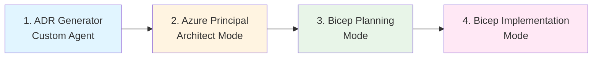
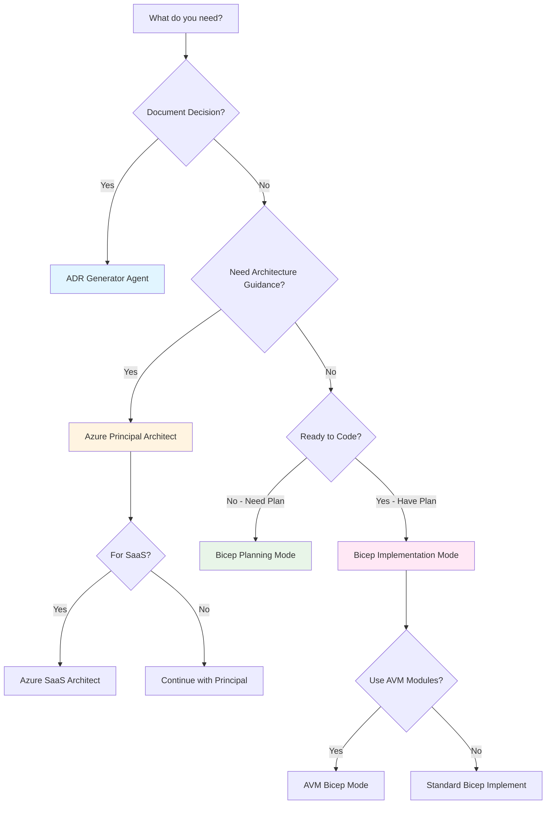

# GitHub Copilot Custom Chat Modes

This directory contains specialized chat modes that enhance GitHub Copilot's capabilities for Azure infrastructure development.

## Overview

Custom chat modes provide context-specific expertise without switching tools. Each mode is optimized for specific stages of infrastructure development.

## Four-Mode Workflow

This repository uses a structured four-mode workflow for Azure infrastructure development:



### Workflow Stages

| Stage | Mode | Purpose | Output |
|-------|------|---------|--------|
| **Decision** | ADR Generator (Agent) | Document architectural decisions | `/docs/adr/adr-NNNN-*.md` |
| **Architecture** | Azure Principal Architect | WAF assessment & best practices | Architecture guidance |
| **Planning** | Bicep Planning | Create machine-readable plans | `.bicep-planning-files/INFRA.*.md` |
| **Implementation** | Bicep Implementation | Generate production-ready code | `*.bicep` files |

## Available Chat Modes

### Core Workflow Modes

#### azure-principal-architect.chatmode.md
**Purpose:** Azure Well-Architected Framework expertise

**Use When:**
- Evaluating architectural decisions against WAF pillars (Security, Reliability, Performance, Cost, Operations)
- Need Azure-specific best practices and patterns
- Assessing trade-offs between architectural approaches
- Designing multi-region or high-availability solutions

**Example:**
```markdown
Using azure-principal-architect mode, assess the security and cost implications 
of using Azure Private Endpoints vs. Service Endpoints for PaaS services.
```

---

#### bicep-plan.chatmode.md
**Purpose:** Create structured, machine-readable infrastructure plans

**Use When:**
- Planning complex Azure deployments before coding
- Breaking down requirements into implementation tasks
- Creating reusable planning artifacts
- Collaborating with teams on infrastructure design

**Output Location:** `.bicep-planning-files/INFRA.{project-name}.md`

**Example:**
```markdown
Using bicep-plan mode, create a plan for deploying a hub-spoke network 
with 3 spokes, Azure Firewall, and Private DNS zones.
```

---

#### bicep-implement.chatmode.md
**Purpose:** Generate production-ready Bicep templates

**Use When:**
- Implementing infrastructure plans
- Converting ARM templates to Bicep
- Adding resources to existing templates
- Following Azure naming conventions and security best practices

**Example:**
```markdown
Using bicep-implement mode, implement the network plan from 
.bicep-planning-files/INFRA.hub-spoke-network.md
```

---

### Azure Verified Modules (AVM) Modes

#### azure-verified-modules-bicep.chatmode.md
**Purpose:** Integrate Azure Verified Modules (Bicep) for enterprise-grade infrastructure

**Use When:**
- Building production infrastructure with Microsoft-verified patterns
- Need enterprise features (RBAC, monitoring, compliance)
- Want consistent, well-tested modules
- Following Microsoft Cloud Adoption Framework

**Example:**
```markdown
Using azure-verified-modules-bicep mode, create a Virtual Network using 
the AVM pattern with proper tagging and diagnostic settings.
```

---

#### azure-verified-modules-terraform.chatmode.md
**Purpose:** Integrate Azure Verified Modules (Terraform) for multi-cloud infrastructure

**Use When:**
- Managing multi-cloud environments
- Existing Terraform investment
- Need Terraform-specific patterns

---

### SaaS Architecture Mode

#### azure-saas-architect.chatmode.md
**Purpose:** Multi-tenant SaaS architecture on Azure

**Use When:**
- Designing SaaS applications
- Implementing tenant isolation strategies
- Planning SaaS pricing models
- Handling SaaS data architecture

**Example:**
```markdown
Using azure-saas-architect mode, design a tenant isolation strategy 
using Azure AD B2C and database-per-tenant pattern.
```

---

### Terraform Modes

#### terraform-azure-planning.chatmode.md
**Purpose:** Create Terraform infrastructure plans for Azure

**Use When:**
- Planning Terraform-based Azure deployments
- Converting existing infrastructure to Terraform
- Creating reusable Terraform modules

---

#### terraform-azure-implement.chatmode.md
**Purpose:** Generate production-ready Terraform code for Azure

**Use When:**
- Implementing Terraform plans
- Creating Azure provider configurations
- Building Terraform modules

---

### Planning & Debugging Modes

#### plan.chatmode.md
**Purpose:** General task planning and decomposition

**Use When:**
- Breaking down complex tasks
- Creating implementation roadmaps
- Planning multi-phase projects

---

#### planner.chatmode.md
**Purpose:** Strategic planning and roadmapping

**Use When:**
- Long-term technical planning
- Architecture evolution planning
- Technology adoption strategies

---

#### debug.chatmode.md
**Purpose:** Troubleshooting and diagnostics assistance

**Use When:**
- Debugging Bicep/Terraform deployment failures
- Analyzing Azure resource errors
- Troubleshooting infrastructure issues
- Interpreting error messages

**Example:**
```markdown
Using debug mode, analyze this Bicep deployment error: 
"The subscription is not registered to use namespace Microsoft.Network"
```

---

## Usage Guidelines

### Activating Chat Modes

**In VS Code:**
1. Open GitHub Copilot Chat
2. Type `@workspace` to invoke workspace context
3. Mention the mode: "Using bicep-plan mode, create a plan for..."

**In Issues/Pull Requests:**
```markdown
@github-copilot using bicep-implement mode, generate a Bicep template 
for the network plan in .bicep-planning-files/INFRA.network.md
```

### Mode Selection Decision Tree



### Best Practices

**1. Follow the Workflow Sequence**
- Start with decisions (ADR Generator)
- Get architectural guidance (Principal Architect)
- Create a plan (Bicep Planning)
- Implement code (Bicep Implementation)

**2. Use Mode-Specific Outputs**
- ADR Generator → `/docs/adr/adr-NNNN-*.md`
- Bicep Planning → `.bicep-planning-files/INFRA.*.md`
- Bicep Implementation → `infrastructure/*.bicep`

**3. Combine Modes for Complex Tasks**
```markdown
# Step 1: Architecture Assessment
Using azure-principal-architect mode, evaluate security requirements 
for PCI-DSS compliant infrastructure.

# Step 2: Create Plan
Using bicep-plan mode, create a plan implementing the security 
recommendations from the architecture assessment.

# Step 3: Implement
Using bicep-implement mode, generate Bicep templates from the plan.
```

**4. Mode-Specific Context**
- Each mode has access to workspace context
- Reference existing files: `.bicep-planning-files/`, `/docs/adr/`
- Modes understand Azure naming conventions and tagging standards

## Maintenance

### Adding New Modes

1. Create `{mode-name}.chatmode.md` in this directory
2. Follow the structure of existing modes
3. Document in this README
4. Add to workflow diagram if it's part of core workflow
5. Create ADR documenting the decision to add the mode

### Updating Existing Modes

1. Test changes with demo scenarios
2. Update relevant ADRs if behavior changes significantly
3. Update this README if usage changes
4. Notify team via pull request

## Examples

### Complete Workflow Example: Three-Tier Network

**Step 1: Document Decision**
```markdown
@adr-generator Create an ADR for using hub-spoke network topology 
vs. virtual WAN for a multi-region deployment.
```

**Step 2: Architecture Guidance**
```markdown
Using azure-principal-architect mode, assess the hub-spoke design 
against WAF pillars for a requirement of 99.95% SLA.
```

**Step 3: Create Plan**
```markdown
Using bicep-plan mode, create a detailed plan for implementing 
a hub-spoke network with:
- Hub VNet in West Europe with Azure Firewall
- 3 spoke VNets (production, staging, development)
- VNet peering with proper route tables
- Private DNS zones for Azure PaaS services
```

**Step 4: Implement**
```markdown
Using bicep-implement mode, implement the hub network from 
.bicep-planning-files/INFRA.hub-spoke-network.md
```

---

### Debugging Example

**Scenario:** Bicep deployment fails with cryptic error

```markdown
Using debug mode, analyze this deployment error and suggest fixes:

Error: InvalidTemplateDeployment
Message: The template deployment failed because of policy violation. 
Please see details for more information.
Details: Policy violation: "Deny-Subnet-Without-Nsg" - 
Subnets must have an NSG attached.
```

**Debug Mode Response:**
```markdown
Analysis:
- Azure Policy is blocking subnet creation without NSG
- Policy name: "Deny-Subnet-Without-Nsg"
- Common in enterprise environments

Solution:
1. Create NSG resource before subnet
2. Reference NSG in subnet properties
3. Or request policy exemption

Code Fix:
[Provides corrected Bicep with NSG dependency]
```

---

## Troubleshooting

### Common Issues

**Issue:** Mode not activating
**Solution:** Ensure you're using `@workspace` context and exact mode name

**Issue:** Mode doesn't have expected context
**Solution:** Reference specific files in your prompt

**Issue:** Multiple modes conflicting
**Solution:** Use one mode at a time, deactivate before switching

### Getting Help

- Check `/docs/adr/` for architectural decisions
- Review `.bicep-planning-files/` for planning examples
- See `resources/copilot-customizations/FOUR-MODE-WORKFLOW.md` for detailed workflow documentation
- Reference demo scripts in `demos/` for practical examples

## Resources

- [GitHub Copilot Custom Chat Modes Documentation](https://docs.github.com/en/copilot/customizing-copilot/custom-chat-modes)
- [Azure Well-Architected Framework](https://learn.microsoft.com/azure/well-architected/)
- [Azure Verified Modules](https://aka.ms/avm)
- [Bicep Documentation](https://learn.microsoft.com/azure/azure-resource-manager/bicep/)
- [awesome-copilot Repository](https://github.com/github/awesome-copilot)

---

**Last Updated:** 2025-11-17  
**Maintained By:** GitHub Copilot IT Pro Repository Team
