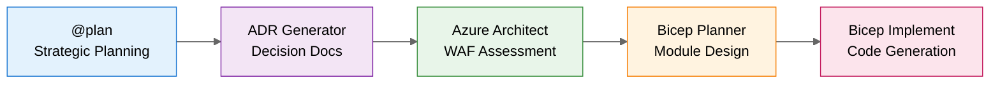

# Scenarios Overview

> **Hands-on learning scenarios demonstrating GitHub Copilot as an efficiency multiplier for IT Professionals.**

---

## Quick Start

| If you're...                     | Start with                                          |
| -------------------------------- | --------------------------------------------------- |
| **New to Copilot**               | [S01 Bicep Baseline](#s01-bicep-baseline)           |
| **Experienced with IaC**         | [S03 Five-Agent Workflow](#s03-five-agent-workflow) |
| **Focused on Terraform**         | [S02 Terraform Baseline](#s02-terraform-baseline)   |
| **Looking for async automation** | [S09 Coding Agent](#s09-coding-agent)               |

---

## Scenario Index

| #   | Scenario                                                  | Character       | Challenge                              | Time      | Difficulty   |
| --- | --------------------------------------------------------- | --------------- | -------------------------------------- | --------- | ------------ |
| S01 | [Bicep Baseline](#s01-bicep-baseline)                     | Elena Rodriguez | Build secure Azure network foundation  | 30 min    | Beginner     |
| S02 | [Terraform Baseline](#s02-terraform-baseline)             | Marcus Chen     | Multi-cloud IaC with Terraform         | 30 min    | Beginner     |
| S03 | [Five-Agent Workflow](#s03-five-agent-workflow)           | —               | End-to-end infrastructure design       | 45-60 min | Advanced     |
| S04 | [Documentation Generation](#s04-documentation-generation) | Elena Rodriguez | Auto-generate docs from code           | 20 min    | Beginner     |
| S05 | [Service Validation](#s05-service-validation)             | Marcus Thompson | Automated compliance testing           | 30 min    | Intermediate |
| S06 | [Troubleshooting](#s06-troubleshooting)                   | James Park      | Diagnose infrastructure issues         | 25 min    | Intermediate |
| S07 | [SBOM Generator](#s07-sbom-generator)                     | —               | Software Bill of Materials             | 20 min    | Intermediate |
| S08 | [Diagrams as Code](#s08-diagrams-as-code)                 | —               | Python-generated architecture diagrams | 20 min    | Beginner     |
| S09 | [Coding Agent](#s09-coding-agent)                         | Alex Petrov     | Async implementation via GitHub Issues | 30 min    | Advanced     |

---

## Scenario Details

### S01: Bicep Baseline

**[📁 View Scenario](S01-bicep-baseline/)**

> **Character**: Elena Rodriguez — Cloud Infrastructure Engineer with 10 years VMware experience, first Azure project

**Challenge**: Build a secure hub-spoke network foundation in 2 weeks with security requirements she's still learning.

**What You'll Learn**:

- Bicep fundamentals and Azure resource model
- Virtual Network concepts (mapped from VMware knowledge)
- Network Security Groups for microsegmentation
- Storage account security and private endpoints
- Module organization and parameter files

**Key Insight**: Copilot as a **learning partner** that maps existing skills to new platforms.

---

### S02: Terraform Baseline

**[📁 View Scenario](S02-terraform-baseline/)**

> **Character**: Marcus Chen — Senior Infrastructure Engineer with multi-cloud responsibilities

**Challenge**: Same hub-spoke topology as S01, but using Terraform for multi-cloud consistency.

**What You'll Learn**:

- HCL syntax and Terraform Azure Provider
- State management with Azure Storage backend
- Module patterns for reusable infrastructure
- Security scanning with tfsec and Checkov

**Key Insight**: Copilot accelerates Terraform development while maintaining multi-cloud portability.

---

### S03: Five-Agent Workflow

**[📁 View Scenario](S03-five-agent-workflow/)**

> **Production Example**: [`infra/bicep/contoso-patient-portal/`](../infra/bicep/contoso-patient-portal/) — 1,070 lines of Bicep, 10 modules

**Challenge**: Design and implement a HIPAA-compliant patient portal for Contoso Healthcare.

**The Five Agents**:



**Time Comparison**:
| Approach | Duration |
|----------|----------|
| Traditional manual | 18+ hours |
| With Five-Agent Workflow | **45 minutes** |

**Key Insight**: Structured agent handoffs preserve context and produce near-production-ready code.

---

### S04: Documentation Generation

**[📁 View Scenario](S04-documentation-generation/)**

> **Character**: Elena Rodriguez — Her infrastructure is deployed, but documentation is outdated

**Challenge**: Generate and maintain documentation that stays in sync with infrastructure code.

**What You'll Learn**:

- Auto-generate READMEs from Bicep/Terraform
- Create Mermaid architecture diagrams
- Build runbooks and operational guides
- Maintain consistency across documentation

**Key Insight**: Documentation as a **byproduct** of development, not a separate task.

---

### S05: Service Validation

**[📁 View Scenario](S05-service-validation/)**

> **Character**: Marcus Thompson — Cloud Architect preparing for Azure Advanced Specialization audit

**Challenge**: Verify 200+ compliance controls across infrastructure before auditors arrive.

**What You'll Learn**:

- PowerShell validation scripts with Pester
- Azure Policy compliance checking
- Automated audit evidence collection
- Pre-deployment validation patterns

**Key Insight**: Catch compliance gaps **before** auditors do.

---

### S06: Troubleshooting

**[📁 View Scenario](S06-troubleshooting/)**

> **Character**: James Park — Platform Engineer with production down and cryptic errors

**Challenge**: Diagnose and fix infrastructure issues under time pressure.

**What You'll Learn**:

- AI-assisted log analysis
- Azure Monitor and Log Analytics queries
- Root cause identification patterns
- Systematic debugging with Copilot

**Key Insight**: Minutes of AI-assisted diagnosis vs. hours of manual investigation.

---

### S07: SBOM Generator

**[📁 View Scenario](S07-sbom-generator/)**

**Challenge**: Generate Software Bill of Materials for compliance and security auditing.

**What You'll Learn**:

- SBOM generation with Syft
- Vulnerability scanning with Grype
- Container image analysis
- Compliance reporting formats

**Key Insight**: Automated security compliance without manual inventory.

---

### S08: Diagrams as Code

**[📁 View Scenario](S08-diagrams-as-code/)**

**Challenge**: Create Azure architecture diagrams that can be version-controlled and automated.

**What You'll Learn**:

- Python Diagrams library for Azure
- Architecture visualization patterns
- Diagram automation in CI/CD
- Consistent visual language

**Key Insight**: Diagrams that **never go stale** because they're generated from code.

---

### S09: Coding Agent

**[📁 View Scenario](S09-coding-agent/)**

> **Character**: Alex Petrov — Cloud Operations Engineer with 24 hours to add monitoring before go-live

**Challenge**: Implement monitoring infrastructure while handling other priorities.

**What You'll Learn**:

- GitHub Issue → Copilot assignment
- Autonomous codebase analysis
- Pull Request review workflow
- Async development patterns

**⚠️ Requirements**: GitHub Copilot Business/Enterprise with Coding Agent enabled

**Key Insight**: Delegate implementation to Copilot, focus on review and approval.

---

## Scenario Structure

Each scenario follows a consistent structure:

```
scenarios/SXX-scenario-name/
├── README.md              # Overview, character, learning objectives
├── DEMO-SCRIPT.md         # Step-by-step walkthrough with 🎓 Learning Moments
├── solution/              # Reference implementation
│   └── README.md          # Solution explanation
├── examples/              # Conversation transcripts
│   └── copilot-conversation.md
├── prompts/               # Effective prompts for this scenario
│   └── effective-prompts.md
└── validation/            # Post-completion validation
    └── validate.ps1
```

---

## Learning Paths

### Path 1: IaC Fundamentals (2 hours)

```
S01 Bicep Baseline → S04 Documentation → S05 Validation
```

Best for: IT Pros new to Infrastructure as Code

### Path 2: Advanced Workflow (3 hours)

```
S03 Five-Agent Workflow → S08 Diagrams as Code → S09 Coding Agent
```

Best for: Architects and senior engineers

### Path 3: Multi-Cloud (2 hours)

```
S01 Bicep Baseline → S02 Terraform Baseline → Compare approaches
```

Best for: Teams evaluating IaC tools

### Path 4: Operations Focus (2 hours)

```
S05 Service Validation → S06 Troubleshooting → S07 SBOM Generator
```

Best for: DevOps and platform engineers

---

## Time Savings Summary

| Scenario                | Traditional | With Copilot | Savings |
| ----------------------- | ----------- | ------------ | ------- |
| S01 Bicep Baseline      | 4-6 hours   | 30 min       | 87-92%  |
| S02 Terraform Baseline  | 4-6 hours   | 30 min       | 87-92%  |
| S03 Five-Agent Workflow | 18+ hours   | 45 min       | 96%     |
| S04 Documentation       | 2-3 hours   | 20 min       | 85-89%  |
| S05 Service Validation  | 4-6 hours   | 30 min       | 87-92%  |
| S06 Troubleshooting     | 2-4 hours   | 25 min       | 79-90%  |

---

## Contributing

Want to add a new scenario? See [CONTRIBUTING.md](../CONTRIBUTING.md) for guidelines.

Each scenario should:

- Feature a relatable IT Pro character with a real challenge
- Include discovery-based learning (not just script generation)
- Provide measurable time savings
- Include validation scripts

---

## Document Info

|                |                            |
| -------------- | -------------------------- |
| **Created**    | November 2025              |
| **Scenarios**  | 9                          |
| **Total Time** | ~4-5 hours (all scenarios) |
| **Maintainer** | Repository maintainers     |
