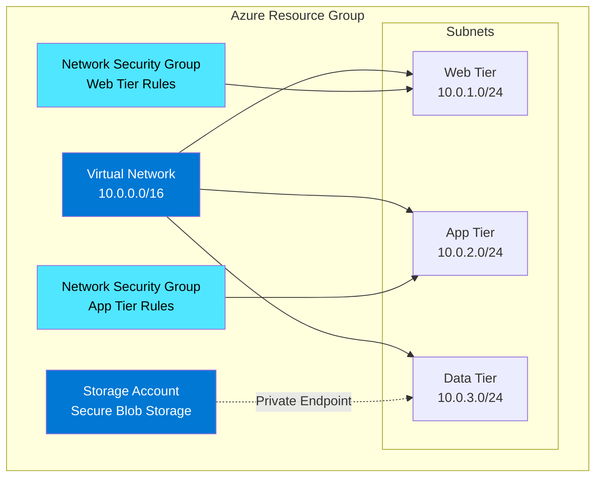

# Demo 1: Bicep Quickstart - Build Azure Infrastructure in Minutes

⏱️ **Duration**: 30 minutes  
🎯 **Difficulty**: Beginner  
💡 **Value**: 60-80% time reduction (45 min → 10 min)

## Overview

This demo showcases how GitHub Copilot accelerates Azure infrastructure creation using Bicep. You'll build a complete networking and storage solution that traditionally takes 45 minutes in just 10 minutes with Copilot assistance.

**Perfect for**: First-time Copilot demos, partner enablement sessions, customer proof-of-value

## Learning Objectives

By completing this demo, participants will learn to:

1. ✅ Use GitHub Copilot to generate Bicep infrastructure code
2. ✅ Apply effective prompting techniques for IaC
3. ✅ Validate and test Bicep templates quickly
4. ✅ Understand Copilot's context-awareness in multi-file projects
5. ✅ Deploy production-ready Azure infrastructure with confidence

## Scenario

**Customer Profile**: Mid-sized financial services company expanding to Azure

**Challenge**: IT team needs to deploy a hub-spoke network topology with secure storage for a new application. The team has limited Bicep experience and tight deadlines.

**Traditional Approach**:

- Research Bicep syntax and Azure resource schemas
- Write VNet with subnets, NSGs, and route tables
- Configure storage account with security settings
- Debug deployment errors
- **Time: 45-60 minutes**

**With Copilot**:

- Use natural language prompts to generate Bicep code
- Leverage Copilot's Azure resource knowledge
- Iterate quickly with inline suggestions
- **Time: 10-15 minutes**

**Business Impact**:

- ⚡ 75% faster infrastructure deployment
- 📚 Reduced learning curve for new team members
- ✅ Fewer deployment errors
- 💰 Lower operational costs

## What You'll Build



## Prerequisites

### Required Tools

- ✅ [VS Code](https://code.visualstudio.com/) with [GitHub Copilot](https://marketplace.visualstudio.com/items?itemName=GitHub.copilot)
- ✅ [Azure CLI](https://learn.microsoft.com/cli/azure/install-azure-cli) (2.50.0+)
- ✅ [Bicep CLI](https://learn.microsoft.com/azure/azure-resource-manager/bicep/install) (0.20.0+)
- ✅ Active Azure subscription with Contributor access

### Knowledge Prerequisites

- Basic understanding of Azure networking concepts
- Familiarity with VS Code
- No prior Bicep experience required!

### Azure Resources Deployed

- 1 Virtual Network
- 3 Subnets
- 2 Network Security Groups
- 1 Storage Account
- Estimated cost: **~$10/month** (minimal for demo)

## Demo Components

### 📁 [scenario/](./scenario/)

- **requirements.md**: Detailed customer requirements
- **architecture.md**: Target architecture with diagrams

### 📁 [manual-approach/](./manual-approach/)

- **template.json**: Traditional ARM template example
- **time-tracking.md**: Manual effort breakdown (45 min)

### 📁 [with-copilot/](./with-copilot/)

- **network.bicep**: VNet, subnets, NSGs (generated with Copilot)
- **storage.bicep**: Storage account configuration
- **main.bicep**: Main orchestration template
- **time-tracking.md**: Copilot-assisted effort (10 min)

### 📁 [prompts/](./prompts/)

- **effective-prompts.md**: Curated prompts for this scenario
- **prompt-patterns.md**: Reusable prompt templates

### 📁 [validation/](./validation/)

- **deploy.ps1**: Automated deployment script
- **cleanup.ps1**: Resource cleanup script
- **verify.ps1**: Post-deployment validation

## Quick Start

### Option 1: Follow the Full Demo (30 min)

```bash
# 1. Open the demo script
code scenarios/01-bicep-quickstart/DEMO-SCRIPT.md

# 2. Follow step-by-step instructions
# 3. Use provided prompts
# 4. Compare manual vs. Copilot approaches
```

### Option 2: Deploy Pre-Built Solution (5 min)

```powershell
# Navigate to validation folder
cd scenarios/01-bicep-quickstart/validation

# Run deployment script
./deploy.ps1 -ResourceGroupName "rg-copilot-demo" -Location "eastus"

# Verify deployment
./verify.ps1 -ResourceGroupName "rg-copilot-demo"

# Clean up when done
./cleanup.ps1 -ResourceGroupName "rg-copilot-demo"
```

## Key Copilot Features Demonstrated

### 1. Natural Language to Code

```

Prompt: "Create a Bicep template for an Azure VNet with three subnets for web, app, and data tiers"
Result: Complete VNet resource with subnet definitions

```

### 2. Context-Aware Suggestions

- Copilot understands existing file context
- Suggests consistent naming conventions
- Follows Azure best practices automatically

### 3. Resource Parameter Intelligence

- Auto-suggests valid Azure regions
- Recommends appropriate SKUs
- Validates resource naming rules

### 4. Multi-File Orchestration

- Generates module references
- Creates proper parameter passing
- Maintains consistent structure

### 5. Security Best Practices

- Includes NSG rules by default
- Suggests secure storage configurations
- Recommends private endpoints

## Success Metrics

Track these metrics during your demo:

| Metric | Manual | With Copilot | Improvement |
|--------|--------|--------------|-------------|
| **Time to First Resource** | 15 min | 2 min | 87% faster |
| **Total Development Time** | 45 min | 10 min | 78% reduction |
| **Lines of Code Written** | 250+ | 50 (prompts) | 80% less typing |
| **Deployment Errors** | 3-5 | 0-1 | 60-80% fewer |
| **Documentation Time** | 10 min | 2 min | 80% reduction |

## Troubleshooting

### Common Issues

**Copilot not suggesting code:**

- Ensure GitHub Copilot extension is active
- Check VS Code status bar for Copilot icon
- Try pressing `Ctrl+Enter` to open Copilot panel

**Bicep deployment fails:**

```powershell
# Validate template before deployment
az bicep build --file main.bicep

# Check for errors
bicep build main.bicep
```

**Azure CLI authentication:**

```powershell
# Re-authenticate
az login

# Set subscription
az account set --subscription "your-subscription-id"
```

### Getting Help

- 📖 Review [prompts/effective-prompts.md](./prompts/effective-prompts.md)
- 💬 Ask in [GitHub Discussions](../../discussions)
- 🐛 Report issues in [GitHub Issues](../../issues)

## Customization Guide

### Adapting for Your Scenario

1. **Change Network Address Space**:
   - Edit `network.bicep`
   - Modify `addressPrefix` parameter
   - Update subnet ranges accordingly

2. **Add More Subnets**:
   - Prompt: "Add a subnet for Azure Bastion with /26 CIDR"
   - Copilot will maintain consistency

3. **Different Storage Configuration**:
   - Prompt: "Configure storage for static website hosting"
   - Adjust security settings as needed

4. **Add Monitoring**:
   - Prompt: "Add Log Analytics workspace and diagnostic settings"
   - Connect resources to monitoring

## Next Steps

### For Demo Presenters

1. ✅ Practice the demo script 2-3 times
2. ✅ Customize prompts for your audience
3. ✅ Prepare backup examples (see [prompts/prompt-patterns.md](./prompts/prompt-patterns.md))
4. ✅ Test deployment in your subscription

### For Learners

1. 🎯 Complete [Demo 2: PowerShell Automation](../02-powershell-automation/)
2. 🎯 Explore [Demo 3: Azure Arc Onboarding](../03-azure-arc-onboarding/)
3. 🎯 Review [Skills Bridge: IaC Fundamentals](../../skills-bridge/iac-fundamentals/)

### For Partners

1. 📊 Use [partner-toolkit/roi-calculator.xlsx](../../partner-toolkit/roi-calculator.xlsx)
2. 📝 Customize [partner-toolkit/demo-delivery-guide.md](../../partner-toolkit/demo-delivery-guide.md)
3. 💼 Review [case-studies/financial-services-bicep.md](../../case-studies/financial-services-bicep.md)

## Related Resources

### Microsoft Learn

- [Bicep Fundamentals](https://learn.microsoft.com/training/paths/fundamentals-bicep/)
- [Azure Networking Basics](https://learn.microsoft.com/azure/networking/fundamentals/)
- [GitHub Copilot for Azure](https://learn.microsoft.com/azure/developer/github/github-copilot-azure)

### Repository Content

- [Demo Script](./DEMO-SCRIPT.md) - Step-by-step walkthrough
- [Effective Prompts](./prompts/effective-prompts.md) - Production-tested prompts
- [Validation Scripts](./validation/) - Automated testing

---

**⏱️ Time Investment**: 30 minutes  
**💰 Value Delivered**: 10+ hours saved per week for your team  
**🎯 Next Demo**: [PowerShell Automation](../02-powershell-automation/)

[🏠 Back to Main README](../../README.md) | [📚 View All Demos](../../README.md#-featured-demos)
