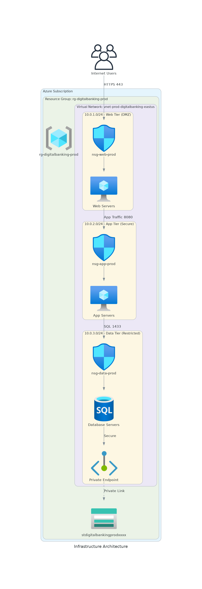

# Infrastructure Architecture (Diagrams as Code)

This document demonstrates the "Diagrams as Code" approach for the Bicep Baseline scenario, using Python to generate the architecture diagram. This ensures the diagram remains consistent with the code and can be version controlled.

## Generated Diagram



## Python Code

The following Python code generates the diagram above. It uses the `diagrams` library to define resources and relationships.

```python
from diagrams import Cluster, Diagram, Edge
from diagrams.azure.general import Resourcegroups
from diagrams.azure.network import VirtualNetworks, Subnets, NetworkSecurityGroupsClassic, PrivateEndpoint
from diagrams.azure.compute import VM
from diagrams.azure.database import SQLDatabases
from diagrams.azure.storage import StorageAccounts
from diagrams.onprem.client import Users

# Create the diagram
with Diagram("Infrastructure Architecture", show=False, direction="TB"):
    
    internet = Users("Internet Users")

    with Cluster("Azure Subscription"):
        with Cluster("Resource Group: rg-digitalbanking-prod"):
            
            rg = Resourcegroups("rg-digitalbanking-prod")
            
            storage = StorageAccounts("stdigitalbankingprodxxxx")
            
            with Cluster("Virtual Network: vnet-prod-digitalbanking-eastus"):
                
                with Cluster("10.0.1.0/24 - Web Tier (DMZ)"):
                    nsg_web = NetworkSecurityGroupsClassic("nsg-web-prod")
                    web_vms = VM("Web Servers")
                    
                with Cluster("10.0.2.0/24 - App Tier (Secure)"):
                    nsg_app = NetworkSecurityGroupsClassic("nsg-app-prod")
                    app_vms = VM("App Servers")
                    
                with Cluster("10.0.3.0/24 - Data Tier (Restricted)"):
                    nsg_data = NetworkSecurityGroupsClassic("nsg-data-prod")
                    data_vms = SQLDatabases("Database Servers")
                    pe = PrivateEndpoint("Private Endpoint")

    # Define connections
    internet >> Edge(label="HTTPS 443") >> nsg_web >> web_vms
    web_vms >> Edge(label="App Traffic 8080") >> nsg_app >> app_vms
    app_vms >> Edge(label="SQL 1433") >> nsg_data >> data_vms
    data_vms >> Edge(label="Secure") >> pe >> Edge(label="Private Link", style="dashed") >> storage
```

## How to Generate

1. Ensure you have Python and Graphviz installed.
2. Install the `diagrams` library:

   ```bash
   pip install diagrams
   ```

3. Run the script:

   ```bash
   python architecture_diagram.py
   ```
