# Infrastructure Architecture

## Logical Architecture


## Network Segmentation

### Traffic Flow Rules


| Source | Destination | Protocol | Port | Action | Purpose |
|--------|-------------|----------|------|--------|---------|
| Internet | Web Tier | TCP | 80, 443 | ✅ Allow | Public web access |
| Internet | App Tier | Any | Any | ❌ Deny | No direct app access |
| Internet | Data Tier | Any | Any | ❌ Deny | No direct data access |
| Web Tier | App Tier | TCP | 8080 | ✅ Allow | Application calls |
| Web Tier | Data Tier | Any | Any | ❌ Deny | Prevent tier jumping |
| App Tier | Data Tier | TCP | 1433 | ✅ Allow | Database queries |
| Data Tier | Storage | HTTPS | 443 | ✅ Allow | Private endpoint only |

## Security Architecture


### Security Controls Implemented

| Control | Technology | Purpose | Compliance |
|---------|------------|---------|------------|
| **Network Isolation** | NSGs on all subnets | Segment traffic between tiers | PCI-DSS Req 1 |
| **No Public Access** | Private Endpoints | Eliminate internet exposure | PCI-DSS Req 1.3 |
| **Encryption in Transit** | TLS 1.2 minimum | Protect data during transmission | PCI-DSS Req 4 |
| **Encryption at Rest** | Storage Service Encryption | Protect stored data | PCI-DSS Req 3 |
| **Accidental Deletion Protection** | Soft Delete (7 days) | Recover from mistakes | SOC 2 CC6.1 |
| **Change Auditing** | Activity Logs | Track all modifications | SOC 2 CC7.2 |

## Resource Topology


## Deployment Architecture

### Bicep Module Structure


### Parameter Flow


## Address Space Planning

### Subnet Sizing

| Subnet | CIDR | Usable IPs | Reserved by Azure | Available | Purpose |
|--------|------|------------|-------------------|-----------|---------|
| **Web Tier** | 10.0.1.0/24 | 256 | 5 | **251** | Load balancers, web VMs |
| **App Tier** | 10.0.2.0/24 | 256 | 5 | **251** | App servers, containers |
| **Data Tier** | 10.0.3.0/24 | 256 | 5 | **251** | Databases, private endpoints |
| **Reserved** | 10.0.4.0/22 | 1,024 | - | **1,024** | Future expansion |
| **Total** | 10.0.0.0/16 | 65,536 | 15 | **65,521** | Full address space |

### Growth Planning


## Cost Projection

### Monthly Infrastructure Costs (East US)

| Resource | SKU/Tier | Quantity | Unit Cost | Monthly Cost |
|----------|----------|----------|-----------|--------------|
| **VNet** | Standard | 1 | No charge | No charge |
| **NSGs** | Standard | 3 | No charge | No charge |
| **Storage Account** | Standard LRS (Hot) | 100 GB | Per GB charge | Minimal |
| **Private Endpoint** | Standard | 1 | Per endpoint | Minimal |
| **Data Transfer** | Outbound | 10 GB | Per GB charge | Minimal |
| **Total** | - | - | - | **Very low cost** |

> **Note**: This is infrastructure-only cost. VM/container costs are separate and depend on application requirements.

### Cost Optimization Tips

1. **Use Standard Storage**: LRS vs. GRS saves ~50% if geo-redundancy not required
2. **Right-Size Subnets**: Don't over-allocate address space (unused IPs cost nothing, but complexity does)
3. **Leverage Free Tier**: NSGs, VNet peering (first 10 GB), and basic monitoring are free
4. **Automate Cleanup**: Delete dev/test resources when not in use

## Compliance Mapping

### PCI-DSS Requirements

| Requirement | Control | Implementation |
|-------------|---------|----------------|
| **Req 1**: Firewall configuration | NSGs | Subnet-level rules, deny by default |
| **Req 2**: Secure configurations | IaC | Bicep templates with hardened defaults |
| **Req 3**: Protect stored data | Encryption | Storage Service Encryption (AES-256) |
| **Req 4**: Encrypt transmission | TLS | Minimum TLS 1.2, HTTPS only |
| **Req 10**: Track and monitor | Logs | Activity logs, NSG flow logs |

### SOC 2 Type II Controls

| Control | Description | Evidence |
|---------|-------------|----------|
| **CC6.1** | Logical access controls | NSG rules, private endpoints |
| **CC6.6** | Encryption at rest | Storage encryption enabled |
| **CC6.7** | Encryption in transit | TLS 1.2 minimum enforced |
| **CC7.2** | Change management | Git version control, audit logs |

## Deployment Validation

### Post-Deployment Checks

```mermaid
%%{init: {'theme':'neutral'}}%%
flowchart TD
    Start([Deploy Infrastructure]) --> Check1{VNet Exists?}
    Check1 -->|Yes| Check2{3 Subnets Created?}
    Check1 -->|No| Fail1[❌ Deployment Failed]
    
    Check2 -->|Yes| Check3{NSGs Attached?}
    Check2 -->|No| Fail2[❌ Subnets Missing]
    
    Check3 -->|Yes| Check4{Storage Account Secure?}
    Check3 -->|No| Fail3[❌ NSGs Not Attached]
    
    Check4 -->|Yes| Check5{Private Endpoint Working?}
    Check4 -->|No| Fail4[❌ Public Access Enabled]
    
    Check5 -->|Yes| Success[✅ Deployment Validated]
    Check5 -->|No| Fail5[❌ Private Endpoint Failed]
    
    style Start fill:#E8F4F8,stroke:#0078D4,color:#000
    style Success fill:#4ECDC4,stroke:#2C7873,color:#000
    style Fail1 fill:#FF6B6B,stroke:#C92A2A,color:#fff
    style Fail2 fill:#FF6B6B,stroke:#C92A2A,color:#fff
    style Fail3 fill:#FF6B6B,stroke:#C92A2A,color:#fff
    style Fail4 fill:#FF6B6B,stroke:#C92A2A,color:#fff
    style Fail5 fill:#FF6B6B,stroke:#C92A2A,color:#fff
```



### Validation Script Output

```bicep
Running deployment validation...

✅ Resource Group: rg-digitalbanking-prod
   Location: East US
   Tags: Environment=prod, Application=DigitalBanking

✅ Virtual Network: vnet-prod-digitalbanking-eastus
   Address Space: 10.0.0.0/16
   Subnets: 3 configured

✅ Subnet: snet-web-prod (10.0.1.0/24)
   NSG: nsg-web-prod (attached)
   Rules: Allow 80, 443 from Internet | Allow 8080 to App Tier

✅ Subnet: snet-app-prod (10.0.2.0/24)
   NSG: nsg-app-prod (attached)
   Rules: Allow 8080 from Web Tier | Allow 1433 to Data Tier

✅ Subnet: snet-data-prod (10.0.3.0/24)
   NSG: nsg-data-prod (attached)
   Rules: Allow 1433 from App Tier | Deny all other

✅ Storage Account: stdigitalbankingprodxxxx
   SKU: Standard_LRS
   HTTPS Only: Enabled
   Min TLS: 1.2
   Public Blob Access: Disabled
   Soft Delete: Enabled (7 days)
   Private Endpoint: Configured in snet-data-prod

Deployment Status: SUCCESS ✅
Total Resources: 8
Security Score: 100/100
Compliance: PCI-DSS, SOC 2 controls verified
```

---

**Architecture Highlights:**

- 🔒 **Zero Trust**: No public access to storage, all traffic flows through NSGs
- 📐 **Three-Tier Design**: Clear separation of web, app, and data layers
- 🛡️ **Defense in Depth**: 6 layers of security controls
- 📈 **Scalable**: Room for 65K+ IP addresses, can grow to thousands of VMs
- 💰 **Cost-Effective**: Very low monthly cost for infrastructure foundation (primarily storage and data transfer)
- ✅ **Compliant**: Meets PCI-DSS and SOC 2 requirements

[🏠 Back to Scenario Requirements](./requirements.md) | [📚 Back to Demo README](../README.md)
