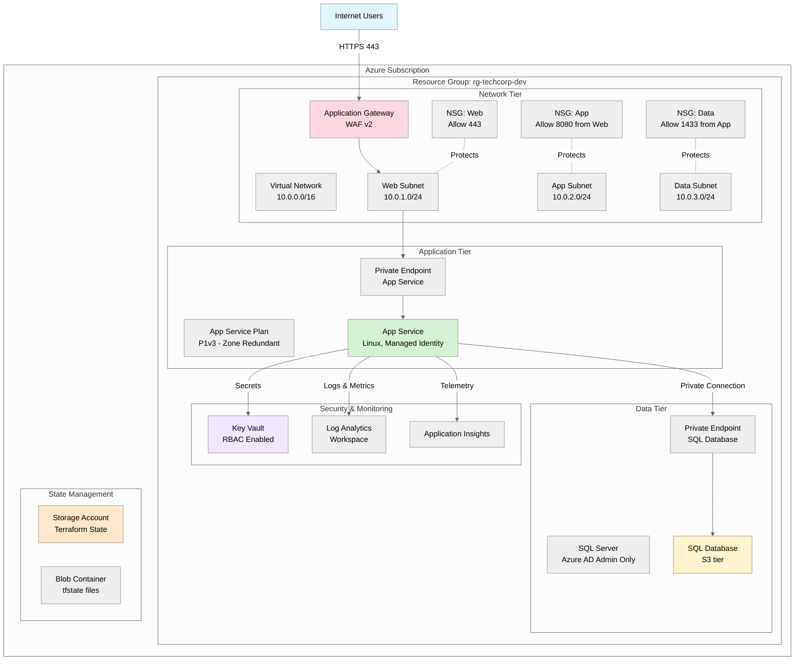
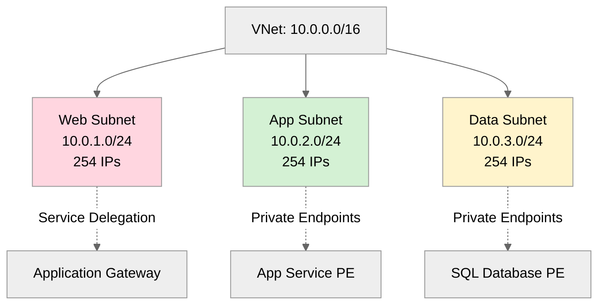

# Target Architecture: 3-Tier Web Application

## High-Level Overview



---

## Network Architecture

### Virtual Network Design

**Address Space**: `10.0.0.0/16` (65,536 IPs)



### Subnet Details

| Subnet | CIDR | Purpose | Service Delegation | Private Endpoints |
|--------|------|---------|-------------------|-------------------|
| **snet-web** | 10.0.1.0/24 | Application Gateway | Microsoft.Network/applicationGateways | None |
| **snet-app** | 10.0.2.0/24 | App Service Private Endpoints | None | App Service |
| **snet-data** | 10.0.3.0/24 | Database Private Endpoints | None | SQL Database |

### Network Security Groups (NSGs)

#### NSG: Web Subnet

```hcl
# Priority 100: Allow HTTPS from Internet
Allow Inbound: Source=Internet, Destination=10.0.1.0/24, Port=443, Protocol=TCP

# Priority 4096: Deny all other inbound
Deny Inbound: Source=*, Destination=*, Port=*, Protocol=*
```

#### NSG: App Subnet

```hcl
# Priority 100: Allow App Service communication
Allow Inbound: Source=10.0.1.0/24, Destination=10.0.2.0/24, Port=8080, Protocol=TCP

# Priority 4096: Deny all other inbound
Deny Inbound: Source=*, Destination=*, Port=*, Protocol=*
```

#### NSG: Data Subnet

```hcl
# Priority 100: Allow SQL from App Subnet
Allow Inbound: Source=10.0.2.0/24, Destination=10.0.3.0/24, Port=1433, Protocol=TCP

# Priority 4096: Deny all other inbound
Deny Inbound: Source=*, Destination=*, Port=*, Protocol=*
```

---

## Application Gateway Configuration

### SKU & Features

- **SKU**: WAF_v2 (Web Application Firewall v2)
- **Capacity**: Autoscaling 2-10 instances
- **Tier**: Standard_v2
- **Zone Redundancy**: Enabled (zones 1, 2, 3)

### Backend Pool

- **Target**: App Service via Private Endpoint
- **Health Probe**: HTTPS on path `/health` every 30 seconds
- **Session Affinity**: Cookie-based (if needed)

### WAF Configuration

- **Mode**: Prevention
- **Rule Set**: OWASP 3.2
- **Custom Rules**:
  - Block requests from known malicious IPs
  - Rate limiting: 100 requests/minute per IP
  - Geo-blocking (optional, based on requirements)

---

## Application Tier

### App Service Plan

```hcl
resource "azurerm_service_plan" "main" {
  name                = "asp-techcorp-dev"
  location            = "swedencentral"
  os_type             = "Linux"
  sku_name            = "P1v3"      # Premium v3 (zone redundancy)
  zone_balancing_enabled = true     # Spread across availability zones
  worker_count        = 3            # Minimum for zone redundancy
  
  tags = {
    Environment = "dev"
    ManagedBy   = "Terraform"
    CostCenter  = "Engineering"
  }
}
```

**Why P1v3?**

- ✅ Zone redundancy support (Standard SKU doesn't support it)
- ✅ 4 GB RAM, 2 vCPUs
- ✅ Private endpoint support
- ✅ Low monthly cost (dev environment optimized)

### App Service

```hcl
resource "azurerm_linux_web_app" "main" {
  name                = "app-techcorp-dev-abc123"  # Globally unique
  location            = "swedencentral"
  service_plan_id     = azurerm_service_plan.main.id
  
  site_config {
    always_on        = true
    http2_enabled    = true
    minimum_tls_version = "1.2"
    
    application_stack {
      dotnet_version = "7.0"  # Or node, python, etc.
    }
  }
  
  https_only          = true
  public_network_access_enabled = false  # Private endpoint only
  
  identity {
    type = "SystemAssigned"  # Managed Identity
  }
  
  app_settings = {
    "APPINSIGHTS_INSTRUMENTATIONKEY" = azurerm_application_insights.main.instrumentation_key
    "KeyVaultUrl" = azurerm_key_vault.main.vault_uri
  }
  
  connection_string {
    name  = "DefaultConnection"
    type  = "SQLAzure"
    value = "Server=tcp:${azurerm_mssql_server.main.fully_qualified_domain_name},1433;..."
  }
}
```

### Private Endpoint (App Service)

```hcl
resource "azurerm_private_endpoint" "app_service" {
  name                = "pe-app-techcorp-dev"
  location            = "swedencentral"
  resource_group_name = azurerm_resource_group.main.name
  subnet_id           = azurerm_subnet.app.id
  
  private_service_connection {
    name                           = "psc-app"
    private_connection_resource_id = azurerm_linux_web_app.main.id
    is_manual_connection           = false
    subresource_names              = ["sites"]
  }
  
  private_dns_zone_group {
    name                 = "pdns-group-app"
    private_dns_zone_ids = [azurerm_private_dns_zone.app_service.id]
  }
}
```

---

## Data Tier

### SQL Server

```hcl
resource "azurerm_mssql_server" "main" {
  name                         = "sql-techcorp-dev-abc123"
  location                     = "swedencentral"
  resource_group_name          = azurerm_resource_group.main.name
  version                      = "12.0"
  administrator_login          = "sqladmin"  # Stored in Key Vault
  administrator_login_password = data.azurerm_key_vault_secret.sql_password.value
  
  azuread_administrator {
    login_username = "SQL Admins"
    object_id      = data.azuread_group.sql_admins.object_id
    azuread_authentication_only = true  # Disable SQL auth (Azure AD only)
  }
  
  public_network_access_enabled = false  # Private endpoint only
  
  tags = {
    Environment    = "dev"
    ManagedBy      = "Terraform"
    SecurityControl = "Ignore"  # For demo (bypass Azure AD-only policy)
  }
}
```

### SQL Database

```hcl
resource "azurerm_mssql_database" "main" {
  name           = "sqldb-techcorp-dev"
  server_id      = azurerm_mssql_server.main.id
  sku_name       = "S0"  # Standard tier (dev) - prod would use S3+
  max_size_gb    = 250
  zone_redundant = false  # Set to true for prod
  
  threat_detection_policy {
    state                      = "Enabled"
    email_account_admins      = true
    retention_days            = 30
  }
  
  long_term_retention_policy {
    weekly_retention  = "P1W"   # 1 week (dev)
    monthly_retention = "P1M"   # 1 month
  }
  
  short_term_retention_policy {
    retention_days = 7  # Point-in-time restore (dev) - prod: 35 days
  }
}
```

### Private Endpoint (SQL Database)

```hcl
resource "azurerm_private_endpoint" "sql" {
  name                = "pe-sql-techcorp-dev"
  location            = "swedencentral"
  resource_group_name = azurerm_resource_group.main.name
  subnet_id           = azurerm_subnet.data.id
  
  private_service_connection {
    name                           = "psc-sql"
    private_connection_resource_id = azurerm_mssql_server.main.id
    is_manual_connection           = false
    subresource_names              = ["sqlServer"]
  }
  
  private_dns_zone_group {
    name                 = "pdns-group-sql"
    private_dns_zone_ids = [azurerm_private_dns_zone.sql.id]
  }
}
```

---

## Security & Monitoring

### Key Vault

```hcl
resource "azurerm_key_vault" "main" {
  name                = "kv-techcorp-dev-abc123"  # Max 24 chars
  location            = "swedencentral"
  resource_group_name = azurerm_resource_group.main.name
  tenant_id           = data.azurerm_client_config.current.tenant_id
  sku_name            = "standard"
  
  enable_rbac_authorization = true  # Use RBAC (not access policies)
  purge_protection_enabled  = true
  soft_delete_retention_days = 7   # Dev: 7 days, Prod: 90 days
  
  network_acls {
    bypass         = "AzureServices"
    default_action = "Deny"
    ip_rules       = []  # No public access
  }
}

# RBAC Assignment: App Service can read secrets
resource "azurerm_role_assignment" "app_kv_secrets" {
  scope                = azurerm_key_vault.main.id
  role_definition_name = "Key Vault Secrets User"
  principal_id         = azurerm_linux_web_app.main.identity[0].principal_id
}
```

### Log Analytics Workspace

```hcl
resource "azurerm_log_analytics_workspace" "main" {
  name                = "law-techcorp-dev"
  location            = "swedencentral"
  resource_group_name = azurerm_resource_group.main.name
  sku                 = "PerGB2018"
  retention_in_days   = 30  # Dev: 30 days, Prod: 90 days
  
  tags = {
    Environment = "dev"
    ManagedBy   = "Terraform"
  }
}

# Diagnostic Settings: App Service logs to LAW
resource "azurerm_monitor_diagnostic_setting" "app_service" {
  name                       = "diag-app-service"
  target_resource_id         = azurerm_linux_web_app.main.id
  log_analytics_workspace_id = azurerm_log_analytics_workspace.main.id
  
  log {
    category = "AppServiceHTTPLogs"
    enabled  = true
  }
  
  log {
    category = "AppServiceConsoleLogs"
    enabled  = true
  }
  
  metric {
    category = "AllMetrics"
    enabled  = true
  }
}
```

### Application Insights

```hcl
resource "azurerm_application_insights" "main" {
  name                = "ai-techcorp-dev"
  location            = "swedencentral"
  resource_group_name = azurerm_resource_group.main.name
  workspace_id        = azurerm_log_analytics_workspace.main.id
  application_type    = "web"
  
  tags = {
    Environment = "dev"
    ManagedBy   = "Terraform"
  }
}
```

---

## Terraform State Management

### Storage Account (Backend)

```hcl
resource "azurerm_storage_account" "tfstate" {
  name                     = "sttfstatetechcorpdev"
  resource_group_name      = azurerm_resource_group.state.name
  location                 = "swedencentral"
  account_tier             = "Standard"
  account_replication_type = "LRS"  # Dev: LRS, Prod: GRS
  
  enable_https_traffic_only = true
  min_tls_version          = "TLS1_2"
  
  blob_properties {
    versioning_enabled = true  # State file versioning
  }
  
  tags = {
    Environment = "dev"
    ManagedBy   = "Terraform"
    Purpose     = "TerraformState"
  }
}

resource "azurerm_storage_container" "tfstate" {
  name                  = "tfstate"
  storage_account_name  = azurerm_storage_account.tfstate.name
  container_access_type = "private"
}
```

### Backend Configuration

```hcl
# environments/dev/backend.tf
terraform {
  backend "azurerm" {
    resource_group_name  = "rg-terraform-state"
    storage_account_name = "sttfstatetechcorpdev"
    container_name       = "tfstate"
    key                  = "dev.terraform.tfstate"
    use_azuread_auth     = true  # Use Azure AD (no access keys)
  }
}
```

---

## Environment-Specific Variations

### Development Environment

| Resource | Configuration | Rationale |
|----------|--------------|-----------|
| **App Service Plan** | P1v3, 3 instances | Zone redundant, cost-optimized |
| **SQL Database** | S0 tier | Basic performance tier |
| **Backup Retention** | 7 days | Short retention for dev data |
| **Log Retention** | 30 days | Compliance minimum |
| **Total Cost** | Low | Budget-friendly dev tier |

### Staging Environment

| Resource | Configuration | Rationale |
|----------|--------------|-----------|
| **App Service Plan** | P2v3, 3 instances | Closer to prod performance |
| **SQL Database** | S2 tier | Mid-tier performance |
| **Backup Retention** | 14 days | Pre-production testing |
| **Log Retention** | 60 days | Extended debugging |
| **Total Cost** | Moderate | Production-like staging |

### Production Environment

| Resource | Configuration | Rationale |
|----------|--------------|-----------|
| **App Service Plan** | P3v3, 6 instances | High availability + scale |
| **SQL Database** | S3 tier, zone-redundant | Business-critical |
| **Backup Retention** | 35 days | Compliance requirement |
| **Log Retention** | 90 days | Audit requirements |
| **Total Cost** | Higher | Mission-critical production |

---

## Security Controls

### 1. Network Isolation

✅ **Private Endpoints**: All data services (App Service, SQL Database, Key Vault) accessible only via private endpoints  
✅ **No Public Access**: `public_network_access_enabled = false` on all resources  
✅ **NSG Rules**: Deny-by-default with explicit allow rules between tiers

### 2. Identity & Access

✅ **Managed Identity**: App Service uses system-assigned managed identity (no credentials)  
✅ **RBAC**: Key Vault uses Azure RBAC (no access policies)  
✅ **Azure AD Admin**: SQL Server uses Azure AD authentication only (SQL auth disabled)

### 3. Data Protection

✅ **Encryption at Rest**: TDE enabled on SQL Database  
✅ **Encryption in Transit**: TLS 1.2 minimum on all endpoints  
✅ **Soft Delete**: Key Vault has 7-day soft delete  
✅ **Geo-Redundant Backup**: SQL Database with point-in-time restore

### 4. Monitoring & Compliance

✅ **Diagnostic Settings**: All resources log to Log Analytics  
✅ **Application Insights**: Performance monitoring and telemetry  
✅ **Advanced Threat Protection**: Enabled on SQL Database  
✅ **Security Baseline**: Follows Microsoft Defender for Cloud recommendations

---

## Deployment Sequence

```mermaid
%%{init: {'theme':'neutral'}}%%
graph LR
    A[Resource Group] --> B[Virtual Network]
    B --> C[Subnets]
    C --> D[NSGs]
    D --> E[Private DNS Zones]
    E --> F[Key Vault]
    F --> G[Log Analytics]
    G --> H[App Service Plan]
    H --> I[App Service]
    I --> J[SQL Server]
    J --> K[SQL Database]
    K --> L[Private Endpoints]
    L --> M[Application Gateway]
    M --> N[Monitoring Setup]
    
    style A fill:#e1f5ff
    style F fill:#f0e6ff
    style J fill:#fff4cc
    style M fill:#ffd6e0
```



**Dependencies**:

1. Network foundation must be created first (VNet, subnets, NSGs)
2. Private DNS zones needed before private endpoints
3. Key Vault created early for secrets storage
4. App Service Plan before App Service
5. SQL Server before SQL Database
6. Private endpoints created after data services
7. Application Gateway configured last (requires backend targets)

---

## Testing Validation

### Post-Deployment Checks

```bash
# 1. Network connectivity
Test-NetConnection <app-service-pe-ip> -Port 443

# 2. SQL connectivity (from App Service)
sqlcmd -S <sql-server-fqdn> -U <user> -P <password> -Q "SELECT @@VERSION"

# 3. Application health
curl -k https://<app-gateway-fqdn>/health

# 4. Key Vault access (using Managed Identity)
az keyvault secret show --vault-name kv-techcorp-dev-abc123 --name ConnectionString

# 5. Logs flowing to Log Analytics
az monitor log-analytics query -w <workspace-id> --analytics-query "AppServiceHTTPLogs | take 10"
```

---

**Next Steps**: See `../with-copilot/example-code/` for complete Terraform implementation.
