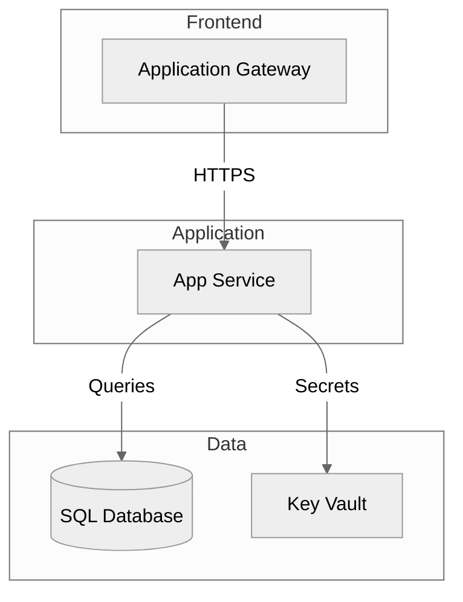

# Demo Script: Documentation Generation

**Duration:** 30 minutes  
**Presenter Level:** Intermediate (comfortable with Azure and PowerShell)  
**Audience:** IT Pros, Cloud Architects, Technical Writers, System Integrators

---

## Demo Objectives

By the end of this demo, the audience will understand:

1. **Why** documentation automation works (data → narrative transformation)
2. **How** Azure Resource Graph enables documentation at scale
3. **What** the prompt-based generation workflow looks like
4. **When** human review is essential vs. when automation is sufficient

---

## Pre-Demo Setup (15 minutes before)

### Environment Checklist

- [ ] VS Code open with GitHub Copilot enabled
- [ ] Azure subscription with deployed resources (or use sample)
- [ ] Terminal ready with Az module loaded (`Import-Module Az`)
- [ ] Browser tab: Azure Portal (for verification)
- [ ] Files open:
  - `examples/copilot-documentation-conversation.md`
  - `solution/ArchitectureDoc.ps1`

### Quick Validation

```powershell
# Verify Azure connection
Get-AzContext | Select-Object Name, Subscription

# Verify resources exist
Get-AzResource -ResourceGroupName "rg-demo" | Select-Object Name, Type | Format-Table
```

---

## Act 1: The Documentation Problem (5 minutes)

### Scene Setting

**Presenter Script:**

> "Let's talk about everyone's favorite task... documentation."
> *(pause for knowing laughs)*
>
> "Meet Priya—she's a technical writer at CloudDocs Solutions. Her company just completed
> a 50-server Azure migration for TechCorp. The infrastructure is perfect. The deployment
> worked flawlessly. And now..."
> *(dramatic pause)*
>
> "...she has to document all of it."

### Show the Pain

**Open a complex architecture diagram in PowerPoint or Visio:**

> "This is what Priya's looking at. Six hours to create architecture diagrams in Visio.
> Eight hours writing the Day 2 operations guide. Five hours compiling troubleshooting
> procedures. Another four hours on API documentation."

**Display the time breakdown:**

| Documentation Type | Time Required |
|-------------------|---------------|
| Architecture Diagrams | 6 hours |
| Day 2 Operations Guide | 8 hours |
| Troubleshooting Guide | 5 hours |
| API Documentation | 4 hours |
| Review & Polish | 2 hours |
| **Total** | **25 hours** |

> "Twenty-five hours. That's more than three full workdays just writing documentation.
> And here's the worst part..."
> *(click to show "Documentation Decay" slide)*
>
> "The moment she finishes, someone changes the infrastructure, and it's already outdated."

### The Key Insight

> "But Priya had a question that changed everything. She asked Copilot:
> 'Why can't I automate this? What would I need to make documentation generation work?'"

**Show the fundamental insight:**

```
The Automation Insight:
━━━━━━━━━━━━━━━━━━━━━━━━━━━━━━━━━━━━━━━━━━━━━━━━
Documentation automation doesn't write from nothing.
It transforms STRUCTURED DATA into NARRATIVE.
━━━━━━━━━━━━━━━━━━━━━━━━━━━━━━━━━━━━━━━━━━━━━━━━

Azure Resources → Query → Data → Prompt → Documentation
```

> "Once Priya understood this, everything clicked."

---

## Act 2: Understanding the Pattern (8 minutes)

### Part 1: Why Resource Graph? (3 minutes)

**Open the conversation transcript** (`examples/copilot-documentation-conversation.md`):

> "Priya's first question was simple: 'Why Azure Resource Graph instead of just using the portal?'"

**Show the comparison:**

| Approach | Time for 50 Resources | Output | Automation |
|----------|----------------------|--------|------------|
| Azure Portal | 2-3 hours clicking | Screenshots | None |
| Azure CLI | 20+ commands | Mixed formats | Some |
| Resource Graph | 1 query | Structured JSON | Full |

**Run a live query:**

```powershell
# Single query gets everything we need
Search-AzGraph -Query @"
Resources
| where resourceGroup == 'rg-demo'
| project name, type, location, sku = sku.name
| order by type
"@ | Format-Table
```

> "One query. Thirty seconds. Structured data we can actually work with."

### Part 2: The Transformation (3 minutes)

**Show the data-to-documentation flow:**

```
┌─────────────────┐     ┌─────────────────┐     ┌─────────────────┐
│ Resource Graph  │ ──▶ │ Structured Data │ ──▶ │ Copilot Prompt  │
│ Query           │     │ (JSON/Table)    │     │ + Template      │
└─────────────────┘     └─────────────────┘     └─────────────────┘
                                                        │
                                                        ▼
                                               ┌─────────────────┐
                                               │ Professional    │
                                               │ Documentation   │
                                               └─────────────────┘
```

> "The script's job is to gather accurate data. Copilot's job is to write the narrative.
> Neither can do the other's job well."

**Show the separation of concerns:**

| Task | Script Does It | Copilot Does It |
|------|----------------|-----------------|
| List all resources | ✅ (accuracy) | ❌ |
| Describe resource purpose | ❌ | ✅ (interpretation) |
| Get exact SKU | ✅ (no guessing) | ❌ |
| Explain SKU implications | ❌ | ✅ (knowledge) |

### Part 3: Why Mermaid? (2 minutes)

> "Priya spent six hours in Visio. Let's see the alternative."

**Show Mermaid diagram generation:**



> "This is text. It's version controlled. It updates when we regenerate.
> And most importantly—Copilot can generate it from the resource data."

**Key comparison:**

| Factor | Visio | Mermaid |
|--------|-------|---------|
| Version control | Can't diff binary | Full Git history |
| Update diagram | Redraw manually | Edit text |
| Automation | None | Generate from data |

---

## Act 3: Live Documentation Generation (12 minutes)

### Part 1: Architecture Documentation (4 minutes)

**Run the script:**

```powershell
cd scenarios/S04-documentation-generation

# Generate architecture documentation prompt
./solution/ArchitectureDoc.ps1 `
    -ResourceGroupName "rg-demo" `
    -OutputPath "./output" `
    -IncludeDiagrams
```

**While it runs, explain:**

> "Notice what this script does: it queries Azure, structures the data, and generates
> a PROMPT file—not the final documentation. Why?"

**Open the generated prompt:**

```powershell
code ./output/architecture-prompt.txt
```

> "This is what we give to Copilot. The data is 100% accurate because it came from Azure.
> The template tells Copilot exactly what sections to generate."

**Copy to Copilot Chat and generate:**

> "Now watch what happens when we paste this into Copilot..."

*(Let Copilot generate the architecture documentation)*

> "In about 30 seconds, we get a comprehensive architecture document that would have
> taken Priya six hours to write manually."

### Part 2: Day 2 Operations Guide (4 minutes)

**Run the operations guide script:**

```powershell
./solution/Day2OperationsGuide.ps1 `
    -ResourceGroupName "rg-demo" `
    -OutputPath "./output"
```

> "This one is interesting because operations procedures are both resource-specific AND
> pattern-based. The script knows that App Services need health checks, SQL needs DTU
> monitoring, Key Vault needs access reviews..."

**Show the pattern matching:**

```powershell
# The script uses pattern libraries
# App Service → health checks, deployment slots, scaling
# SQL Database → DTU monitoring, backup verification, performance tuning
# Key Vault → certificate expiry, access audit, soft delete status
```

**Open and review the generated prompt:**

```powershell
code ./output/day2-operations-prompt.txt
```

> "See how it's customized for YOUR resources? This isn't generic documentation—
> it's specific to what you actually deployed."

### Part 3: Troubleshooting Guide (4 minutes)

**Run the troubleshooting script:**

```powershell
./solution/TroubleshootingGuide.ps1 `
    -ResourceGroupName "rg-demo" `
    -OutputPath "./output" `
    -IncludeDiagnostics
```

> "Troubleshooting guides are different because you're documenting things that MIGHT
> go wrong, not what currently exists. The script handles this by combining actual
> resource data with known failure patterns."

**Show the approach:**

```
Resource Type + Known Issues = Tailored Troubleshooting

App Service + Common Issues (503 errors, cold starts, memory)
     ↓
Troubleshooting section with:
  - Specific diagnostic queries for YOUR app
  - KQL for YOUR Application Insights
  - Resolution steps for YOUR configuration
```

**Key takeaway:**

> "The documentation is evidence-based AND comprehensive. Not generic templates—
> actual procedures for your actual infrastructure."

---

## Act 4: The Results (5 minutes)

### Time Comparison

**Display the results table:**

| Documentation | Manual Time | With Copilot | Savings |
|---------------|-------------|--------------|---------|
| Architecture | 6 hours | 45 min | 87% |
| Day 2 Ops | 8 hours | 55 min | 88% |
| Troubleshooting | 5 hours | 45 min | 85% |
| API Docs | 4 hours | 40 min | 83% |
| Review | 2 hours | 25 min | 80% |
| **Total** | **25 hours** | **~3 hours** | **88%** |

> "Twenty-five hours became three hours. That's not incremental improvement—
> that's a fundamental change in how documentation works."

### Time Savings

> "Let's look at the time savings for a consulting firm doing 8 documentation projects per year:"

```
Per Project:
  Manual: 25 hours
  With Copilot: 3 hours
  Time Saved: 22 hours (88%)

Annual (8 projects):
  Manual time: 200 hours
  With Copilot: 24 hours
  Time Recovered: 176 hours (4+ weeks of productive time)
```

### Quality Improvements

> "But here's what surprised Priya most—the documentation was BETTER, not just faster."

| Quality Metric | Manual | Automated |
|----------------|--------|-----------|
| Completeness | ~60% | ~95% |
| Consistency | Variable | 100% template |
| Update speed | 5 hours | 30 minutes |
| Accuracy | Human error | Data-driven |

> "When you generate from actual Azure data, you don't miss resources.
> When you use templates, formatting is always consistent.
> When you can regenerate in 30 minutes, documentation stays current."

---

## Wrap-Up: The Learning Journey (2 minutes)

### What Priya Learned

> "Priya didn't just learn to run scripts. She learned WHY documentation automation works."

**Three Key Insights:**

1. **Data First** - Good documentation starts with accurate data from Resource Graph
2. **Transform, Don't Create** - Automation converts structured data to narrative
3. **Human + AI** - Scripts gather data, Copilot writes prose, humans review quality

### Discovery Questions

> "The most valuable thing Priya did was ask 'why' at every step."

**Questions to ask Copilot:**

```
- Why is Resource Graph better than CLI for documentation?
- How do I discover what properties are available for each resource type?
- Why generate prompts instead of final documentation directly?
- What diagram type should I use for architecture vs. workflows?
```

> "These questions transform you from script-runner to documentation automation expert."

### Call to Action

> "Three things you can do this week:"

1. **Try it:** Run the scripts against your Azure environment
2. **Ask why:** Use the discovery questions to understand the patterns
3. **Customize:** Adapt the prompt templates to your organization's standards

> "Questions?"

---

## Backup Plans

### If Azure Connection Fails

Use pre-generated outputs in `solution/output/`:

```powershell
# Show pre-generated prompt
code solution/output/architecture-prompt.txt
```

### If Script Errors

Show the conversation transcript instead:

```powershell
# Walk through the learning conversation
code examples/copilot-documentation-conversation.md
```

### If Time Runs Short

Skip to Act 4 (Results) with pre-generated documentation samples.

---

## Presenter Notes

### Energy Checkpoints

- **High Energy:** Opening (documentation pain), Results reveal
- **Conversational:** Pattern explanation, discovery questions
- **Let Tool Speak:** During live generation (pause, don't narrate every second)

### Key Pauses

- After "25 hours" reveal: Let it sink in
- After first generation completes: "That just happened in 30 seconds"
- At ROI numbers: "$26,400 annual savings"

### Audience Engagement

- Ask: "Who's written documentation this week?" (hands up)
- Ask: "How current is your infrastructure documentation?" (knowing looks)
- Ask: "What would you do with 22 extra hours per project?" (engagement)

### Character Connection

Reference Priya throughout:
- "Priya asked herself..."
- "This is what Priya discovered..."
- "Priya's key insight was..."

This makes the demo feel like a story, not a product pitch.

---

*Demo script optimized for 30-minute delivery with discovery-based learning focus.*
