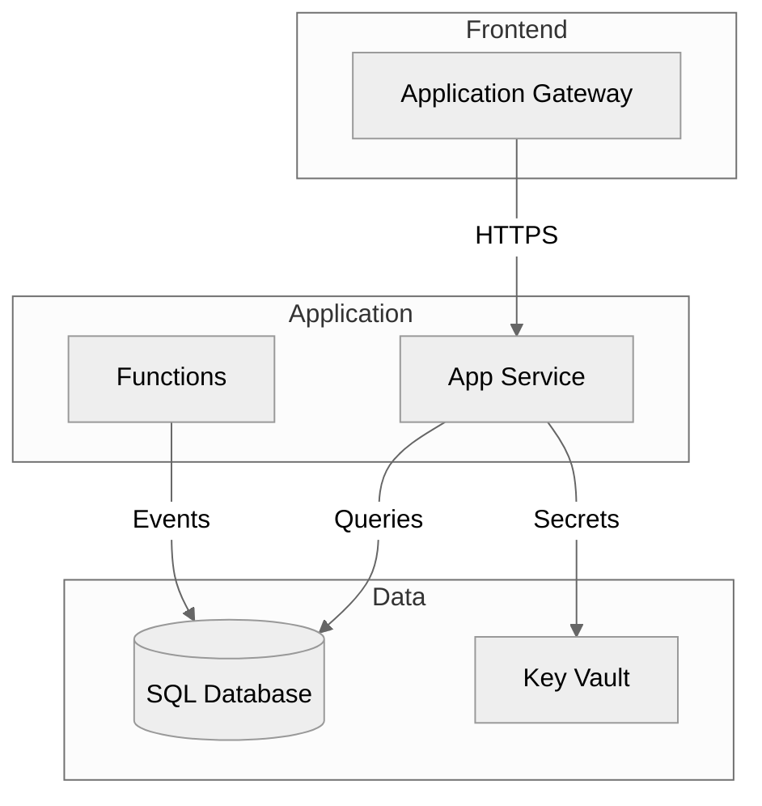

# Learning Documentation Automation with GitHub Copilot

A complete conversation transcript demonstrating how to learn Azure documentation automation
patterns through discovery-based dialogue with GitHub Copilot.

---

## The Scenario

**Character:** Priya Sharma  
**Role:** Senior Technical Writer at CloudDocs Solutions  
**Background:** 8 years technical writing experience (API docs, user guides, system documentation)  
**Challenge:** Manual documentation takes 20+ hours per Azure migration project  
**Goal:** Learn to automate documentation using Copilot while understanding the underlying patterns

**Project Context:**

- TechCorp Solutions needs migration documentation handoff
- 50-server Azure environment to document
- Deliverables: Architecture docs, runbooks, troubleshooting guides, API documentation
- Timeline: 1 week (normally would take 3 weeks manually)

---

## Phase 1: Understanding Documentation Automation Patterns

### Starting the Conversation

**Priya:** I'm a technical writer who's been creating Azure documentation manually for years.
I've heard Copilot can help automate this, but I want to understand the patterns, not just get
scripts. Can you help me learn how documentation automation actually works?

**Copilot:** Absolutely! Documentation automation is fundamentally about extracting structured
information from sources (Azure resources, code, logs) and transforming it into human-readable
documentation. Let me break down the key patterns:

**Pattern 1: Resource Discovery → Documentation**

```
Azure Resources → Resource Graph Query → Structured Data → Markdown Template → Documentation
```

**Pattern 2: Code Analysis → Documentation**

```
Source Code → Parse Comments/Annotations → Extract Structure → Format → API Docs
```

**Pattern 3: Log Analysis → Documentation**

```
Application Insights → Query Patterns → Identify Issues → Troubleshooting Guide
```

The key insight is that documentation automation doesn't write documentation from nothing—it
transforms existing structured information into readable formats.

What aspect would you like to explore first?

---

**Priya:** Let's start with the Resource Discovery pattern. I've used Azure Portal to inventory
resources manually, but what's Azure Resource Graph and why is it better for documentation?

**Copilot:** Great question! Azure Resource Graph is a query service that lets you explore your
Azure resources at scale using a SQL-like language called Kusto Query Language (KQL).

**Why Resource Graph vs. Portal for Documentation:**

| Approach                       | Manual (Portal)           | Resource Graph        |
| ------------------------------ | ------------------------- | --------------------- |
| Time to inventory 50 resources | 2-3 hours                 | 30 seconds            |
| Output format                  | Screenshots, manual notes | Structured JSON/Table |
| Repeatability                  | Start over each time      | Save and rerun query  |
| Cross-subscription             | Switch contexts manually  | Query all at once     |
| Automation potential           | None                      | Full automation       |

**Basic Resource Graph Query:**

```kusto
Resources
| where resourceGroup == 'rg-techcorp-prod'
| project name, type, location, tags
| order by type asc
```

This returns a table you can directly transform into documentation. The structured output is
what makes automation possible—you can't automate screenshots.

---

**Priya:** That makes sense. But how do I know what properties to query? Azure resources have
dozens of fields.

**Copilot:** Excellent observation. Resource Graph exposes a `properties` bag that varies by
resource type. Here's how to discover what's available:

**Discovery Query - See All Properties:**

```kusto
Resources
| where type == 'microsoft.web/sites'
| take 1
| project properties
```

**Common Documentation-Relevant Properties by Resource Type:**

| Resource Type   | Key Properties for Docs                                           |
| --------------- | ----------------------------------------------------------------- |
| App Service     | `properties.httpsOnly`, `properties.state`, `kind`                |
| SQL Database    | `properties.maxSizeBytes`, `properties.edition`, `sku`            |
| Storage Account | `properties.encryption`, `properties.networkAcls`                 |
| Virtual Network | `properties.addressSpace`, `properties.subnets`                   |
| Key Vault       | `properties.enableSoftDelete`, `properties.enablePurgeProtection` |

**Pro Tip:** For documentation purposes, focus on:

1. **Configuration** - What's deployed and how
2. **Security** - Encryption, network isolation, access control
3. **Scale** - SKUs, capacity, limits
4. **Relationships** - What connects to what

Would you like to try building a documentation query together?

---

### Building Our First Documentation Query

**Priya:** Yes! Let's build a query for architecture documentation. What should it include?

**Copilot:** For architecture documentation, you want to answer these questions:

1. **What exists?** (Resource inventory)
2. **How is it organized?** (Resource groups, subscriptions)
3. **Where is it?** (Regions, availability zones)
4. **How is it connected?** (Networking, dependencies)
5. **How is it protected?** (Security controls)
6. **What does it cost?** (SKUs → pricing)

Let's build the query step by step:

**Step 1: Basic Inventory**

```kusto
Resources
| where resourceGroup == 'rg-techcorp-prod'
| project
    name,
    type,
    location,
    resourceGroup,
    sku = sku.name,
    kind
| order by type asc
```

**Step 2: Add Security-Relevant Properties**

```kusto
Resources
| where resourceGroup == 'rg-techcorp-prod'
| extend
    httpsOnly = properties.httpsOnly,
    tlsVersion = properties.minTlsVersion,
    encryption = properties.encryption.services.blob.enabled
| project
    name, type, location,
    httpsOnly, tlsVersion, encryption
```

**Step 3: Identify Relationships (Network)**

```kusto
Resources
| where resourceGroup == 'rg-techcorp-prod' and type == 'microsoft.network/virtualnetworks'
| mv-expand subnet = properties.subnets
| project
    vnetName = name,
    subnetName = subnet.name,
    addressPrefix = subnet.properties.addressPrefix,
    nsg = subnet.properties.networkSecurityGroup.id
```

Does this progression make sense? Each query answers a specific documentation question.

---

**Priya:** This is clicking now. But I'm curious—why KQL specifically? It looks complex compared
to just calling Azure CLI.

**Copilot:** Great critical question! Let me compare approaches:

**Azure CLI Approach:**

```bash
# Get all resources
az resource list --resource-group rg-techcorp-prod --output table

# Get specific resource details (need separate call per resource type)
az webapp list --resource-group rg-techcorp-prod
az sql server list --resource-group rg-techcorp-prod
az keyvault list --resource-group rg-techcorp-prod
# ... 15 more commands for different resource types
```

**Resource Graph KQL Approach:**

```kusto
# One query for everything
Resources
| where resourceGroup == 'rg-techcorp-prod'
| project name, type, location, properties
```

**Why KQL Wins for Documentation:**

| Factor                            | Azure CLI                 | Resource Graph KQL     |
| --------------------------------- | ------------------------- | ---------------------- |
| Queries needed for full inventory | 15-20 (per resource type) | 1                      |
| Cross-subscription support        | Loop through contexts     | Built-in               |
| Join relationships                | Manual correlation        | `join` operator        |
| Aggregations                      | Post-process in script    | Built-in (`summarize`) |
| Performance                       | Sequential API calls      | Parallel execution     |
| Output structure                  | Varies by command         | Consistent schema      |

**The Real Power - Joins:**

```kusto
Resources
| where type == 'microsoft.web/sites'
| join kind=leftouter (
    Resources
    | where type == 'microsoft.insights/components'
) on resourceGroup
| project webAppName = name, appInsightsName = name1
```

This finds which App Services have Application Insights configured—try doing that with CLI!

---

## Phase 2: From Data to Documentation

### Understanding the Transformation

**Priya:** Okay, I can query Azure resources now. But how do I turn query results into actual
documentation? That's where I spend most of my time—writing the narrative.

**Copilot:** This is where the "prompt engineering for documentation" pattern comes in. The key
insight is that you're not asking Copilot to write documentation from nothing—you're giving it
structured data and asking it to transform that into narrative.

**The Documentation Transformation Pattern:**

```
┌─────────────────┐     ┌─────────────────┐     ┌─────────────────┐
│ Resource Graph  │ ──▶ │ Structured Data │ ──▶ │ Copilot Prompt  │
│ Query Results   │     │ (JSON/Table)    │     │ + Template      │
└─────────────────┘     └─────────────────┘     └─────────────────┘
                                                        │
                                                        ▼
                                               ┌─────────────────┐
                                               │ Professional    │
                                               │ Documentation   │
                                               └─────────────────┘
```

**Example Transformation:**

**Input (Query Result):**

```json
{
  "name": "app-techcorp-api",
  "type": "microsoft.web/sites",
  "location": "eastus",
  "sku": "P1v3",
  "httpsOnly": true,
  "minTlsVersion": "1.2"
}
```

**Prompt:**

```
Transform this Azure resource data into an architecture documentation entry:
[paste JSON]

Include:
- Purpose description (infer from name)
- Security configuration analysis
- SKU and scaling information
- Recommendations if any issues found
```

**Output:**

```markdown
### Application API Service

**Resource:** `app-techcorp-api` (Azure App Service)  
**Location:** East US  
**SKU:** Premium v3 (P1v3) - near-production-ready with zone redundancy support

**Security Configuration:**

- ✅ HTTPS Only: Enforced (HTTP redirects to HTTPS)
- ✅ TLS Version: 1.2 minimum (current best practice)
- ✅ Premium SKU: Supports VNet integration and private endpoints

**Recommendations:**

- Consider enabling VNet integration for database connectivity
- Verify managed identity is configured for Key Vault access
```

The structured data provides accuracy; the prompt provides format and analysis.

---

**Priya:** So the script's job is really to gather and structure the data, and Copilot's job is
to write the narrative around it?

**Copilot:** Exactly! You've identified the separation of concerns:

**Script Responsibilities:**

1. **Query** - Get accurate data from Azure
2. **Structure** - Organize data logically (by tier, by function)
3. **Enrich** - Add context (resource relationships, dependencies)
4. **Format** - Prepare for prompt consumption

**Copilot Responsibilities:**

1. **Interpret** - Understand what resources do
2. **Analyze** - Identify security gaps, best practices
3. **Narrate** - Write human-readable documentation
4. **Format** - Generate Markdown, diagrams, tables

**Why This Split Works:**

| Task                      | Script | Copilot | Why                     |
| ------------------------- | ------ | ------- | ----------------------- |
| List all resources        | ✅     | ❌      | API accuracy needed     |
| Describe resource purpose | ❌     | ✅      | Interpretation needed   |
| Get exact SKU name        | ✅     | ❌      | No guessing allowed     |
| Explain SKU implications  | ❌     | ✅      | Knowledge synthesis     |
| Find missing tags         | ✅     | ❌      | Boolean check           |
| Recommend improvements    | ❌     | ✅      | Best practice knowledge |

This is why documentation automation is "90% faster" not "100% automated"—you still need
human review, but the tedious parts are eliminated.

---

### Understanding Mermaid Diagrams

**Priya:** I spend hours in Visio creating architecture diagrams. How does the Mermaid approach
work, and why is it better?

**Copilot:** Mermaid is "diagrams as code"—you write a text description, and it renders as a
visual diagram. This is transformative for documentation automation.

**Why Mermaid Over Visio:**

| Factor          | Visio                   | Mermaid                     |
| --------------- | ----------------------- | --------------------------- |
| Version control | Binary file, can't diff | Text file, full Git history |
| Automation      | Manual creation only    | Generate from code/data     |
| Collaboration   | One person at a time    | Merge like code             |
| Consistency     | Manual alignment        | Auto-layout                 |
| Update time     | Re-draw diagram         | Edit text, auto-render      |
| Cost            | License required        | Free, open source           |
| Portability     | Windows desktop         | Any Markdown renderer       |

**Basic Mermaid Architecture Diagram:**



**The Automation Advantage:**

You can generate Mermaid syntax from Resource Graph data:

```kusto
Resources
| where resourceGroup == 'rg-techcorp-prod'
| where type in ('microsoft.web/sites', 'microsoft.sql/servers', 'microsoft.keyvault/vaults')
| project name, type
```

Then transform to Mermaid:

```
For each App Service: App[{name}]
For each SQL Server: SQL[({name})]
For each Key Vault: KV[{name}]
Add edges based on known patterns or connection strings
```

This is exactly what our documentation scripts do—query resources, generate Mermaid syntax.

---

**Priya:** How do I know what diagram type to use? I see `graph`, `flowchart`, `sequenceDiagram`...

**Copilot:** Great question! Each Mermaid diagram type answers different documentation questions:

**Diagram Type Selection Guide:**

| Question to Answer                                | Diagram Type      | Example Use               |
| ------------------------------------------------- | ----------------- | ------------------------- |
| What components exist and how are they connected? | `graph TB/LR`     | Architecture overview     |
| What's the network topology?                      | `graph LR`        | VNet/subnet layout        |
| How does a request flow through the system?       | `sequenceDiagram` | API call documentation    |
| What are the deployment phases?                   | `flowchart TD`    | Runbook procedures        |
| What's the timeline of events?                    | `gantt`           | Project/incident timeline |
| What's the class structure?                       | `classDiagram`    | API object models         |
| What state transitions occur?                     | `stateDiagram`    | Workflow documentation    |

**Architecture Documentation Typically Uses:**

1. **High-Level Architecture** (`graph TB`):

   ```mermaid
   %%{init: {'theme':'neutral'}}%%
   graph TB
       User -->|HTTPS| FrontDoor
       FrontDoor --> AppService
       AppService --> Database
   ```

2. **Network Topology** (`graph LR`):

   ```mermaid
   %%{init: {'theme':'neutral'}}%%
   graph LR
       subgraph VNet[10.0.0.0/16]
           subgraph WebSubnet[10.0.1.0/24]
               App[App Service]
           end
           subgraph DataSubnet[10.0.2.0/24]
               SQL[(SQL)]
           end
       end
   ```

3. **Request Flow** (`sequenceDiagram`):
   ```mermaid
   %%{init: {'theme':'neutral'}}%%
   sequenceDiagram
       User->>+Gateway: Request
       Gateway->>+App: Route
       App->>+SQL: Query
       SQL-->>-App: Data
       App-->>-Gateway: Response
       Gateway-->>-User: Result
   ```

Would you like to practice generating a specific diagram type?

---

## Phase 3: Building Documentation Scripts

### Understanding Script Structure

**Priya:** Now I want to understand how to build these documentation scripts. What's the
structure I should follow?

**Copilot:** Documentation scripts follow a consistent pattern. Let me break down the structure:

**Documentation Script Pattern:**

```
┌─────────────────────────────────────────────────────────────────┐
│ 1. PARAMETERS                                                    │
│    - Resource scope (subscription, resource group)               │
│    - Output options (path, format, sections to include)          │
│    - Authentication context                                      │
├─────────────────────────────────────────────────────────────────┤
│ 2. DATA COLLECTION                                               │
│    - Azure Resource Graph queries                                │
│    - Additional API calls for details                            │
│    - Relationship discovery                                      │
├─────────────────────────────────────────────────────────────────┤
│ 3. DATA TRANSFORMATION                                           │
│    - Structure for documentation sections                        │
│    - Generate Mermaid diagram syntax                             │
│    - Calculate aggregations (counts, costs)                      │
├─────────────────────────────────────────────────────────────────┤
│ 4. PROMPT GENERATION                                             │
│    - Build context-rich prompt with collected data               │
│    - Include template structure                                  │
│    - Add specific instructions for Copilot                       │
├─────────────────────────────────────────────────────────────────┤
│ 5. OUTPUT                                                        │
│    - Save prompt to file for Copilot Chat                        │
│    - Optionally generate basic Markdown directly                 │
│    - Provide instructions for next steps                         │
└─────────────────────────────────────────────────────────────────┘
```

**Why Generate Prompts Instead of Final Docs?**

This is a key design decision. The scripts generate prompts because:

1. **Accuracy** - Data from Azure is 100% accurate
2. **Flexibility** - User can modify prompt before using
3. **Quality** - Copilot generates better prose than templates
4. **Iteration** - Easy to regenerate with different parameters
5. **Learning** - User sees how prompts are structured

---

**Priya:** Can you show me what a documentation script looks like? I want to understand the
actual code structure.

**Copilot:** Here's a simplified architecture documentation script with annotations:

````powershell
<#
.SYNOPSIS
    Generates architecture documentation prompt for Azure resources.

.DESCRIPTION
    Queries Azure Resource Graph to collect resource information,
    then generates a context-rich prompt for Copilot to create
    comprehensive architecture documentation.

.PARAMETER ResourceGroupName
    The Azure resource group to document.

.PARAMETER OutputPath
    Directory to save the generated prompt file.

.EXAMPLE
    .\ArchitectureDoc.ps1 -ResourceGroupName "rg-prod" -OutputPath ".\docs"
#>

[CmdletBinding()]
param(
    [Parameter(Mandatory = $true)]
    [string]$ResourceGroupName,

    [Parameter(Mandatory = $false)]
    [string]$OutputPath = ".\output",

    [Parameter(Mandatory = $false)]
    [switch]$IncludeDiagrams,

    [Parameter(Mandatory = $false)]
    [switch]$IncludeCostAnalysis
)

#region Data Collection
# ═══════════════════════════════════════════════════════════════

Write-Host "📊 Querying Azure resources..." -ForegroundColor Cyan

# Main resource inventory query
$resourceQuery = @"
Resources
| where resourceGroup == '$ResourceGroupName'
| project
    name,
    type,
    location,
    resourceGroup,
    sku = sku.name,
    kind,
    tags
| order by type asc
"@

$resources = Search-AzGraph -Query $resourceQuery

# Network topology query (for diagrams)
$networkQuery = @"
Resources
| where resourceGroup == '$ResourceGroupName'
| where type == 'microsoft.network/virtualnetworks'
| mv-expand subnet = properties.subnets
| project
    vnetName = name,
    vnetAddressSpace = properties.addressSpace.addressPrefixes,
    subnetName = subnet.name,
    subnetPrefix = subnet.properties.addressPrefix
"@

$networkData = Search-AzGraph -Query $networkQuery

#endregion

#region Data Transformation
# ═══════════════════════════════════════════════════════════════

Write-Host "🔄 Processing resource data..." -ForegroundColor Cyan

# Group resources by type for structured documentation
$resourcesByType = $resources | Group-Object -Property type

# Generate resource inventory table
$inventoryTable = $resources | ForEach-Object {
    "| $($_.name) | $($_.type.Split('/')[-1]) | $($_.location) | $($_.sku ?? 'N/A') |"
}

# Generate Mermaid diagram if requested
if ($IncludeDiagrams) {
    $mermaidDiagram = Generate-MermaidDiagram -Resources $resources -Network $networkData
}

# Calculate summary statistics
$summary = @{
    TotalResources = $resources.Count
    ResourceTypes = ($resources | Select-Object -Unique type).Count
    Regions = ($resources | Select-Object -Unique location).Count
    PrimaryRegion = ($resources | Group-Object location | Sort-Object Count -Descending | Select-Object -First 1).Name
}

#endregion

#region Prompt Generation
# ═══════════════════════════════════════════════════════════════

Write-Host "📝 Generating documentation prompt..." -ForegroundColor Cyan

$prompt = @"
# Architecture Documentation Request

Generate comprehensive Azure architecture documentation for the following environment.

## Environment Summary
- **Resource Group:** $ResourceGroupName
- **Total Resources:** $($summary.TotalResources)
- **Resource Types:** $($summary.ResourceTypes)
- **Primary Region:** $($summary.PrimaryRegion)

## Resource Inventory

| Name | Type | Location | SKU |
|------|------|----------|-----|
$($inventoryTable -join "`n")

## Resource Details by Type

$($resourcesByType | ForEach-Object {
    $typeName = $_.Name.Split('/')[-1]
    $typeResources = $_.Group | ForEach-Object { "- $($_.name)" }
    @"
### $typeName ($($_.Count) resources)
$($typeResources -join "`n")

"@
})

$(if ($IncludeDiagrams) {
@"
## Network Topology Data

$($networkData | ConvertTo-Json -Depth 5)

"@
})

## Documentation Requirements

Please generate architecture documentation with these sections:

1. **Executive Summary**
   - High-level overview for non-technical stakeholders
   - Key statistics and primary purpose

2. **Architecture Overview**
   - Description of the solution architecture
   - Mermaid diagram showing resource relationships
   - Design decisions and rationale

3. **Resource Inventory**
   - Formatted table with all resources
   - Purpose description for each resource
   - Dependencies and relationships

4. **Network Architecture**
   - VNet and subnet layout (Mermaid diagram)
   - Network security groups and rules
   - Connectivity patterns

5. **Security Controls**
   - Encryption configuration
   - Access control mechanisms
   - Compliance-relevant settings

6. **Operational Considerations**
   - Monitoring and alerting
   - Backup and recovery
   - Scaling capabilities

$(if ($IncludeCostAnalysis) {
"7. **Cost Analysis**
   - Estimated monthly costs by resource
   - Cost optimization recommendations"
})

## Output Format
- Use Markdown with proper headings
- Include Mermaid diagrams (```mermaid blocks)
- Use tables for structured data
- Add emoji indicators for status (✅ ❌ ⚠️)
"@

#endregion

#region Output
# ═══════════════════════════════════════════════════════════════

# Ensure output directory exists
if (-not (Test-Path $OutputPath)) {
    New-Item -ItemType Directory -Path $OutputPath -Force | Out-Null
}

# Save prompt file
$promptFile = Join-Path $OutputPath "architecture-prompt.txt"
$prompt | Out-File -FilePath $promptFile -Encoding UTF8

Write-Host "`n✅ Documentation prompt generated!" -ForegroundColor Green
Write-Host "📄 Prompt saved to: $promptFile" -ForegroundColor Yellow
Write-Host "`n📋 Next Steps:" -ForegroundColor Cyan
Write-Host "   1. Open the prompt file"
Write-Host "   2. Copy contents to GitHub Copilot Chat"
Write-Host "   3. Review and refine generated documentation"
Write-Host "   4. Save final documentation as architecture.md"

#endregion
````

**Key Design Patterns:**

1. **Comment-Based Help** - Makes script self-documenting
2. **Regions** - Organize code by function
3. **Progress Indicators** - User knows what's happening
4. **Structured Queries** - KQL embedded in script
5. **Prompt Template** - Clear instructions for Copilot
6. **Next Steps** - Guide user through workflow

---

**Priya:** I notice the script generates a prompt file, not the final documentation. Why this
extra step instead of calling Copilot directly?

**Copilot:** Excellent observation! This is a deliberate design decision. Here's why:

**Why Prompt Files vs. Direct Generation:**

| Factor         | Direct API Call  | Prompt File          |
| -------------- | ---------------- | -------------------- |
| User control   | Black box        | Full visibility      |
| Customization  | Re-run script    | Edit prompt          |
| Learning       | Hidden process   | See how prompts work |
| Iteration      | Script changes   | Quick edits          |
| Cost           | API call per run | One interaction      |
| Quality review | After generation | Before + after       |

**The Workflow This Enables:**

```
┌─────────────┐     ┌─────────────┐     ┌─────────────┐     ┌─────────────┐
│ Run Script  │ ──▶ │ Review      │ ──▶ │ Paste in    │ ──▶ │ Refine      │
│             │     │ Prompt      │     │ Copilot     │     │ Output      │
└─────────────┘     └─────────────┘     └─────────────┘     └─────────────┘
     ↑                    │
     └────────────────────┘
     Iterate if needed
```

**Benefits for Technical Writers:**

1. **Quality Control** - You see exactly what Copilot will receive
2. **Customization** - Add company-specific requirements before generating
3. **Audit Trail** - Prompts can be version-controlled
4. **Reusability** - Same prompt template, different data
5. **Learning** - Understand prompt engineering by example

**Example Customization:**

```
# Original generated prompt:
"Generate architecture documentation..."

# Your customization before pasting:
"Generate architecture documentation following our company template.
Use passive voice. Include section numbers. Add 'ACME Corp Confidential'
footer on each page..."
```

This flexibility is why the "90% time savings" is achievable—the tedious data gathering is
automated, but you retain creative control over the final output.

---

## Phase 4: Practical Documentation Types

### Architecture Documentation

**Priya:** Let's walk through creating actual documentation. What's the best approach for
architecture docs?

**Copilot:** Architecture documentation answers the question "What did we build and why?"
Here's the systematic approach:

**Architecture Documentation Structure:**

```
1. Executive Summary (for leadership)
   └── What, why, key metrics

2. Architecture Overview (for architects)
   └── Design decisions, patterns, trade-offs

3. Component Details (for engineers)
   └── Each resource, configuration, purpose

4. Network Architecture (for network team)
   └── Topology, security groups, connectivity

5. Security Architecture (for security team)
   └── Controls, encryption, access management

6. Operational Guide (for ops team)
   └── Monitoring, scaling, maintenance
```

**Discovery Questions to Ask Copilot:**

When generating architecture docs, ask these questions to deepen understanding:

```
Understanding Design Decisions:
- Why was App Service chosen over Container Apps for this workload?
- What are the trade-offs of using SQL Database vs. Cosmos DB here?
- Why are private endpoints used instead of service endpoints?

Understanding Security:
- What security controls are implemented for HIPAA/SOC2/GDPR?
- How is data encrypted at rest and in transit?
- What would an attacker need to compromise this system?

Understanding Operations:
- What are the scaling limits of this architecture?
- What monitoring should be in place?
- What's the disaster recovery strategy?
```

These questions transform documentation from "list of resources" to "documented architecture."

---

### Day 2 Operations Guide

**Priya:** Day 2 ops guides are my biggest time sink. What's the approach there?

**Copilot:** Day 2 operations documentation answers "How do we keep this running?" The challenge
is that operations procedures are both resource-specific AND pattern-based.

**Day 2 Ops Documentation Pattern:**

```
┌─────────────────────────────────────────────────────────────────┐
│ DAILY OPERATIONS (15-30 min)                                    │
│ • Health checks for each resource type                          │
│ • Log review queries (KQL)                                      │
│ • Backup verification                                           │
├─────────────────────────────────────────────────────────────────┤
│ WEEKLY OPERATIONS (1-2 hours)                                   │
│ • Performance review                                            │
│ • Cost analysis                                                 │
│ • Security scan review                                          │
├─────────────────────────────────────────────────────────────────┤
│ MONTHLY OPERATIONS (2-4 hours)                                  │
│ • Capacity planning                                             │
│ • DR testing                                                    │
│ • Patch/update review                                           │
├─────────────────────────────────────────────────────────────────┤
│ SCALING PROCEDURES                                              │
│ • Manual scale triggers and steps                               │
│ • Autoscale configuration                                       │
│ • Post-scale validation                                         │
├─────────────────────────────────────────────────────────────────┤
│ TROUBLESHOOTING PLAYBOOKS                                       │
│ • Common issues by resource type                                │
│ • Diagnostic queries                                            │
│ • Resolution steps                                              │
└─────────────────────────────────────────────────────────────────┘
```

**What Makes This Automatable:**

Each Azure resource type has standard operations:

| Resource Type | Daily Check     | Weekly Check       | Common Issues             |
| ------------- | --------------- | ------------------ | ------------------------- |
| App Service   | Health endpoint | CPU/Memory metrics | Cold starts, memory leaks |
| SQL Database  | DTU usage       | Query performance  | Blocking, deadlocks       |
| Key Vault     | Access attempts | Certificate expiry | Permission errors         |
| Storage       | Availability    | Capacity growth    | Throttling                |

The script queries your resources, identifies types, and generates procedures specific to
YOUR infrastructure, not generic best practices.

---

**Priya:** How does the script know what procedures to include for each resource type?

**Copilot:** The script uses a pattern library—a mapping of resource types to relevant
operations. Here's how it works:

**Pattern Library Concept:**

```powershell
$operationsPatterns = @{
    'microsoft.web/sites' = @{
        DailyChecks = @(
            'Check application health endpoint',
            'Review Application Insights exceptions',
            'Verify deployment slot status'
        )
        WeeklyChecks = @(
            'Review CPU and memory metrics',
            'Check scaling history',
            'Review failed requests trend'
        )
        KQLQueries = @{
            HealthCheck = 'requests | where success == false | summarize count() by bin(timestamp, 1h)'
            Performance = 'requests | summarize avg(duration) by bin(timestamp, 1h)'
        }
        CommonIssues = @(
            @{
                Symptom = 'Application returns 503 errors'
                Cause = 'App Service plan at capacity or cold start'
                Resolution = 'Scale up/out or enable Always On'
            }
        )
    }
    'microsoft.sql/servers/databases' = @{
        DailyChecks = @(
            'Check DTU/vCore utilization',
            'Review query performance insights',
            'Verify backup status'
        )
        # ... more patterns
    }
}
```

**How the Script Uses This:**

```powershell
# Query resources
$resources = Search-AzGraph -Query "Resources | where resourceGroup == '$rg'"

# Match to patterns
foreach ($resource in $resources) {
    $pattern = $operationsPatterns[$resource.type]
    if ($pattern) {
        # Include this pattern's procedures in documentation
        $dailyOps += $pattern.DailyChecks
        $weeklyOps += $pattern.WeeklyChecks
        $queries += $pattern.KQLQueries
    }
}

# Generate prompt with matched patterns
$prompt = Build-OperationsPrompt -DailyOps $dailyOps -WeeklyOps $weeklyOps -Queries $queries
```

**Why This Works Better Than Templates:**

- **Tailored** - Only procedures for YOUR resources
- **Complete** - Doesn't miss resource types
- **Actionable** - Real KQL queries, not placeholders
- **Maintainable** - Update pattern library, regenerate docs

---

### Troubleshooting Guides

**Priya:** Troubleshooting guides are tricky because issues are unpredictable. How do you
automate something that depends on what goes wrong?

**Copilot:** Great insight! Troubleshooting documentation is different—you're documenting
patterns of failure, not current state. The approach is:

**Troubleshooting Documentation Sources:**

```
┌─────────────────────────────────────────────────────────────────┐
│ SOURCE 1: Resource Type Patterns                                │
│ Each Azure resource type has known failure modes                │
│ Example: App Service → 503 errors, deployment failures,         │
│          memory issues, certificate problems                    │
├─────────────────────────────────────────────────────────────────┤
│ SOURCE 2: Application Insights History                          │
│ Query past exceptions, failed requests, performance issues      │
│ Real issues YOUR application has experienced                    │
├─────────────────────────────────────────────────────────────────┤
│ SOURCE 3: Azure Service Health                                  │
│ Past incidents affecting your resources                         │
│ Regional issues, service degradations                           │
├─────────────────────────────────────────────────────────────────┤
│ SOURCE 4: Best Practice Knowledge                               │
│ Copilot's knowledge of common issues and resolutions            │
│ Microsoft documentation patterns                                │
└─────────────────────────────────────────────────────────────────┘
```

**The Troubleshooting Prompt Pattern:**

```
Generate a troubleshooting guide for this Azure environment:

Resource Inventory:
[from Resource Graph query]

Application Insights Summary (past 30 days):
- Total Exceptions: 1,247
- Top Exception Types: NullReferenceException (45%), TimeoutException (30%), SqlException (25%)
- Failed Request Rate: 2.3%
- Slowest Operations: /api/orders (avg 3.2s), /api/search (avg 2.8s)

For each resource type present, document:
1. Common failure scenarios
2. Diagnostic steps (specific commands and KQL queries)
3. Resolution procedures
4. Prevention recommendations

Include:
- Decision tree diagram for initial triage
- Quick reference table of symptoms → likely causes
- Escalation criteria (when to contact support)
```

**Why This Works:**

The script provides REAL data (exception counts, slow operations) combined with patterns
(resource type failure modes). Copilot then generates documentation that's both
evidence-based AND comprehensive.

---

## Phase 5: The Complete Workflow

### Putting It All Together

**Priya:** I think I understand the patterns now. Can you summarize the complete workflow for
documentation automation?

**Copilot:** Here's the end-to-end workflow:

**Documentation Automation Workflow:**

```
┌─────────────────────────────────────────────────────────────────────────┐
│ PHASE 1: PREPARATION (5 minutes)                                        │
│                                                                         │
│  ┌─────────────┐     ┌─────────────┐     ┌─────────────┐               │
│  │ Identify    │ ──▶ │ Determine   │ ──▶ │ Gather      │               │
│  │ Scope       │     │ Doc Types   │     │ Credentials │               │
│  └─────────────┘     └─────────────┘     └─────────────┘               │
│  (which RG/sub?)     (arch? ops? API?)   (Azure access)                │
├─────────────────────────────────────────────────────────────────────────┤
│ PHASE 2: DATA COLLECTION (10 minutes)                                   │
│                                                                         │
│  ┌─────────────┐     ┌─────────────┐     ┌─────────────┐               │
│  │ Run         │ ──▶ │ Review      │ ──▶ │ Validate    │               │
│  │ Scripts     │     │ Queries     │     │ Data        │               │
│  └─────────────┘     └─────────────┘     └─────────────┘               │
│  (generate prompts)  (check coverage)    (spot issues)                 │
├─────────────────────────────────────────────────────────────────────────┤
│ PHASE 3: GENERATION (30-45 minutes)                                     │
│                                                                         │
│  ┌─────────────┐     ┌─────────────┐     ┌─────────────┐               │
│  │ Customize   │ ──▶ │ Paste in    │ ──▶ │ Iterate     │               │
│  │ Prompts     │     │ Copilot     │     │ Sections    │               │
│  └─────────────┘     └─────────────┘     └─────────────┘               │
│  (add specifics)     (generate docs)     (refine output)               │
├─────────────────────────────────────────────────────────────────────────┤
│ PHASE 4: REVIEW & POLISH (30 minutes)                                   │
│                                                                         │
│  ┌─────────────┐     ┌─────────────┐     ┌─────────────┐               │
│  │ Technical   │ ──▶ │ Format &    │ ──▶ │ Stakeholder │               │
│  │ Review      │     │ Consistency │     │ Review      │               │
│  └─────────────┘     └─────────────┘     └─────────────┘               │
│  (accuracy check)    (styling, TOC)      (approval)                    │
├─────────────────────────────────────────────────────────────────────────┤
│ PHASE 5: PUBLISH (10 minutes)                                           │
│                                                                         │
│  ┌─────────────┐     ┌─────────────┐     ┌─────────────┐               │
│  │ Commit to   │ ──▶ │ Export      │ ──▶ │ Distribute  │               │
│  │ Git         │     │ Formats     │     │ to Team     │               │
│  └─────────────┘     └─────────────┘     └─────────────┘               │
│  (version control)   (PDF, HTML, Wiki)   (share links)                 │
└─────────────────────────────────────────────────────────────────────────┘

TOTAL TIME: ~1.5-2 hours (vs. 20+ hours manual)
```

**Documentation Types and Time:**

| Document Type   | Script | Copilot | Review | Total     | Manual     |
| --------------- | ------ | ------- | ------ | --------- | ---------- |
| Architecture    | 5 min  | 20 min  | 20 min | 45 min    | 6 hrs      |
| Day 2 Ops       | 5 min  | 30 min  | 20 min | 55 min    | 8 hrs      |
| Troubleshooting | 5 min  | 25 min  | 15 min | 45 min    | 5 hrs      |
| API Docs        | 5 min  | 20 min  | 15 min | 40 min    | 4 hrs      |
| **TOTAL**       | 20 min | 95 min  | 70 min | **3 hrs** | **23 hrs** |

---

### Discovery Questions Summary

**Priya:** What are the most important discovery questions to ask during this process?

**Copilot:** Here are the key discovery questions organized by phase:

**Understanding the Tools:**

```
- Why Resource Graph over Azure CLI for documentation?
- How do I discover what properties are available for each resource type?
- Why generate prompts instead of final documentation directly?
- When should I use Mermaid vs. other diagram tools?
```

**Understanding the Data:**

```
- What resource relationships are important to document?
- How do I identify security-relevant configurations?
- What metrics indicate operational health?
- How do I find cost-relevant information?
```

**Understanding the Output:**

```
- Who is the audience for this documentation?
- What decisions will this documentation support?
- How will this documentation be maintained?
- What's the update frequency needed?
```

**Understanding Quality:**

```
- How do I validate generated documentation is accurate?
- What's the appropriate level of detail for each audience?
- How do I ensure consistency across document types?
- What should always be reviewed by a human?
```

**The Meta-Question:**

```
"What would I need to know to maintain this documentation myself?"

This question ensures you're learning, not just generating.
```

---

## Key Takeaways

### For Technical Writers

1. **Automation ≠ Replacement** - You're automating data gathering, not writing
2. **Prompts Are Assets** - Version control your prompt templates
3. **Review Is Essential** - 90% automated means 10% human judgment
4. **Diagrams as Code** - Mermaid enables automation AND version control
5. **Iterate Rapidly** - Regenerate docs as infrastructure changes

### For the Process

1. **Data First** - Good documentation starts with accurate data
2. **Structure Second** - Templates ensure completeness
3. **Narrative Third** - Copilot excels at prose from structure
4. **Review Always** - Human judgment for quality and accuracy

### Time Investment

| Activity                   | One-Time      | Per Project      |
| -------------------------- | ------------- | ---------------- |
| Learn Resource Graph       | 2 hours       | -                |
| Customize script templates | 2 hours       | -                |
| Run documentation scripts  | -             | 20 min           |
| Generate with Copilot      | -             | 90 min           |
| Review and polish          | -             | 60 min           |
| **Total**                  | 4 hours setup | ~3 hours/project |

**ROI:** After setup, each documentation project saves 20 hours.
Break-even after 1 project. 8 projects/year = 160 hours saved.

---

## Related Resources

- **Example Scripts:** `solution/ArchitectureDoc.ps1`, `solution/Day2OperationsGuide.ps1`
- **Prompt Patterns:** `prompts/effective-prompts.md`
- **Sample Outputs:** `solution/output/`
- **Azure Resource Graph:** [Microsoft Learn - Resource Graph Queries](https://learn.microsoft.com/azure/governance/resource-graph/)
- **Mermaid Diagrams:** [Mermaid Documentation](https://mermaid.js.org/)

---

_This conversation demonstrates learning documentation automation patterns through discovery-based
dialogue. The focus is understanding WHY approaches work, not just WHAT commands to run._

**Character Growth:**

- **Start:** Manual documentation taking 20+ hours per project
- **End:** Understands automation patterns, prompt engineering, and diagram-as-code approaches
- **Key Insight:** Documentation automation transforms data into narrative, not replaces writers
