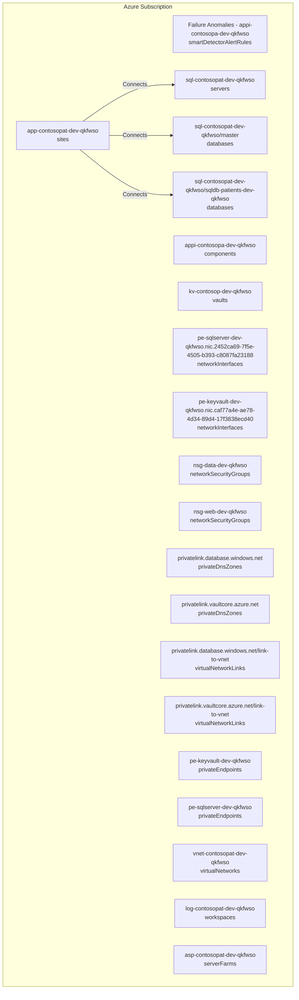
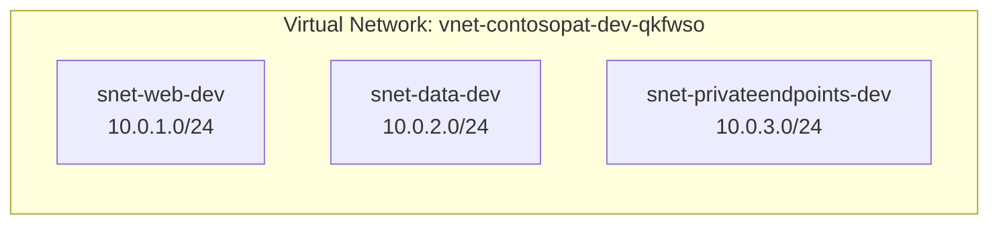

# Azure Architecture Documentation

**Resource Group**: rg-contoso-patient-portal-dev  
**Subscription**: noalz  
**Generated**: 2025-11-20 17:14:35  
**Generated By**: GitHub Copilot + PowerShell Automation

---

## Executive Summary

This document provides comprehensive architecture documentation for the **rg-contoso-patient-portal-dev** resource group in Azure. It includes resource inventory, architecture diagrams, network topology, and cost analysis.

**Total Resources**: 20  
**Primary Location**: swedencentral

---

## Resource Inventory

| Resource Name | Type | Location | Purpose |
|---------------|------|----------|---------|
| nsg-data-dev-qkfwso | networkSecurityGroups | swedencentral | Networking |
| asp-contosopat-dev-qkfwso | serverFarms | swedencentral | Supporting service |
| nsg-web-dev-qkfwso | networkSecurityGroups | swedencentral | Networking |
| vnet-contosopat-dev-qkfwso | virtualNetworks | swedencentral | Networking |
| log-contosopat-dev-qkfwso | workspaces | swedencentral | Supporting service |
| sql-contosopat-dev-qkfwso | servers | swedencentral | Database service |
| kv-contosop-dev-qkfwso | vaults | swedencentral | Supporting service |
| appi-contosopa-dev-qkfwso | components | swedencentral | Supporting service |
| app-contosopat-dev-qkfwso | sites | swedencentral | Application hosting |
| sql-contosopat-dev-qkfwso/master | databases | swedencentral | Database service |
| sql-contosopat-dev-qkfwso/sqldb-patients-dev-qkfwso | databases | swedencentral | Database service |
| privatelink.database.windows.net | privateDnsZones | global | Networking |
| privatelink.vaultcore.azure.net | privateDnsZones | global | Networking |
| privatelink.database.windows.net/link-to-vnet | virtualNetworkLinks | global | Networking |
| privatelink.vaultcore.azure.net/link-to-vnet | virtualNetworkLinks | global | Networking |
| pe-keyvault-dev-qkfwso | privateEndpoints | swedencentral | Networking |
| pe-sqlserver-dev-qkfwso | privateEndpoints | swedencentral | Networking |
| pe-sqlserver-dev-qkfwso.nic.2452ca69-7f5e-4505-b393-c8087fa23188 | networkInterfaces | swedencentral | Networking |
| pe-keyvault-dev-qkfwso.nic.caf77a4e-ae78-4d34-89d4-17f3838ecd40 | networkInterfaces | swedencentral | Networking |
| Failure Anomalies - appi-contosopa-dev-qkfwso | smartDetectorAlertRules | global | Supporting service |

---

## Architecture Diagram

---

## Network Topology

---

## Resource Details by Type

### smartDetectorAlertRules (1)

#### Failure Anomalies - appi-contosopa-dev-qkfwso

- **Type**: microsoft.alertsmanagement/smartDetectorAlertRules
- **Location**: global
- **Resource ID**: `/subscriptions/00858ffc-dded-4f0f-8bbf-e17fff0d47d9/resourceGroups/rg-contoso-patient-portal-dev/providers/microsoft.alertsmanagement/smartDetectorAlertRules/Failure Anomalies - appi-contosopa-dev-qkfwso`
- **Tags**:
  - application: 
  - backup-policy: 
  - costcenter: Healthcare-IT
  - environment: dev
  - maint-window: 
  - owner: 
  - sla: 
  - tech-contact: 
  - workload: 

### components (1)

#### appi-contosopa-dev-qkfwso

- **Type**: Microsoft.Insights/components
- **Location**: swedencentral
- **Resource ID**: `/subscriptions/00858ffc-dded-4f0f-8bbf-e17fff0d47d9/resourceGroups/rg-contoso-patient-portal-dev/providers/Microsoft.Insights/components/appi-contosopa-dev-qkfwso`
- **Tags**:
  - Environment: dev
  - ManagedBy: Bicep
  - Project: PatientPortal
  - CostCenter: Healthcare-IT
  - Compliance: HIPAA
  - SecurityControl: Ignore
  - application: 
  - backup-policy: 
  - maint-window: 
  - owner: 
  - sla: 
  - tech-contact: 
  - workload: 

### vaults (1)

#### kv-contosop-dev-qkfwso

- **Type**: Microsoft.KeyVault/vaults
- **Location**: swedencentral
- **Resource ID**: `/subscriptions/00858ffc-dded-4f0f-8bbf-e17fff0d47d9/resourceGroups/rg-contoso-patient-portal-dev/providers/Microsoft.KeyVault/vaults/kv-contosop-dev-qkfwso`
- **Tags**:
  - Environment: dev
  - ManagedBy: Bicep
  - Project: PatientPortal
  - CostCenter: Healthcare-IT
  - Compliance: HIPAA
  - SecurityControl: Ignore
  - application: 
  - backup-policy: 
  - maint-window: 
  - owner: 
  - sla: 
  - tech-contact: 
  - workload: 

### networkInterfaces (2)

#### pe-sqlserver-dev-qkfwso.nic.2452ca69-7f5e-4505-b393-c8087fa23188

- **Type**: Microsoft.Network/networkInterfaces
- **Location**: swedencentral
- **Resource ID**: `/subscriptions/00858ffc-dded-4f0f-8bbf-e17fff0d47d9/resourceGroups/rg-contoso-patient-portal-dev/providers/Microsoft.Network/networkInterfaces/pe-sqlserver-dev-qkfwso.nic.2452ca69-7f5e-4505-b393-c8087fa23188`
- **Tags**:
  - Environment: dev
  - ManagedBy: Bicep
  - Project: PatientPortal
  - CostCenter: Healthcare-IT
  - Compliance: HIPAA
  - SecurityControl: Ignore
  - application: 
  - backup-policy: 
  - maint-window: 
  - owner: 
  - sla: 
  - tech-contact: 
  - workload: 

#### pe-keyvault-dev-qkfwso.nic.caf77a4e-ae78-4d34-89d4-17f3838ecd40

- **Type**: Microsoft.Network/networkInterfaces
- **Location**: swedencentral
- **Resource ID**: `/subscriptions/00858ffc-dded-4f0f-8bbf-e17fff0d47d9/resourceGroups/rg-contoso-patient-portal-dev/providers/Microsoft.Network/networkInterfaces/pe-keyvault-dev-qkfwso.nic.caf77a4e-ae78-4d34-89d4-17f3838ecd40`
- **Tags**:
  - Environment: dev
  - ManagedBy: Bicep
  - Project: PatientPortal
  - CostCenter: Healthcare-IT
  - Compliance: HIPAA
  - SecurityControl: Ignore
  - application: 
  - backup-policy: 
  - maint-window: 
  - owner: 
  - sla: 
  - tech-contact: 
  - workload: 

### networkSecurityGroups (2)

#### nsg-data-dev-qkfwso

- **Type**: Microsoft.Network/networkSecurityGroups
- **Location**: swedencentral
- **Resource ID**: `/subscriptions/00858ffc-dded-4f0f-8bbf-e17fff0d47d9/resourceGroups/rg-contoso-patient-portal-dev/providers/Microsoft.Network/networkSecurityGroups/nsg-data-dev-qkfwso`
- **Tags**:
  - Environment: dev
  - ManagedBy: Bicep
  - Project: PatientPortal
  - CostCenter: Healthcare-IT
  - Compliance: HIPAA
  - SecurityControl: Ignore
  - application: 
  - backup-policy: 
  - maint-window: 
  - owner: 
  - sla: 
  - tech-contact: 
  - workload: 

#### nsg-web-dev-qkfwso

- **Type**: Microsoft.Network/networkSecurityGroups
- **Location**: swedencentral
- **Resource ID**: `/subscriptions/00858ffc-dded-4f0f-8bbf-e17fff0d47d9/resourceGroups/rg-contoso-patient-portal-dev/providers/Microsoft.Network/networkSecurityGroups/nsg-web-dev-qkfwso`
- **Tags**:
  - Environment: dev
  - ManagedBy: Bicep
  - Project: PatientPortal
  - CostCenter: Healthcare-IT
  - Compliance: HIPAA
  - SecurityControl: Ignore
  - application: 
  - backup-policy: 
  - maint-window: 
  - owner: 
  - sla: 
  - tech-contact: 
  - workload: 

### privateDnsZones (2)

#### privatelink.database.windows.net

- **Type**: Microsoft.Network/privateDnsZones
- **Location**: global
- **Resource ID**: `/subscriptions/00858ffc-dded-4f0f-8bbf-e17fff0d47d9/resourceGroups/rg-contoso-patient-portal-dev/providers/Microsoft.Network/privateDnsZones/privatelink.database.windows.net`
- **Tags**:
  - Environment: dev
  - ManagedBy: Bicep
  - Project: PatientPortal
  - CostCenter: Healthcare-IT
  - Compliance: HIPAA
  - SecurityControl: Ignore
  - application: 
  - backup-policy: 
  - maint-window: 
  - owner: 
  - sla: 
  - tech-contact: 
  - workload: 

#### privatelink.vaultcore.azure.net

- **Type**: Microsoft.Network/privateDnsZones
- **Location**: global
- **Resource ID**: `/subscriptions/00858ffc-dded-4f0f-8bbf-e17fff0d47d9/resourceGroups/rg-contoso-patient-portal-dev/providers/Microsoft.Network/privateDnsZones/privatelink.vaultcore.azure.net`
- **Tags**:
  - Environment: dev
  - ManagedBy: Bicep
  - Project: PatientPortal
  - CostCenter: Healthcare-IT
  - Compliance: HIPAA
  - SecurityControl: Ignore
  - application: 
  - backup-policy: 
  - maint-window: 
  - owner: 
  - sla: 
  - tech-contact: 
  - workload: 

### virtualNetworkLinks (2)

#### privatelink.database.windows.net/link-to-vnet

- **Type**: Microsoft.Network/privateDnsZones/virtualNetworkLinks
- **Location**: global
- **Resource ID**: `/subscriptions/00858ffc-dded-4f0f-8bbf-e17fff0d47d9/resourceGroups/rg-contoso-patient-portal-dev/providers/Microsoft.Network/privateDnsZones/privatelink.database.windows.net/virtualNetworkLinks/link-to-vnet`
- **Tags**:
  - application: 
  - backup-policy: 
  - costcenter: Healthcare-IT
  - environment: dev
  - maint-window: 
  - owner: 
  - sla: 
  - tech-contact: 
  - workload: 

#### privatelink.vaultcore.azure.net/link-to-vnet

- **Type**: Microsoft.Network/privateDnsZones/virtualNetworkLinks
- **Location**: global
- **Resource ID**: `/subscriptions/00858ffc-dded-4f0f-8bbf-e17fff0d47d9/resourceGroups/rg-contoso-patient-portal-dev/providers/Microsoft.Network/privateDnsZones/privatelink.vaultcore.azure.net/virtualNetworkLinks/link-to-vnet`
- **Tags**:
  - application: 
  - backup-policy: 
  - costcenter: Healthcare-IT
  - environment: dev
  - maint-window: 
  - owner: 
  - sla: 
  - tech-contact: 
  - workload: 

### privateEndpoints (2)

#### pe-keyvault-dev-qkfwso

- **Type**: Microsoft.Network/privateEndpoints
- **Location**: swedencentral
- **Resource ID**: `/subscriptions/00858ffc-dded-4f0f-8bbf-e17fff0d47d9/resourceGroups/rg-contoso-patient-portal-dev/providers/Microsoft.Network/privateEndpoints/pe-keyvault-dev-qkfwso`
- **Tags**:
  - Environment: dev
  - ManagedBy: Bicep
  - Project: PatientPortal
  - CostCenter: Healthcare-IT
  - Compliance: HIPAA
  - SecurityControl: Ignore
  - application: 
  - backup-policy: 
  - maint-window: 
  - owner: 
  - sla: 
  - tech-contact: 
  - workload: 

#### pe-sqlserver-dev-qkfwso

- **Type**: Microsoft.Network/privateEndpoints
- **Location**: swedencentral
- **Resource ID**: `/subscriptions/00858ffc-dded-4f0f-8bbf-e17fff0d47d9/resourceGroups/rg-contoso-patient-portal-dev/providers/Microsoft.Network/privateEndpoints/pe-sqlserver-dev-qkfwso`
- **Tags**:
  - Environment: dev
  - ManagedBy: Bicep
  - Project: PatientPortal
  - CostCenter: Healthcare-IT
  - Compliance: HIPAA
  - SecurityControl: Ignore
  - application: 
  - backup-policy: 
  - maint-window: 
  - owner: 
  - sla: 
  - tech-contact: 
  - workload: 

### virtualNetworks (1)

#### vnet-contosopat-dev-qkfwso

- **Type**: Microsoft.Network/virtualNetworks
- **Location**: swedencentral
- **Resource ID**: `/subscriptions/00858ffc-dded-4f0f-8bbf-e17fff0d47d9/resourceGroups/rg-contoso-patient-portal-dev/providers/Microsoft.Network/virtualNetworks/vnet-contosopat-dev-qkfwso`
- **Tags**:
  - Environment: dev
  - ManagedBy: Bicep
  - Project: PatientPortal
  - CostCenter: Healthcare-IT
  - Compliance: HIPAA
  - SecurityControl: Ignore
  - application: 
  - backup-policy: 
  - maint-window: 
  - owner: 
  - sla: 
  - tech-contact: 
  - workload: 

### workspaces (1)

#### log-contosopat-dev-qkfwso

- **Type**: Microsoft.OperationalInsights/workspaces
- **Location**: swedencentral
- **Resource ID**: `/subscriptions/00858ffc-dded-4f0f-8bbf-e17fff0d47d9/resourceGroups/rg-contoso-patient-portal-dev/providers/Microsoft.OperationalInsights/workspaces/log-contosopat-dev-qkfwso`
- **Tags**:
  - Environment: dev
  - ManagedBy: Bicep
  - Project: PatientPortal
  - CostCenter: Healthcare-IT
  - Compliance: HIPAA
  - SecurityControl: Ignore
  - application: 
  - backup-policy: 
  - maint-window: 
  - owner: 
  - sla: 
  - tech-contact: 
  - workload: 

### servers (1)

#### sql-contosopat-dev-qkfwso

- **Type**: Microsoft.Sql/servers
- **Location**: swedencentral
- **Resource ID**: `/subscriptions/00858ffc-dded-4f0f-8bbf-e17fff0d47d9/resourceGroups/rg-contoso-patient-portal-dev/providers/Microsoft.Sql/servers/sql-contosopat-dev-qkfwso`
- **Tags**:
  - Environment: dev
  - ManagedBy: Bicep
  - Project: PatientPortal
  - CostCenter: Healthcare-IT
  - Compliance: HIPAA
  - SecurityControl: Ignore
  - application: 
  - backup-policy: 
  - maint-window: 
  - owner: 
  - sla: 
  - tech-contact: 
  - workload: 

### databases (2)

#### sql-contosopat-dev-qkfwso/master

- **Type**: Microsoft.Sql/servers/databases
- **Location**: swedencentral
- **Resource ID**: `/subscriptions/00858ffc-dded-4f0f-8bbf-e17fff0d47d9/resourceGroups/rg-contoso-patient-portal-dev/providers/Microsoft.Sql/servers/sql-contosopat-dev-qkfwso/databases/master`

#### sql-contosopat-dev-qkfwso/sqldb-patients-dev-qkfwso

- **Type**: Microsoft.Sql/servers/databases
- **Location**: swedencentral
- **Resource ID**: `/subscriptions/00858ffc-dded-4f0f-8bbf-e17fff0d47d9/resourceGroups/rg-contoso-patient-portal-dev/providers/Microsoft.Sql/servers/sql-contosopat-dev-qkfwso/databases/sqldb-patients-dev-qkfwso`
- **Tags**:
  - Environment: dev
  - ManagedBy: Bicep
  - Project: PatientPortal
  - CostCenter: Healthcare-IT
  - Compliance: HIPAA
  - SecurityControl: Ignore
  - application: 
  - backup-policy: 
  - maint-window: 
  - owner: 
  - sla: 
  - tech-contact: 
  - workload: 

### serverFarms (1)

#### asp-contosopat-dev-qkfwso

- **Type**: Microsoft.Web/serverFarms
- **Location**: swedencentral
- **Resource ID**: `/subscriptions/00858ffc-dded-4f0f-8bbf-e17fff0d47d9/resourceGroups/rg-contoso-patient-portal-dev/providers/Microsoft.Web/serverFarms/asp-contosopat-dev-qkfwso`
- **Tags**:
  - Environment: dev
  - ManagedBy: Bicep
  - Project: PatientPortal
  - CostCenter: Healthcare-IT
  - Compliance: HIPAA
  - SecurityControl: Ignore
  - application: 
  - backup-policy: 
  - maint-window: 
  - owner: 
  - sla: 
  - tech-contact: 
  - workload: 

### sites (1)

#### app-contosopat-dev-qkfwso

- **Type**: Microsoft.Web/sites
- **Location**: swedencentral
- **Resource ID**: `/subscriptions/00858ffc-dded-4f0f-8bbf-e17fff0d47d9/resourceGroups/rg-contoso-patient-portal-dev/providers/Microsoft.Web/sites/app-contosopat-dev-qkfwso`
- **Tags**:
  - Environment: dev
  - ManagedBy: Bicep
  - Project: PatientPortal
  - CostCenter: Healthcare-IT
  - Compliance: HIPAA
  - SecurityControl: Ignore
  - application: 
  - backup-policy: 
  - maint-window: 
  - owner: 
  - sla: 
  - tech-contact: 
  - workload: 

---

## Cost Analysis

**Estimated Monthly Cost**: $785
**Estimated Annual Cost**: $9420

| Resource | Type | Estimated Monthly Cost |
|----------|------|------------------------|
| sql-contosopat-dev-qkfwso/master | databases | $200 |
| sql-contosopat-dev-qkfwso | servers | $200 |
| sql-contosopat-dev-qkfwso/sqldb-patients-dev-qkfwso | databases | $200 |
| app-contosopat-dev-qkfwso | sites | $50 |
| pe-sqlserver-dev-qkfwso.nic.2452ca69-7f5e-4505-b393-c8087fa23188 | networkInterfaces | $10 |
| pe-sqlserver-dev-qkfwso | privateEndpoints | $10 |
| pe-keyvault-dev-qkfwso | privateEndpoints | $10 |
| privatelink.vaultcore.azure.net/link-to-vnet | virtualNetworkLinks | $10 |
| privatelink.database.windows.net/link-to-vnet | virtualNetworkLinks | $10 |
| privatelink.vaultcore.azure.net | privateDnsZones | $10 |
| privatelink.database.windows.net | privateDnsZones | $10 |
| nsg-data-dev-qkfwso | networkSecurityGroups | $10 |
| vnet-contosopat-dev-qkfwso | virtualNetworks | $10 |
| nsg-web-dev-qkfwso | networkSecurityGroups | $10 |
| pe-keyvault-dev-qkfwso.nic.caf77a4e-ae78-4d34-89d4-17f3838ecd40 | networkInterfaces | $10 |
| appi-contosopa-dev-qkfwso | components | $5 |
| kv-contosop-dev-qkfwso | vaults | $5 |
| log-contosopat-dev-qkfwso | workspaces | $5 |
| asp-contosopat-dev-qkfwso | serverFarms | $5 |
| Failure Anomalies - appi-contosopa-dev-qkfwso | smartDetectorAlertRules | $5 |

> **Note**: Cost estimates are approximate. Use Azure Cost Management for accurate billing data.

---

## Best Practices & Recommendations

### Security
- ✅ Enable Azure AD authentication where possible
- ✅ Use managed identities for service-to-service authentication
- ✅ Implement network security groups (NSGs) on all subnets
- ✅ Enable encryption at rest and in transit
- ✅ Regular security audits using Azure Security Center

### High Availability
- ✅ Deploy across multiple availability zones
- ✅ Implement auto-scaling for application tier
- ✅ Configure backup and disaster recovery
- ✅ Use Azure Front Door or Traffic Manager for geo-distribution
- ✅ Regular DR testing and runbooks

### Performance
- ✅ Use Azure CDN for static content
- ✅ Implement caching strategies (Redis, CDN)
- ✅ Monitor application performance with Application Insights
- ✅ Right-size resources based on actual usage
- ✅ Regular performance testing and optimization

### Cost Optimization
- ✅ Use reserved instances for predictable workloads
- ✅ Implement auto-scaling to match demand
- ✅ Regular cost analysis and optimization reviews
- ✅ Tag all resources for cost allocation
- ✅ Remove unused resources and snapshots

---

## Maintenance & Operations

### Monitoring
- Azure Monitor for metrics and alerts
- Application Insights for application telemetry
- Log Analytics for centralized logging
- Service Health alerts for platform issues

### Backup & Recovery
- Automated backups configured for databases
- Geo-redundant storage for critical data
- Disaster recovery runbook in place
- Regular restore testing (quarterly)

### Change Management
- All infrastructure changes via IaC (Bicep/Terraform)
- Changes deployed through CI/CD pipeline
- Change approval process for production
- Rollback procedures documented

---

## Additional Resources

- [Azure Well-Architected Framework](https://learn.microsoft.com/azure/well-architected/)
- [Azure Architecture Center](https://learn.microsoft.com/azure/architecture/)
- [Azure Best Practices](https://learn.microsoft.com/azure/cloud-adoption-framework/)

---

*This documentation was auto-generated by GitHub Copilot and PowerShell. Last updated: 2025-11-20 17:14:38*
