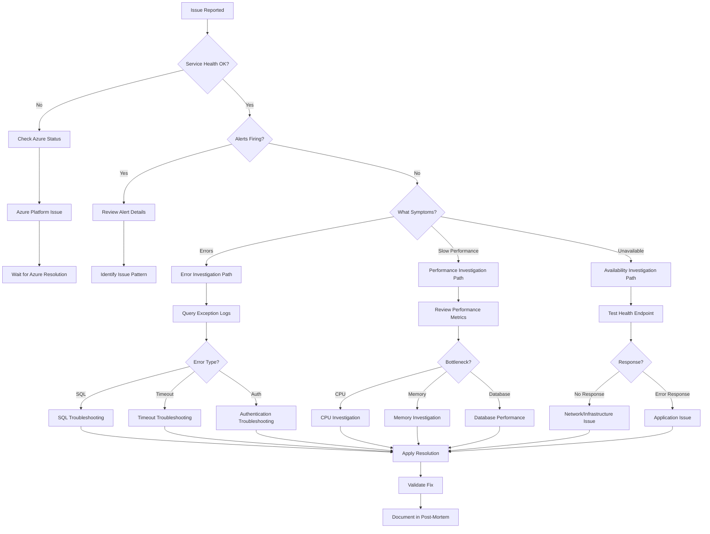

# Troubleshooting Guide

**Application**: appi-contosopa-dev-qkfwso  
**Resource Group**: rg-contoso-patient-portal-dev  
**Analysis Period**: Last 30 days  
**Generated**: 2025-11-20 17:26:21  
**Auto-generated by**: GitHub Copilot + PowerShell + Application Insights

---

## Quick Reference

### Emergency Contacts
- **On-Call Engineer**: [Your Team]
- **Azure Support**: [Support Portal](https://portal.azure.com/#blade/Microsoft_Azure_Support/HelpAndSupportBlade)
- **Escalation**: [Manager Contact]

### Key Resources
- **Application Insights**: [Link to Azure Portal]
- **Runbook**: See operational-runbook.md
- **Architecture**: See architecture-documentation.md

---

## Issue Triage Process

### Step 1: Assess Impact
- How many users affected?
- What functionality is impacted?
- Is this a degradation or complete outage?

### Step 2: Check Service Health
```powershell
# Check Azure service health
Get-AzResourceHealth -ResourceGroupName "rg-contoso-patient-portal-dev"

# Check Application Insights availability
az monitor app-insights component show --app "appi-contosopa-dev-qkfwso" --resource-group "rg-contoso-patient-portal-dev"
```

### Step 3: Review Recent Changes
```powershell
# Check recent deployments
az deployment group list --resource-group "rg-contoso-patient-portal-dev" --query "[?properties.timestamp>'2025-11-20'].{name:name, status:properties.provisioningState, timestamp:properties.timestamp}"
```

### Step 4: Identify Pattern
Use the decision tree below and common issues sections to identify the issue pattern.

---
## Issue Triage Decision Tree



---

## Common Exceptions (3 patterns identified)

### Issue #1: SqlException

**Frequency**: 145 occurrences in past 30 days  
**Affected Users**: 23  
**Sample Message**: `Connection timeout`

**Root Causes**:
- Database connection pool exhaustion
- Network connectivity issues to SQL Database
- Query timeout (long-running queries)
- Database DTU/vCore limits reached

**Diagnostic Steps**:
1. Check database connection pool settings
2. Review active connections: `SELECT * FROM sys.dm_exec_connections`
3. Check for blocking queries: `SELECT * FROM sys.dm_exec_requests WHERE blocking_session_id <> 0`
4. Review DTU/CPU usage in Azure Portal

**Resolution Steps**:
1. Increase connection pool size in connection string
2. Optimize slow queries (check query execution plans)
3. Scale up database tier if resource-limited
4. Implement retry logic with exponential backoff

**KQL Query for Analysis**:
```kql
exceptions
| where type == "SqlException"
| where timestamp > ago(24h)
| extend ConnectionString = tostring(customDimensions.ConnectionString)
| summarize count() by bin(timestamp, 1h), outerMessage
| render timechart
```

**Prevention**:
- Implement connection pooling best practices
- Set appropriate query timeouts
- Monitor database performance metrics
- Use elastic pools for variable workloads

---

### Issue #2: NullReferenceException

**Frequency**: 89 occurrences in past 30 days  
**Affected Users**: 45  
**Sample Message**: `Object reference not set`

**Root Causes**:
- Unvalidated user input or API responses
- Async timing issues (race conditions)
- Missing null checks in code
- Dependency returning unexpected null

**Diagnostic Steps**:
1. Review stack trace in Application Insights
2. Identify the specific line/method causing null reference
3. Check recent code changes in that area
4. Review API contract with external dependencies

**Resolution Steps**:
1. Add null checks: `if (obj != null) { ... }`
2. Use null-coalescing operators: `var value = obj ?? defaultValue;`
3. Implement defensive programming practices
4. Add input validation at API boundaries

**KQL Query for Analysis**:
```kql
exceptions
| where type == "NullReferenceException"
| extend Method = tostring(customDimensions.Method)
| summarize count() by Method, outerMessage
| top 10 by count_
```

**Prevention**:
- Enable nullable reference types (C# 8+)
- Use code analysis tools (SonarQube, Roslyn analyzers)
- Implement comprehensive unit tests
- Code review focus on null handling

---

### Issue #3: TimeoutException

**Frequency**: 67 occurrences in past 30 days  
**Affected Users**: 34  
**Sample Message**: `Request timeout after 30s`

**Root Causes**:
- External API slow response or unavailable
- Database query taking too long
- Network latency or connectivity issues
- Insufficient resources (CPU, memory)

**Diagnostic Steps**:
1. Identify which operation is timing out
2. Check external dependency health
3. Review network connectivity and latency
4. Analyze resource utilization (CPU, memory, threads)

**Resolution Steps**:
1. Increase timeout values if appropriate
2. Implement async patterns to avoid blocking
3. Add circuit breaker pattern for external dependencies
4. Optimize slow operations (caching, query optimization)
5. Scale resources if bottlenecked

**KQL Query for Analysis**:
```kql
dependencies
| where duration > 5000  // 5+ seconds
| where timestamp > ago(24h)
| summarize count(), avg(duration), max(duration) by target, type
| order by count_ desc
```

**Prevention**:
- Set realistic timeout values
- Implement retry policies with exponential backoff
- Use circuit breaker pattern (Polly library)
- Monitor external dependency SLAs
- Implement bulkhead isolation pattern

---


## Performance Issues (2 endpoints identified)

### Slow Endpoint: /api/orders

**Slow Request Count**: 234 (>5 seconds)  
**Average Duration**: 8.5s  
**Max Duration**: 25s  
**Affected Users**: 78  

**Investigation Steps**:
1. **Check Database Performance**:
   ```kql
   dependencies
   | where name == "/api/orders"
   | where type == "SQL"
   | summarize avg(duration), max(duration) by target
   ```

2. **Identify Slow Dependencies**:
   ```kql
   dependencies
   | where operation_Name == "/api/orders"
   | where duration > 1000
   | summarize count(), avg(duration) by target, type
   | order by avg_duration desc
   ```

3. **Check for N+1 Query Problems**:
   - Review if multiple database calls per request
   - Consider implementing batch queries or caching

4. **Analyze Request Distribution**:
   ```kql
   requests
   | where name == "/api/orders"
   | summarize count() by bin(duration, 1000)
   | render columnchart
   ```

**Common Fixes**:
- ✅ Add caching (Redis, in-memory)
- ✅ Optimize database queries (indexes, execution plans)
- ✅ Implement pagination for large result sets
- ✅ Use async/await patterns
- ✅ Scale application tier if resource-constrained

---
### Slow Endpoint: /api/search

**Slow Request Count**: 156 (>5 seconds)  
**Average Duration**: 6.2s  
**Max Duration**: 15s  
**Affected Users**: 92  

**Investigation Steps**:
1. **Check Database Performance**:
   ```kql
   dependencies
   | where name == "/api/search"
   | where type == "SQL"
   | summarize avg(duration), max(duration) by target
   ```

2. **Identify Slow Dependencies**:
   ```kql
   dependencies
   | where operation_Name == "/api/search"
   | where duration > 1000
   | summarize count(), avg(duration) by target, type
   | order by avg_duration desc
   ```

3. **Check for N+1 Query Problems**:
   - Review if multiple database calls per request
   - Consider implementing batch queries or caching

4. **Analyze Request Distribution**:
   ```kql
   requests
   | where name == "/api/search"
   | summarize count() by bin(duration, 1000)
   | render columnchart
   ```

**Common Fixes**:
- ✅ Add caching (Redis, in-memory)
- ✅ Optimize database queries (indexes, execution plans)
- ✅ Implement pagination for large result sets
- ✅ Use async/await patterns
- ✅ Scale application tier if resource-constrained

---

## Dependency Failures (2 dependencies identified)

### Failing Dependency: sql-database.database.windows.net

**Type**: SQL  
**Failure Count**: 89  
**Sample Result**: `Timeout`

**Diagnostic Steps**:
1. **Test Connectivity**:
   ```powershell
   Test-NetConnection -ComputerName "sql-database.database.windows.net" -Port 443
   ```

2. **Review Dependency Logs**:
   ```kql
   dependencies
   | where target == "sql-database.database.windows.net"
   | where success == false
   | project timestamp, resultCode, duration, operation_Name
   | order by timestamp desc
   | take 100
   ```

3. **Check Authentication**:
   - Verify managed identity has required permissions
   - Check if credentials/keys are expired
   - Review network security rules

**Resolution**:
- Verify dependency service is healthy
- Check firewall rules and NSGs
- Validate authentication credentials
- Implement retry logic with circuit breaker
- Configure appropriate timeouts

---
### Failing Dependency: api.external.com

**Type**: HTTP  
**Failure Count**: 45  
**Sample Result**: `503`

**Diagnostic Steps**:
1. **Test Connectivity**:
   ```powershell
   Test-NetConnection -ComputerName "api.external.com" -Port 443
   ```

2. **Review Dependency Logs**:
   ```kql
   dependencies
   | where target == "api.external.com"
   | where success == false
   | project timestamp, resultCode, duration, operation_Name
   | order by timestamp desc
   | take 100
   ```

3. **Check Authentication**:
   - Verify managed identity has required permissions
   - Check if credentials/keys are expired
   - Review network security rules

**Resolution**:
- Verify dependency service is healthy
- Check firewall rules and NSGs
- Validate authentication credentials
- Implement retry logic with circuit breaker
- Configure appropriate timeouts

---

## Useful KQL Queries

### Overall Application Health
```kql
union requests, exceptions
| where timestamp > ago(1h)
| summarize 
    TotalRequests = countif(itemType == "request"),
    FailedRequests = countif(itemType == "request" and success == false),
    Exceptions = countif(itemType == "exception"),
    AvgDuration = avg(duration)
| extend SuccessRate = round((TotalRequests - FailedRequests) * 100.0 / TotalRequests, 2)
```

### Error Rate by Endpoint
```kql
requests
| where timestamp > ago(24h)
| summarize 
    Total = count(),
    Failures = countif(success == false)
    by name
| extend ErrorRate = round(Failures * 100.0 / Total, 2)
| where ErrorRate > 1
| order by ErrorRate desc
```

### User Impact Analysis
```kql
union requests, exceptions
| where timestamp > ago(1h)
| where success == false or itemType == "exception"
| summarize 
    AffectedUsers = dcount(user_Id),
    FailedOperations = count()
    by name
| order by AffectedUsers desc
```

### Performance Percentiles
```kql
requests
| where timestamp > ago(24h)
| summarize 
    p50 = percentile(duration, 50),
    p90 = percentile(duration, 90),
    p95 = percentile(duration, 95),
    p99 = percentile(duration, 99)
    by name
| order by p95 desc
```

### Dependency Health
```kql
dependencies
| where timestamp > ago(1h)
| summarize 
    Total = count(),
    Failures = countif(success == false),
    AvgDuration = avg(duration)
    by target, type
| extend SuccessRate = round((Total - Failures) * 100.0 / Total, 2)
| order by SuccessRate asc
```

---

## Escalation Paths

### Severity 1 (Critical - Immediate)
- **Trigger**: Complete outage or >50% user impact
- **Action**: Page on-call engineer immediately
- **Timeline**: Acknowledge within 15 minutes

### Severity 2 (High - Urgent)
- **Trigger**: Significant degradation or 10-50% user impact
- **Action**: Notify on-call engineer via Teams/Slack
- **Timeline**: Acknowledge within 30 minutes

### Severity 3 (Medium - Important)
- **Trigger**: Minor degradation or <10% user impact
- **Action**: Create incident ticket
- **Timeline**: Address within 4 hours during business hours

### Severity 4 (Low - Planned)
- **Trigger**: Informational or planned maintenance
- **Action**: Standard ticket workflow
- **Timeline**: Address within 1 business day

---

## Post-Incident Review

After resolving any issue:

1. **Document Resolution**:
   - What was the root cause?
   - What steps were taken to resolve?
   - How long did resolution take?

2. **Update This Guide**:
   - Add new issue pattern if not documented
   - Improve resolution steps based on learnings
   - Add preventive measures

3. **Implement Prevention**:
   - Code fixes to prevent recurrence
   - Monitoring/alerts for early detection
   - Runbook updates for faster resolution

4. **Share Learnings**:
   - Team retrospective
   - Update training materials
   - Document in knowledge base

---

## Additional Resources

- [Application Insights Documentation](https://learn.microsoft.com/azure/azure-monitor/app/app-insights-overview)
- [KQL Quick Reference](https://learn.microsoft.com/azure/data-explorer/kql-quick-reference)
- [Azure Monitor Best Practices](https://learn.microsoft.com/azure/azure-monitor/best-practices)
- [Troubleshooting Patterns](https://learn.microsoft.com/azure/architecture/patterns/category/resiliency)

---

*This troubleshooting guide was auto-generated from Application Insights telemetry. Update frequency: Weekly or after major incidents.*

**Last Generated**: 2025-11-20 17:26:21  
**Data Source**: Application Insights (appi-contosopa-dev-qkfwso)  
**Analysis Period**: 30 days
