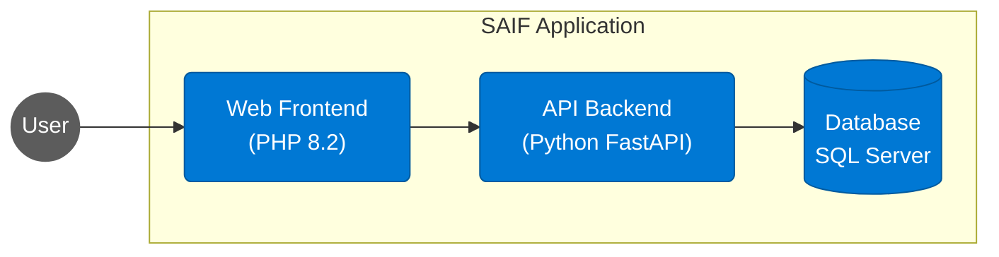

# SAIF: Secure AI Foundations

[](https://github.com/yourusername/SAIF)
[](LICENSE)
[](docs/hackathon/hacker-assets/deployment.md)
[](docs/security-challenges.md)
[](docker-compose.yml)


A 3-tier diagnostic application designed for hands-on learning about securing AI systems across identity, network, application, and content safety domains.

## � SAIF in Action


*SAIF's interactive diagnostic dashboard with security assessment tools*

## �🚀 Quick Deploy

Deploy SAIF to Azure with **complete automation** - true 1-click deployment:

### Option 1: PowerShell Script (Recommended - Fully Automated)
```powershell
git clone https://github.com/jonathan-vella/SAIF.git
cd SAIF\scripts
.\Deploy-SAIF-v1.ps1
```
**✅ Includes:** Infrastructure + Container builds + App configuration + Monitoring setup

### Option 2: Deploy to Azure Button (Infrastructure Only)
[](https://portal.azure.com/#create/Microsoft.Template/uri/https%3A%2F%2Fraw.githubusercontent.com%2Fjonathan-vella%2FSAIF%2Fmain%2Finfra%2Fazuredeploy.json)

After infrastructure deployment, complete setup:
```powershell
git clone https://github.com/jonathan-vella/SAIF.git
cd SAIF\scripts
.\Update-SAIF-Containers.ps1 -ResourceGroupName "your-rg-name"
```

📖 **[Complete Deployment Guide](DEPLOY.md)**

## Project Overview


SAIF is an intentionally insecure application that provides a platform for students to identify security gaps and implement remediation strategies. The application consists of:

1. **Web Frontend**: PHP-based diagnostic interface
2. **API Backend**: Python REST API with various diagnostic endpoints
3. **Database**: SQL Server database for data storage and queries

## Architecture



### Containerized Architecture

The application uses Docker containers for all components:

- **Web Frontend**: PHP 8.2 container
- **API Backend**: Python FastAPI container
- **Database**: SQL Server container (development) / Azure SQL Database (production)

### Azure Deployment Options

When deployed to Azure, the application can use:

- **Web Frontend**: Containerized App Service or Azure Container Apps
- **API Backend**: Containerized App Service or Azure Container Apps
- **Database**: Azure SQL Database

## Deployment

### Local Development

Run SAIF locally using Docker Compose:

```bash
docker-compose up
# Access at http://localhost:8080
```

### Azure Deployment

SAIF features **true 1-click deployment** with complete automation:

**Fully Automated (Recommended):**
```powershell
.\scripts\Deploy-SAIF-v1.ps1
```

**Infrastructure + Manual Container Build:**
1. Use Deploy to Azure button (see above)
2. Run `.\scripts\Update-SAIF-Containers.ps1` to build and deploy containers

For detailed deployment instructions, see [DEPLOY.md](DEPLOY.md).

## Security Challenges

This application contains multiple security vulnerabilities for students to identify and fix, including:

- Identity and Access Management vulnerabilities
- Network security gaps
- Application security issues
- Data protection weaknesses
- API security concerns
- Content safety risks

## Quality & Evaluation Resources

| Resource | Purpose | Link |
|----------|---------|------|
| Student Consolidated Quality Checklist | Single source of truth for per‑challenge quality expectations & pre‑flight review | [QUALITY-CHECKLIST](docs/hackathon/QUALITY-CHECKLIST.md) |
| Coach Red Flags Guide | Rapid assessment of common weak submission patterns | [Coach Red Flags](docs/hackathon/coach-guide/QUALITY-RED-FLAGS.md) |
| Scoring Sheet Template | Lightweight, repeatable rubric capture & notes | [Scoring Sheet](docs/hackathon/coach-guide/SCORING-SHEET.md) |
| Scoring CSV Export Script | Parse markdown scoring sheet to CSV for aggregation | `scripts/Export-ScoringSheet.ps1` |
| Multi-Sheet Aggregator | Combine multiple team scoring sheets & totals | `scripts/Aggregate-ScoringSheets.ps1` |
| GitHub Action (Aggregation) | Automated artifact build of combined scores | `.github/workflows/scoring-aggregation.yml` |
| JSON Export Support | Structured data for automation / dashboards | Use `-JsonPath` or `-IncludeJson` on scripts |
| Summary Dashboard | Markdown & HTML ranking with stats (percentile=better) | `Aggregate-ScoringSheets.ps1 -GenerateSummary` |
| Docs Linter Script | Optional pre‑commit validation of challenge docs | `scripts/Invoke-DocsLint.ps1` |

Additions for new challenges should include: a "Quality Checklist" link, a "Submission Artifacts" section, and authoritative references. The linter can help enforce this.

## Workshop Structure

1. **Deployment**: Deploy the insecure application
2. **Discovery**: Identify security vulnerabilities
3. **Remediation**: Implement fixes for the discovered issues
4. **Verification**: Confirm that the security improvements are effective

## Repository Structure

```mermaid
graph TD
    title(SAIF Repository Structure)
    
    %% Root structure
    Root(SAIF Repository) --> API(/api)
    Root --> Web(/web)
    Root --> Infra(/infra)
    Root --> Scripts(/scripts)
    Root --> Docs(/docs)
    Root --> GitHub(.github)
    Root --> DockerCompose(docker-compose.yml)
    Root --> DeployMD(DEPLOY.md)
    Root --> ReadmeMD(README.md)
    Root --> InitDB(init-db.sql)
    
    %% API structure
    API --> AppPy(app.py)
    API --> APIDockerfile(Dockerfile)
    API --> Requirements(requirements.txt)
    API --> EnvExample(.env.example)
    API --> APIReadme(README.md)
    
    %% Web structure
    Web --> IndexPHP(index.php)
    Web --> ProxyPHP(proxy.php)
    Web --> APIProxyPHP(api-proxy.php)
    Web --> WebDockerfile(Dockerfile)
    Web --> Assets(/assets)
    Web --> Htaccess(.htaccess)
    Web --> ApacheConfig(apache-config.conf)
    Web --> WebReadme(README.md)
    
    %% Web Assets structure
    Assets --> CSS(/css)
    Assets --> IMG(/img)
    Assets --> JS(/js)
    
    %% Infra structure
    Infra --> MainBicep(main.bicep)
    Infra --> AzureDeploy(azuredeploy.json)
    Infra --> MainParams(main.parameters.json)
    Infra --> AzureParams(azuredeploy.parameters.json)
    Infra --> Metadata(metadata.json)
    
  %% Scripts structure
  Scripts --> DeployComplete(Deploy-SAIF-v1.ps1)
    Scripts --> UpdateContainers(Update-SAIF-Containers.ps1)
    Scripts --> TestLocal(Test-SAIFLocal.ps1)
    
    %% Docs structure
    Docs --> DeploymentDoc(hackathon/hacker-assets/deployment.md)
    Docs --> SecurityDoc(security-challenges.md)
    Docs --> InfraImprovements(infrastructure-improvements.md)
    
    %% GitHub structure
    GitHub --> CopilotInstructions(copilot-instructions.md)
    
    %% Styling
    classDef folder fill:#f9d75e,stroke:#333,color:black;
    classDef file fill:#78b2f2,stroke:#333,color:black;
    classDef component fill:#91ca76,stroke:#333,color:black;
    
    %% Apply classes
    class API,Web,Infra,Scripts,Docs,Assets,CSS,IMG,JS,GitHub folder;
    class DockerCompose,Requirements,DeployMD,ReadmeMD,InitDB,APIDockerfile,WebDockerfile,MainBicep,AzureDeploy,MainParams,AzureParams,Metadata,DeployComplete,UpdateContainers,TestLocal,DeploymentDoc,SecurityDoc,InfraImprovements,CopilotInstructions,AppPy,IndexPHP,ProxyPHP,APIProxyPHP,Htaccess,ApacheConfig,EnvExample,APIReadme,WebReadme file;
```



### Key Components

- **`/api`**: Python FastAPI backend with containerization
  - `app.py`: Main FastAPI application with security challenge endpoints
  - `Dockerfile`: Container configuration for API service
  - `requirements.txt`: Python dependencies
  - `.env.example`: Environment variable template
  - `README.md`: API component documentation
- **`/web`**: PHP web frontend with containerization
  - `index.php`: Main web interface for interacting with API
  - `proxy.php` & `api-proxy.php`: API communication handlers
  - `Dockerfile`: Container configuration for web service
  - `.htaccess` & `apache-config.conf`: Apache server configuration
  - `/assets`: Static resources (CSS, JavaScript, images)
  - `README.md`: Web component documentation
- **`/infra`**: Complete Azure infrastructure as code
  - `main.bicep`: Main Bicep template with full automation
  - `azuredeploy.json`: ARM template for Deploy to Azure button
  - `main.parameters.json` & `azuredeploy.parameters.json`: Parameter files for different environments
  - `metadata.json`: Azure QuickStart template metadata
- **`/scripts`**: Fully automated PowerShell deployment scripts
  - `Deploy-SAIF-v1.ps1`: End-to-end automated deployment
  - `Update-SAIF-Containers.ps1`: Container build and deployment updates
  - `Test-SAIFLocal.ps1`: Local development testing script
- **`/docs`**: Comprehensive documentation and guides
  - `hackathon/hacker-assets/deployment.md`: Detailed deployment instructions
  - `security-challenges.md`: Security vulnerability documentation
  - `infrastructure-improvements.md`: Infrastructure enhancement details
- **`/.github`**: GitHub configuration and templates
  - `copilot-instructions.md`: GitHub Copilot coding guidelines
- **`docker-compose.yml`**: Local development environment
- **`DEPLOY.md`**: Complete deployment guide with automation details
- **`init-db.sql`**: Database initialization script

## Prerequisites

- Azure subscription
- Azure CLI
- PowerShell 7.0+
- Docker and Docker Compose (for local development)
- Visual Studio Code (recommended)

## License

MIT

## (Optional) Enable Documentation Pre-Commit Hook
To automatically run the docs linter before each commit:
```powershell
git config core.hooksPath .githooks
```
Disable again by resetting:
```powershell
git config --unset core.hooksPath
```
