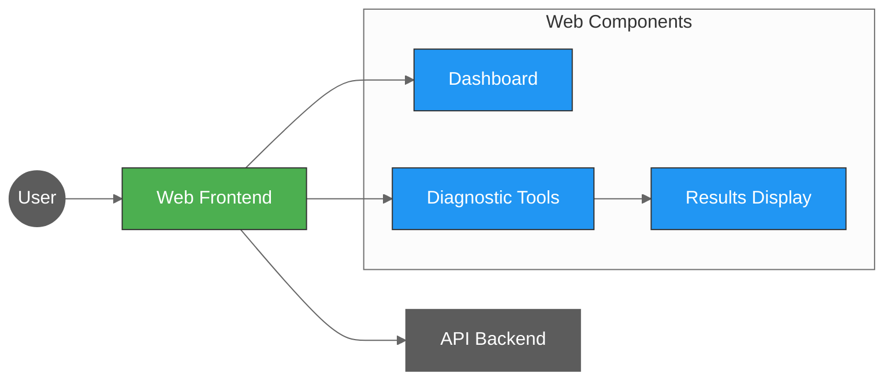

# Web Frontend for SAIF

[](https://www.php.net/)
[](https://httpd.apache.org/)
[](https://getbootstrap.com/)
[](../docker-compose.yml)

PHP-based web interface that provides a user-friendly way to interact with the SAIF API endpoints.



## Features

The web interface provides access to all API endpoints, including:

- Health check display
- IP information
- SQL Server diagnostics
- DNS and reverse DNS lookup tools
- URL fetch utility
- Environment variable display
- PI calculation tool

## Setup

The web component requires:

- PHP 8.2+
- Apache or other compatible web server

## Environment Variables

- `API_URL` - The URL of the SAIF API service (e.g., http://localhost:8000)
- `API_KEY` - The API key for authenticated endpoints (deliberately insecure)

## Development

For local development:

```bash
# Move to the web directory
cd web

# Start PHP's built-in server
php -S localhost:8080
```

## Docker Development

```bash
# Build the image
docker build -t saif-web .

# Run the container
docker run -p 80:80 -e API_URL=http://api:8000 -e API_KEY=your_api_key saif-web
```

## Security Challenges

This web interface contains deliberate security issues for learning purposes:

1. Lack of input validation
2. Potential XSS vulnerabilities
3. Client-side API key exposure
4. No authentication or authorization controls
