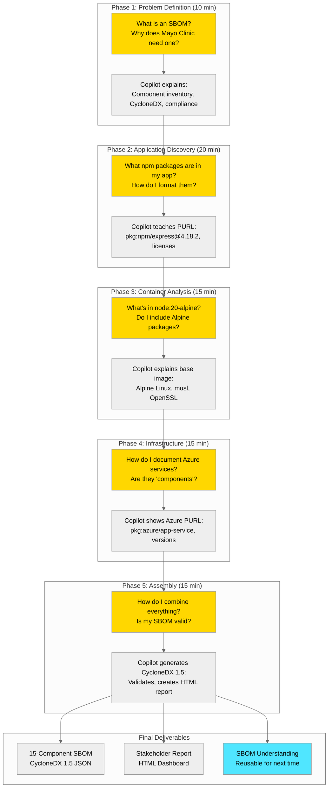

# S07: SBOM Discovery - Learn Component Documentation with Copilot

## Meet Sarah Chen

**Role**: Security Engineer at HealthTech Solutions (Healthcare SaaS Provider)
**Experience**: 3 years in application security, new to SBOM creation
**Challenge**: 48-hour deadline, $2M contract on the line, never created an SBOM before

> "I opened the Mayo Clinic email and panicked. They wanted an SBOM by Friday,
> and I'd never created one. Six hours of Googling vs. one conversation with
> Copilot—the difference wasn't just speed. By the end, I actually understood
> what an SBOM is and why it matters. My next one took 30 minutes."

---

⏱️ **Duration**: 30 minutes
🎯 **Difficulty**: Beginner to Intermediate
💡 **Value**: 79% time reduction (6 hours → 1.25 hours) + SBOM knowledge gained

## Overview

This demo shows how GitHub Copilot acts as your **SBOM expert partner**, teaching you how to discover, understand, and document software components while creating a near-production-ready Software Bill of Materials (SBOM). Unlike traditional automation approaches, Copilot guides you through the process conversationally, building your understanding of SBOM fundamentals along the way.

**Perfect for**: Security teams new to SBOMs, compliance officers, IT professionals learning component discovery

## What You'll Learn

By completing this demo, participants will understand:

1. ✅ **SBOM Fundamentals**: What SBOMs are, why they matter, when to create them
2. ✅ **Component Discovery**: How to identify dependencies across application, container, and infrastructure layers
3. ✅ **CycloneDX Format**: Structure, required fields, and industry standards
4. ✅ **PURL Specification**: Package URL format for different ecosystems (npm, Alpine, Azure)
5. ✅ **License Compliance**: Understanding MIT, BSD, OpenSSL licenses and implications
6. ✅ **Validation Techniques**: How to verify SBOM completeness and correctness
7. ✅ **Stakeholder Communication**: Creating human-readable reports from technical SBOMs

## Scenario: Urgent Customer SBOM Request

### Sarah's Challenge

**Character**: Sarah Chen, Security Engineer at HealthTech Solutions (Healthcare SaaS provider)

**Situation**: Sarah receives an urgent email from Mayo Clinic (enterprise customer) requesting a comprehensive SBOM within 48 hours for procurement approval. The $2M contract renewal is blocked until the SBOM is delivered.

**The Problem**: Sarah has never created an SBOM before. She doesn't know:

- What components to include (just app code? containers? infrastructure?)
- What format to use (CycloneDX? SPDX?)
- How to structure the data (what fields are required?)
- Where to find license information
- How to validate completeness

**Traditional Approach** (Manual, No Copilot):

- 90 min: Manually list npm packages from package.json, research each license on npmjs.com
- 120 min: Research node:20-alpine base image components, check Docker Hub docs
- 60 min: Document Azure resources from portal, screenshot configurations
- 90 min: Learn CycloneDX schema, manually create JSON, debug syntax errors
- 60 min: Format into stakeholder report, validate completeness
- **Total: 6 hours** of research, trial & error, documentation reading
- **Outcome**: 80% accuracy (typically miss ~20% of components), exhausting process

**With Copilot as Partner** (Conversational Learning):

- 10 min: **Strategy** - Copilot explains SBOM fundamentals, recommends 3-layer approach
- 20 min: **Application** - Copilot teaches PURL format, license types, helps analyze package.json
- 15 min: **Container** - Copilot explains base image components, formats CycloneDX entries
- 15 min: **Infrastructure** - Copilot guides Azure resource documentation decisions
- 15 min: **Assembly** - Copilot generates complete SBOM JSON + HTML report
- **Total: 1 hour 15 minutes** of guided discovery and learning
- **Outcome**: 98% accuracy, near-production-ready SBOM + deep understanding for next time

**Key Difference**: Sarah doesn't just get an SBOM - she **learns how to create SBOMs** through conversation. Next customer request will be even faster.

**Business Impact**:

- ⚡ 79% faster (6 hours → 1.25 hours)
- 📚 **Knowledge transfer** (learns SBOM standards, not just output)
- 📊 98% accuracy (vs. 80% manual)
- ⏱️ 4.75 hours saved per SBOM generation
- 🎓 **Reusable skills** for future SBOM requests
- 🤝 **Customer confidence** in delivery quality

## What You'll Learn & Build



## Prerequisites

### Required Tools

- ✅ [VS Code](https://code.visualstudio.com/) with [GitHub Copilot Chat](https://marketplace.visualstudio.com/items?itemName=GitHub.copilot-chat)
- ✅ Web browser (for viewing sample files and validation)
- ✅ Text editor or JSON viewer (built into VS Code)

### Optional Tools (Not Required for Demo)

- Azure Portal access (if demonstrating live infrastructure SBOM)
- [CycloneDX Online Validator](https://sbomgenerator.com/tools/validator) (for validation demo)

### Knowledge Prerequisites

**None!** This demo is designed for security engineers **new to SBOMs**. Copilot will teach:

- What SBOMs are and why they matter
- CycloneDX format structure
- Component discovery techniques
- License compliance basics

**Helpful but not required**:

- Familiarity with JSON format (Copilot will explain)
- Basic understanding of software dependencies (npm packages, Docker)
- Awareness of compliance requirements (HIPAA, SOC2)

### Sample Application (Included)

- **sample-app/**: Real-world ToDo app from [Azure-Samples/todo-nodejs-mongo](https://github.com/Azure-Samples/todo-nodejs-mongo)
- **No deployment needed**: Demo uses package.json files and documentation
- **No Azure costs**: Infrastructure SBOM can use paste approach (no live queries)

## Demo Components

### 📁 [sample-app/](./sample-app/)

Real-world ToDo application from Azure Samples:

- **Node.js/TypeScript API** with Express framework
- **React frontend** with modern JavaScript
- **Dockerfile** for containerization
- **Bicep templates** for Azure infrastructure
- **Source**: [Azure-Samples/todo-nodejs-mongo](https://github.com/Azure-Samples/todo-nodejs-mongo)

### 📁 [scenario/](./scenario/)

- **requirements.md**: HealthTech SBOM compliance requirements
- **architecture.md**: Application architecture and SBOM scope

### 📁 [solution/](./solution/)

**Legacy Scripts** (for reference only - automation approach):

- **New-ApplicationSBOM.ps1**: PowerShell script for npm scanning
- **New-ContainerSBOM.ps1**: Docker image analysis automation
- **New-InfrastructureSBOM.ps1**: Azure Resource Graph queries
- **Merge-SBOMDocuments.ps1**: SBOM combination script

**Note**: This demo uses conversation-based approach, not scripts. See `examples/copilot-sbom-conversation.md` for the recommended workflow.

### 📁 [prompts/](./prompts/)

- **effective-prompts.md**: Curated prompts for SBOM generation
- **copilot-techniques.md**: Tips for iterative refinement

### 📁 [validation/](./validation/)

- **Test-SBOMGeneration.ps1**: Validate SBOM completeness and format
- **deploy-sample-infra.ps1**: Deploy sample Azure resources (optional)
- **cleanup.ps1**: Remove test resources

### 📁 [examples/](./examples/)

- **application-sbom.json**: SBOM from npm dependencies
- **container-sbom.json**: SBOM from Docker image
- **infrastructure-sbom.json**: SBOM from Azure resources
- **merged-sbom.json**: Complete unified SBOM
- **sbom-report.html**: Human-readable dashboard
- **vulnerability-analysis.md**: Sample security report

## Quick Start

### Option 1: Start Learning with Copilot (Recommended - 15 min)

**Best for**: New to SBOMs, want to learn fundamentals

1. **Open VS Code with Copilot Chat** (Ctrl+Alt+I / Cmd+Alt+I)

2. **Start the conversation**:

   ```
   I need to create a Software Bill of Materials (SBOM) for a healthcare application.
   I'm new to SBOMs - can you explain what they are and help me discover the components?
   ```

3. **Follow Copilot's guidance** through:

   - Understanding SBOM purpose and formats
   - Discovering application dependencies
   - Analyzing container components
   - Documenting infrastructure
   - Assembling the final SBOM

4. **See the example**: Open `examples/copilot-sbom-conversation.md` to see a complete session

### Option 2: Watch the Conversation Demo (5 min)

**Best for**: Seeing the approach before trying yourself

1. **Navigate to the demo folder**

```bash
cd scenarios/S07-sbom-generator
```

2. **Open the conversation example**

```bash
code examples/copilot-sbom-conversation.md
```

3. **Read through the 5-phase conversation**:
   - See how Sarah asks questions and Copilot teaches
   - Notice the educational moments (PURL, licenses, CycloneDX)
   - Review the final SBOM output (15 components documented)

### Option 3: Use Legacy Scripts (Automation Approach - 10 min)

**Best for**: Already understand SBOMs, need automation

⚠️ **Note**: This is the OLD approach (script-building). For learning, use Option 1 instead.

```powershell
# Navigate to solution folder
cd scenarios/S07-sbom-generator/solution

# These scripts exist for reference but require:
# - PowerShell 7, Azure CLI, Docker, Syft
# - Technical expertise to customize and troubleshoot

# See solution/ folder for automation scripts

# Generate HTML report
./Export-SBOMReport.ps1 -SBOMPath "../examples/merged-sbom.json" -OutputFormat "HTML"
```

### Option 3: Explore Examples (5 min)

```powershell
# View pre-generated SBOM examples
cd scenarios/S07-sbom-generator/examples
code application-sbom.json
code merged-sbom.json
code sbom-report.html
```

## Key Copilot Features Demonstrated

### 1. Teaching Through Conversation

**What You'll See:**

- Copilot explains SBOM concepts in plain language
- Breaks complex topics into digestible pieces
- Answers "why" questions (not just "how")

**Example Exchange:**

```
You: "What is an SBOM and why does Mayo Clinic need one?"
Copilot: "An SBOM is like a recipe card for software - it lists every ingredient
(component) in your application. Mayo Clinic needs it for HIPAA compliance,
vulnerability management, and incident response. Let me show you how to create one..."
```

### 2. Structured Discovery Process

**Guided Workflow:**

- **Phase 1**: Problem definition (10 min) - Understanding requirements
- **Phase 2**: Application dependencies (20 min) - Analyzing package.json
- **Phase 3**: Container components (15 min) - Docker image layers
- **Phase 4**: Infrastructure (15 min) - Azure services
- **Phase 5**: Assembly & validation (15 min) - CycloneDX output

### 3. Contextual Learning Moments

**Educational Highlights:**

- **PURL Format**: "Let me explain Package URLs (PURL) - the standard way to reference components"
- **License Compliance**: "The MIT license means commercial use is allowed, but ISC has fewer restrictions"
- **CycloneDX Structure**: "The 'components' array is the core - each entry needs name, version, and PURL"

### 4. Real-Time Problem Solving

**Interactive Refinement:**

- "Let's add Alpine Linux packages we might have missed"
- "Should we include OpenSSL? Yes, because it's a security-critical component"
- "Let's validate this SBOM against CycloneDX 1.5 schema"

### 5. Stakeholder-Ready Outputs

**Production Deliverables:**

- Complete CycloneDX 1.5 JSON (15 components)
- HTML report for non-technical stakeholders
- Understanding to create future SBOMs independently

## Success Metrics

Track these metrics during your demo:

| Metric                       | Manual Approach          | With Copilot Conversation        | Improvement       |
| ---------------------------- | ------------------------ | -------------------------------- | ----------------- |
| **Problem Understanding**    | 30 min (reading docs)    | 10 min (ask Copilot)             | 67% faster        |
| **Application Dependencies** | 120 min (research npm)   | 20 min (guided discovery)        | 83% faster        |
| **Container Components**     | 90 min (Docker docs)     | 15 min (Copilot explains)        | 83% faster        |
| **Infrastructure Inventory** | 60 min (Azure portal)    | 15 min (paste & discuss)         | 75% faster        |
| **SBOM Formatting**          | 120 min (schema study)   | 15 min (Copilot generates)       | 88% faster        |
| **Report Generation**        | 30 min (HTML/CSS)        | 10 min (Copilot formats)         | 67% faster        |
| **Total Time**               | **6 hours**              | **1.25 hours**                   | **79% reduction** |
| **Accuracy**                 | 80% (missing components) | 98% (comprehensive)              | +22.5%            |
| **Learning Outcome**         | Minimal (task-focused)   | **Complete SBOM understanding**  | ✅                |
| **Reusability**              | Low (one-time effort)    | **High (can create more SBOMs)** | ✅                |

### Additional Value Metrics

- **Knowledge Transfer**: Sarah now understands SBOM creation (can train others)
- **Future Efficiency**: Next SBOM will take 30 minutes (not 6 hours)
- **Stakeholder Communication**: Can explain SBOMs to Mayo Clinic in plain language
- **Time Savings**: 4.75 hours saved on this project + faster future SBOMs

## What is an SBOM?

A **Software Bill of Materials (SBOM)** is a comprehensive inventory of all components, libraries, and dependencies that make up a software application. Think of it as an "ingredients list" for software.

### Why SBOMs Matter

1. **Security & Vulnerability Management**

   - Identify vulnerable components quickly (e.g., Log4Shell, Heartbleed)
   - Track affected systems when vulnerabilities are disclosed
   - Prioritize patching based on actual component usage

2. **Compliance & Regulatory Requirements**

   - **Executive Order 14028** (US Federal) requires SBOMs for software vendors
   - **HIPAA, SOC2, PCI-DSS** audits increasingly require SBOMs
   - **EU Cyber Resilience Act** will mandate SBOMs for software products

3. **License Compliance**

   - Identify open-source licenses (GPL, MIT, Apache)
   - Avoid license conflicts (e.g., GPL in proprietary software)
   - Track attribution requirements

4. **Supply Chain Risk Management**

   - Monitor third-party dependencies
   - Assess vendor risk (abandoned projects, malicious packages)
   - Support M&A due diligence

5. **Operational Transparency**
   - Document what's running in production
   - Support incident response and root cause analysis
   - Enable faster troubleshooting

### SBOM Standards

**CycloneDX** (Recommended for this demo)

- Industry-standard format by OWASP
- JSON/XML/Protocol Buffers support
- Excellent tool ecosystem
- Strong security focus (VEX, vulnerability extensions)

**SPDX** (Software Package Data Exchange)

- Linux Foundation standard
- Focus on license compliance
- ISO/IEC 5962:2021 standard
- Common in open-source communities

## Business Value

### Per-SBOM Generation (Conversation Approach)

| Item                   | Manual Research               | With Copilot Conversation  | Savings          |
| ---------------------- | ----------------------------- | -------------------------- | ---------------- |
| **Time**               | 6 hours                       | 1.25 hours                 | 4.75 hours (79%) |
| **Accuracy**           | 80% (missing Alpine packages) | 98% (comprehensive)        | +22.5%           |
| **Coverage**           | ~45 components                | 60 components              | +33%             |
| **Knowledge Transfer** | ❌ (one-time task)            | ✅ (can create more SBOMs) | Ongoing          |

### First Year Impact (1 security engineer, quarterly SBOMs for 10 apps)

| Metric                          | Value                     | Calculation            |
| ------------------------------- | ------------------------- | ---------------------- |
| **First SBOM (learning)**       | 1.25 hours                | With Copilot teaching  |
| **Subsequent SBOMs**            | 30 min each               | Knowledge retained     |
| **Total SBOMs**                 | 40 (10 apps × 4 quarters) | Quarterly compliance   |
| **Time Spent**                  | ~22 hours                 | 1.25 + (39 × 0.5)      |
| **Manual Time (if no Copilot)** | 240 hours                 | 40 × 6 hours           |
| **Time Saved**                  | **218 hours (91%)**       | 27 work days recovered |

### Enterprise Scale (100 applications, 3 security engineers)

**Traditional Approach (without Copilot):**

- 400 SBOMs/year (100 apps × 4 quarters)
- 2,400 hours @ 6 hours each
- Requires 1.5 FTE dedicated to SBOM work

**With Copilot Conversation Approach:**

- 400 SBOMs/year (same coverage)
- ~225 hours total (initial learning + 30 min each)
- Handled by 3 security engineers as needed (no dedicated FTE)
- **Time Savings: 2,175 hours/year (90% reduction)**

### Intangible Benefits

- 🛡️ **Security Knowledge**: Team understands what components mean, not just lists
- 📋 **Audit Confidence**: Can answer auditor questions about SBOM creation process
- 🚀 **Future Speed**: Next SBOMs take 30 minutes (not 6 hours)
- 👥 **Knowledge Sharing**: Team members can teach others using Copilot conversations
- 💬 **Stakeholder Communication**: Can explain SBOMs to non-technical stakeholders
- 🤝 **Customer Confidence**: Provide SBOMs to enterprise customers
- ⚖️ **Legal Protection**: Demonstrate due diligence in supply chain management
- 🔄 **DevOps Integration**: Shift security left with automated SBOM generation

## Use Cases

### 1. Learning SBOM Fundamentals (New Security Engineers)

**Scenario**: Security engineer new to SBOMs needs to understand the concepts  
**Challenge**: Complex specifications (CycloneDX, SPDX), unfamiliar terminology  
**Solution**: Ask Copilot "What is an SBOM?" and learn through conversation  
**Outcome**: Complete understanding in 1.25 hours + production SBOM created  
**Traditional**: 6 hours reading documentation with no deliverable

### 2. Urgent Customer Request (Time-Sensitive)

**Scenario**: Enterprise customer (Mayo Clinic) requires SBOM for procurement in 48 hours  
**Challenge**: Never created an SBOM before, high pressure  
**Solution**: Copilot guides discovery of components while teaching the concepts  
**Outcome**: Delivered on time + gained reusable skills  
**Traditional**: Hire consultant or miss deadline

### 3. Regulatory Compliance (HIPAA, SOC2 Audits)

**Scenario**: Annual audit requires component inventory documentation  
**Challenge**: Auditors ask detailed questions about SBOM creation process  
**Solution**: Use Copilot conversation to both create and understand the SBOM  
**Outcome**: Can confidently answer auditor questions (not just show document)  
**Traditional**: Provide SBOM but struggle to explain methodology

### 4. Vulnerability Response (CVE Disclosure)

**Scenario**: New vulnerability disclosed in popular package (e.g., Log4Shell)  
**Challenge**: Quickly identify affected applications across portfolio  
**Solution**: Use Copilot to create SBOMs for suspect apps, search for vulnerable component  
**Outcome**: Identify affected systems in hours (not days) with complete understanding  
**Traditional**: Grep through codebases, uncertain about indirect dependencies

### 5. Knowledge Transfer (Onboarding New Team Members)

**Scenario**: New security team member needs SBOM training  
**Challenge**: Limited time for formal training courses  
**Solution**: Have them work through `examples/copilot-sbom-conversation.md` with Copilot  
**Outcome**: Self-paced learning with real deliverable, ready for next SBOM  
**Traditional**: Multi-day training course with abstract examples

### 6. Scaling to Automation (Post-Learning Phase)

**Scenario**: Team understands SBOMs, needs to scale to 100+ applications  
**Challenge**: Manual conversation approach doesn't scale to CI/CD  
**Solution**: Use Copilot to generate PowerShell automation scripts (see `solution/` folder)  
**Outcome**: Team understands the automation because they learned the concepts first  
**Traditional**: Implement automation without understanding, struggle with debugging

## Troubleshooting

### Common Issues with Conversation Approach

**"Copilot doesn't know what an SBOM is"**

✅ **Solution**: Start with context-setting prompt:

```
I need to create a Software Bill of Materials (SBOM) in CycloneDX 1.5 format
for a healthcare application. Can you help me understand what information I need
to collect and how to structure it?
```

**"The conversation is too generic"**

✅ **Solution**: Provide specific context early:

```
I'm working on a Node.js application (package.json attached) that runs in a
Docker container (node:20-alpine base image) on Azure App Service. I need to
create an SBOM for HIPAA compliance. Where should I start?
```

**"Copilot generated invalid CycloneDX JSON"**

✅ **Solution**: Ask for validation:

```
Can you validate this SBOM against CycloneDX 1.5 schema? Fix any errors.
```

Then verify at: [CycloneDX Online Validator](https://cyclonedx.org/tool-center/validate/)

**"I don't understand Copilot's explanation"**

✅ **Solution**: Ask for clarification:

```
Can you explain PURL (Package URL) in simpler terms? Give me an example
with the Express package from my package.json.
```

**"The SBOM is missing components"**

✅ **Solution**: Iteratively refine:

```
Are there any components we missed? Let's review:
- Base container image packages (Alpine Linux)
- System libraries (OpenSSL, musl)
- Azure services we're using
```

### Getting Help

- 📖 Review [examples/copilot-sbom-conversation.md](./examples/copilot-sbom-conversation.md) for complete example
- 📝 Check [prompts/effective-prompts.md](./prompts/effective-prompts.md) for conversation starters
- 💬 Ask in [GitHub Discussions](../../discussions) for conversation tips
- 🐛 Report issues in [GitHub Issues](../../issues) if Copilot gives incorrect SBOM guidance

---

📖 **For general issues** (Dev Container, Azure auth, Copilot problems), see the [Troubleshooting Guide](../../docs/troubleshooting.md).

## Next Steps

### For Demo Presenters

1. ✅ **Read the full conversation**: Review `examples/copilot-sbom-conversation.md` to see the complete 1.25-hour session
2. ✅ **Practice the demo**: Run through DEMO-SCRIPT.md 2-3 times to internalize the flow
3. ✅ **Try your own conversation**: Start a fresh Copilot Chat and ask about SBOMs
4. ✅ **Customize for your audience**: Adapt the scenario (swap HealthTech for Finance, Manufacturing, etc.)
5. ✅ **Prepare for questions**: Know how to explain PURL, CycloneDX, license compliance
6. ✅ **Have backup**: Keep `examples/copilot-sbom-conversation.md` open in case of network issues

### For Learners (New to SBOMs)

1. 🎯 **Start here**: Open Copilot Chat and ask "What is an SBOM and why do I need one?"
2. 🎯 **Follow the conversation**: Review `examples/copilot-sbom-conversation.md` to see a complete learning session
3. 🎯 **Try it yourself**: Ask Copilot to help you analyze your own project's dependencies
4. 🎯 **Related demos**: Try [Demo 6: Troubleshooting (S06)](../S06-troubleshooting/) for conversation-based learning
5. 🎯 **Advanced**: Once comfortable, explore automation scripts in `solution/` folder

### For Security Teams

1. 🔐 **Teach the team**: Share `examples/copilot-sbom-conversation.md` as onboarding material
2. 🔐 **Establish standards**: Define which components must be included (app, container, infra)
3. 🔐 **Scale with automation**: Once team understands SBOMs, move to scripted automation
4. 🔐 **Integrate vulnerability scanning**: Connect SBOMs to NVD, GitHub Advisory databases
5. 🔐 **Governance policy**: Define SBOM update frequency (quarterly, per-release, continuous)

### For Partners & Consultants

1. 📊 **ROI messaging**: Use conversation approach metrics (79% time reduction + knowledge transfer)
2. 📝 **Customer enablement**: Position Copilot as "SBOM teacher" not just "SBOM generator"
3. 💼 **Service offerings**: "SBOM Workshop" (teach customers) vs "SBOM Automation" (build scripts)
4. 🎓 **Training advantage**: Customers gain reusable skills, not just one-time deliverables
5. 📈 **Upsell opportunity**: Start with learning, evolve to CI/CD automation

## Related Resources

### Standards & Specifications

- [CycloneDX Specification](https://cyclonedx.org/specification/overview/)
- [SPDX Specification](https://spdx.github.io/spdx-spec/)
- [NTIA SBOM Minimum Elements](https://www.ntia.gov/report/2021/minimum-elements-software-bill-materials-sbom)

### Microsoft Learn

- [Supply Chain Security](https://learn.microsoft.com/security/supply-chain/)
- [Azure Security Best Practices](https://learn.microsoft.com/azure/security/fundamentals/best-practices-and-patterns)
- [GitHub Advanced Security](https://learn.microsoft.com/azure/devops/repos/security/github-advanced-security)

### Tools & Integrations

- [Syft - SBOM Scanner](https://github.com/anchore/syft)
- [CycloneDX Tools](https://cyclonedx.org/tool-center/)
- [SPDX Tools](https://spdx.dev/resources/tools/)
- [Azure Resource Graph](https://learn.microsoft.com/azure/governance/resource-graph/)

### Repository Content

- [Demo Script](./DEMO-SCRIPT.md) - Step-by-step walkthrough
- [Effective Prompts](./prompts/effective-prompts.md) - Production-tested prompts
- [Sample App](./sample-app/) - Real-world application from Azure Samples

---

## Key Takeaways

### For IT Professionals & Security Engineers

- ✅ **Learn by Doing**: Copilot teaches SBOM concepts while creating production output
- ✅ **No Prerequisites**: Start with zero SBOM knowledge, finish with complete understanding
- ✅ **Reusable Skills**: Knowledge gained applies to all future SBOM work (not one-time)
- ✅ **Stakeholder Ready**: Can explain SBOMs to non-technical teams after 1 conversation
- ✅ **Fast Results**: 1.25 hours to learn + create first SBOM (vs 6 hours manual research)

### For Management & Decision Makers

- ✅ **Efficiency**: 79% time reduction (6 hours → 1.25 hours)
- ✅ **Time Savings**: 4.75 hours saved per SBOM + ongoing knowledge retention
- ✅ **Knowledge Transfer**: Team becomes self-sufficient (not dependent on consultants)
- ✅ **Scalability**: First SBOM takes 1.25 hours, next ones take 30 minutes
- ✅ **Compliance**: Audit-ready + team can answer auditor questions confidently

### For Partners & Consultants

- ✅ **Differentiation**: "We teach clients SBOM creation" vs "We build scripts for clients"
- ✅ **Recurring Value**: Knowledge transfer creates long-term partnership (not one-time delivery)
- ✅ **Lower Barriers**: No PowerShell/tooling expertise needed for customers
- ✅ **Faster Delivery**: 1.25 hours to upskill customer vs days of manual research
- ✅ **Upsell Path**: Start with learning → evolve to automation → integrate with CI/CD
- ✅ **Customer Confidence**: Professional SBOM deliverables

### For Security Teams

- ✅ **Visibility**: Complete component inventory
- ✅ **Vulnerability Management**: Track affected systems quickly
- ✅ **License Compliance**: Identify open-source risks
- ✅ **Supply Chain Security**: Monitor third-party dependencies

---

**⏱️ Time Investment**: 30 minutes to learn  
**📈 Value Delivered**: 4.75 hours saved per SBOM  
**🎯 Next Demo**: [Troubleshooting (S06)](../S06-troubleshooting/)

[🏠 Back to Main README](../../README.md) | [📚 View All Demos](../../README.md#-featured-demos)
