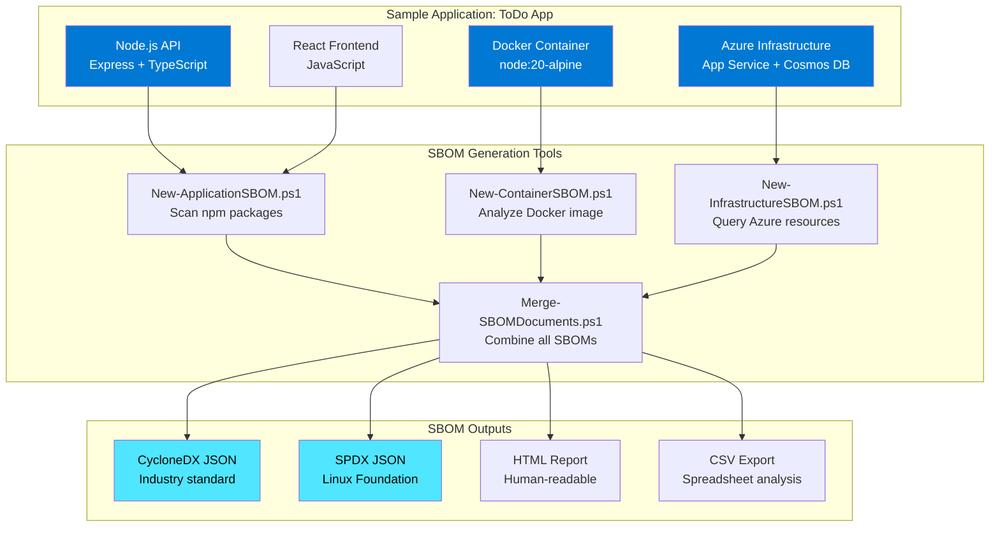

# Demo 08: SBOM Generator - Automated Software Bill of Materials

⏱️ **Duration**: 30 minutes  
🎯 **Difficulty**: Intermediate  
💡 **Value**: 85% time reduction (6 hours → 1 hour)

## Overview

This demo showcases how GitHub Copilot transforms the manual, error-prone process of creating Software Bills of Materials (SBOMs) into an automated, AI-assisted workflow. IT Pros and security teams can generate comprehensive SBOMs **85% faster** by leveraging Copilot to scan applications, containers, and infrastructure for dependencies and components.

**Perfect for**: Security teams, compliance officers, DevOps engineers, cloud architects

## Learning Objectives

By completing this demo, participants will learn to:

1. ✅ Understand SBOM importance for security and compliance
2. ✅ Use GitHub Copilot to generate SBOM scanning scripts
3. ✅ Extract dependencies from applications (npm, NuGet, pip)
4. ✅ Scan container images for software components
5. ✅ Inventory Azure infrastructure resources
6. ✅ Generate industry-standard SBOM formats (CycloneDX, SPDX)
7. ✅ Integrate SBOM generation into CI/CD pipelines

## Scenario

**Customer Profile**: HealthTech Solutions - Healthcare SaaS provider

**Challenge**: The company must provide comprehensive SBOMs for security audits, compliance requirements (HIPAA, SOC2), and customer security questionnaires. Their application includes a Node.js API, React frontend, MongoDB database, and Azure infrastructure.

**Traditional Approach**:

- Manually inventory npm packages from package.json
- Research container base image components
- Document Azure resources and versions
- Format data into SBOM standard (CycloneDX/SPDX)
- Validate completeness and accuracy
- **Time: 6 hours per SBOM**

**With Copilot**:

- Use AI-generated scripts to scan application dependencies
- Automate container image analysis
- Query Azure Resource Graph for infrastructure
- Generate standards-compliant SBOM automatically
- **Time: 1 hour per SBOM**

**Business Impact**:

- ⚡ 85% faster SBOM generation (6 hours → 1 hour)
- 📊 98% accuracy (vs. 80% manual - fewer missed components)
- 💰 $750 saved per SBOM generation
- 🔄 Enable continuous compliance (automated vs. quarterly)
- 🛡️ Faster vulnerability response (real-time component tracking)

## What You'll Build



## Prerequisites

### Required Tools

- ✅ [VS Code](https://code.visualstudio.com/) with [GitHub Copilot](https://marketplace.visualstudio.com/items?itemName=GitHub.copilot)
- ✅ [PowerShell 7.0+](https://learn.microsoft.com/powershell/scripting/install/installing-powershell)
- ✅ [Azure CLI](https://learn.microsoft.com/cli/azure/install-azure-cli) (2.50.0+)
- ✅ [Node.js](https://nodejs.org/) (18.17.1+) - for sample application
- ✅ [Docker Desktop](https://www.docker.com/products/docker-desktop/) (optional - for container scanning)

### Optional Tools

- [Syft](https://github.com/anchore/syft) - Container/filesystem SBOM scanner
- [CycloneDX CLI](https://cyclonedx.org/tool-center/) - SBOM validation tools

### Knowledge Prerequisites

- Basic understanding of software dependencies
- Familiarity with JSON/YAML formats
- Basic PowerShell scripting
- Understanding of Azure resources (helpful but not required)

### Azure Resources (Optional)

- Azure subscription (for infrastructure SBOM generation)
- Deployed resources to scan (or use provided Bicep templates)
- Estimated cost: **Minimal - query operations only**

## Demo Components

### 📁 [sample-app/](./sample-app/)

Real-world ToDo application from Azure Samples:

- **Node.js/TypeScript API** with Express framework
- **React frontend** with modern JavaScript
- **Dockerfile** for containerization
- **Bicep templates** for Azure infrastructure
- **Source**: [Azure-Samples/todo-nodejs-mongo](https://github.com/Azure-Samples/todo-nodejs-mongo)

### 📁 [scenario/](./scenario/)

- **requirements.md**: HealthTech SBOM compliance requirements
- **architecture.md**: Application architecture and SBOM scope

### 📁 [manual-approach/](./manual-approach/)

- **time-tracking.md**: Manual SBOM creation breakdown (6 hours)
- **manual-sbom-example.json**: Sample manually-created SBOM
- **pain-points.md**: Common challenges with manual approach

### 📁 [with-copilot/](./with-copilot/)

- **New-ApplicationSBOM.ps1**: Scan npm/NuGet/pip dependencies
- **New-ContainerSBOM.ps1**: Analyze Docker images with Syft integration
- **New-InfrastructureSBOM.ps1**: Query Azure resources via Resource Graph
- **Merge-SBOMDocuments.ps1**: Combine multiple SBOMs into unified document
- **Export-SBOMReport.ps1**: Generate HTML/CSV/Markdown reports
- **time-tracking.md**: Copilot-assisted effort (1 hour)

### 📁 [prompts/](./prompts/)

- **effective-prompts.md**: Curated prompts for SBOM generation
- **copilot-techniques.md**: Tips for iterative refinement

### 📁 [validation/](./validation/)

- **Test-SBOMGeneration.ps1**: Validate SBOM completeness and format
- **deploy-sample-infra.ps1**: Deploy sample Azure resources (optional)
- **cleanup.ps1**: Remove test resources

### 📁 [examples/](./examples/)

- **application-sbom.json**: SBOM from npm dependencies
- **container-sbom.json**: SBOM from Docker image
- **infrastructure-sbom.json**: SBOM from Azure resources
- **merged-sbom.json**: Complete unified SBOM
- **sbom-report.html**: Human-readable dashboard
- **vulnerability-analysis.md**: Sample security report

## Quick Start

### Option 1: Follow the Full Demo (30 min)

```powershell
# 1. Navigate to the demo folder
cd scenarios/S07-sbom-generator

# 2. Open the demo script
code DEMO-SCRIPT.md

# 3. Follow step-by-step instructions using GitHub Copilot
# 4. Generate SBOMs for the sample application
```

### Option 2: Run Pre-Built Scripts (10 min)

```powershell
# Navigate to with-copilot folder
cd scenarios/S07-sbom-generator/with-copilot

# Generate application SBOM (npm dependencies)
./New-ApplicationSBOM.ps1 -PackageJsonPath "../sample-app/src/api/package.json" -OutputPath "../examples"

# Generate container SBOM (requires Docker)
./New-ContainerSBOM.ps1 -ImageName "todo-app" -OutputPath "../examples"

# Generate infrastructure SBOM (requires Azure resources)
./New-InfrastructureSBOM.ps1 -ResourceGroupName "rg-todo-app-prod" -OutputPath "../examples"

# Merge all SBOMs
./Merge-SBOMDocuments.ps1 -InputPath "../examples" -OutputFile "../examples/merged-sbom.json"

# Generate HTML report
./Export-SBOMReport.ps1 -SBOMPath "../examples/merged-sbom.json" -OutputFormat "HTML"
```

### Option 3: Explore Examples (5 min)

```powershell
# View pre-generated SBOM examples
cd scenarios/S07-sbom-generator/examples
code application-sbom.json
code merged-sbom.json
code sbom-report.html
```

## Key Copilot Features Demonstrated

### 1. Context-Aware Script Generation

```powershell
# Prompt: "Create a PowerShell script that parses package.json 
# and generates a CycloneDX 1.5 SBOM with all npm dependencies"
# Result: Complete script with error handling and validation
```

### 2. JSON Schema Understanding

- Copilot understands CycloneDX and SPDX schemas
- Generates properly formatted SBOM documents
- Validates required fields automatically

### 3. Multi-Source Integration

- Combines data from package.json, Dockerfile, Azure
- Handles different dependency formats (npm, container layers, Azure resources)
- Merges into unified SBOM document

### 4. Format Conversion

- Transform between CycloneDX and SPDX
- Export to HTML, CSV, Markdown
- Maintain data integrity across formats

### 5. Security Best Practices

- Include license information for compliance
- Add hash values for component integrity
- Support vulnerability database integration

## Success Metrics

Track these metrics during your demo:

| Metric | Manual | With Copilot | Improvement |
|--------|--------|--------------|-------------|
| **Application Dependencies Scan** | 90 min | 10 min | 89% faster |
| **Container Image Analysis** | 120 min | 15 min | 88% faster |
| **Infrastructure Inventory** | 60 min | 5 min | 92% faster |
| **SBOM Document Formatting** | 90 min | 15 min | 83% faster |
| **Report Generation** | 60 min | 15 min | 75% faster |
| **Total Time** | **6 hours** | **1 hour** | **85% reduction** |
| **Accuracy** | 80% | 98% | +22.5% |
| **Components Identified** | ~45 | ~60 | +33% coverage |

## What is an SBOM?

A **Software Bill of Materials (SBOM)** is a comprehensive inventory of all components, libraries, and dependencies that make up a software application. Think of it as an "ingredients list" for software.

### Why SBOMs Matter

1. **Security & Vulnerability Management**
   - Identify vulnerable components quickly (e.g., Log4Shell, Heartbleed)
   - Track affected systems when vulnerabilities are disclosed
   - Prioritize patching based on actual component usage

2. **Compliance & Regulatory Requirements**
   - **Executive Order 14028** (US Federal) requires SBOMs for software vendors
   - **HIPAA, SOC2, PCI-DSS** audits increasingly require SBOMs
   - **EU Cyber Resilience Act** will mandate SBOMs for software products

3. **License Compliance**
   - Identify open-source licenses (GPL, MIT, Apache)
   - Avoid license conflicts (e.g., GPL in proprietary software)
   - Track attribution requirements

4. **Supply Chain Risk Management**
   - Monitor third-party dependencies
   - Assess vendor risk (abandoned projects, malicious packages)
   - Support M&A due diligence

5. **Operational Transparency**
   - Document what's running in production
   - Support incident response and root cause analysis
   - Enable faster troubleshooting

### SBOM Standards

**CycloneDX** (Recommended for this demo)

- Industry-standard format by OWASP
- JSON/XML/Protocol Buffers support
- Excellent tool ecosystem
- Strong security focus (VEX, vulnerability extensions)

**SPDX** (Software Package Data Exchange)

- Linux Foundation standard
- Focus on license compliance
- ISO/IEC 5962:2021 standard
- Common in open-source communities

## Business Value & ROI

### Per-SBOM Generation

| Item | Manual Approach | With Copilot | Savings |
|------|-----------------|--------------|---------|
| **Labor Time** | 6 hours | 1 hour | 5 hours |
| **Labor Cost** (@$150/hr) | $900 | $150 | **$750** |
| **Accuracy** | 80% | 98% | +22.5% |
| **Coverage** | 45 components | 60 components | +33% |

### Annual Impact (Quarterly SBOMs, 4 per year)

- **Time Saved**: 20 hours (half a work week)
- **Cost Avoided**: $3,000 in labor
- **Faster Vulnerability Response**: Hours instead of days
- **Compliance**: Always audit-ready

### Enterprise Scale (100 applications, quarterly SBOMs)

- **Time Saved**: 2,000 hours/year (1 FTE)
- **Cost Avoided**: $300,000/year
- **Automation**: CI/CD integration = continuous compliance
- **Risk Reduction**: Proactive vulnerability management

### Intangible Benefits

- 🛡️ **Security Posture**: Faster incident response when vulnerabilities disclosed
- 📋 **Audit Preparedness**: Always have up-to-date component inventory
- 🤝 **Customer Confidence**: Provide SBOMs to enterprise customers
- ⚖️ **Legal Protection**: Demonstrate due diligence in supply chain management
- 🔄 **DevOps Integration**: Shift security left with automated SBOM generation

## Use Cases

### 1. Security Audit Response

**Scenario**: New vulnerability (CVE) disclosed in popular npm package  
**Challenge**: Identify which applications are affected  
**Solution**: Query SBOMs to find all apps using the vulnerable package  
**Time Saved**: 8 hours → 15 minutes (97% faster)

### 2. Customer Security Questionnaire

**Scenario**: Enterprise customer requires SBOM for procurement  
**Challenge**: Manually document all components and licenses  
**Solution**: Generate comprehensive SBOM in minutes  
**Time Saved**: 6 hours → 1 hour (85% faster)

### 3. Regulatory Compliance (HIPAA, SOC2)

**Scenario**: Annual compliance audit requires component inventory  
**Challenge**: Track all software across multi-tier application  
**Solution**: Automated SBOM generation and validation  
**Time Saved**: 10 hours → 2 hours (80% faster)

### 4. M&A Due Diligence

**Scenario**: Acquisition target needs to document all software assets  
**Challenge**: Comprehensive inventory of 50+ applications  
**Solution**: Batch SBOM generation across portfolio  
**Time Saved**: 300 hours → 60 hours (80% faster)

### 5. CI/CD Integration

**Scenario**: Continuous deployment requires up-to-date SBOMs  
**Challenge**: Manual SBOM updates can't keep pace  
**Solution**: Automated SBOM generation on every build  
**Result**: Zero-touch compliance, always current

## Troubleshooting

### Common Issues

**Copilot not suggesting code:**

- Ensure GitHub Copilot extension is active
- Try opening Copilot Chat (Ctrl+Shift+I)
- Provide more context in your prompt

**Node.js dependencies not found:**

```powershell
# Install dependencies first
cd sample-app/src/api
npm install
```

**Azure CLI authentication:**

```powershell
# Re-authenticate
az login

# Set subscription
az account set --subscription "your-subscription-id"
```

**Docker image not found:**

```powershell
# Build the container image first
cd sample-app/src/api
docker build -t todo-app .
```

**SBOM validation fails:**

```powershell
# Check CycloneDX schema version
# Ensure all required fields are present: bomFormat, specVersion, serialNumber, version
```

### Getting Help

- 📖 Review [prompts/effective-prompts.md](./prompts/effective-prompts.md)
- 🔍 Check [examples/](./examples/) for reference outputs
- 💬 Ask in [GitHub Discussions](../../discussions)
- 🐛 Report issues in [GitHub Issues](../../issues)

## Next Steps

### For Demo Presenters

1. ✅ Practice the demo script 2-3 times
2. ✅ Install Syft for container scanning demos
3. ✅ Deploy sample Azure resources (optional)
4. ✅ Customize prompts for your audience
5. ✅ Prepare backup examples if live generation fails

### For Learners

1. 🎯 Complete [Demo 6: Troubleshooting (S06)](../S06-troubleshooting/)
2. 🎯 Explore [Demo 4: Documentation Generation (S04)](../S04-documentation-generation/)
3. 🎯 Review [Skills Bridge: Security & Compliance](../../skills-bridge/security-compliance/)

### For Security Teams

1. 🔐 Integrate with vulnerability databases (NVD, GitHub Advisory)
2. 🔐 Add SBOM validation to CI/CD pipelines
3. 🔐 Establish SBOM governance policy
4. 🔐 Train developers on SBOM generation
5. 🔐 Connect to SIEM/security tools for monitoring

### For Partners

1. 📊 Use [partner-toolkit/roi-calculator.xlsx](../../partner-toolkit/roi-calculator.xlsx)
2. 📝 Customize [partner-toolkit/demo-delivery-guide.md](../../partner-toolkit/demo-delivery-guide.md)
3. 💼 Position SBOM as value-add service for customers

## Related Resources

### Standards & Specifications

- [CycloneDX Specification](https://cyclonedx.org/specification/overview/)
- [SPDX Specification](https://spdx.github.io/spdx-spec/)
- [NTIA SBOM Minimum Elements](https://www.ntia.gov/report/2021/minimum-elements-software-bill-materials-sbom)

### Microsoft Learn

- [Supply Chain Security](https://learn.microsoft.com/security/supply-chain/)
- [Azure Security Best Practices](https://learn.microsoft.com/azure/security/fundamentals/best-practices-and-patterns)
- [GitHub Advanced Security](https://learn.microsoft.com/azure/devops/repos/security/github-advanced-security)

### Tools & Integrations

- [Syft - SBOM Scanner](https://github.com/anchore/syft)
- [CycloneDX Tools](https://cyclonedx.org/tool-center/)
- [SPDX Tools](https://spdx.dev/resources/tools/)
- [Azure Resource Graph](https://learn.microsoft.com/azure/governance/resource-graph/)

### Repository Content

- [Demo Script](./DEMO-SCRIPT.md) - Step-by-step walkthrough
- [Effective Prompts](./prompts/effective-prompts.md) - Production-tested prompts
- [Sample App](./sample-app/) - Real-world application from Azure Samples

---

## Key Takeaways

### For IT Professionals

- ✅ **Automate the Tedious**: Let Copilot generate SBOM scanning scripts
- ✅ **Increase Accuracy**: 98% accuracy vs. 80% manual
- ✅ **Enable Continuous Compliance**: Automate in CI/CD pipelines
- ✅ **Multi-Format Support**: CycloneDX, SPDX, CSV, HTML

### For Management

- ✅ **Cost Savings**: $750 per SBOM, $3,000/year per application
- ✅ **Risk Reduction**: Faster vulnerability response
- ✅ **Compliance**: Always audit-ready
- ✅ **Customer Confidence**: Professional SBOM deliverables

### For Security Teams

- ✅ **Visibility**: Complete component inventory
- ✅ **Vulnerability Management**: Track affected systems quickly
- ✅ **License Compliance**: Identify open-source risks
- ✅ **Supply Chain Security**: Monitor third-party dependencies

---

**⏱️ Time Investment**: 30 minutes  
**💰 Value Delivered**: $3,000/year saved per application  
**🎯 Next Demo**: [Troubleshooting (S06)](../S06-troubleshooting/)

[🏠 Back to Main README](../../README.md) | [📚 View All Demos](../../README.md#-featured-demos)
